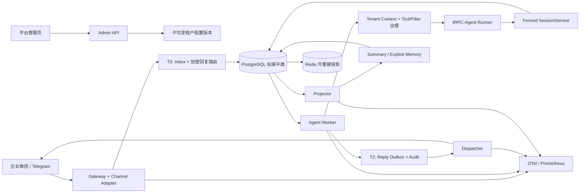

# tRPC-Agent 多租户节点化部署平台

> Python 3.12 · tRPC-Agent-Python 1.1.19 · FastAPI · PostgreSQL · Redis · OpenTelemetry

本仓库不是单 Agent 示例，而是一套可运行、可验证的企业级平台骨架：企业微信和 Telegram 消息先经过协议验签与租户绑定，再进入持久 Inbox；任意 Worker 节点都可领取任务，但只有持有最新租约、fencing token 和版本号的节点能提交状态；Agent 回复通过 Outbox 异步投递；Summary/Memory 由独立 Projector 在 T2 提交后生成。平台不依赖 sticky session。

课题原文完整保存在 [docs/requirements.md](docs/requirements.md)，逐项验收证据见 [docs/acceptance.md](docs/acceptance.md)。

## 架构总览



### 四个可独立扩缩的进程角色

| 角色 | 启动命令 | 责任边界 |
|---|---|---|
| Gateway | `trpc-agent-service serve` | HTTP 限制、验签/解密、租户路由、T0 持久化 ACK、Admin API |
| Worker | `trpc-agent-service worker` | 公平轮询租户、租约心跳、tRPC Runner、CAS 事件、T2 原子完成 |
| Dispatcher | `trpc-agent-service dispatcher` | 顺序领取 Outbox、解密短期回复坐标、限流/重试/UNKNOWN 分类 |
| Projector | `trpc-agent-service projector` | fenced 投影任务、窗口摘要、用户显式 Memory、单调水位提交 |

## 关键设计

- **多租户不是只加 `tenant_id`**：租户配置不可变版本化；Inbox 固定接收时的 config/app revision；PostgreSQL runtime 角色启用 `FORCE ROW LEVEL SECURITY`；工具集合按租户白名单重新构造；外部用户、群和会话 ID 通过 HMAC 派生为不可逆内部标识。
- **不使用 sticky session**：同 session 的写入同时受数据库租约、单调 fencing token 和 `log_version` OCC 保护；旧 Worker 即使延迟恢复也不能覆盖新状态。
- **事务边界明确**：T0 提交 Inbox 后才 ACK；Runner 完整事件先 staged；T2 在单事务中发布 committed event、state、Outbox、Audit 和 ProjectionJob。
- **不虚构 exactly-once**：跨模型、Tool 和 IM 没有分布式事务。平台使用幂等账本，并为结果不明的 Tool/IM 调用保留 `unknown`，不进行危险的盲目重试。
- **权威数据与投影分离**：Session event、运行账本、审计和加密 SDK event object 在 PostgreSQL；Redis/向量索引/缓存均按 watermark 重建，不能反向覆盖权威状态。
- **配置回滚可追溯**：旧 revision 不修改、不删除；回滚通过重新物化 active revision 完成。Agent revision 进入 session 命名空间，新旧版本互不污染。

## 已实现范围

| 能力 | 可核验实现 |
|---|---|
| 租户与配置 | Tenant/App/Channel/Backend/Audit schema，不可变 publish、幂等发布、读取指定 revision、回滚 |
| 企业微信 | 智能机器人 JSON 验签、AES-CBC 解密、24 小时回调防重放、单聊/群聊身份派生、一次性 `response_url` 加密保存 |
| Telegram | webhook secret 常量时间校验、单聊/群组/topic 映射、重复 update 去重、Bot API 投递分类 |
| 可靠性 | Inbox、Session lease、fence、OCC、staged/committed event、ToolEffect、Outbox、append-only Audit |
| tRPC 集成 | 精确锁定 `trpc-agent-py==1.1.19`，运行时兼容检查，真实 `Runner.run_async` 与自定义 `BaseSessionService` |
| 数据后端 | SQL 权威面、SQL/Redis/InMemory Session 投影合同、双写迁移状态机、Summary/Memory 单调投影 |
| 安全 | AES-GCM envelope、租户 AAD、环境密钥 allowlist、递归日志/trace 脱敏、URL 凭据清洗、PostgreSQL RLS |
| 部署 | Dockerfile、完整 Compose 四角色、Kubernetes/Kustomize 起点、migration owner/runtime 角色分离 |
| 工程门禁 | frozen lock、Ruff、Mypy、pytest、覆盖率阈值、迁移往返、Alembic drift、PostgreSQL 专属 CI |

尚未冒充“已经完成”的部分包括：真实企业微信/Telegram 账号联调、具体业务 Tool/MCP、附件下载沙箱、向量库/S3 适配器、完整跨进程 OTel parent context、KMS/Vault 与 OIDC Admin 鉴权。详细差距见 [验收矩阵](docs/acceptance.md#4-诚实边界与后续工程)。

## 快速开始

### 本地开发

前置条件：Python 3.12、[uv](https://docs.astral.sh/uv/)。

```bash
cp .env.example .env
uv sync --frozen --all-extras
uv run trpc-agent-service migrate
uv run trpc-agent-service doctor
uv run trpc-agent-service serve --host 127.0.0.1 --port 8000 --reload
```

Windows PowerShell 将第一行改为：

```powershell
Copy-Item .env.example .env
```

默认配置使用 SQLite 和 mock 模型标识，只用于 Gateway、Admin API 与合同测试。Worker 会拒绝以 mock provider 启动，避免演示桩误入业务流。需要实际 Worker 时，设置模型 provider/key 并分别启动：

```bash
uv run trpc-agent-service worker
uv run trpc-agent-service dispatcher
uv run trpc-agent-service projector
```

### Docker Compose

```bash
docker compose config --quiet
docker compose up --build
```

Compose 包含 migration、Gateway、Worker、Dispatcher、Projector、PostgreSQL、Redis 和 OTel Collector。示例密码仅用于本机；真实环境不得复用。

### Kubernetes

部署骨架位于 [deploy/k8s](deploy/k8s/README.md)。它故意不提交 Secret；使用前必须换成镜像 digest、真实域名、External Secrets/KMS 以及目标集群的 egress 规则。

## 质量门禁

```bash
uv lock --check
uv sync --frozen --all-extras
uv run ruff format --check trpc_service tests migrations
uv run ruff check trpc_service tests migrations
uv run mypy trpc_service
uv run pytest --cov=trpc_service --cov-report=term-missing
uv pip check
```

本地最新证据：`271 passed, 5 skipped`，语句/分支综合覆盖率为 `86.37%`；5 项跳过均为需要 `TEST_POSTGRES_URL` 的 PostgreSQL 专属合同。CI 会以非 superuser runtime 角色执行这些测试，覆盖 FORCE RLS、append-only、`SKIP LOCKED` 和 stale-fence 拒绝。最终成绩以当前提交的 GitHub Actions 结果为准。

## 文档导航

- [架构与组件边界](docs/architecture.md)
- [数据模型与多后端分工](docs/data-model.md)
- [一致性、幂等与故障语义](docs/reliability.md)
- [IM 通道与完整时序](docs/channels.md)
- [安全模型与 15 项生产风险](docs/security.md)
- [部署、容量、灰度与恢复](docs/operations.md)
- [开源组件评估与复用边界](docs/oss-evaluation.md)
- [验收标准—证据追踪矩阵](docs/acceptance.md)

## 上游与版本证据

- 课题仓库：[raychen911/trpc-agent-service](https://github.com/raychen911/trpc-agent-service)，设计基线 `4cda37bfc41efc412e9ce5e38aa563859c1aa8ee`。
- SDK：[trpc-group/trpc-agent-python](https://github.com/trpc-group/trpc-agent-python)，锁定 tag `v1.1.19` / commit `fd051a475574c900123acf0fa64eab9b3c502842`。
- 依赖解析由 `uv.lock` 固定；关键兼容面由 `tests/framework` 覆盖。升级 SDK 必须先更新兼容审计与回归测试。
