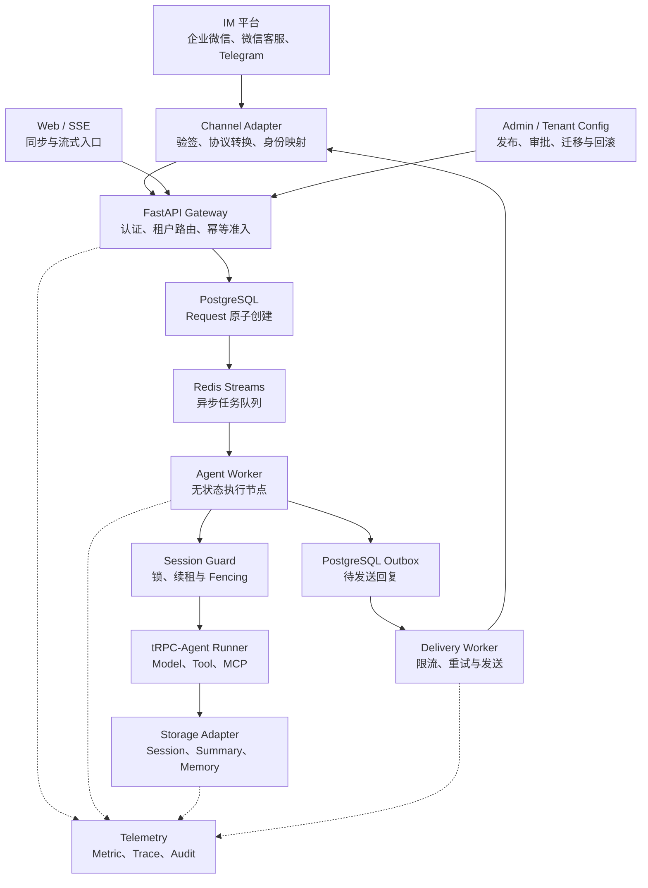

# tRPC Agent 多租户节点化服务

这是一个基于 `trpc-agent-py 1.1.19` 的多租户 Agent 服务实现。仓库把 SDK 已有的 `LlmAgent`、`Runner`、`SessionService`、`MemoryService` 和 OpenTelemetry 埋点装配成可通过 FastAPI/SSE 访问的服务，并在平台层补充租户配置、命名空间、同 Session 串行锁、消息幂等、Redis Streams 契约、Outbox、IM Adapter、治理、审计和部署骨架。

正式设计与验收入口见[架构设计文档](架构设计文档.md)，各模块的运行和测试细节见 [docs](docs/README.md)。

## 1. 实现范围

代码共收集 167 项测试：**145 项离线测试、18 项 Redis/PostgreSQL 集成测试、4 项 Live 条件检查**。离线测试、真实数据库集成测试、flake8、compileall 和 wheel 构建均已通过，三个 IM 页面资源也已进入安装包。

项目提供 16 个离线 Demo，并完成三类 IM 的协议测试和本地可视化闭环。真实账号通过统一 Live 入口验证。

| 能力 | 实现内容 | 验证结论 | 状态 |
|---|---|---|---|
| 配置发布/回滚 | 内存与 PostgreSQL Registry、事务 active pointer、Runtime 失效 | 发布、回滚和在途版本固定通过 | 完成 |
| Agent/Session/Memory | SDK Summary、阶段化后处理和共享状态 | Summary Event、Memory 跨 Worker 可见和故障续跑通过 | 完成 |
| 同 Session 并发 | token/epoch/续租/取消；Redis Lua 与 PostgreSQL 事务 fencing | 20 条并发、双进程共享状态和旧代次拒写通过 | 完成 |
| 幂等与请求状态 | PostgreSQL 原子准入；结果、Outbox 和完成状态同事务 | 并发准入、冲突检测、入队故障和结果回放通过 | 完成 |
| Streams/Outbox | Pending reclaim、死信、Consumer 清理和投递租约 | Worker 崩溃、Redis/PostgreSQL 故障恢复通过 | 完成 |
| 三类 IM | 企业微信、微信客服、Telegram 统一 Adapter；文本、附件和可视化链路 | 协议样例、Fake Client 和 `im-demo` 通过 | 完成；真实账号需验收凭据 |
| Artifact/Knowledge | 对象元数据、租户检索 Tool、附件入库及向量 Provider 方案 | 下载、对象隔离和 Knowledge Tool 通过 | 完成 |
| Approval/Budget/Usage | 参数绑定审批、Tool 防重、Redis Lua 和 PostgreSQL Usage | 一次性审批、原子预算、Tool Event 和 Usage 落库通过 | 完成 |
| Audit/PII/Metric/Trace | PostgreSQL Audit、脱敏、标签限制及平台/SDK Span | Tool/Storage/Delivery 指标、Jaeger Trace 和审计落库通过 | 完成 |
| 数据迁移 | Redis↔PostgreSQL 双写、回填、hash、dirty 和切换屏障 | 迁移自动测试、非空双向迁移和 202 条记录往返通过 | 完成 |
| 部署 | Compose 多角色及 Kubernetes Deployment/PDB/HPA | Gateway、双 Worker、Delivery 与共享数据库通过 | 完成 |

## 2. 架构



开发环境由一个进程合并角色，同步 Chat 方便学习；异步 Chat 和 Webhook 走 Queue→Worker→Outbox。生产通过 `build_production_container()` 强制使用 Redis/PostgreSQL，并按角色拆分 Deployment。

每个 SDK `app_name` 使用 `tenant:{tenant_id}:app:{app_id}`。外部用户 ID 和会话主题先哈希再组成内部 ID，因此相同外部 ID 在不同租户、通道和应用中会生成不同的内部标识。Worker 每次从共享 Session 后端重载状态，请求可以分发到任意节点。

## 3. 目录

```text
trpc_service/
├── agent/       # TenantRuntimeFactory、Runtime 缓存、无状态 Worker
├── channels/    # 企业微信、微信客服、Telegram协议与可注入传输客户端
├── config/      # Pydantic 配置、YAML 加载、SecretResolver
├── gateway/     # 协议、命名空间、幂等、队列、Outbox、调度
├── log/         # 日志初始化、审计事件和脱敏
├── metrics/     # 平台指标注册表
├── migration/   # Redis 与 PostgreSQL 双向迁移、对账和路由切换
├── resources/   # Attachment、Artifact 与 Knowledge Provider
├── skill/       # SDK Skill 扩展的服务侧入口
├── storage/     # SDK Storage 工厂和 Session Execution Guard
├── tenant/      # TenantContext、版本注册表、治理和预算
├── tool/        # 工具注册表与显式白名单
├── workspace/   # SDK 本地/容器 Workspace 的安全装配入口
└── web/         # FastAPI、SSE、Composition Root
docs/            # 模块、配置、接口和开发说明
examples/        # 可运行租户配置与 HTTP Client
migrations/      # 平台控制面 PostgreSQL DDL
deploy/          # Kubernetes 示例
tests/           # unit/component/integration/e2e/fault/live 分层测试
```

`skill/` 提供 SDK Skill 类型和执行工具的稳定导出入口；`workspace/` 复用 SDK 的本地和容器运行时，生产环境使用容器执行模式。`version.py` 只保存包版本 `__version__`，作为统一版本来源。`data/` 初始包含说明文件，PID、日志和测试附件会在运行后生成，并由 Git 忽略。

代码格式由 YAPF 统一处理，以 PEP 8 为基础，使用 4 空格缩进、120 字符行宽，并在多行表达式中把逻辑运算符放在新行前。`format.sh` 负责格式化，`lint_flake8.sh` 负责检查；两者使用同一组源码目录。

CLI 的主要入口和结果如下：

| 命令 | 运行结果 |
|---|---|
| `python -m trpc_service._cli --help` | 显示 `serve`、`im-demo`、`check-config`、`show-config` 和 `demo` |
| `python -m trpc_service._cli check-config ...` | 校验租户配置，成功输出配置数量 |
| `python -m trpc_service._cli serve ...` | 启动 FastAPI 服务，提供 Chat、SSE、Admin 和探针接口 |
| `python -m trpc_service._cli im-demo ...` | 启动三类 IM 的本地可视化页面 `/im` |
| `python -m trpc_service._cli demo all` | 依次运行 16 个本地 Demo，并输出 `[PASS]` |

## 4. 本地安装与运行

项目要求 Python 3.10+。如果已经进入配置好的 Anaconda 子环境，后续直接使用 `python`：

```bat
python -m pip install -e ".[dev]"
if not exist ".env" copy ".env.example" ".env" >nul
notepad .env
python -m trpc_service._cli check-config examples/config/tenants.yaml --env-file .env
```

`.env` 保存测试模型信息，并由 `.gitignore` 排除。更换模型时修改下面四项即可，Python 代码和租户 YAML 保持不变：

```dotenv
TRPC_AGENT_MODEL_PROVIDER=openai-compatible
TRPC_AGENT_MODEL_NAME=gpt-4o-mini
TRPC_AGENT_BASE_URL=https://api.openai.com/v1
TRPC_AGENT_API_KEY=填写真实密钥
```

启动服务：

```bat
python -m trpc_service._cli serve ^
  --config examples/config/tenants.yaml ^
  --env-file .env ^
  --host 127.0.0.1 ^
  --port 8080
```

浏览器打开 `http://127.0.0.1:8080/docs`，或在另一个终端运行：

```bat
python examples/chat_client.py
```

模型密钥采用惰性解析。配置校验、健康检查、OpenAPI 和自动测试可以直接运行；发起真实 Chat 时，服务创建租户 Runtime 并解析对应密钥。

本地验证三类 IM 时运行：

```bat
python -m trpc_service._cli im-demo --config examples\config\im-demo.yaml --env-file .env
```

然后打开 `http://127.0.0.1:8080/im`。页面会生成符合企业微信、微信客服或 Telegram 协议结构的消息，再经过 Adapter、队列、Runner、Session/Memory、Outbox 和 Fake Delivery。默认 Fake Model 在本地运行。详细边界见 [IM 接入与本地可视化验证](docs/im.md)。

如果评审环境提供真实 IM 凭据，将其填写到 `.env` 后使用统一入口：

```bat
python -m trpc_service._cli demo im-live --env-file .env --channels all --confirm --json
```

只验证一种账号时，把 `all` 改为 `wecom`、`wecom-kf` 或 `telegram`。企业微信检查真实长连接认证；微信客服和 Telegram 会向 `.env` 指定的测试用户发送消息，命令通过 `--confirm` 确认本次真实发送。配置字段、输出说明和完整收发流程见 [IM 接入与本地可视化验证](docs/im.md)。

## 5. 常用命令

```bat
REM 本地 Demo 和测试（使用 OfflineModel）
python -m trpc_service._cli demo all
python -m pytest -m "not integration and not live" -vv

REM 格式化
python -m yapf -ir trpc_service tests examples

REM 静态检查
python -m flake8 trpc_service tests examples

REM 构建 wheel
python -m build
```

Linux/macOS 可使用仓库脚本。测试分层、每项测试目的与预期见[测试说明](docs/testing.md)。Docker Compose、真实 Redis/PostgreSQL、真实模型和 Jaeger 均有运行记录；三类真实 IM 使用验收环境提供的凭据运行统一 Live 入口。

## 6. HTTP 接口

核心 Chat 请求：

```http
POST /api/v1/chat
Content-Type: application/json
X-Idempotency-Key: client-message-001

{
  "tenant_id": "demo",
  "app_id": "assistant",
  "user_id": "student-001",
  "session_id": "lesson-001",
  "message": "你好"
}
```

- `POST /api/v1/chat/stream`：返回 `text/event-stream`，事件类型包括 `started`、`delta`、`tool_call`、`tool_result`、`completed`、`error`。
- `POST /api/v1/chat/async` 与任务状态查询：持久入队和异步观察入口。
- `POST /api/v1/channels/{binding_id}/webhook`：Telegram入队返回202；微信客服加密通知保存后返回200 success，GET用于地址验证。
- Artifact、Knowledge、Approval、Migration 测试接口见 [接口说明](docs/api.md)。
- `GET /healthz`、`GET /readyz`、`GET /metrics`：探针和平台指标。
- `GET /api/v1/admin/tenants`：查看活动快照。
- `PUT /api/v1/admin/tenants/{tenant_id}/config`：发布更高版本。
- `POST /api/v1/admin/tenants/{tenant_id}/rollback`：切回已存在版本。

完整契约和错误语义见 [HTTP 与内部协议](docs/api.md)。

## 7. 关键工程设计

1. IM 通过 `binding_id` 查找已发布绑定，并从绑定关系取得可信 `tenant_id`。
2. 同一 Session 的 Runner 周期由 `SessionExecutionGuard` 保护，实现跨节点串行执行。
3. Redis 锁使用唯一令牌，续租和释放时校验所有权；等待超时返回可重试错误。
4. `AgentRequest.config_version` 在入队时固定，Worker 按该版本构建 Runtime。
5. IM 的 `update_id/msgid` 在入队前占位，Redis Streams 和 Outbox 采用至少一次语义。
6. 必要后处理按 `Agent final Event → Summary → Memory → 结果提交` 同步执行，阶段记录用于判断完成位置。
7. 日志、指标和 Trace 使用字段白名单与统一脱敏，覆盖 Prompt、模型密钥、IM Token、数据库密码和外部用户标识。
8. InMemory 用于单进程开发与测试，多副本部署使用共享 Redis 或 PostgreSQL。

## 8. 交付文档入口

- 代码架构与消息顺序：[架构实现说明](docs/architecture.md)
- 租户 YAML、存储和 Secret：[配置说明](docs/configuration.md)
- HTTP/SSE 与内部协议：[接口说明](docs/api.md)
- 测试、调试和扩展 Adapter：[开发指南](docs/development.md)
- 正式架构设计：[架构设计文档](架构设计文档.md)
- 测试范围与预期结果：[测试说明](docs/testing.md)

实现覆盖题目要求的主链路与设计交付物。企业微信、微信客服和 Telegram 已提供协议适配、本地完整链路和统一 Live 验证入口；真实账号验证由验收环境注入 Bot 凭据后执行。
