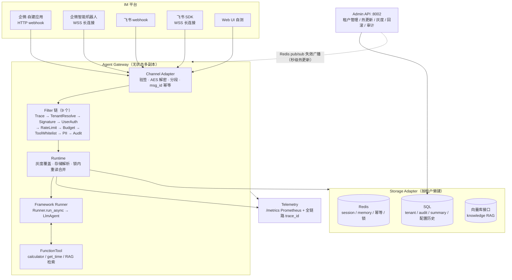
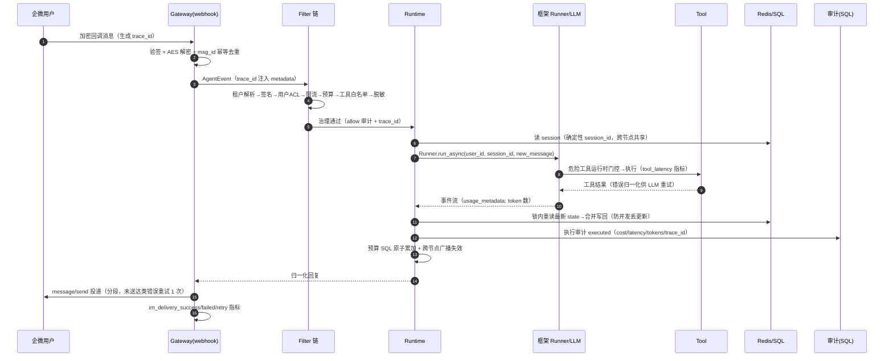

# ✨ Teneuris — 多租户节点化 Agent 部署平台


> **Teneuris** = **Tenant**（租户）+ **Neur**（神经元）+ **-is**（系统）
> *每个租户如同独立的神经元，共同构成一个鲜活的智能神经网络。*

基于 [tRPC-Agent-Python](https://github.com/trpc-group/trpc-agent-python) 构建的多租户、节点化、多后端 AI Agent 部署平台（Python 实现）。框架提供 Agent 编排、Tool / MCP、Session / Memory、Knowledge、Filter、Telemetry 等基础能力；平台层在其上补齐多租户隔离、无状态多节点、治理运维，把 Agent 能力从单点 Demo 扩展为可统一管理的平台化服务。

- 语言 / 框架：Python 3.12 · tRPC-Agent-Python v1.1.20（uv.lock 锁定）+ FastAPI + SQLAlchemy + Redis
- 质量基线：282 单测通过 / 覆盖率 84% / flake8 0 条（两轮全链路验收，见 `docs/VERIFICATION.md`）
- IM 通道：企业微信（自建应用 + 智能机器人长连接）、飞书（webhook + 官方 SDK 长连接），收发方向真机联调闭环

## 文档导航

| 文档 | 内容 |
| --- | --- |
| [`docs/PRD.md`](docs/PRD.md) | 主设计文档（spec）：架构图、六大板块设计、风险清单、验收标准映射 |
| [`docs/DESIGN-*.md`](docs/DESIGN-ARCHITECTURE.md) | 六篇详设：架构 / 多租户 / 数据同步 / IM 通道 / 治理 / 运维 |
| [`docs/VERIFICATION.md`](docs/VERIFICATION.md) | 验证记录：全链路实测证据与复现命令 |
| [`docs/README.md`](docs/README.md) | 完整文档导航 |

---

## 一、系统设计

### 1.1 架构总览



### 1.2 三个基石决策

1. **一切状态外置，Worker 无状态**：对话历史在 Redis、配置与审计在 SQL、幂等键与分布式锁也在 Redis——Gateway 进程不存任何业务状态，因此不需要 sticky session。session_id 由 `sha256(tenant + 通道 + 群/用户)` 确定性生成，同一用户永远落到同一 session，「路由到正确 session」在生成规则层面被消解。
2. **治理前置成 Filter 链，与业务解耦**：每条消息进 Agent 前依次过 9 个 Filter（Trace → 租户解析 → IM 验签 → 用户 ACL → 限流 → 预算 → 工具白名单 → PII 脱敏 → 审计），治理阻断与执行失败均留审计。
3. **数据按性质选后端与一致性等级**：会话热状态走 Redis（低延迟），租户/审计/摘要走 SQL（强一致），知识检索走向量（最终一致），Artifact 预留对象存储接口。

### 1.3 核心链路时序（trace_id 贯穿）



治理阻断（限流 / 预算超限 / ACL / 未知租户）与执行失败同样留审计（`decision=block/execution_error`），且释放幂等键保证 IM 平台重试可重新处理。

### 1.4 数据模型

| 数据 | 存储 | 说明 |
| --- | --- | --- |
| tenant（含 agent app / channel binding / 灰度配置） | SQL `tenant` 表 | JSON 列承载嵌套配置，Admin 热更新 + 回滚 |
| tenant 配置历史 | SQL `tenant_config_history`（环形 5 份） | 回滚快照持久化，跨节点一致、密钥不落盘 |
| audit log | SQL `audit_log` | Problem 4.4 的 11 字段全覆盖，trace_id 可追溯 |
| summary | SQL `summary` | LLM 异步生成，不阻塞回复 |
| session（含 message/event 历史） | Redis | 平台态 + 框架态分键；版本号 + 分布式锁防并发丢更新 |
| memory | Redis list | `tenant + app + user` 隔离，LTRIM 上限 |
| knowledge | 向量检索（哈希 embedding + cosine，Redis 共享） | 租户隔离，`knowledge_search` 工具化接入 RAG；生产可换 pgvector |
| artifact | `ArtifactStore` 接口（InMemory 占位） | 生产换 S3/MinIO，接口不变 |
| 幂等 / 锁 | Redis | `SET NX EX 24h` 幂等；`SET NX EX` + Lua 防误删锁 |

### 1.5 关键设计决策（真实设计过程）

| 决策 | 结论 | 理由 |
| --- | --- | --- |
| Runner 入口 | 框架 `Runner.run_async`，不自构造 `InvocationContext` | 后者跳过 session 落库 / memory 沉淀 / telemetry（实测 v1.1.19） |
| Session / Memory 后端 | 平台层实现框架 Service 抽象，委托平台 `Storage` | 直接用框架内置服务会让平台存储层空转，「至少三类后端」失去代码支撑 |
| 并发写会话 | 分布式锁 + 锁内重读合并（框架态按事件指纹去重） | 读-改-写横跨 LLM 周期，仅锁「写」防不住丢失更新（8 并发实测零丢失） |
| IM 通道 | HTTP 回调手写官方协议；长连接用官方 SDK | 手写部分验签 / AES 由单测完整覆盖；长连接官方 SDK asyncio 原生、内建重连 |
| 知识检索 | 平台内建哈希向量检索（零依赖），生产可换 pgvector | 哈希 embedding 确定性强、可离线跑，接口不变随时替换 |
| 密钥注入 | 只经环境变量 / SecretStr，缺 key 显式失败 | 静默回落 mock 会让演示"看起来能跑"实际全假 |
| tracing | 自研 trace_id 全链路贯穿（等价 tracing） | Problem 允许「或等价 tracing」；不留未接线的预留依赖 |
| 生产安全 fail-closed | `env=prod` 六项校验启动即拒 | Admin 密钥 / DEBUG / sqlite / 默认 DSN 等危险配置不带病运行 |

设计全文见 [`docs/PRD.md`](docs/PRD.md)（主 spec）与 [`docs/DESIGN-*.md`](docs/DESIGN-ARCHITECTURE.md)（六篇详设）。

---

## 二、安装

### 环境要求

| 依赖 | 说明 |
| --- | --- |
| Python ≥ 3.12 | 运行环境 |
| Redis（可选） | 多节点/生产后端；本地自测可用 `--storage inmemory` |
| DeepSeek API Key（可选） | 真实 LLM（`--runner framework`）；无 key 用 mock 模式体验全链路 |

### 安装步骤

```bash
# 1) 安装依赖（uv.lock 精确锁定 115 包，框架 trpc-agent-py==1.1.20）
sh build.sh
# 或：pip install -r requirements.txt

# 2) 配置密钥（.env 已被 .gitignore 排除，不进版本库）
cp .env.example .env
# 填入 DEEPSEEK_API_KEY（真实 LLM）、WECOM_* / FEISHU_*（IM 联调）、
# TENEURIS_ADMIN_API_KEY（Admin 鉴权）。环境变量与 .env 汇入同一注入流。

# 3) 质量门禁自检
bash gate-check.sh    # lint + 全量测试 + 覆盖率
```

---

## 三、使用

### 3.1 快速开始

```bash
# 本地回声模式（无需任何 key 与 Redis，开箱即用）
python -m trpc_service._cli gateway --storage inmemory --runner mock

# 真实 LLM 模式（需 DEEPSEEK_API_KEY）
python -m trpc_service._cli gateway --storage inmemory --runner framework

# 生产默认（等价于 --storage redis --runner framework，需本地 redis-server）
python -m trpc_service._cli gateway

# Admin API（租户管理 / 灰度下发 / 回滚 / 审计查询 / Web 控制台）
TENEURIS_ADMIN_API_KEY=<管理密钥> python -m trpc_service._cli admin

# 一键起停
./start.sh    # 自动拉起 redis-server
./stop.sh
```

生产环境 `env=prod` 会触发安全校验：Admin 密钥必填、禁 DEBUG 日志、脱敏与监控强制开启、SQL 禁 sqlite、Redis 须显式配置——任一不满足启动即拒。

### 3.2 Web UI 自测

Gateway 启动后访问 `http://localhost:8000/`（多轮会话聊天页），或直接调接口：

```bash
curl -X POST http://localhost:8000/chat \
  -H 'Content-Type: application/json' \
  -d '{"tenant_id":"demo","user_id":"alice","content":"你好"}'
```

Web UI 是本地验证 IM 流程的手段，不计入正式 IM 实现。

### 3.3 IM 通道接入

| 通道 | .env 凭证 | 接入形态 |
| --- | --- | --- |
| 企业微信·自建应用 | `WECOM_CORP_ID` / `WECOM_AGENT_ID` / `WECOM_SECRET` / `WECOM_TOKEN` / `WECOM_AES_KEY` | webhook `POST /webhook/wechat_work/demo__wecom`（验签 + AES 解密 + 分段投递） |
| 企业微信·智能机器人 | `WECOM_BOT_ID` / `WECOM_BOT_SECRET` | 出站 WSS 长连接（`--wecom-bot`），支持群聊 @；同一 bot 仅单副本 |
| 飞书·webhook | `FEISHU_APP_ID` / `FEISHU_APP_SECRET` / `FEISHU_DEMO_USER_OPEN_ID` | webhook `POST /webhook/feishu/demo__feishu`（验签 / 加密事件 / URL 验证 / 撤回事件） |
| 飞书·SDK 长连接 | `FEISHU_APP_ID` / `FEISHU_APP_SECRET` | 出站 WSS（`--feishu-sdk`），免公网回调域名；与 webhook 二选一 |

群聊/单聊 session 隔离：单聊按 `tenant + channel + user` 确定性生成 session_id，群聊按 `tenant + channel + 群 id + user`；跨租户天然隔离。消息长度分段、频率错峰、撤回、投递失败重试均已处理。

### 3.4 租户管理与知识库

```bash
# 创建租户（模型单价预填 DeepSeek 官网价，预算与限流租户级生效）
curl -X POST http://localhost:8002/tenants -H 'Content-Type: application/json' \
  -d '{"tenant_id":"kefu","name":"客服部","monthly_budget_usd":10.0,"rate_limit_per_min":30}'

# 知识库录入（切块写入 Redis hash，多节点共享、录入即全部节点可检）
python -m trpc_service._cli knowledge-add --tenant kefu --doc-id kefu-faq \
  --file data/knowledge/kefu-faq.txt

# 后端迁移（copy + verify 双步，mismatched=0 后经 Admin 热切）
python -m trpc_service._cli migrate-summaries --tenant kefu --source redis --target sql
```

治理能力实测：预算硬限（第二轮 `budget exceeded` 拦截）、限流（Redis 固定窗口多节点共享额度）、system_prompt 热更新下一句生效（pub/sub 广播）、一键回滚（快照持久化跨节点）。

### 3.5 多节点部署

```bash
TENEURIS_RUNNER=mock docker compose up -d --build   # 2×Gateway + Redis（离线验证）
sh scripts/verify-multinode.sh                      # 轮换实测：同 session、trace 各异、历史连续
TENEURIS_RUNNER=mock sh scripts/verify-integration.sh   # 六场景联调
```

无 sticky session：任一节点可处理任一请求，会话状态全部来自共享 Redis。

### 3.6 生产部署（Kubernetes）

`deploy/kustomize/` 提供生产部署件：Gateway 2 副本 + HPA（CPU 70%，2–10 副本）+ PDB + 探针（复用 `/healthz` `/readyz`）+ Secret 注入 DSN 与密钥。`env=prod` 部署即触发安全校验（fail-closed）。构建、推送与 `kubectl apply -k` 全流程见 [`deploy/kustomize/README.md`](deploy/kustomize/README.md)。

---

## 四、测试与验证

| 项 | 值 | 复现 |
| --- | --- | --- |
| 单元/集成测试 | 282 passed | `sh coverage.sh`（Redis 在线；关闭态 255 + 27 自动 skip） |
| 覆盖率 | 84% | 同上 |
| 静态检查 | flake8 0 条 | `bash lint_flake8.sh` |
| 全链路验证 | 两轮「归零→重建→部署→全板块实测」通过 | `docs/VERIFICATION.md`（含复现命令） |

实测覆盖：真实 LLM 工具调用与跨轮记忆、知识库 RAG、PII 实时脱敏、预算熔断、限流、热更新广播、跨节点幂等、Redis 重启自愈、多节点无 sticky 路由。

## 五、生产风险清单（11 项）

| # | 风险 | 缓解措施 |
| --- | --- | --- |
| 1 | 跨租户数据泄露：查询漏加 tenant_id | 统一查询层强制注入；存储 key 前缀隔离；隔离 E2E 用例覆盖 |
| 2 | 密钥泄露：token/key 入日志 | 环境变量/SecretRef 注入 + 日志全量脱敏 + Admin 输出排除密钥字段 |
| 3 | 多节点 Session 写冲突 | 分布式锁（Lua 防误删）+ 锁内重读合并 + 版本号串行化；8 并发实测零丢失 |
| 4 | IM 消息重复/乱序 | msg_id 幂等（SET NX 24h）+ 确定性 session_id；失败释放幂等键保重试安全 |
| 5 | 向量库最终一致 | 检索场景容忍；写入即全节点可见（共享热存）；生产可换 pgvector |
| 6 | Redis 单点故障 | Sentinel/Cluster 生产部署 + `/readyz` 真实探活摘流量 + 会话可迁移 |
| 7 | 模型超时雪崩 | `timeout_ms` 显式上限 + 超时转错误回复 + 租户限流前置 + 预算硬限 |
| 8 | 审计缺失 | 双行审计（治理+执行）+ 独立 SQL 审计表 + 11 字段含 trace_id |
| 9 | 灰度误伤 | 按用户比例金丝雀（sha256 稳定分流）+ 配置版本快照 + 一键回滚 |
| 10 | 成本失控 | 按租户单价结算 + SQL 原子累加 + BudgetFilter 硬限（实测拦截）+ 成本指标 |
| 11 | IM 平台封禁 | 出站投递按 `rate_limit_per_sec` 错峰；多节点共享计数列为生产演进 |

## 六、验收标准对照（Problem.md 7 条）

| # | 验收标准 | 覆盖 |
| --- | --- | --- |
| 1 | 架构覆盖多租户/节点化/数据同步/多后端/IM/治理监控/故障恢复 | 全部落地代码并实测（§1.1–1.5 与 docs/PRD.md 各章） |
| 2 | 数据模型表达 8 类关系 | §1.4 数据模型表；DDL 见 docs/DESIGN-DATA-SYNC.md |
| 3 | ≥2 种 IM 通道含微信/企微 | 企业微信（自建应用 + 机器人长连接）与飞书（webhook + SDK），接入差异见 docs/DESIGN-IM-CHANNELS.md |
| 4 | ≥3 类后端 | Redis / SQL / 向量库，同步策略见 §1.4 与 docs/DESIGN-DATA-SYNC.md |
| 5 | 完整链路时序 + trace_id | §1.3 时序图；实测审计行 trace_id 贯穿治理与执行 |
| 6 | ≥8 个生产风险及缓解 | §五列 11 项 |
| 7 | 复用 vs 新增 | 复用：Runner / LlmAgent / FunctionTool / Session-Memory Service 抽象；新增：多租户模型、StorageManager、治理 Filter 链、Admin、IM 适配、成本结算（详见 docs/DESIGN-ARCHITECTURE.md） |

## 七、代码目录

```text
|-- README.md        # 本文档：设计概览、安装、使用
|-- build.sh         # 依赖安装（uv.lock frozen）
|-- clean.sh         # 清理中间产物
|-- coverage.sh      # 运行单测覆盖率
|-- format.sh        # 代码格式化
|-- lint_flake8.sh   # 静态检查
|-- start.sh         # 启动服务（自动拉起 redis-server）
|-- stop.sh          # 停止服务
|-- gate-check.sh    # 质量门禁（lint + 测试 + 覆盖率）
|-- docker-compose.yml  # 多节点部署（2×Gateway + Redis）
|-- deploy/kustomize/   # K8s 生产部署件
|-- config/          # 平台配置（teneuris.yaml）
|-- data/            # 运行数据（sqlite / 日志 / 知识库种子）
|-- docs/            # 交付文档（见上方文档导航）
|-- scripts/         # 验证脚本（多节点 / 集成联调）
|-- tests/           # 282 用例
`-- trpc_service/    # 源码
    |-- _cli.py      # CLI 入口（gateway / admin / knowledge-add / migrate）
    |-- agent/       # Agent 构建（Runner 适配 / 模型工厂 / 摘要）
    |-- channels/    # IM 通道（企微×2 / 飞书×2 / Web）
    |-- config/      # 配置模型与加载
    |-- filters/     # 9 个治理 Filter
    |-- log/         # 结构化日志（脱敏）
    |-- metrics/     # Prometheus 指标
    |-- runtime/     # Runtime 编排 / Runner
    |-- skill/       # 骨架占位
    |-- storage/     # 八域存储抽象与多后端实现
    |-- tenant/      # 多租户模型 / 注册表 / 灰度 / 预算
    |-- tool/        # FunctionTool 注册与门控
    |-- version.py   # 版本号
    |-- web/         # Gateway / Admin API 与页面
    `-- workspace/   # 骨架占位
```

## 八、分支与提交规范

按课题要求，交付分支为 **`feature/niuchenxun`**（直接建于课程仓库，非 fork 链接）；日常开发分支经 merge 汇入。
