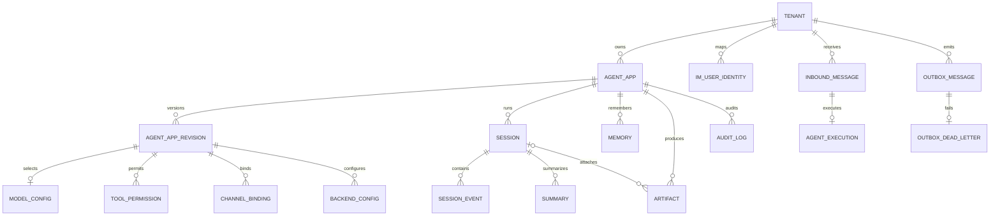

# 多租户 Agent 平台数据模型设计

> 本文以当前 `trpc_service/storage/models.py` 和 Alembic `0001`～`0004` 为准，描述平台控制面、消息运行面、数据同步和故障恢复所需的数据关系。

## 1. 设计目标

数据模型需要满足以下要求：

- 以 `tenant_id` 作为所有业务数据的隔离根；
- 支持一个租户创建多个 Agent App，并对模型、工具、IM 通道和数据后端进行版本化发布与回滚；
- 能表达 Session、Message/Event、Memory、Summary、Artifact 和 Audit Log 的完整关系；
- 支持企业微信、Telegram 等外部账号与租户、Agent App、内部用户的绑定；
- 支持同 Session 并发控制、IM 消息幂等、事务 Outbox 和双事务恢复；
- 支持 PostgreSQL RLS、复合外键和可追踪的 `trace_id/request_id`。

当前 ORM 使用 `VARCHAR(36)` 保存 UUID 字符串，以兼容 SQLite 与 PostgreSQL；生产部署可继续使用该格式，也可以在后续迁移为 PostgreSQL 原生 UUID。

## 2. 总体实体关系



关系说明：

- Tenant 是配置和数据隔离根；
- Agent App 是稳定的应用身份，Agent App Revision 是不可变配置版本；
- 运行时只读取 `AgentApp.active_version` 指向的 Revision；
- Session 属于一个 tenant 的一个 Agent App；Event 和 Summary 从属于 Session；
- Memory 属于 tenant、Agent App 和内部用户，允许跨 Session 检索；
- Channel Binding 把外部 IM 账号绑定到一个已发布的 Agent App；
- Inbound Message、Agent Execution 和 Outbox Message 共同支持异步处理与崩溃恢复。

## 3. 控制面表结构

### 3.1 `tenants`

租户隔离根，保存租户状态、审计策略和密钥命名空间。

| 字段 | 类型 | 约束/说明 |
|---|---|---|
| `id` | `VARCHAR(36)` | 主键，UUID |
| `slug` | `VARCHAR(63)` | 全局唯一 |
| `name` | `VARCHAR(128)` | 租户名称 |
| `status` | enum | `active/suspended/disabled` |
| `audit_policy` | JSON | 保留期、审计范围和脱敏策略 |
| `key_namespace` | `VARCHAR(255)` | Vault/KMS Secret 命名空间 |
| `version` | INT | `>=1`，租户配置乐观锁 |
| `created_at/updated_at` | TIMESTAMPTZ | 创建和更新时间 |

### 3.2 `agent_apps`

租户内稳定的 Agent 应用身份。

| 字段 | 类型 | 约束/说明 |
|---|---|---|
| `id` | `VARCHAR(36)` | 主键 |
| `tenant_id` | `VARCHAR(36)` | 外键 → `tenants.id` |
| `slug` | `VARCHAR(63)` | 租户内唯一 |
| `name` | `VARCHAR(128)` | 应用名称 |
| `status` | enum | `draft/active/disabled` |
| `active_version` | INT NULL | 当前生效 Revision |
| `draft_version` | INT | `>=1` |
| `lock_version` | INT | `>=1`，Admin API CAS |
| `created_at/updated_at` | TIMESTAMPTZ | 时间字段 |

关键约束：`UNIQUE(tenant_id, slug)` 和 `UNIQUE(tenant_id, id)`。第二个约束用于子表建立包含 tenant 的复合外键，阻止跨租户引用。

### 3.3 `agent_app_revisions`

保存不可变的应用配置版本。

| 字段 | 类型 | 说明 |
|---|---|---|
| `id` | `VARCHAR(36)` | 主键 |
| `tenant_id/agent_app_id` | `VARCHAR(36)` | 复合外键 → Agent App |
| `version` | INT | `>=1`，应用内唯一 |
| `description` | `VARCHAR(512)` | 版本描述 |
| `instruction` | TEXT | Agent 指令 |
| `application_config` | JSON | 治理、预算及扩展配置 |
| `status` | enum | `draft/published` |
| `published_at` | TIMESTAMPTZ NULL | 发布时间 |

关键约束：`UNIQUE(agent_app_id, version)`。发布后不修改原 Revision；回滚只改变 `agent_apps.active_version`。

### 3.4 Revision 子配置表

| 表 | 关键字段 | 唯一约束 | 用途 |
|---|---|---|---|
| `model_configs` | provider、model_name、base_url、api_key_secret_ref、parameters | `(agent_app_id, config_version)` | 每版本最多一个模型配置 |
| `tool_permissions` | tool_name、effect、requires_confirmation、constraints | `(agent_app_id, config_version, tool_name)` | 工具白名单/黑名单及二次确认 |
| `channel_bindings` | channel_type、account_id、webhook_path、token_secret_ref、secret_ref、options | `(agent_app_id, config_version, channel_type, account_id)` | IM 账号绑定与验签配置 |
| `backend_configs` | backend_kind、backend_type、secret_ref、options | `(agent_app_id, config_version, backend_kind)` | Session、Memory、Summary、Knowledge、Artifact、Audit 后端选择 |

所有 Secret 字段只保存 `env://`、`vault://`、`kms://` 等引用，不保存明文。

### 3.5 `im_user_identities`

把 IM 外部用户映射为租户内稳定用户。

| 字段 | 类型 | 说明 |
|---|---|---|
| `id` | `VARCHAR(36)` | 主键 |
| `tenant_id` | `VARCHAR(36)` | 外键 → Tenant |
| `channel_type` | enum | `wecom/telegram/wechat_official/http` |
| `account_id` | `VARCHAR(255)` | IM 机器人或应用账号 |
| `external_user_id` | `VARCHAR(255)` | 通道用户 ID |
| `internal_user_id` | `VARCHAR(255)` | 租户内用户 ID |
| `display_name` | `VARCHAR(255) NULL` | 展示名 |
| `status` | `VARCHAR(16)` | `active/disabled` |
| `attributes` | JSON | 部门、角色等扩展信息 |

唯一约束：`UNIQUE(tenant_id, channel_type, account_id, external_user_id)`。同一外部 ID 在不同租户和不同 IM 账号下不会串联。

## 4. 消息与会话数据表

### 4.1 `sessions`

| 字段 | 类型 | 说明 |
|---|---|---|
| `id` | `VARCHAR(36)` | 内部主键 |
| `tenant_id/agent_app_id` | `VARCHAR(36)` | 复合外键 → Agent App |
| `user_id` | `VARCHAR(255)` | 映射后的租户内用户 |
| `session_key` | `VARCHAR(512)` | 通道生成的业务 Session ID |
| `state` | JSON | 当前 Agent 状态 |
| `version` | INT | `>=0`，CAS 版本 |
| `created_at/updated_at` | TIMESTAMPTZ | 时间字段 |

唯一约束：`UNIQUE(tenant_id, agent_app_id, session_key)`。

推荐 Session Key：

```text
单聊：{channel}:{account_id}:direct:{internal_user_id}
群聊：{channel}:{account_id}:group:{conversation_id}
```

即使外部用户或群 ID 相同，tenant、Agent App 和 account 仍共同构成隔离边界。

### 4.2 `session_events`

追加式保存用户消息、模型回复、工具调用等事件。

| 字段 | 类型 | 说明 |
|---|---|---|
| `id` | `VARCHAR(36)` | 主键 |
| `tenant_id/session_id` | `VARCHAR(36)` | 复合外键 → Session |
| `sequence_no` | INT | Session 内递增，`>=0` |
| `event_type` | `VARCHAR(64)` | user_message、assistant_message、tool_call 等 |
| `role` | `VARCHAR(32) NULL` | user/assistant/tool/system |
| `payload` | JSON | 标准化事件内容 |
| `channel_type` | `VARCHAR(32) NULL` | wecom、telegram 等 |
| `external_message_id` | `VARCHAR(255) NULL` | IM 消息 ID |
| `trace_id` | `VARCHAR(64)` | 全链路 Trace |
| `created_at` | TIMESTAMPTZ | 发生时间 |

关键约束：

- `UNIQUE(session_id, sequence_no)` 保证 Session 内顺序；
- `UNIQUE(tenant_id, channel_type, external_message_id)` 构成 Event 层幂等屏障；
- `INDEX(trace_id)` 支持从 Jaeger 定位数据库事件。

### 4.3 `summaries`

| 字段 | 类型 | 说明 |
|---|---|---|
| `id` | `VARCHAR(36)` | 主键 |
| `tenant_id/session_id` | `VARCHAR(36)` | 复合外键 → Session |
| `version` | INT | Summary 版本，`>=1` |
| `through_sequence` | INT | 已覆盖的最大 Event sequence |
| `content` | TEXT | 摘要内容 |
| `created_at` | TIMESTAMPTZ | 创建时间 |

唯一约束：`UNIQUE(session_id, version)`。`through_sequence` 防止摘要遗漏或重复覆盖 Event。

### 4.4 `memories`

保存可跨 Session 使用的长期用户事实，SQL 为事实源，向量库为检索索引。

| 字段 | 类型 | 说明 |
|---|---|---|
| `id` | `VARCHAR(36)` | 主键，也是向量文档稳定 ID |
| `tenant_id/agent_app_id` | `VARCHAR(36)` | 复合外键 → Agent App |
| `user_id` | `VARCHAR(255)` | 租户内用户 |
| `memory_key` | `VARCHAR(255)` | 业务稳定键 |
| `content` | TEXT | Memory 原文 |
| `topics` | JSON array | 主题标签 |
| `version` | INT | `>=1`，向量同步版本 |
| `created_at/updated_at` | TIMESTAMPTZ | 时间字段 |

唯一约束：`UNIQUE(tenant_id, agent_app_id, user_id, memory_key)`。

## 5. Artifact 与审计

### 5.1 `artifacts`

对象正文保存在 MinIO/本地文件，SQL 只保存元数据。

| 字段 | 类型 | 说明 |
|---|---|---|
| `id` | `VARCHAR(36)` | 主键 |
| `tenant_id/agent_app_id` | `VARCHAR(36)` | 复合外键 → Agent App |
| `session_id` | `VARCHAR(36) NULL` | 可选复合外键 → Session |
| `object_key` | `VARCHAR(1024)` | 对象存储键 |
| `mime_type` | `VARCHAR(255)` | MIME 类型 |
| `size_bytes` | INT | `>=0` |
| `checksum` | `VARCHAR(128)` | SHA-256 等摘要 |
| `metadata_json` | JSON | 文件名、来源和业务标签 |

唯一约束：`UNIQUE(tenant_id, object_key)`。

### 5.2 `audit_logs`

| 字段 | 类型 | 说明 |
|---|---|---|
| `id` | `VARCHAR(36)` | 主键 |
| `tenant_id/agent_app_id` | `VARCHAR(36)` | 复合外键 → Agent App，删除策略 RESTRICT |
| `channel` | `VARCHAR(32) NULL` | 来源通道 |
| `user_id` | `VARCHAR(255) NULL` | 租户内用户 |
| `session_id` | `VARCHAR(512) NULL` | 外部通道生成的业务 Session Key |
| `agent_name` | `VARCHAR(128)` | Agent 名称 |
| `tool_name` | `VARCHAR(128) NULL` | Tool 名称 |
| `decision` | `VARCHAR(64)` | allow、deny、confirm 等 |
| `latency_ms` | INT | `>=0` |
| `error_type` | `VARCHAR(128) NULL` | 错误类型 |
| `cost` | `NUMERIC(18,8)` | `>=0` |
| `trace_id/request_id` | `VARCHAR(64)` | 链路关联标识 |
| `details` | JSON | 脱敏后的扩展字段 |
| `created_at` | TIMESTAMPTZ | 审计时间 |

`audit_logs.session_id` 在 Alembic `0004` 中扩展为 512 字符，因为企业微信等业务 Session Key 明显长于 UUID。

## 6. 异步处理与故障恢复表

| 表 | 关键字段与约束 | 作用 |
|---|---|---|
| `inbound_messages` | `UNIQUE(tenant_id, channel, external_message_id)`；status、attempts、available_at、locked_by/until、result | Webhook 快速入队、去重和异步消费 |
| `agent_executions` | `UNIQUE(inbound_message_id)`、`UNIQUE(idempotency_key)`；runner_reply、platform_event_id、status | 解决 tRPC Runner 与平台 SQL turn 的双事务恢复 |
| `outbox_messages` | `UNIQUE(dedupe_key)`；topic、payload、status、attempts、available_at、lease、last_error | 事务提交后同步向量库或回复 IM |
| `outbox_dead_letters` | `UNIQUE(original_outbox_id)`；topic、payload、attempts、last_error | 保存超过重试阈值的任务 |
| `tenant_budget_usage` | `UNIQUE(tenant_id, period)`；request_count、token_count、cost | 租户预算预留与结算 |

Execution 状态机：

```text
pending
  → runner_started
  → runner_completed
  → platform_committed
  → delivery_enqueued
```

异常状态为 `uncertain/failed`。Worker 重启后通过 Execution Ledger 判断应该重跑 Runner、补交平台事务，还是只补建 IM Outbox，从而避免重复模型调用和重复回复。

## 7. 核心 SQL 结构示例

下面是与当前 ORM 对齐的最小逻辑结构，省略时间字段和部分扩展列：

```sql
CREATE TABLE tenants (
  id VARCHAR(36) PRIMARY KEY,
  slug VARCHAR(63) UNIQUE NOT NULL,
  name VARCHAR(128) NOT NULL,
  status VARCHAR(16) NOT NULL,
  audit_policy JSON NOT NULL,
  key_namespace VARCHAR(255) NOT NULL,
  version INT NOT NULL CHECK (version >= 1)
);

CREATE TABLE agent_apps (
  id VARCHAR(36) PRIMARY KEY,
  tenant_id VARCHAR(36) NOT NULL REFERENCES tenants(id) ON DELETE CASCADE,
  slug VARCHAR(63) NOT NULL,
  name VARCHAR(128) NOT NULL,
  status VARCHAR(16) NOT NULL,
  active_version INT,
  draft_version INT NOT NULL CHECK (draft_version >= 1),
  lock_version INT NOT NULL CHECK (lock_version >= 1),
  UNIQUE (tenant_id, slug),
  UNIQUE (tenant_id, id)
);

CREATE TABLE channel_bindings (
  id VARCHAR(36) PRIMARY KEY,
  tenant_id VARCHAR(36) NOT NULL,
  agent_app_id VARCHAR(36) NOT NULL,
  config_version INT NOT NULL,
  channel_type VARCHAR(32) NOT NULL,
  account_id VARCHAR(255) NOT NULL,
  webhook_path VARCHAR(255) NOT NULL,
  token_secret_ref VARCHAR(512),
  secret_ref VARCHAR(512),
  enabled BOOLEAN NOT NULL,
  options JSON NOT NULL,
  UNIQUE (agent_app_id, config_version, channel_type, account_id)
);

CREATE TABLE sessions (
  id VARCHAR(36) PRIMARY KEY,
  tenant_id VARCHAR(36) NOT NULL,
  agent_app_id VARCHAR(36) NOT NULL,
  user_id VARCHAR(255) NOT NULL,
  session_key VARCHAR(512) NOT NULL,
  state JSON NOT NULL,
  version INT NOT NULL CHECK (version >= 0),
  FOREIGN KEY (tenant_id, agent_app_id)
    REFERENCES agent_apps(tenant_id, id) ON DELETE CASCADE,
  UNIQUE (tenant_id, agent_app_id, session_key),
  UNIQUE (tenant_id, id)
);

CREATE TABLE session_events (
  id VARCHAR(36) PRIMARY KEY,
  tenant_id VARCHAR(36) NOT NULL,
  session_id VARCHAR(36) NOT NULL,
  sequence_no INT NOT NULL CHECK (sequence_no >= 0),
  event_type VARCHAR(64) NOT NULL,
  role VARCHAR(32),
  payload JSON NOT NULL,
  channel_type VARCHAR(32),
  external_message_id VARCHAR(255),
  trace_id VARCHAR(64) NOT NULL,
  FOREIGN KEY (tenant_id, session_id)
    REFERENCES sessions(tenant_id, id) ON DELETE CASCADE,
  UNIQUE (session_id, sequence_no),
  UNIQUE (tenant_id, channel_type, external_message_id)
);

CREATE TABLE memories (
  id VARCHAR(36) PRIMARY KEY,
  tenant_id VARCHAR(36) NOT NULL,
  agent_app_id VARCHAR(36) NOT NULL,
  user_id VARCHAR(255) NOT NULL,
  memory_key VARCHAR(255) NOT NULL,
  content TEXT NOT NULL,
  topics JSON NOT NULL,
  version INT NOT NULL CHECK (version >= 1),
  UNIQUE (tenant_id, agent_app_id, user_id, memory_key)
);

CREATE TABLE summaries (
  id VARCHAR(36) PRIMARY KEY,
  tenant_id VARCHAR(36) NOT NULL,
  session_id VARCHAR(36) NOT NULL,
  version INT NOT NULL CHECK (version >= 1),
  through_sequence INT NOT NULL CHECK (through_sequence >= 0),
  content TEXT NOT NULL,
  FOREIGN KEY (tenant_id, session_id)
    REFERENCES sessions(tenant_id, id) ON DELETE CASCADE,
  UNIQUE (session_id, version)
);

CREATE TABLE audit_logs (
  id VARCHAR(36) PRIMARY KEY,
  tenant_id VARCHAR(36) NOT NULL,
  agent_app_id VARCHAR(36) NOT NULL,
  channel VARCHAR(32),
  user_id VARCHAR(255),
  session_id VARCHAR(512),
  agent_name VARCHAR(128) NOT NULL,
  tool_name VARCHAR(128),
  decision VARCHAR(64) NOT NULL,
  latency_ms INT NOT NULL CHECK (latency_ms >= 0),
  error_type VARCHAR(128),
  cost NUMERIC(18,8) NOT NULL CHECK (cost >= 0),
  trace_id VARCHAR(64) NOT NULL,
  request_id VARCHAR(64) NOT NULL,
  details JSON NOT NULL
);
```

## 8. Event JSON Schema 示例

`session_events.payload` 根据 `event_type` 保存结构化内容。用户消息示例：

```json
{
  "$schema": "https://json-schema.org/draft/2020-12/schema",
  "title": "UserMessageEventPayload",
  "type": "object",
  "required": ["text", "message_type"],
  "properties": {
    "text": {"type": "string"},
    "message_type": {
      "type": "string",
      "enum": ["text", "image", "voice", "video", "file", "mixed"]
    },
    "attachments": {
      "type": "array",
      "items": {
        "type": "object",
        "required": ["artifact_id", "mime_type"],
        "properties": {
          "artifact_id": {"type": "string"},
          "mime_type": {"type": "string"},
          "filename": {"type": ["string", "null"]}
        },
        "additionalProperties": false
      }
    },
    "metadata": {
      "type": "object",
      "properties": {
        "account_id": {"type": "string"},
        "external_sender_user_id": {"type": "string"},
        "identity_mapped": {"type": "boolean"}
      },
      "additionalProperties": true
    }
  },
  "additionalProperties": false
}
```

Tool 调用结果、模型回复和系统事件可以定义独立 payload schema，但公共追踪字段 `tenant_id/session_id/sequence_no/trace_id/channel_type/external_message_id` 应保留在 Event 表列中，便于索引和审计，不应只藏在 JSON 内。

## 9. 事务更新顺序

一次消息 turn 由 `TurnCoordinator` 获取 Session 锁和幂等 claim，然后由 `SqlDataPlane.commit_turn` 在单个 SQL 事务中执行：

```text
1. INSERT SessionEvent
2. UPDATE Session State WHERE version = expected_version
3. INSERT Summary（可选）
4. UPSERT Memory 事实（可选）
5. INSERT OutboxMessage
6. COMMIT
```

事务提交后：

- `memory.upsert` Outbox 同步 Qdrant；
- `knowledge.upsert` Outbox 同步知识索引；
- `im.reply.wecom` 或 `im.reply.telegram` Outbox 投递回复；
- 失败任务重试，超过阈值进入 `outbox_dead_letters`。

该顺序保证 Event、State、Summary 和 Memory 事实保持一致，同时消除 SQL 已提交但向量库或 IM 投递任务丢失的双写窗口。

## 10. 多租户隔离和索引建议

### 当前隔离机制

- 所有业务表带 `tenant_id`；
- 子实体通过 `(tenant_id, agent_app_id)` 或 `(tenant_id, session_id)` 复合外键关联；
- Alembic `0003` 为 Tenant 及全部租户表启用并强制执行 PostgreSQL RLS；
- RLS Policy 同时使用 `USING` 和 `WITH CHECK` 限制读写；
- 仅内部可信任务可以设置 `trpc.rls_bypass=on`。

### 重点索引

- Channel 查询：`(channel_type, account_id, enabled)`；
- Session 查询：`(tenant_id, agent_app_id, session_key)`；
- Event 顺序：`(session_id, sequence_no)`；
- Event/审计追踪：`trace_id`；
- Memory：`(tenant_id, agent_app_id, user_id, memory_key)`；
- Inbox/Outbox Worker：`(status, available_at, created_at)`；
- Audit 查询：`(tenant_id, created_at)`；
- IM 身份：`(tenant_id, channel_type, account_id, external_user_id)`。

JSON 字段只保存变化频繁或通道特有的扩展内容。用于隔离、关联、幂等、排序、追踪和状态机判断的字段必须独立成列并建立约束或索引。

## 11. 数据保留建议

| 数据 | 建议策略 |
|---|---|
| Tenant/Agent 配置版本 | 长期保留，禁用后软删除或归档 |
| Session/Event/Summary | 按租户审计策略保留；超期归档对象存储 |
| Memory | 支持用户级查询、更正和删除，并同步删除向量索引 |
| Audit Log | 追加写；按合规期限保留，限制修改和删除权限 |
| Inbox/Outbox | processed 数据短期保留用于排障；dead letter 保留到人工闭环 |
| Artifact | 使用生命周期规则；删除 SQL metadata 前先处理对象正文 |
| Budget Usage | 按日/月聚合，明细过期后保留汇总 |

## 12. 结论

当前数据模型以 Tenant 为隔离根、Agent App Revision 为配置版本边界、Session/Event 为对话事实链、Memory/Summary 为长期上下文，并通过 Inbox、Execution Ledger 和 Transactional Outbox 支撑异步处理与恢复。核心实体、复合外键、幂等约束、CAS 版本和 PostgreSQL RLS 已能覆盖多租户 Agent 平台的主要验收要求。
