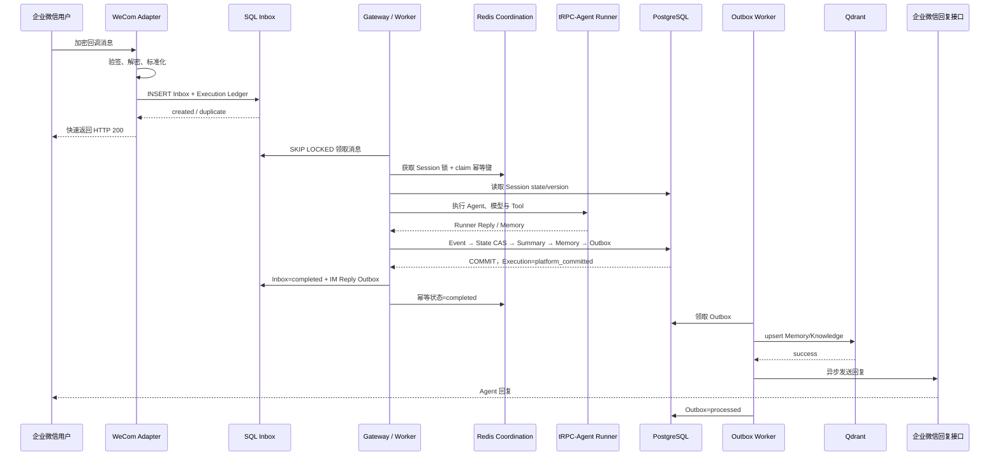

# 多租户 Agent 平台数据同步与幂等策略

> 本文基于当前项目已经实现的 SQL Inbox、Execution Ledger、Redis Coordination、Session CAS、Transactional Outbox、Qdrant Memory 同步和企业微信异步回复链路整理。

## 1. 目标与边界

平台需要在 IM 重复投递、多节点并发、Worker 崩溃、数据库短暂不可用和外部后端超时的情况下，尽量保证：

- 同一条外部消息只产生一次有效 Agent turn；
- 同一 Session 的 Event、State 和 Summary 顺序一致；
- SQL 已提交后，Memory 向量同步和 IM 回复任务不会丢失；
- Worker 崩溃后其他节点可以接管未完成任务；
- 重试可以安全重复执行，不产生重复向量、重复回复或跨租户污染；
- `trace_id/request_id` 能关联 Webhook、Inbox、Runner、SQL、Outbox 和回复。

平台采用的不是端到端“恰好一次”承诺，而是：

```text
至少一次接收/执行
+ 多层幂等约束
+ SQL 原子事务
+ 可重试派生同步
= 业务效果接近恰好一次
```

SQL 是权威事实源；Redis 是协调层；Qdrant 和 IM 平台是最终一致的派生端。

## 2. 统一业务标识

### 2.1 外部消息幂等键

规范幂等键固定为：

```text
tenant_id:channel:external_message_id
```

代码由 `storage.keys.idempotency_key()` 统一生成。不同通道的 `external_message_id` 来源为：

- 企业微信：优先使用平台消息 ID；无稳定 ID 的事件由 Adapter 根据稳定字段生成摘要键；
- Telegram：使用 `update_id`；
- HTTP/其他 IM：Adapter 必须提供稳定、可重复计算的外部消息 ID。

`tenant_id` 必须包含在键中，避免不同租户恰好使用相同 IM 消息 ID 时互相去重。

### 2.2 Session 锁键

```text
session:{urlencode(tenant_id)}:{urlencode(agent_app_id)}:{urlencode(session_id)}
```

Session ID 可能包含企业微信账号、群 ID 或用户 ID，因此每段先进行 URL 编码，防止分隔符歧义。

### 2.3 派生任务去重键

| 任务 | dedupe key 示例 | 作用 |
|---|---|---|
| IM 回复 | `im-reply:{inbound_message_id}` | 同一 Inbox 只生成一个回复任务 |
| Memory 同步 | `memory:{tenant}:{app}:{user}:{memory_key}:v{version}` | 同一 Memory 版本只同步一次 |
| Knowledge 同步 | 建议 `knowledge:{tenant}:{app}:{document_id}:v{version}` | 文档索引可幂等重建 |

Outbox 表对 `dedupe_key` 建立全局唯一约束，消费者使用稳定业务 ID 执行 upsert。

## 3. 四层消息幂等防线

### 第一层：SQL Inbox 入队去重

Webhook 完成验签、解密和消息标准化后，先写入 `inbound_messages`。数据库约束为：

```text
UNIQUE(tenant_id, channel, external_message_id)
```

若 IM 平台重复回调，插入触发唯一约束，`SqlInboundQueue.enqueue()` 查询并返回已有记录，`created=false`，不会再创建第二条 Inbox 或第二条 Execution Ledger。

这一层防止重复消息进入异步队列，是跨进程、跨节点且不依赖 Redis TTL 的长期屏障。

### 第二层：Redis 幂等 Claim

`TurnCoordinator` 在执行 Agent turn 前调用 Redis：

```text
SET trpc:idempotency:{business_key}
    {status: processing, result: null}
    NX EX 86400
```

- 首个节点 claim 成功后进入执行；
- 其他节点看到已存在记录，抛出 DuplicateMessageError；
- SQL 提交成功后将状态更新为 `completed`，保存 `event_id` 和 `session_version`；
- 执行失败且 SQL 未提交时，仅在状态仍为 processing 时删除 claim，允许后续重试；
- 默认 TTL 为 24 小时，用于快速去重，不作为长期唯一依据。

### 第三层：Session Event 唯一约束

SQL `session_events` 同时具有：

```text
UNIQUE(session_id, sequence_no)
UNIQUE(tenant_id, channel_type, external_message_id)
```

即使 Redis 不可用、claim 过期，或者在“SQL 已提交、Redis completed 尚未写入”的窗口发生重试，数据库仍拒绝重复 Event。`SqlDataPlane` 将该冲突转换为 `DuplicateMessageError`。

### 第四层：Execution 与 Outbox 唯一约束

- `agent_executions.idempotency_key` 唯一，防止同一消息创建多个 Runner 执行账本；
- `agent_executions.inbound_message_id` 唯一，保证一条 Inbox 对应至多一次执行；
- `outbox_messages.dedupe_key` 唯一，防止同一 Memory 版本或 IM 回复重复排队；
- `outbox_dead_letters.original_outbox_id` 唯一，防止同一 Outbox 重复进入死信表。

四层分别覆盖入队、执行、事实提交和派生投递窗口，不能只保留其中一层。

## 4. 同 Session 多节点并发控制

`TurnCoordinator.execute()` 对同一 Session 按以下顺序处理：

1. 获取 Redis Session 分布式锁；
2. claim 外部消息幂等键；
3. 读取或创建当前 Session；
4. 使用当前 `state/version` 执行 Agent；
5. 将 `expected_version` 连同新 Event、State、Summary、Memory 和 Outbox 交给 SQL；
6. SQL 提交成功后完成 Redis 幂等记录；
7. 释放 Session 锁。

当前 Redis 锁采用：

- `SET key token NX PX ttl` 原子获取；
- 默认锁 TTL 60 秒、等待时间 10 秒；
- 后台任务约每个 TTL 的三分之一自动续租；
- 释放和续租均通过 Lua 校验唯一 token，其他节点不能误释放锁。

分布式锁负责降低冲突，CAS 才是最终正确性屏障：

```sql
UPDATE sessions
SET state = :next_state, version = :expected_version + 1
WHERE id = :session_id AND version = :expected_version;
```

若更新行数不是 1，抛出 `VersionConflictError`。调用方必须重新读取 Session，再决定是否重新执行或停止，不能覆盖新版本。

## 5. Event → State → Summary → Memory → Outbox 固定顺序

`SqlDataPlane.commit_turn()` 在同一个数据库事务中完成：

```text
1. SELECT Session FOR UPDATE
2. 校验 Session user_id 和 expected_version
3. INSERT SessionEvent
4. CAS UPDATE Session.state/version
5. INSERT Summary（可选）
6. UPSERT Memory 事实并增加 version（可选）
7. INSERT Memory/IM 等 Outbox 任务
8. 将 Execution Ledger 更新为 platform_committed
9. COMMIT
```

任何步骤失败，整笔事务回滚。因此不会出现：

- Event 已存在但 State 未推进；
- State 已推进但 Summary 指向旧 sequence；
- Memory 已改变但没有产生向量同步任务；
- Runner 结果被标记提交但平台 Event 实际不存在。

`Summary.through_sequence` 与新 Session version/sequence 对齐，用于判断摘要覆盖到了哪条 Event。

## 6. Transactional Outbox 同步策略

SQL、Qdrant、MinIO 和 IM 平台不能参与同一个本地事务。项目采用 Transactional Outbox：

```text
SQL 事务：写事实 + 写 Outbox
                 │
                 └── COMMIT
                       │
                       ▼
                 Outbox Worker
                  ├── memory.upsert → Qdrant
                  ├── knowledge.upsert → Qdrant
                  ├── im.reply.wecom → 企业微信
                  └── im.reply.telegram → Telegram
```

### 6.1 领取与并发

Outbox Worker 查询以下记录：

- `pending/failed` 且 `available_at <= now`；
- 或 `processing` 但 `locked_until` 已过期。

在 PostgreSQL 下使用 `FOR UPDATE SKIP LOCKED`，多个 Worker 可以并行领取不同任务。领取成功后：

- status → `processing`；
- attempts + 1；
- 写入 `locked_by`；
- 设置 60 秒处理租约。

Worker 崩溃后，租约过期的记录可被其他节点重新领取。

### 6.2 成功、失败与死信

- 成功：status → `processed`，记录 `processed_at`；
- 失败：status → `failed`，按 `2^attempts` 秒指数退避，最大 300 秒；
- 默认达到 8 次仍失败：复制到 `outbox_dead_letters`，原记录标为 processed，并记录 `DEAD_LETTER` 错误。

Outbox 提供的是至少一次投递，因此下游必须幂等：Qdrant 使用稳定 ID upsert；IM 回复依赖 Outbox dedupe key，并应结合通道自身幂等能力判断不确定投递。

## 7. Memory 与 Knowledge 同步

### 7.1 Memory

Memory 的权威记录先写 SQL：

```text
UNIQUE(tenant_id, agent_app_id, user_id, memory_key)
```

每次更新递增 `version`，在同一事务生成带版本的 `memory.upsert` Outbox。事务提交后，`VectorOutboxHandlers` 调用 `SemanticStore.upsert_memory()` 写 Qdrant。

向量命名空间包含：

```text
tenant_id + agent_app_id + user_id
```

因此：

- SQL Memory 在事务提交后立即跨节点可见；
- Qdrant 语义检索在 Outbox 成功后最终可见；
- 重复消费同一版本不会生成重复向量；
- 向量库损坏时可使用 `SqlMemoryToVectorMigrator` 从 SQL 重建。

### 7.2 Knowledge

`knowledge.upsert` 使用同一 Outbox/Handler 机制。生产方案应保存文档 ID 和版本，采用稳定 Qdrant document ID。原始大文件进入对象存储，结构化元数据保存在 SQL，向量库只保存可重建索引。

### 7.3 查询时的一致性取舍

| 数据 | 可见性 |
|---|---|
| Event、Session State、Summary、Memory 事实 | SQL 事务提交后强一致可见 |
| Redis 幂等、锁和短期状态 | Redis 成功写入后跨节点可见，受 TTL 约束 |
| Qdrant Memory/Knowledge 检索 | Outbox 完成后的最终一致 |
| IM 用户收到回复 | Outbox 投递成功后的最终一致 |

若向量同步尚未完成，可以返回旧检索结果或暂时不返回新 Memory，但不能把向量库内容反向覆盖 SQL 事实。

## 8. Inbox 持久化队列

IM Webhook 不直接等待完整模型执行。标准化消息写入 SQL Inbox 后即可快速响应平台，后台 `InboundWorker` 异步处理。

### 8.1 领取机制

- 领取条件与 Outbox 类似；
- PostgreSQL 使用 `FOR UPDATE SKIP LOCKED`；
- Inbox 处理租约为 90 秒；
- Worker 崩溃后由其他节点重新领取；
- 默认最多尝试 5 次，失败采用指数退避，最大 300 秒。

当前实现中，超过 Inbox 最大尝试次数的记录保持 failed，并把 `available_at` 推迟到很远的未来；Outbox 有独立死信表，而 Inbox 尚未建立独立 dead-letter 表。这是当前实现边界，生产化时建议增加 `inbound_dead_letters` 或统一的人工处理接口。

### 8.2 异步回复

Agent turn 完成后，`SqlInboundQueue.complete()` 与下列操作处于同一事务：

- Inbox status → completed；
- 保存 Gateway result；
- 创建 `im.reply.{channel}` Outbox；
- Execution status → delivery_enqueued。

回复 dedupe key 为 `im-reply:{inbound_id}`，所以重复完成同一 Inbox 不应产生第二条回复任务。

## 9. Runner 与平台 SQL 双事务恢复

tRPC-Agent Runner Session 与平台 SQL Event/State 无法共享数据库事务。项目使用 `agent_executions` 保存阶段状态和 Runner 回复：

```text
pending
  → runner_started
  → runner_completed       # runner_reply 已缓存
  → platform_committed     # 与 Event/State SQL 事务一起更新
  → delivery_enqueued      # 与 IM Outbox 创建一起更新
```

恢复判断：

| Ledger 状态 | 恢复动作 |
|---|---|
| `pending` | 尚未执行，可开始 Runner |
| `runner_started` 且结果未知 | 标记 uncertain，避免自动重复产生外部副作用 |
| `runner_completed` | 复用缓存的 runner_reply，只补交平台 SQL turn |
| `platform_committed` | 不再调用 Runner，只补建或检查 IM 回复 Outbox |
| `delivery_enqueued` | 等待 Outbox 投递，不重复生成回复 |
| `uncertain` | 由管理员选择 retry 或 fail，并保留审计记录 |

`agent_executions.idempotency_key` 与外部消息幂等键相同，确保多个节点看到的是同一执行账本。

## 10. 完整消息时序



同一个 trace context 在写 Inbox 时注入 `metadata._trace_context`，后台消费时恢复，因此异步边界前后的 Span 仍可关联同一个 Trace。

## 11. 故障窗口与恢复策略

| 故障位置 | 数据状态 | 恢复方式 | 是否重复调用模型 |
|---|---|---|---|
| Inbox 插入前失败 | 无可靠记录 | IM 平台重试回调 | 否 |
| Inbox 已写、HTTP 响应丢失 | 已有 Inbox | 重复回调命中唯一约束 | 否 |
| Runner 开始前崩溃 | execution=pending | 租约过期后其他 Worker 接管 | 否 |
| Runner 调用中崩溃 | runner_started，结果未知 | 标记 uncertain，人工决策 | 默认不自动重试 |
| Runner 完成、SQL turn 前崩溃 | runner_completed + cached reply | 复用 reply 补交 SQL | 否 |
| SQL turn 已提交、Redis complete 失败 | Event/State 已存在 | SQL 唯一约束阻止重复提交 | 否或返回已有结果 |
| SQL 已提交、Qdrant 不可用 | Memory + pending/failed Outbox | Outbox 指数退避重试 | 否 |
| IM 已接收但客户端超时 | 投递结果 uncertain | 按通道能力查询/谨慎人工重放 | 否，但可能重复回复 |
| Worker 领取 Outbox 后崩溃 | processing + lease | 60 秒租约过期后重新领取 | 否 |

## 12. 跨后端迁移与同步

### Redis Session → SQL

现有 `RedisToSqlSessionMigrator` 分批读取 Redis Session，并按 tenant/app/session upsert SQL。建议迁移顺序：冻结写入或短期双写、全量回填、增量校验、切换 active backend、观察、保留回滚窗口。

### SQL Memory → 远端向量库

使用 `SqlMemoryToVectorMigrator` 按租户分批重建 Qdrant。迁移前后核对 SQL Memory 数量、向量点数、版本和抽样召回结果。

### Local Artifact → MinIO

使用 `LocalToMinioArtifactMigrator` 上传并校验 checksum。在 SQL metadata、对象数量和 checksum 全部一致前不删除本地源文件。

迁移任务本身也必须幂等：使用稳定目标键、支持断点续传、记录成功/失败/跳过数量，并可重复运行。

## 13. 一致性模型总结

| 范围 | 一致性 | 实现手段 |
|---|---|---|
| 单个 SQL turn | 强一致 | 单事务、行锁、CAS、唯一约束 |
| 同 Session 多节点写 | 串行化 + 乐观并发保护 | Redis 可续租锁 + SQL CAS |
| IM 重复回调 | 业务幂等 | Inbox/Redis/Event/Execution 四层约束 |
| SQL → Qdrant | 最终一致 | Transactional Outbox + 稳定 ID upsert |
| SQL → IM 回复 | 最终一致、至少一次 | Outbox、租约、退避和死信 |
| Redis 临时数据 | 有界生命周期 | TTL、原子 Lua、SQL 最终约束 |
| Artifact 迁移 | 校验后切换 | checksum、稳定 object key、迁移报告 |

## 14. 监控与验收

建议持续监控：

- 幂等 duplicate/processing/completed 数量；
- Session 锁等待、续租失败和 CAS 冲突；
- Inbox/Outbox backlog、最老消息年龄、attempts 和 dead letter；
- SQL transaction P95、连接池等待和唯一约束冲突；
- Memory 向量同步延迟与 Qdrant upsert 失败；
- IM 投递成功率、429、超时和 uncertain；
- 每个 trace 的 Inbox、Runner、commit_turn、memory.upsert、outbox.deliver Span 是否完整。

最低验收用例：

1. 同一企业微信消息连续投递两次，只存在一条 Inbox、一条 Event 和一次回复；
2. 两个真实节点并发处理同一 Session，Event sequence 和 Session version 单调递增；
3. Qdrant 停止后 SQL turn 仍可提交，恢复后 Outbox 自动同步；
4. Worker 在领取 Inbox/Outbox 后被终止，租约过期后其他节点能够接管；
5. Runner 完成后、SQL 提交前模拟崩溃，恢复时复用 cached reply；
6. 达到 Outbox 最大重试次数后生成唯一死信记录；
7. 使用 `trace_id` 能串联 Webhook、Gateway、Runner、存储和 IM 回复。

## 15. 当前实现边界

- 生产环境已禁止 InMemory Session，但 Redis Session Store 尚未作为完整 `ConversationStore` 接入租户级 turn 路由；
- Outbox 有独立死信表，Inbox 超过重试次数目前采用长期延后方式，尚未建立独立 Inbox 死信表；
- 向量同步和 IM 回复已经接入 Outbox，Artifact 正常写入仍主要依赖对象存储自身结果与 checksum，未统一经过 Outbox；
- 外部 IM API 通常无法提供真正端到端 exactly-once，超时后的投递结果仍需按通道能力谨慎处理；
- Redis 幂等 TTL 默认 24 小时，长期去重最终依赖 SQL 唯一约束。

## 16. 结论

当前项目通过“SQL Inbox + Redis 锁与 claim + SQL CAS/唯一约束 + Execution Ledger + Transactional Outbox”覆盖了从消息接收到派生投递的主要故障窗口。SQL 事务负责 Event、State、Summary、Memory 和 Outbox 的强一致，Qdrant 与 IM 回复采用可重试最终一致；多节点重复执行则由稳定业务键、租约和数据库约束共同抑制。这一策略符合当前真实企业微信链路，也为后续增加其他 IM 和远端后端保留了统一扩展边界。
