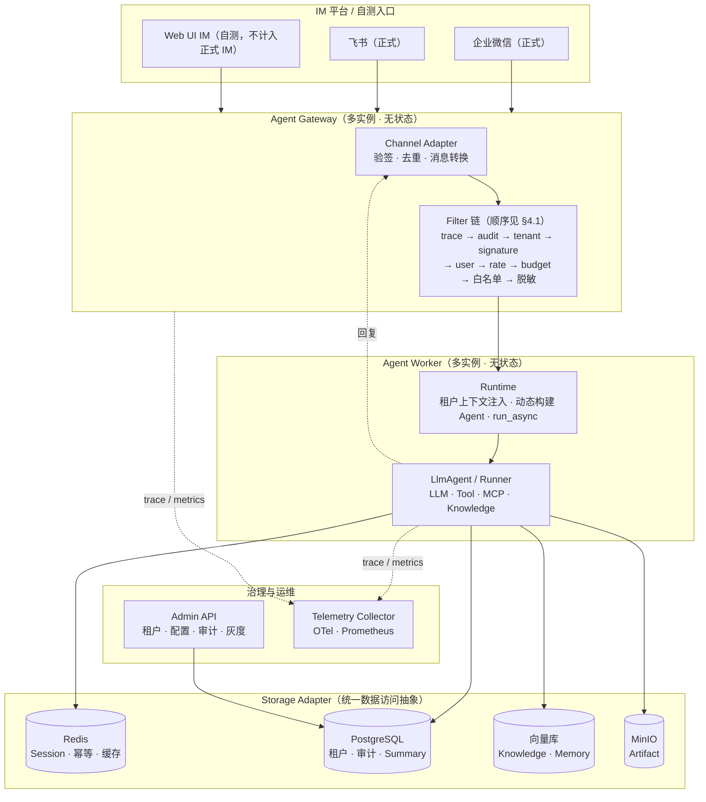
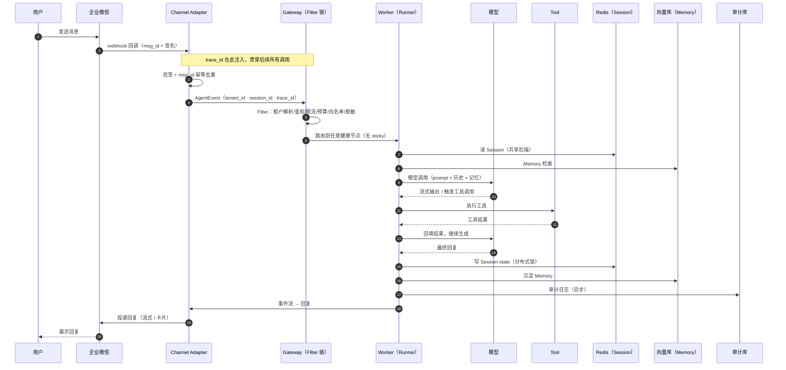

# 详设 0 · 总体架构与运行时模型

> 主文档：[PRD.md §0](PRD.md)　|　验证证据：[VERIFICATION.md](VERIFICATION.md)
> 本文为该章节的完整详设（spec 深度层）；与代码/实测不一致时，以后者为准。
> 小节编号沿用原 PRD 章号（如本篇 §N.x）；跨篇 § 引用指向对应编号的详设文件。

### 0.1 系统架构图



### 0.2 组件职责

| 组件                          | 职责                                                               | 部署特性                 | 归属            |
| ----------------------------- | ------------------------------------------------------------------ | ------------------------ | --------------- |
| **Agent Gateway**       | 接收 IM Webhook / HTTP，Filter 链处理鉴权/限流/脱敏，路由到 Worker | 多实例、无状态、水平扩展 | 平台层新增      |
| **Agent Worker**        | 执行 Agent 推理循环（Runner → LLM → Tool），读写 Session/Memory  | 多实例、**无状态** | 复用框架 Runner |
| **Channel Adapter**     | IM 消息格式转换、验签、去重、流式/卡片回复                         | 每类 IM 独立扩缩容       | 平台层新增      |
| **Storage Adapter**     | 统一数据访问抽象，屏蔽后端差异                                     | 与后端同生命周期         | 平台层新增      |
| **Runtime**             | 租户上下文注入、Runner 封装、事件流 → IM 回复的编排               | 内嵌 Worker              | 平台层新增      |
| **Filter 链**           | 租户解析/鉴权/限流/预算/工具白名单/脱敏/审计                       | 内嵌 Gateway             | 复用框架 Filter |
| **Admin API**           | 租户管理、配置下发、审计查询、灰度控制                             | 独立部署、内网访问       | 平台层新增      |
| **Telemetry Collector** | 接收各组件 Trace / Metrics / Logs                                  | Sidecar 或 DaemonSet     | 复用 OTel       |

### 0.3 运行时模型（Runtime）—— 一次请求的完整生命周期

Runtime 是平台层新增的编排模块，职责是**在框架 Runner 之外，补上多租户上下文注入与「事件流 → IM 回复」的桥接**。完整链路：

```
1. 接入：IM Webhook 到达 Gateway
   Channel Adapter：验签 → msg_id 幂等去重 → 解析为内部 AgentEvent
2. 治理：Filter 链（洋葱模型，按注册顺序；**权威定义见 §4.1**）
   TraceFilter(注入 trace_id) → AuditFilter(审计) → TenantResolveFilter(tenant_id → ctx)
   → SignatureFilter(验签) → UserAuthFilter(IM 用户级权限) → RateLimitFilter(租户限流)
   → BudgetFilter(预算) → ToolWhitelistFilter(工具白名单) → PIIFilter(脱敏)
3. 路由：Gateway 将 AgentEvent 投递到任意健康 Worker（无需 sticky）
4. 执行：Worker 的 Runtime
   a. 从 ctx 取 tenant_id → 加载租户配置（本地 LRU 缓存）
   b. 按配置动态构建 LlmAgent（模型 / 工具白名单 / 知识库）
   c. Runner.run_async(user_id, session_id, new_message) 产出事件流
   d. Storage Adapter 读写 Session / Memory（共享后端）
5. 回复：事件流 → Channel Adapter
   文本 / 流式分片 / 卡片消息 → 投递回 IM
6. 异步收尾（不阻塞主链路）
   Summary 更新、审计落库、token 成本累计、Memory 沉淀
```

**事件流**是 tRPC-Agent-Python 的核心抽象：`Runner.run_async` 以流式 `Event` 产出，包含 `user_message / model_output / tool_call / tool_result / assistant_message` 等。Runtime 负责把这条事件流翻译成 IM 侧的消息（详见 3.2）。

> **Filter 顺序说明（2026-08-27 修订）**：`AuditFilter` 原置于链尾，但洋葱模型下前置 Filter 抛 `FilterBlocked` 即短路，链尾的 `_after` 永不执行——**限流、预算超限、工具越权这些最需要留痕的治理事件恰恰不落审计**。现将其上移至 `TraceFilter` 之后（洋葱外层），使 `decision=block` 的流量同样留痕，满足 §4.4「审计覆盖全部流量」。

### 0.4 复用框架 vs 平台层新增

| 能力          | 复用 tRPC-Agent-Python                         | 平台层新增                                                 |
| ------------- | ---------------------------------------------- | ---------------------------------------------------------- |
| Agent 编排    | ✅`LlmAgent` / `Runner` / 事件流           | 动态构建 + 租户上下文注入                                  |
| Tool / MCP    | ✅`FunctionTool` / `MCPToolset`            | 工具白名单 Filter                                          |
| Session       | ✅`SessionService`（Redis/SQL 后端）         | 租户级 key 前缀 + 分布式锁                                 |
| Memory        | ✅`MemoryService`（InMemory/Redis/SQL/向量） | 租户级隔离 + 版本号                                        |
| Knowledge/RAG | ✅`Knowledge` + 向量检索                     | 按租户分 collection                                        |
| Filter        | ✅`Filter` AOP 机制                          | 各治理 Filter 实现                                         |
| Telemetry     | ✅ OpenTelemetry 埋点                          | tenant 维度标签                                            |
| 服务化        | ✅ FastAPI / Gateway / A2A / AG-UI             | 多租户路由 + IM Adapter                                    |
| —            |                                                | 租户模型、Storage Adapter、Channel Adapter、审计、密钥管理 |

### 0.5 代码目录结构

在题目既定骨架（`docs/Problem.md` 的代码目录）之上，新增 `runtime/`、`storage/`、`filters/` 三个平台层模块（老师允许「增加目录」）：

```
trpc_service/
├── _cli.py          # 命令行入口
├── version.py
├── agent/           # [复用为主] LlmAgent 构建与编排
├── channels/        # [平台新增] IM Channel Adapter（企微/飞书/Web UI + 长连接形态 wecom_bot/feishu_sdk）
├── config/          # [平台新增] 配置加载与校验
├── filters/         # [平台新增] 治理 Filter 链（白名单/脱敏/预算/审计）
├── runtime/         # [平台新增] Runner 封装 + 租户上下文 + 事件流→回复
├── storage/         # [平台新增] Storage Adapter（redis/sql/vector/s3）
├── tenant/          # [平台新增] 租户模型与解析
├── tool/            # [复用为主] FunctionTool / MCP 工具
├── skill/           # [复用为主] SKILL.md 技能
├── log/             # [平台新增] 日志 + 脱敏
├── metrics/         # [平台扩展] Prometheus 指标
├── web/             # [平台新增] Web UI IM（自测）+ Admin 页面
└── workspace/       # [复用为主] 沙箱运行时（本地/容器）
```

### 0.6 核心时序图（企业微信全链路）



### 0.7 关键设计决策

> 本表记录**架构级**决策及其理由；单阶段需求切片以验收用例形式并入开发日志。新增决策须同时写「结论」和「理由」。

| 决策 | 结论 | 理由 |
| --- | --- | --- |
| Runner 入口 | 用框架 `Runner.run_async`，不自行构造 `InvocationContext` 后调 `agent.run_async` | 后者会跳过框架的 session 落库、memory 沉淀与 telemetry 埋点（实测 trpc-agent-py v1.1.19） |
| Session / Memory 后端 | 平台层实现框架的 Service 抽象，内部委托给既有 `Storage`（`storage/framework_adapter.py`） | 直接用框架内置服务会让既有 `storage/` 层空转，Problem.md 验收标准 4「至少三类后端的存储和同步策略」失去代码支撑 |
| 模型构造 | `provider → LLMModel` **实例** | `LlmAgent.model` 只接受 `str / LLMModel / Callable`，传配置 dict 直接 `ValidationError` |
| 会话历史持久化 | 在 `append_event` 中落库，而非 `update_session` | Runner 仅在异常/取消路径调用 `update_session`，正常路径不调；`update_session` 基类默认还是 no-op |
| 密钥注入 | 只经 `SecretStr` 或环境变量，缺 key 显式失败 | 静默回落 mock 会让终稿演示"看起来能跑"实际全是假的；启动预检有专项测试覆盖（缺 key 必须当场退出） |
| IM 通道实现 | **手写官方协议**（httpx + cryptography），不依赖 wechatpy 等 SDK | 调研过 wechatpy：企微能力仅在 2.0 **alpha**、且为 requests **同步库**，与平台全异步架构不匹配。手写协议与异步链路天然契合，验签/AES 用单测覆盖（调研留档见 `docs/IM-SDK-RESEARCH.md`） |
| 企微智能机器人接入 | **长连接选官方 SDK** `wecom-aibot-python-sdk`（asyncio 原生，WSS 出站，`wecom_bot` 形态） | 与「自建应用手写回调协议」并列：长连接为企微私有 WSS 协议，手写成本高且官方 SDK 已 asyncio 原生（websockets/aiohttp/pyee），与平台全异步契合；**附带补齐企微群聊标识缺口**（§3.5） |
| 会话并发写一致性 | **锁内重读（read-in-lock）+ 锁等待重试**，框架路径 events 按序列化指纹合并 | 读-改-写横跨整个 LLM 调用周期，仅锁写防不住丢失更新——09-04 联调实测 mock 12 并发丢 2 轮、framework 6 并发丢 5 条模型回复；修复后真实 E2E 零丢失（见 §2.3-A） |
| Admin 更新合并语义 | **非脱敏 dump 作合并基线**（`_dump_full`），API 输出仍走脱敏 `_dump` | 脱敏 dump 已剔除密钥字段，作基线会使任何局部更新静默清空内存路径租户的密钥（09-04 全项目审查发现）；SqlTenantStore 本就不落密钥（PRD 4.5），本决策保证「旧配置 + 传入变更」合并语义完整 |

### 0.8 示例租户 Agent（Demo Tenant）—— 平台孵化的 Agent

**平台的终点不是中间件，而是孵化出 Agent**。题目「最终目标是……并孵化出 Agent」，本平台以
内置的 **Demo Tenant（企业内部知识库问答助手）** 作为落地载体：它是「运行在本平台之上的第一个真实 Agent」，
同时承担答辩与验收时「框架理解深度」的展示抓手。

| 维度 | 内容 | 复用的平台能力 |
|---|---|---|
| **场景** | 企业内部知识库问答：员工经 IM 提问制度/流程（如「报销流程是怎样的」），Agent 检索租户知识库作答 | Knowledge/RAG（§2.2 向量选型） |
| **身份** | `tenant_id=demo`，企微/飞书/Web UI 三通道接入，配置与其他租户完全隔离 | 多租户模型（§1.1）+ IM 接入（§3） |
| **工具集** | `knowledge_search`（知识库检索）、`calculator`（计算）、`get_time`（时间）；危险工具（如 `delete_file`）走二次确认 | 工具白名单 Filter（§4.1）+ 动态 Agent 构建 |
| **记忆** | 跨轮会话连续 + 会话级 LLM 异步摘要沉淀 | Session/Memory 共享后端（§2.2） |
| **模型** | DeepSeek（`provider → LLMModel`，缺 key 显式失败） | 模型工厂（§0.7 决策） |

它的价值在于：**「多租户/节点化/多后端/治理」每一条平台能力都能在 Demo Tenant 上被真实验证**——
评审看到的不是一个抽象路由平台，而是一个具体、可交互、可被治理约束的 Agent 应用。
新增租户即复制 Demo 配置改模型/工具/知识库，完成「一次部署、多场景复用」。

---

## 0.9 镜像职责分离（开发镜像 vs 生产镜像）

系统存在两个职责完全分离的 Dockerfile，杜绝「一个镜像既当开发环境又当生产产物」导致的语义冲突：

| | 开发环境镜像 | 生产运行镜像 |
| --- | --- | --- |
| 定义 | `.ide/Dockerfile` | 根 `Dockerfile`（多阶段：deps → runtime） |
| 内容 | 依赖（uv.lock 锁定）+ IDE 工具链（code-server / Node / Go） | 仅运行所需：Python 3.12-slim + 锁定依赖 + 源码，非 root（`teneuris`）运行 |
| 源码 | 不打入镜像（由部署环境以挂载/拉取方式提供源码） | COPY 进 /app |
| Redis | 内置 redis-server（本地验证用） | 不内置（K8s 中 Redis 为独立容器） |
| 构建触发 | 开发镜像流水线监听 `.ide/Dockerfile` / `pyproject.toml` / `uv.lock` 变更自动重建 | 按 `deploy/kustomize/README.md` 流程手动/CI 构建推送 |

**演进记录**：曾设计 `deploy/Dockerfile` 组装层（依赖镜像 + COPY 源码），因构建上下文错误
（`docker build deploy/` 下 COPY 取不到源码）与 `:latest` tag 在两处语义相反被取消，
收敛为「根 = 生产、.ide = 开发」的当前格局。
