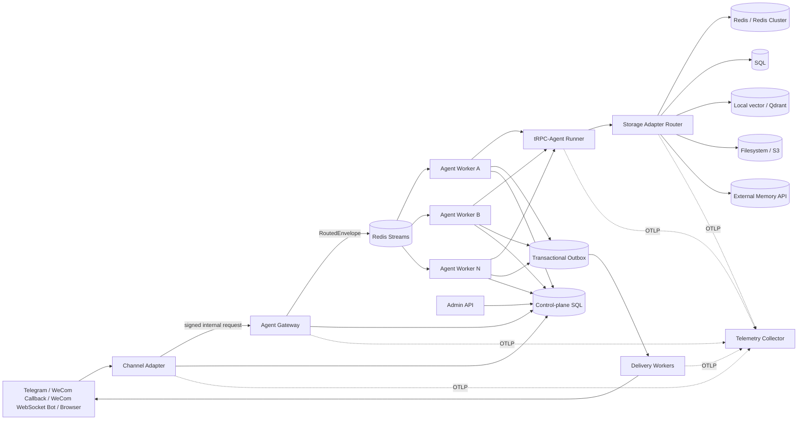

# Multi-Tenant and Multi-Node Deployment Design

## 1. Outcome and design principles

This project is a complete runnable service around tRPC-Agent-Python 1.1.19. It
accepts browser, Telegram, and encrypted WeCom messages; resolves the tenant from
a trusted channel binding; derives tenant-scoped user and session identities;
executes a tenant-specific Runner on stateless workers; persists normalized
events, state, summary, memory, artifacts, knowledge, audit, usage, idempotency,
and delivery state; and replies through a transactional outbox.

The central invariants are:

1. A caller cannot select `tenant_id`. Tenant identity comes from the channel and
   opaque binding in the callback route.
2. A worker never owns authoritative session state. Persistent backends and a
   renewable per-session lease make workers replaceable.
3. An external message may be delivered more than once, but its agent turn and
   reply intent are created once.
4. Every tenant-owned record and cache key carries a tenant scope. No query may
   omit it.
5. Secrets are references, not configuration values. Logs, exceptions, and all
   exported spans are sanitized.
6. Configuration revisions are immutable. Activation and rollback are atomic
   pointer switches, and queued jobs retain the exact revision selected at ingress.

## 2. Tenant model

`TenantConfig` is the immutable tenant control-plane document. Its minimum fields
and implementation are:

| Concern | Fields | Isolation behavior |
|---|---|---|
| Identity | `tenant_id`, `display_name`, `status`, `revision` | `tenant_id` is validated, present on every owned row, and part of every derived ID. |
| Applications | `apps[app_id]`: agent name, instruction, model profile, tool subset | A Runner graph is cached only by `(tenant_id, app_id, revision, cache_epoch)` in a bounded, draining cache. |
| Models | provider, model name, API-key reference, endpoint, timeout, output cap, price | Model clients and credentials are never shared across tenant cache keys. |
| Tools | allow, deny, dangerous, confirmation TTL; app-level subset | Deny wins; unknown or unlisted tools are never instantiated. Dangerous calls need an exact one-use signed confirmation. |
| IM channels | binding ID, channel, app, external account, credential references, settings | The globally unique `(channel, binding_id)` is the trusted route to the tenant. |
| Data backends | independent Session, Memory, Summary, Artifact, Knowledge, Audit references | Each resource can use a different adapter and namespace. |
| Governance | user/group ACL, monthly token/cost budget, request cap, redaction policy | Enforced before Runner and again at tool boundaries through a tRPC Filter. |
| Audit | enabled, retention, prompt hash/content policy, export sink | Content is excluded by default; content opt-in is still redacted. |

Secret-bearing fields use references such as `env://TENANT_ACME_NAME`,
`file://acme/mounted-name`,
or `vault://mount/path#field`. Plain values fail validation. The production
example uses Vault references; cloud secret-manager schemes are reserved for
deployment-specific resolver plugins.
Environment references use an injective prefix: alphanumeric tenant IDs remain
`TENANT_{TENANT_ID}_*`, while IDs containing `-` or `_` use a Base32 `TENANT_ENC_*`
prefix, so distinct IDs can never share an environment namespace. The sole
exception is the audit-only control DSN. File paths are decoded before validation, must
be canonical relative paths rooted at the tenant directory, and are resolved
again beneath both the global mount root and tenant snapshot. Arbitrary top-level
links, NTFS junctions, and any cross-tenant resolution are rejected; only the exact
tenant-scoped Kubernetes AtomicWriter `..data` root chain is accepted. Vault paths use
one fixed KV-v1 (`<mount>/tenants/<tenant>/...`) or KV-v2
(`<mount>/data/tenants/<tenant>/...`) hierarchy, so a later matching subsequence
cannot disguise a path rooted under another tenant.

Configuration lifecycle is `draft -> active -> superseded`. A revision's checksum
and body cannot change. Activating an old revision is the rollback operation. A
job records `config_revision`, so an activation during queue wait cannot silently
change the job's policy, model, or storage target.
Admin activation and rollback first resolve channel/model/backend secrets, reject
unknown tools and production-local backends, initialize and health-check every
resource adapter, construct the configured tRPC model and native Session service
without provider invocation, and reject the browser fallback in production. First
bootstrap uses this same callback. Only a successful bounded preflight is audited
and allowed to switch the active pointer.

Bootstrap YAML is seed-only: it creates and activates a tenant only when that
tenant has no stored versions. A process restart therefore cannot reactivate a
superseded file revision over an administrator's current revision. Current tenant
suspension and binding revocation remain authoritative kill switches for queued
execution and delivery.

## 3. Deployment topology and collaboration



The Channel Adapter terminates public webhooks, verifies the platform-specific
signature, converts the payload to `InboundEnvelope`, and acknowledges within the
IM deadline. In split production mode it forwards a `RoutedEnvelope` to the Agent
Gateway using a private bearer credential. The Gateway recomputes the derived
route, rejects any mismatch, and publishes to Redis Streams. The stream is
at-least-once and supports consumer groups and stale-message reclaim. Each Worker
uses a unique pod/container hostname as its consumer identity; replicas therefore
do not collapse into one logical Redis Streams consumer.

Agent Workers load the exact configuration revision, claim the message receipt,
take a session lease, execute the selected Runner, write canonical state, and
atomically complete the receipt with an outbox reply. Delivery Workers retry IM
effects independently. The Admin API is a separate control-plane service and is
not exposed through the public webhook Service. Storage Adapters are in-process
ports backed by shared services, not extra network hops. The Telemetry Collector
receives the complete propagated trace and performs a second redaction pass.

The minimal profile combines all logical roles in one process, uses SQLite plus
in-memory data adapters, and provides the browser adapter. The production profile
separates roles so they scale and fail independently.

## 4. Routing, sessions, and horizontal scaling

### 4.1 Routing algorithm

1. The callback path contains `/{channel}/{binding_id}`. The control plane looks
   up an enabled binding and obtains the tenant; a request body or tenant header
   cannot override it.
2. The adapter verifies Telegram's webhook-secret header, WeCom's SHA-1 callback
   signature plus AES receiver ID, or the browser binding token.
3. The adapter normalizes the external account, user, chat, thread, message ID,
   text, media references, and timestamp.
4. `IdentityDeriver` creates an opaque internal user ID and session ID with
   length-framed HMAC-SHA-256 input. Length framing prevents delimiter ambiguity.
5. The Gateway includes the immutable config revision and W3C trace context, then
   publishes to Redis Streams.
6. Any Worker can consume the message. It obtains all state from shared backends.

### 4.2 Session ID rules

Direct message scope is:

```text
HMAC(tenant_id, app_id, binding_id, channel, "direct", external_user_id)
```

The default group scope is shared by the conversation and optional topic/thread:

```text
HMAC(tenant_id, app_id, binding_id, channel, "group", external_chat_id, thread_id)
```

If a tenant selects `group_session_scope=per_user`, the external user ID is added.
Thus different groups, topics, bindings, applications, channels, and tenants do
not collide. Group events retain the internal actor ID even when context is shared.
A verified `identity_links` table is available for deliberate cross-channel user
linking inside one tenant. Identity links never cross tenants.

### 4.3 Sticky session decision

Sticky sessions are not required and are intentionally avoided. They hide state
locality problems, complicate node draining, and turn a worker loss into a session
loss. Workers are stateless because:

- tRPC active context uses the tenant's Redis/SQL SessionService;
- normalized session events and state use the configured shared Session adapter;
- long-term memory and summaries use shared tenant-selected adapters;
- a Redis or SQL lease serializes a complete turn for one session;
- an optimistic `revision` still rejects stale writes if a lease is lost;
- receipts, usage, and the delivery outbox live in the shared control plane.

InMemory is accepted only for the one-process demo and tests. Startup policy and
documentation prohibit treating it as a multi-node backend.

## 5. Unified data access and resource placement

### Framework reuse and platform responsibilities

| Responsibility | Reused tRPC-Agent capability | Added platform module |
|---|---|---|
| Agent execution | Runner, LlmAgent, provider models, RunConfig | `agent/trpc.py` selects immutable tenant/app runtime bundles |
| Model conversation history | Native SessionService implementations | Isolated SQL provisioning and tenant-scoped native app names |
| Tool execution | FunctionTool and Filter extension points | Fixed registry, allow-lists, exact confirmations, auditing |
| Tenant data | SDK extension points and typed Agent events | Repository protocols, SQL/Redis/object/vector adapters, migration |
| IM and lifecycle | SDK events, asyncio/FastAPI integration | Verified channel adapters, gateway routing, broker, durable outbox |
| Observability | OpenTelemetry-compatible framework spans | Cross-queue trace propagation and exporter/Collector redaction |

### Core WeCom message sequence

```mermaid
sequenceDiagram
    participant IM as WeCom
    participant CA as Channel Adapter / Bot socket owner
    participant GW as Gateway Router
    participant Q as Shared Broker
    participant W as Agent Worker
    participant R as tRPC Runner + Tool Filter
    participant D as Session / Memory / Summary
    participant CP as Control SQL + Outbox
    participant O as Delivery Worker
    IM->>CA: Authenticated message / stable message ID
    CA->>GW: Tenant binding + normalized envelope
    GW->>Q: Session identity + config revision + traceparent
    Q->>W: Claimed work / propagated trace context
    W->>CP: Claim idempotency receipt + reserve budget
    W->>D: Acquire renewable session lease; append inbound event/state
    W->>R: Invoke configured model and governed tools
    R-->>W: Agent events + observed usage
    W->>D: Append outbound event/state; project Summary and Memory
    W->>CP: Atomic receipt completion + usage settlement + reply outbox
    W-->>Q: Acknowledge work
    O->>CP: Claim reply (Bot lane only on socket owner)
    O->>IM: Reply / final stream with same stream ID
    IM-->>O: Delivery acknowledgement
    O->>CP: Checkpoint + complete outbox; delivery audit with trace_id
```

The application depends on narrow protocols rather than backend classes:
`SessionRepository`, `MemoryRepository`, `SummaryRepository`,
`ArtifactRepository`, `KnowledgeRepository`, `AuditRepository`,
`ReceiptRepository`, `UsageRepository`, `OutboxRepository`, and `LeaseProvider`.
`StorageRouter` validates which backend kinds are legal for each resource, resolves
the DSN only through the secret resolver, caches connection pools by a non-secret
fingerprint, and returns a `TenantDataPlane`.

| Resource | Content and key | Supported placement |
|---|---|---|
| Session | opaque session metadata, revision, last event sequence, state | InMemory, Redis, SQL |
| Event/message | immutable ordered event with actor, payload, state delta, trace ID | Same Session adapter; Redis sorted set or SQL table |
| Memory | cross-session user memory with stable ID and revision | InMemory, Redis, SQL, external HTTP Memory service |
| Summary | version and `through_event_sequence` checkpoint | InMemory, Redis, SQL, independently from Session |
| Artifact | metadata, checksum, version, content/object URI | InMemory, SQL BLOB, filesystem, S3-compatible storage |
| Knowledge | document/chunk, metadata, embedding model/vector | InMemory, SQL/local vector scan, Qdrant |
| Audit log | required decision, latency, cost, and trace fields | InMemory for tests, durable SQL for production |
| Receipt/outbox/usage | exactly-once processing boundary and shared budgets | Control-plane SQL in production |

Backends for separate resources need not share a database. Therefore Summary,
Artifact, Memory, Knowledge, and Audit schemas do not use cross-database foreign
keys. The coordinator enforces tenant/session relationships. Session events remain
foreign-keyed to Session when both are one adapter.
The normalized platform SQL Session schema and tRPC's native SQL Session schema
both contain a table named `sessions` with incompatible keys. SQL Session tenants
therefore require separate `dsn_ref` and `native_dsn_ref` databases.
`db-init --database-url-env` provisions each platform resource database;
`native-session-init --database-url-env` provisions and versions the isolated
native schema. Activation validates both read-only and rejects identical DSNs.
S3 artifacts publish metadata and bytes as one immutable versioned bundle object.
`If-None-Match: *` makes same-version creation atomic across nodes: identical
writers are idempotent, conflicting writers fail, and readers choose the highest
complete positive signed-64-bit version. S3 409 conditional conflicts retry with a
bound; a subsequent 412 compares the winning bundle. Legacy `.json`/`.bin` pairs
remain read-compatible, but a missing half is reported as corruption rather than absence.
The filesystem adapter uses the same single-bundle encoding. It fsyncs a temporary
file and publishes it with a no-overwrite atomic link; equal concurrent writers are
idempotent, conflicting writers fail, and legacy two-file pairs are read-only with
torn pairs reported as corruption.

Redis keys use `namespace:{sha256(tenant_id) prefix}:resource:id`. Hash tags keep a
tenant session's atomic Lua keys in one Redis Cluster slot. Filesystem/S3 keys and
Qdrant collection names use a tenant hash; Qdrant also requires a tenant payload
filter as defense in depth. SQL methods include `tenant_id` in every predicate and
primary/unique key. Production uses a non-owner, non-bypass runtime role. It may add
PostgreSQL row-level security only after transaction-scoped tenant context is
implemented and tested; the portable runtime deliberately leaves RLS disabled.

## 6. Consistency and synchronization

### 6.1 Concurrent writes to one session

The full turn is serialized by a renewable lease keyed by `(tenant_id,
session_id)`. Redis uses `SET NX PX`, owner-checked renewal, and owner-checked Lua
release. SQL uses an expiring lease row with owner-checked renewal and release. The
session itself has an optimistic revision. Appending an event
checks the expected revision and atomically performs all of the following:

```text
assign sequence = last_event_sequence + 1
insert immutable event
merge state_delta into state
increment revision and last_event_sequence
```

Redis performs this in one Lua script; SQL performs it in one row-locked
transaction and uses `WHERE revision = expected`. The lease provides orderly
turns; the revision is the safety net against lease loss or operator mistakes.

### 6.2 Event, state, summary, and memory order

One successful turn follows this happens-before chain:

```text
receipt claim
  -> session lease
  -> inbound event + running state (atomic)
  -> Runner and governed tool events
  -> outbound event + completed/degraded state (atomic)
  -> summary(version, through_event_sequence) if threshold reached
  -> long-term memory upsert
  -> receipt completion + usage update + outbound reply outbox insert
     (one control-plane transaction)
```

A summary cannot claim an uncommitted event. When Summary and Session share an
InMemory, SQL, or Redis adapter, the adapter also checks the current sequence. When they differ, the
coordinator's committed `SessionSnapshot` supplies the checkpoint. Summary failure
does not discard a completed conversation: it writes a stable
`auxiliary-repair` outbox item. The Delivery worker reconstructs Summary or Memory
from canonical inbound/outbound Session events with bounded retry/dead-letter
semantics, so a transient auxiliary outage is repaired without rerunning the model.
The inbound event stores the exact governed `effective_text`; Memory repair therefore
replays the same redaction and attachment descriptors as the normal write rather
than rebuilding from raw user content. Legacy events without that field are passed
through the same attachment projection and tenant redactor before repair.
Memory is written synchronously after the final
event, so a successful adapter write is immediately visible to other nodes. Redis
publishes an invalidation notification; SQL readers use committed reads. External
Memory service semantics must satisfy read-after-write for the same user, or the
tenant must explicitly accept eventual consistency.

### 6.3 Duplicate IM delivery

The dedupe key is an HMAC over tenant, channel, external account, and platform
message/update ID. `claim_receipt` is an atomic insert/reclaim operation with a
processing lease. Outcomes are:

- absent/expired/failed: this worker owns processing;
- processing and unexpired: return accepted without a second Runner call;
- completed: return the cached normalized reply without a second Runner call.

Only an expired `processing` receipt or an explicit `failed` receipt is reclaimable;
`completed` is terminal regardless of its old lease timestamp. This same invariant
keeps dangerous-tool confirmation receipts one-use for their full token lifetime.
Before any new budget decision, Dispatcher checks for a committed outbound event.
Crash recovery acquires the same session lease, re-reads the committed event, and
rebuilds projections only through that outbound event's sequence checkpoint. It
settles recorded actual usage and returns that reply even when
later traffic has exhausted the tenant budget; policy denial cannot overwrite work
that was already paid for and persisted.

The final receipt and IM outbox row commit together. If a worker dies before that
transaction, the receipt lease expires and another worker replays stable event IDs.
If it dies after commit, the reply is still in the outbox. Delivery is at-least-once
at the transport boundary; Telegram/WeCom platform IDs and duplicate-check fields
further reduce duplicate visible replies. The transaction rejects any response or
outbox row whose `tenant_id` differs from the owning receipt.

Long replies, cards, and attachments are converted into an immutable ordered
delivery plan. Each outbox attempt performs one external side effect at a time and
checkpoints `next_segment` plus acknowledged external message IDs. A retry resumes
at the first unacknowledged segment instead of resending earlier successful chunks.
The currently in-flight segment still has the unavoidable remote-accept/local-
timeout ambiguity, so the system does not claim global exactly-once delivery.
Delivery audit runs after outbox completion in a separate failure boundary: an
audit outage raises a metric but never requeues a reply already accepted by IM.

### 6.4 Backend migration

Production migration uses six controlled phases. The checked-in `DataMigrator`
implements the quiesced/shadow backfill and verification portions; it deliberately
fails when target history is not a source prefix. It is not a live dual-write,
watermark, repair-log, or shadow-read controller.

1. **Prepare:** validate schemas, tenant scope, TTL policy, vector dimensions,
   embedding model, target capacity, and rollback time objective. Take a logical
   event-sequence watermark.
2. **Dual write (deployment responsibility):** keep source authoritative; write
   stable IDs to both stores and record repair work. This phase must exist before
   an online migration; the CLI alone does not provide it.
3. **Backfill:** `DataMigrator` scans only one tenant and replays stable IDs into an
   empty/shadow target in order. It is safe to rerun against a source-prefix target;
   artifacts are checksum-verified. CLI SQL/local-vector adapters disable schema
   creation, require pre-provisioned SQLite paths, and reject an all-empty source
   unless `--allow-empty-source` is explicit.
4. **Verify:** compare canonical content hashes, counts, latest session revisions,
   sampled state reconstruction, summary checkpoints, memory search results, and
   vector recall on a golden query set. Exact-vector migrations hash complete
   records. Re-embedding migrations hash immutable tenant/document/chunk/text/
   metadata identity, require an offline embedding map plus golden-query file, and
   fail unless target recall meets every configured threshold. The CLI exits
   non-zero on either identity or recall mismatch.
5. **Cutover (deployment responsibility):** after a quiesced window or an external
   tail catch-up/dual-write controller reaches zero lag, switch an immutable tenant
   revision. The CLI does not perform online cutover or shadow reads.
6. **Retire:** stop dual writes only after the rollback window and backup. Delete
   source data later under the audit retention policy.

Native tRPC SessionService history is replayed as well as normalized platform
events. `migrate_trpc_session_history` uses the normalized session manifest to
enumerate app/user/session keys and copies historical plus active tRPC events.
`migrate-data --include-native-session-history` integrates this phase for SQL/Redis
after verifying that native SQL tables and columns already exist. Every SQL side
uses an explicit isolated native DSN option; Redis may share its endpoint because
the keyspaces are distinct. The pinned native SQL service refreshes server-generated
timestamps inside SQLAlchemy's async boundary and uses `expire_on_commit=False`,
avoiding runtime `MissingGreenlet` while retaining pre-provisioned schema checks.
Native ordered event payloads must be an exact prefix before copy; a partial replay
may have prefix state, so the missing suffix is applied before final state and
canonical hash equality is required. Explicit source/target Redis Cluster flags
select cluster-capable normalized and native Session clients.
The engine also writes the external message ID into native tRPC `request_id`. On a
reclaimed job it searches active and historical native events for a completed final
event before invoking the model, closing the crash window between native Runner
persistence and normalized platform persistence. Built-in artifact writes derive
their ID from the tool invocation/content so the same invocation is idempotent.
When vector dimensions or embedding models differ, embeddings are not copied
blindly: provide a transform that re-embeds text, build a new per-tenant collection,
compare recall, then switch the Knowledge reference. Never mix vector models in a
single collection without an explicit version filter.
For unchanged cosine embeddings, exact verification unit-normalizes and quantizes
both sides before hashing because Qdrant normalizes stored vectors. Direction,
dimension, content, and identity changes still fail verification.

### 6.5 Backend tradeoffs

| Backend | Consistency | Typical latency | Cost/operations | Appropriate use |
|---|---|---:|---|---|
| InMemory | Strong inside one process; invisible elsewhere; lost on restart | Lowest | Lowest; no durability | Tests and one-node demo only |
| Redis/Cluster | Atomic per key/slot; read-after-write on primary; replicas may lag | Very low | Medium; persistence, failover, hot-key planning | Sessions, leases, dedupe/cache, short/medium memory |
| SQL | Strong transactions and constraints; replica reads may lag | Low to medium | Medium; schema/index/vacuum/backups | Control plane, audit, durable events, usage, outbox |
| Local vector | Strong local writes, no safe shared-writer scaling | Low locally | Low initially, high node-coupling risk | Development or single writer |
| Qdrant/remote vector | Usually immediately visible after acknowledged write; distributed replicas vary | Medium | Managed/cluster cost and index operations | Production semantic knowledge |
| Filesystem | Strong on one filesystem; unsafe across independent node disks | Low | Low | Minimal deployment only |
| S3/object | Strong read/list-after-write contract; immutable versioned single-object bundles with conditional create | Medium | Low storage, request cost | Durable artifacts and large media |
| External Memory API | Contract-dependent, commonly eventual for extraction/indexing | Medium/high | Service fee and vendor operations | Specialized semantic memory |

Do not route correctness-sensitive reads to asynchronous SQL/Redis replicas unless
the recorded consistency class permits it. Session/event/receipt paths use primary
reads. Knowledge and analytical audit queries may accept eventual consistency.

## 7. Minimum data model

The executable SQLAlchemy schema is in `src/tenant_agent/storage/schema.py`.
The required logical tables are:

| Table | Minimum important columns |
|---|---|
| `tenants` | `tenant_id` PK, display name, status, active config revision, timestamps |
| `tenant_config_versions` | `(tenant_id, revision)` PK, immutable JSON, status, checksum, actor, activation time |
| `agent_apps` | `(tenant_id, app_id)` PK, agent name, config revision, app JSON, enabled |
| `sessions` | `(tenant_id, session_id)` PK, app, user, channel, state JSON, revision, last event sequence, summary version |
| `session_events` | `(tenant_id, event_id)` PK, session, unique sequence, kind, actor, payload/state delta, trace ID |
| `memories` | `(tenant_id, user_id, memory_id)` PK, content, metadata, revision, timestamps |
| `summaries` | `(tenant_id, session_id)` PK, version, through event sequence, content |
| `channel_bindings` | `(tenant_id, binding_id)` PK, unique channel route, app/account, credential references, settings |
| `audit_logs` | `(tenant_id, audit_id)` PK plus channel, user, session, agent, tool, decision, latency, error, cost, tokens, trace |
| `inbound_receipts` | dedupe key PK, status, owner, processing lease, cached reply, safe error type |
| `outbox` | ID PK, tenant, kind, payload, attempts, availability/lease, owner, safe last error |
| `tenant_usage` | `(tenant_id, period)` PK, input/output tokens, cost |
| `usage_reservations` | `(tenant_id, reservation_id)` PK, period, worst-case tokens/cost, expiry |
| `tenant_concurrency_slots` | `(tenant_id, owner)` PK, expiring cross-node admission lease |
| `artifacts` / `knowledge_chunks` | tenant-scoped artifact metadata/content and vector chunks |

Every tenant-owned index begins with `tenant_id`. Audit rows deliberately store
internal HMAC user/session IDs, not raw IM identifiers.

## 8. IM Channel Adapters

### 8.1 Unified conversion

`ChannelAdapter.parse` returns one or more `InboundEnvelope` values. It maps text,
caption, media IDs, user, chat, thread, timestamp, and external message ID without
allowing tenant override. tRPC input is a `Content(role="user", Part(text=...))`.
tRPC Events map as follows:

| tRPC event | Internal event | IM behavior |
|---|---|---|
| partial text | `text_delta` | Browser SSE in the all-in-one validation profile; production IM delivery uses the reliable final outbox |
| final text | `text_final` | Reliable outbox text reply, split to platform limits |
| function call/response | `tool_start` / `tool_result` | Trace/audit status; not raw tool arguments |
| artifact | `artifact` | Object metadata and a platform-supported file/image reference |
| error/timeout | `error` plus degraded final | Safe retry message, no stack trace |

When any PII/credential redaction is active, unsafe partial chunks are not emitted;
the sanitized final replacement is delivered. This prevents a secret divided
across chunks from escaping the redactor. Tenants without content redaction may
enable low-latency partial delivery.

### 8.2 Telegram

The callback uses HTTPS and checks `X-Telegram-Bot-Api-Secret-Token` with constant-
time comparison. `update_id` is the dedupe ID. Private, group, supergroup, channel,
topic, callback query, text/caption, photo, document, audio, and video metadata are
normalized. Replies use `sendMessage`; the adapter has an `editMessageText`
primitive, but the production outbox deliberately sends reliable final segments.
Text is split below Telegram's 4096-character limit. `429 retry_after` schedules
the outbox rather than blocking a callback. Inline card buttons map to Telegram's
inline keyboard. Media downloads are deferred and bounded; the bot token never
appears in a stored URL or trace.

### 8.3 WeCom enterprise application

GET verification and POST callbacks verify the SHA-1 signature over token,
timestamp, nonce, and ciphertext. AES-256-CBC decryption uses the documented
32-byte encoding key, PKCS#7 block size, message length frame, and receiver/corp ID
check. XML uses `defusedxml`. `MsgId` is the preferred dedupe ID; deterministic
fallback hashing handles event callbacks without one.
Configuration preflight rejects malformed credentials before activation: callback
tokens are 3-32 alphanumeric characters, EncodingAESKey is 43 alphanumeric
characters that strict-decode to 32 bytes, CorpID begins with `ww`, application
secrets are bounded, and AgentID is a canonical positive decimal integer.

The adapter acknowledges `success` immediately and sends asynchronously through
the enterprise application API. Access tokens are cached before expiry and never
logged. Direct replies use `message/send`; configured application group chats use
`appchat/send`. Text is UTF-8-byte bounded, template cards are supported, and media
IDs can map to image/file messages. Decrypted POST callbacks must also contain an
`AgentID` that exactly matches the binding, preventing same-corporation application
credential reuse from crossing bindings. Expired access tokens invalidate the cache;
rate limits and 5xx responses retry through the outbox. Group support depends on
the enterprise application's permissions and chat type.

### 8.4 WeCom intelligent bot (Bot ID/Secret)

The intelligent-bot product uses a separate outbound WebSocket at
`wss://openws.work.weixin.qq.com`. On connect, the adapter sends
`aibot_subscribe` with the Bot ID and Secret, maintains a 30-second heartbeat, and
reconnects with bounded exponential backoff. Incoming `aibot_msg_callback` frames
are validated against the authenticated Bot ID, mapped to the same
`InboundEnvelope` and HMAC session rules, and published to the shared broker only
after routing. This mode needs no public webhook or CorpID/AgentID credentials.

The connection manager holds a shared lease keyed by a hash of the Bot ID, so only
one node owns a bot connection at a time. Each binding has a dedicated outbox kind;
only that socket owner can claim its replies. Replies use the callback `req_id` and
`aibot_respond_msg` stream frames. Text is capped at the provider's 20,480-byte
stream limit, sensitive media URLs and per-message AES keys are discarded at the
ingress boundary, and unsupported media is dead-lettered rather than downloaded
implicitly. A provider disconnect or authentication failure stops the binding and
requires a config revision or credential correction before reconnecting.

### 8.5 IM account binding and limits

Webhook URLs are `/v1/channels/{channel}/{opaque_binding_id}/webhook`. A binding
contains only secret references for token, bot token, AES key, corp ID/secret, or
agent ID. Activation prevents another tenant from claiming the same route.

Callbacks are acknowledged after durable queue publication, not after model
execution. Redis admission is one Lua transaction across the live stream and a
tenant-pending hash: it rejects before acknowledgement at either the global or
per-tenant high-watermark, and acknowledgement atomically releases the tenant
slot. The stream uses a Redis Cluster hash tag, accepted entries are never trimmed,
and terminal broker records use tenant-partitioned bounded dead streams. This
provides backpressure without silent loss or noisy-neighbor queue monopolization.
Transient Worker failures are atomically moved from the PEL to a delayed sorted set
with their incremented attempt count. Due jobs are promoted back into the stream;
the configured exponential delay is honored and the finite attempt budget ends in
the tenant dead-letter stream.
`duplicate_processing` is an idempotency wait, not a failure: it uses the same
durable delay without incrementing attempts and can never create a false dead letter.
Media is retained as a typed attachment reference; the model receives
only kind/name/type/size metadata, never the platform ID or download URL, until an
authorized scanning/retrieval service is added. Outbound messages are split, rate limited, retried with full
jitter, and dead-lettered after the configured maximum. A failed edit does not
erase the reliable final message. Edited messages are new idempotent callbacks.
Telegram does not provide a general bot message-deletion callback, and this project
does not claim remote recall or reversal of already executed model/tool effects;
platform-specific withdrawal events require an explicit new normalized event.
Media size/type and object checksums are validated before durable storage.

The split planner uses a 4,000-character Telegram safety ceiling (below the 4,096
Bot API limit) and a 2,048-byte UTF-8 WeCom ceiling, so multibyte CJK replies stay
within provider limits.

## 9. Governance, observability, and security

### 9.1 Filter governance

`TenantToolGovernanceFilter` is attached to every instantiated tRPC
`FunctionTool`. It applies tenant and application allow-lists, deny precedence,
dangerous-tool confirmation, tool latency metrics, output handling, and an audit
decision. A dangerous confirmation token binds tenant, internal user, session,
tool, canonical argument hash, unique ID, and expiry. It is HMAC signed and claimed
through the shared receipt store, making it exact and one-use across nodes.

Before Runner, `GovernanceService` applies tenant/app status, IM user/group ACL,
request token cap, monthly shared usage, and optional pre-model redaction. Admission
row-locks the tenant-period ledger and atomically reserves the configured model
context window plus maximum output for every allowed LLM call. tRPC `RunConfig`
enforces the same LLM/tool-call ceilings, so instructions, up to 200 retained
events, tool schemas/responses, and multi-round loops are covered by the bound.
Each logical call is multiplied by `retry_count + 1`, covering ambiguous or billable
provider attempts inside the SDK retry policy.
Receipt completion reconciles actual usage
and removes the reservation in the same transaction; failure/cancellation releases
it, and expired reservations are ignored and pruned. Terminal provider errors,
exceptions, and timeouts still expose all observed billed usage, and native crash
recovery sums usage across every event in the matching invocation rather than only
the final response. Tools
are selected from a fixed code registry; configuration cannot import an arbitrary
callable. The HTTP fetch tool additionally requires HTTPS, a tenant host allow-list,
public DNS results, a connection pinned to the validated IP with the original TLS
SNI/Host identity, no proxy or redirect, timeout, and response-size cap to reduce SSRF risk.
The calculator parses a small arithmetic AST and cannot execute Python.

The input estimator charges non-ASCII characters conservatively instead of using
an English-only characters-per-token ratio, preventing CJK prompts from bypassing
request budgets. Tool errors are audited as `tool_error`; failure of the audit
backend is isolated, counted, and cannot turn a successful tool result into an
error or relabel an original tool failure as success.

### 9.2 Metrics

Prometheus exposes:

- callback/request count by tenant, channel, result;
- model/Runner latency by tenant, model, result;
- tool latency by tenant, tool, result;
- IM delivery success/retry/dead counts;
- safe error count by tenant, component, type;
- input/output tokens and per-tenant estimated USD cost;
- Session/Memory backend operation latency dimensions;
- active sessions and queue depth.

No user, session, message, or trace ID is a metric label, preventing unbounded
cardinality. Tenant is retained because per-tenant cost and SLOs are requirements;
very large installations can export tenant cost to billing and replace the public
metrics label with a service tier.

### 9.3 Trace continuity

The W3C trace carrier is captured during the IM callback, stored in the routed
job, extracted by the Worker, and propagated into tRPC-Agent's existing spans.
One trace can contain:

```text
HTTP server -> im.callback -> gateway publish -> worker consume
  -> receipt claim -> session lease/read/write -> runner.execute
  -> tRPC invocation -> agent_run -> call_llm -> execute_tool
  -> summary.write -> memory.write -> outbox commit -> im.reply
```

The current code creates explicit callback, Runner, and IM-reply spans; tRPC creates
Runner/model/tool spans under the same provider. Storage timing metrics accompany
the trace. `RedactingSpanExporter` sanitizes spans created by both codebases and
replaces prompt/output/state/tool-argument attributes before OTLP export. The
Collector repeats content-key removal, so a future framework attribute change has
two defense layers. API keys and connection strings are registered as exact-value
redaction secrets.

### 9.4 Audit schema

Every decision record contains at least:

```text
tenant_id, channel, user_id, session_id, agent_name, tool_name,
decision, latency_ms, error_type, cost_usd, token_input,
token_output, trace_id, message_id, occurred_at, details
```

The default stores a tenant-scoped HMAC-SHA-256 prompt fingerprint only, not content. Content
opt-in always uses the platform's mandatory credential/PII redactor, even if a
tenant chooses a less restrictive presentation policy. Tool audit stores argument
names, never values. Errors use class/type codes rather than raw messages. Audit is
append-only in normal request/tool/delivery paths; only the maintenance worker calls
prune/delete ports. Production should give that worker separate database credentials
and deny delete/update to application roles; the single-DSN example demonstrates
the behavior but cannot itself prove database-role separation.

`AuditMaintenanceWorker` enforces retention for configured tenants even after
audit is disabled or a tenant is suspended. Without
an export sink it prunes oldest expired rows in bounded batches with a per-tenant
cycle cap, preventing a large tenant from starving others. With a configured HTTPS
sink it exports a batch with an ID-derived idempotency key and optional secret-
referenced authorization, then deletes exactly those IDs only after success. A
failed export preserves the source rows for retry and exposes a safe error metric.
The same bounded maintenance path removes expired non-processing idempotency
receipts and completed outbox rows; dead-letter rows remain available for incident
handling.

### 9.5 Isolation and key management

| Layer | Mechanism |
|---|---|
| Configuration | immutable tenant revisions, globally unique channel routes, tenant/revision Runner cache key |
| SQL data | tenant in every PK/index/predicate, isolated platform/native Session databases, separate migration/runtime roles; RLS disabled until tenant transaction context exists |
| Redis | tenant-hashed prefix/hash tag, no global scans in request path, per-resource namespace |
| Vector | per-tenant collection plus mandatory payload tenant filter |
| Object | tenant-hashed prefix, checksum, server-side encryption, tenant IAM prefix policy |
| Tools | fixed registry, tenant+app whitelist, dangerous exact confirmation, egress constraints |
| Logs/traces | recursive key/value redaction, content attributes dropped at exporter and Collector |
| Secrets | fixed-hierarchy tenant Vault references, AtomicWriter-aware tenant-contained files, tenant-env allow-list, role/purpose-scoped Kubernetes/Compose credentials, coalesced resolver cache, no secret in errors/repr/logs |

Production uses Vault/KMS or a cloud secret manager, short-lived workload identity,
TLS/mTLS, and envelope encryption for database/object data. Rotation changes the
secret-manager version behind the same reference; cached IM access tokens and
Runner bundles are drained or invalidated. Kubernetes Secrets are examples only;
External Secrets or an equivalent controller is recommended. Never commit `.env`.
For Vault workload authentication, `VAULT_TOKEN_FILE` is reread on each uncached
lookup so a Vault Agent/CSI token sink can rotate credentials without a pod restart.
Compose bootstraps a `tenant_agent_admin` migration owner and a distinct
`tenant_agent_app` role constrained with `NOSUPERUSER NOBYPASSRLS`; production
startup rejects privileged PostgreSQL runtime roles. Alembic head
`d4e5f607a1b2` disables the unsafe implicit reservation policy from the earlier
revision. `postgres_rls.example.sql` lists all tenant tables, including
`usage_reservations`, but is a non-active reference: applying it without a
transaction-local `app.tenant_id` hook would deny legitimate runtime operations.

## 10. Fault recovery and operations

| Failure | Behavior and recovery |
|---|---|
| Channel Adapter node dies | IM retries another replica; update ID dedupe prevents a second turn. |
| Gateway dies before publish | Internal call fails; Adapter returns retryable 503 so IM redelivers. |
| Gateway dies after publish | Redis Stream owns the job; duplicate publish is harmless. |
| Broker reaches tenant/global capacity | Publication fails atomically with retryable 503 and `Retry-After`; IM retries after Workers drain the queue. No accepted job is trimmed. |
| Worker dies mid-turn | Stream pending entry is reclaimed; session lease/receipt expires; stable IDs and revision prevent duplicate state. |
| Worker dies after native Runner final | Reclaimed work finds the matching native `request_id` final, sums usage across its invocation, and normalizes it without a second model call. |
| SQL/Redis briefly unavailable before accept | Return non-2xx; IM retries. Circuit metrics alert; do not acknowledge data that was not durably queued. |
| SQL unavailable after queue | Atomically defer with the computed exponential delay and incremented attempt count; due Redis jobs are promoted from the delayed set, while Inline uses the same finite budget. Persistent failure dead-letters. No model side effect runs before receipt claim. |
| Model timeout/rate/5xx | tRPC retry policy may retry before visible output; platform timeout returns a safe degraded reply and audit error type while preserving usage observed before failure. |
| Tool fails | The tool returns a bounded safe error to the agent; Filter audit records failure; dangerous tools never auto-retry after an uncertain external effect. |
| IM delivery fails | Receipt remains completed, outbox retries independently with jitter; expired processing leases are reclaimed; terminal failure enters dead state. Tenant-scoped audited Admin APIs list and requeue dead records without rerunning the model. |
| A later reply segment fails | The outbox resumes from checkpointed `next_segment`; acknowledged earlier chunks are not replayed. |
| Delivery audit fails after IM accepts | The outbox remains completed; a safe `delivery_audit` metric records the independent audit failure. |
| Turn audit fails after receipt commit | The committed response/outbox remains successful; a safe `turn_audit` metric records the outage without broker replay. |
| Summary/Memory fails | Conversation remains committed and a stable auxiliary-repair outbox item reconstructs the projection from canonical Session events with bounded retry/dead-letter handling. |
| Config causes regression | Activate the previous immutable revision for one tenant; queued jobs retain their selected revision for deterministic execution. Current tenant suspension or binding revocation overrides that revision and terminates queued work. |

The outbox should alert on oldest pending age, retry rate, and dead items. Stream
alerts cover pending count, oldest idle age, and consumer lag. Database alerts cover
pool saturation, transaction latency, replica lag, and deadlocks. Node drains allow
the configured 120-second application drain; Kubernetes adds `preStop` inside a
150-second termination grace period.

## 11. Gray release and rollback

Tenant configuration rolls out by cohort: create and validate a revision, activate
it for an internal tenant, then pilot tenants, then successive production cohorts.
Activation is tenant-local, so unrelated tenants remain on prior revisions. Compare
error, latency, token, cost, tool-denial, and delivery SLOs by revision in trace/audit
details. Rollback is the Admin API pointer switch:

```text
POST /admin/v1/tenants/{tenant_id}/rollback/{known_good_revision}
```

The recommended code-canary pattern uses a second Deployment and an ingress/Gateway
tenant allow-list or stable hash percentage routed to a canary stream/consumer
group. That routing controller is deployment-specific and is not included in the
current manifests. Canary and stable Workers can read the same Session/Memory schema;
schema changes must be expand/contract compatible. Stop canary routing before
rolling back code. Never combine destructive schema contraction with the release
that stops writing the old field.

## 12. Capacity estimation

Use measured p95 service time, not model marketing latency. Little's Law gives:

```text
peak concurrent turns = callback peak RPS * p95 agent seconds * headroom
workers = ceil(peak concurrent turns / tested per-worker concurrency)
backend QPS = peak RPS * operations per turn * headroom
token throughput = peak RPS * (average input + average output tokens)
```

`tenant-agent capacity` calculates these values and recommends at least two
Workers. Example: 100 callbacks/s, four-second p95, 32 safe concurrent turns/node,
and 1.5x headroom require about 600 concurrent turns and 19 Workers. Validate with
a load profile containing duplicate callbacks, one hot session, many independent
sessions, slow tools, provider 429s, and database failover.

`TAP_WORKER_CONCURRENCY` defaults to 32 bounded in-flight turns per Worker; this
must be reduced to the measured model/connection/memory limit. Delivery Workers
claim one row per slot just in time and default to 16 concurrent slots, avoiding
lease expiry on a serially preclaimed batch.

Capacity review includes model-provider RPM/TPM, Redis command QPS and hot-key
memory, SQL read/write QPS and connection limits, queue buffer for at least three
p95 windows, artifact bandwidth, vector indexing throughput, Collector capacity,
and per-tenant budget. Scale Gateway on callback RPS/CPU, Worker on queue age plus
active turns, and Delivery on outbox age/rate.

SQL transports are pooled by resolved DSN and connection options rather than by
tenant secret-reference URI or logical namespace. Namespace-bearing Redis/Qdrant/
object adapters remain separate and the per-process adapter cache is fail-closed at
`TAP_STORAGE_ADAPTER_CACHE_MAX_ENTRIES` (default 256); capacity review must include
this bound and drain nodes after large credential/backend rotations.

## 13. Deployment choices

Minimal:

```bash
docker compose --profile minimal up --build
```

This runs one all-in-one node with SQLite, filesystem artifacts, InMemory
Session/Memory/Summary, the deterministic model, and browser UI. It proves the
whole interface but is not horizontally scalable.

Production Compose separates Channel Adapter, Gateway, three Workers, two Delivery
Workers, Admin API, PostgreSQL, Redis, Qdrant, MinIO, OpenTelemetry Collector,
Jaeger, and Prometheus. It is an integration environment, not a substitute for
managed high availability. Backend traffic stays on an internal network; only
Workers and Delivery Workers also join an egress-only network so model, tool,
Telegram, and WeCom APIs are reachable without exposing additional inbound ports.

Kubernetes uses separate Deployments, restricted containers, read-only roots,
topology spreading, PDBs, HPA, internal Services, default-deny NetworkPolicy, and
an OTLP Collector pair. PostgreSQL, Redis Cluster, object storage, vector storage,
Vault/KMS, ingress TLS/WAF, and backups should be managed services across failure
domains. The public Service exposes only the Channel Adapter. Admin API and Gateway
remain private.

## 14. Deliberate limitations

- InMemory and local vector/filesystem modes are not multi-node safe and are
  rejected by production-mode backend routing; the production control plane also
  rejects InMemory and SQLite.
- Redis/SQL leases coordinate turns and normalized event writes still use revision
  CAS. The SQL lease counter is not propagated as a universal fencing token to
  native tRPC storage or arbitrary external tools; those effects require their own
  idempotency keys. This is not a multi-master Redlock claim.
- Concurrent messages for one session are serialized by lease-acquisition order,
  not guaranteed callback FIFO across independent Redis consumers. Deployments
  requiring strict arrival order need session-partitioned sequencing.
- `DataMigrator` is an offline/quiesced or externally coordinated shadow copier.
  Online dual-write, watermark/tail catch-up, repair logs, and shadow-read cutover
  are required production controls but are not claimed as implemented here.
- The browser adapter is a local validation fallback and is rejected in production;
  production identity must come from Telegram/WeCom or another authenticated
  adapter rather than caller-supplied browser `user_id`.
- External Memory read-after-write behavior is provider-specific and must pass the
  contract test before a tenant selects it.
- WeCom capabilities depend on enterprise application permissions. WeChat Official
  Account/Customer Service can be added behind the same adapter port without
  changing Gateway or Worker code.
- A dangerous external tool with an ambiguous timeout is not automatically retried;
  its own idempotency key or a human reconciliation step is required.
- Runner/model clients live in a bounded TTL/epoch cache. In-flight bundles drain
  safely, so a rotated secret may remain in one active turn until that turn ends;
  new turns move to the new epoch without requiring sticky routing.
- True low-latency token streaming and aggressive content redaction conflict. This
  implementation chooses confidentiality and emits a sanitized final response when
  content redaction is active.
- The checked-in Worker HPA is a portable CPU fallback. Production should expose
  authoritative Redis pending-age/consumer-lag and SQL outbox-age metrics through
  Prometheus Adapter or KEDA, then scale I/O-bound Workers and Delivery nodes on
  those signals; that cluster-specific metrics adapter is not bundled here.
