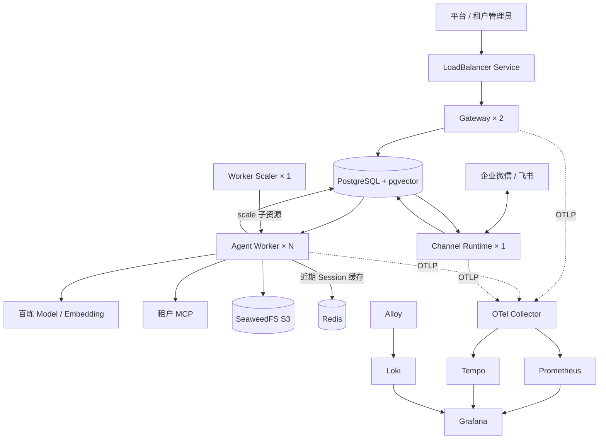

# Kubernetes 部署

## 定位

Docker Desktop 的 3 节点 Kubernetes 集群用于本地部署验收。运行拓扑初始为 2 个 Gateway、2 个无状态 Agent Worker、1 个 IM Channel Runtime、1 个 Worker Scaler，以及共享存储和可观测组件。所有资源归属于 `trpc-agent-service` Namespace，并通过标准 Label 在逻辑上归为同一应用；Pod 名称由 Deployment/StatefulSet 控制器生成，不应手工改名。

正式生产可以复用这些清单，但 PostgreSQL、Redis、对象存储和监控存储应替换为高可用或托管服务，并补充 Ingress TLS、远端镜像仓库、备份策略和跨故障域调度。



`Agent Worker × N` 的 N 来自数据库中的期望节点数；初始清单为 2，系统管理端修改后由 Scaler 收敛。Gateway、Worker、Channel 和 Scaler 是独立 Deployment，业务事实都进入共享存储。

本地脚本模式和 Kubernetes 模式是两套启动方式。两者会占用相同的 8000、3000、9090 等本机端口，切换前必须先执行 `./stop.sh` 或 `./deploy/kubernetes/stop.sh`，不能同时运行。

## 部署

首次部署且需要导入 Compose 的 PostgreSQL 数据时，先停止宿主机进程，再只启动源 PostgreSQL：

```bash
./stop.sh
docker compose up --detach --wait postgres
./deploy/kubernetes/deploy.sh --import-compose-data
docker compose down
```

`--import-compose-data` **仅迁移 PostgreSQL**，不会复制 SeaweedFS 对象、Redis 缓存或本地 Workspace 文件。若旧知识库仍引用 Compose 中的对象文件，需另行迁移对象存储或在 Kubernetes 租户控制台重新上传；不能把数据库导入成功视为知识库文件也已迁移。

后续更新直接执行：

```bash
./deploy/kubernetes/deploy.sh
```

如果只修改了 Kubernetes 清单或运行配置，或者目标应用镜像已由 CI 构建，可以显式复用本机已有镜像，避免重复构建：

```bash
TRPC_K8S_REUSE_IMAGE=trpc-agent-service:<已有标签> ./deploy/kubernetes/deploy.sh
```

应用代码发生变化时仍应使用默认命令构建新镜像；复用模式会先验证镜像存在，再执行迁移和滚动发布。

脚本会使用项目 `Dockerfile` 构建 Python 3.12 应用镜像、同步平台 Secret、创建 ConfigMap、启动存储和监控、执行 Alembic Job，并滚动部署应用角色。每次重新部署都会重启依赖 ConfigMap 的可观测组件，并将 PostgreSQL、Grafana 持久化密码与最新 Secret 同步，避免 Pod 继续使用旧配置或旧密码。发布成功后，只清理未被当前 Namespace 中任何 Pod 引用的旧 `trpc-agent-service` 镜像。真实密钥只从已忽略的 `.env` 和 `.secrets/` 读取，不写入部署清单。首次以 Kubernetes 启动时会生成并持久保留租户 SecretStore 主密钥。

新建或更新的 IM Binding 由租户管理员在 `/tenant` 中配置，密钥以数据库密文保存。部署脚本**不会**把旧的本地文件型 IM SecretRef 挂载进 Pod；如导入的旧 Binding 仍引用这类文件，部署后需在租户控制台重新保存密钥，使其转为数据库密文，否则对应 IM 长连接无法使用。

当前清单已经覆盖 Redis 近期会话缓存、PostgreSQL/pgvector 持久事实与向量、SeaweedFS Artifact（S3 入口和内部 Volume 数据通道）、租户加密 IM/MCP 凭据、Skill 文件、MCP 出站调用、动态 Worker 扩缩容，以及 Prometheus、Grafana、Tempo、Loki、Alloy 全链路可观测。上述应用能力都随同一镜像和共享配置发布，不需要为 Skill、MCP 或新的 IM Adapter 单独增加 Pod。

## 验证

```bash
kubectl get pods -n trpc-agent-service -o wide
kubectl get services -n trpc-agent-service
curl http://localhost:8000/health
curl http://localhost:8000/ready
```

- 系统管理端：`http://localhost:8000/admin`
- 租户管理端：`http://localhost:8000/tenant`
- Grafana：`http://localhost:3000`
- Prometheus：`http://localhost:9090`
- Bootstrap Token 和 Grafana 密码继续读取 `.secrets/` 下的原文件；Grafana 用户名固定为 `admin`。

执行节点统一在系统管理端的“运行节点”页面调整。页面只写入期望数量，`worker-scaler` ServiceAccount 仅有读取和修改 `agent-worker` scale 子资源的权限，不能操作其他 Deployment。

紧急运维仍可临时执行：

```bash
kubectl scale deployment/agent-worker -n trpc-agent-service --replicas=3
```

Worker Scaler 会在下一次对账时恢复管理端保存的期望数量，因此不能长期同时使用手工 `kubectl scale`、HPA 和管理端期望值。后续接入 HPA 时，应将容量控制权切换给 HPA，而不是让两个控制器同时修改副本数。

Kubernetes 缩容时先向 Pod 发送 `SIGTERM`。Worker 立即进入 `draining` 并停止领取任务，`terminationGracePeriodSeconds` 为现有任务保留完成窗口；最终状态继续由任务租约和 fencing token 保护。

## 停止与清理

仅停止应用并保留全部数据：

```bash
./deploy/kubernetes/stop.sh
```

删除 Namespace、组件和全部 Kubernetes PVC 测试数据：

```bash
./deploy/kubernetes/remove.sh --confirm-delete-data
```

本地 StorageClass 使用节点本地卷，只适合单机验收。Worker 的 `/data/workspaces` 使用 Pod 独立 `emptyDir`，每个请求仍会得到标准 Workspace，但跨 Pod 重试不会继承其中的临时文件；需要保留的结果必须写入 Artifact 对象存储。Session、Memory、RAG、审批、审计和任务状态均保存在共享后端，因此 Worker 不需要 Sticky Session。若生产环境需要跨 Pod 延续 Workspace，应改用支持 RWX 的卷或实现远程 Sandbox `WorkspaceProvider`，不能依赖节点本地目录。
