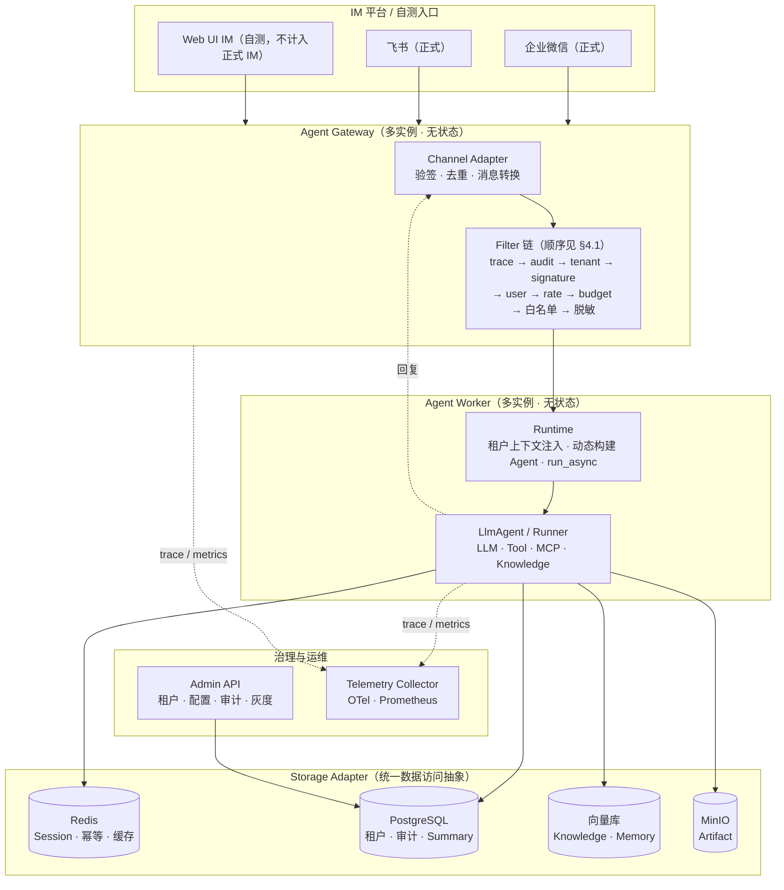
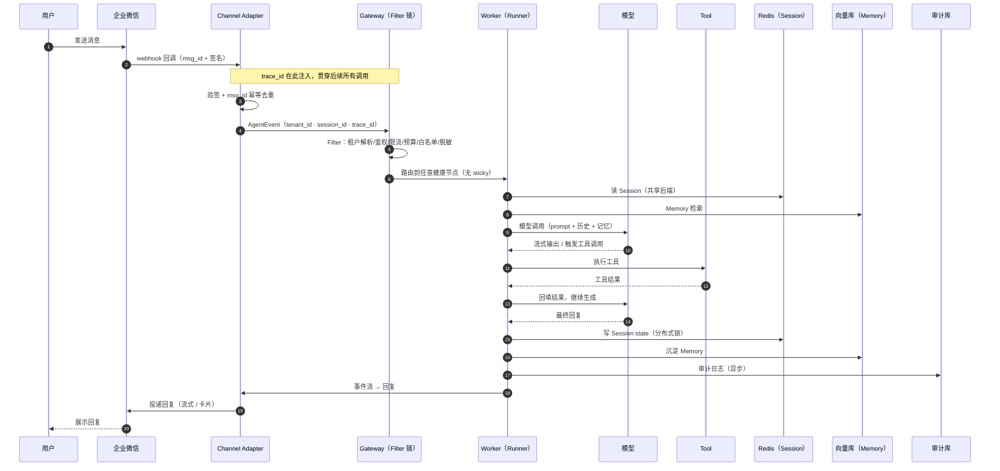

# 多租户节点化 Agent 部署平台（设计文档）

> **文档定位**：本文是系统的**主设计文档（spec）**——只承载决策、结论与关键机制，按题目板块组织；
> 实现细节与演进记录在六篇详设（[DESIGN-ARCHITECTURE](DESIGN-ARCHITECTURE.md) 等），实测证据在 [VERIFICATION.md](VERIFICATION.md)。
> 各信息类别以本文为唯一事实来源，冲突时以代码与实测为准。

## 0. 总体架构

**一句话**：企业每个部门在本平台开一家「AI 助手门店」（租户），把助手接进企微/飞书，配自己的
知识库、规矩和预算；平台让成百上千家店在多台机器上**稳定、隔离、可审计**地跑。

**三个基石决策**：① 一切状态外置（Redis/SQL/向量），Gateway 无状态——不需要 sticky session，
session_id 由 `sha256(tenant+通道+群/用户)` 确定性生成，路由难题被消解；② 治理前置成 Filter 链，
与业务解耦；③ 数据按性质选后端与一致性等级。

**复用 vs 新增**：Agent 编排/Session/Memory/Tool/Telemetry 直接复用 tRPC-Agent-Python（v1.1.20，
uv.lock 锁定）；平台新增集中在 `tenant/ config/ channels/ storage/ filters/ runtime/ web/` 七个目录
（对照表见 [design/01 §0.4](DESIGN-ARCHITECTURE.md)）。开发镜像（`.ide/Dockerfile`）与生产镜像
（根 Dockerfile，多阶段/非 root）职责分离，构建链以 uv.lock 精确锁定（`--frozen` 防漂移）。

## 1. 多租户与节点部署

- **租户模型**：`TenantConfig` = tenant_id + 应用/模型/工具权限/IM 通道/数据后端/审计策略/灰度/预算
  （pydantic 强校验；密钥仅存引用 `*_ref`，经环境注入，不落库不落日志）。
- **水平扩展**：Gateway 无状态多副本 + 共享 Redis/SQL；消息按确定性 session_id 落到共享后端，
  任意节点可服务任何请求。
- **租户隔离**：配置隔离（每租户独立 TenantConfig + 版本化历史）、数据隔离（所有存储 key 带
  tenant 前缀）、工具权限隔离（白名单 + 危险工具二次确认）、日志脱敏（redaction + PII Filter，
  实测手机号在 LLM 输出中被替换为 `[REDACTED]`）。
- **首启自举**：空库自动播种 demo 租户（消除 Admin/Gateway 配置源分裂），mock 种子切 framework
  启动时模型自动对齐——详见 [design/02 §1.5](DESIGN-MULTI-TENANT.md)。

## 2. 数据同步与多后端

- **统一抽象**：Storage 八域（Session/Memory/Knowledge/Summary/Artifact/Idempotency/Lock/Audit），
  每域独立选后端，租户级 `DataBackendConfig` 声明式指定。
- **并发一致性**：分布式锁（SET NX EX + Lua 防误删）+ 锁内重读合并 + 版本号递增；实测 09-04
  修复并发丢写。
- **迁移**：`migrate-summaries` CLI 复制 + 校验 + 收敛（实测 sql→redis copied=2 重跑 matched=2），
  双写/切读经 Admin 热切换。
- **幂等**：msg_id SET NX EX 24h；跨节点重投实测拦截。

完整抽象定义、DDL、逐域策略与一致性论证见 [design/03](DESIGN-DATA-SYNC.md)。

| 数据域 | 后端 | 一致性取舍 |
| --- | --- | --- |
| Session/锁/幂等 | Redis hash/list（热） | 强一致 + 低延迟；持久化为演进项 |
| 租户/审计/Summary | SQL（sqlite→mysql/pg） | 强一致持久化 |
| Memory/知识库 | Redis / 向量检索 | 最终一致（写入后强制刷新兜底） |
| Artifact | InMemory / S3（演进） | — |

## 3. IM 软件接入

**四通道实现**：企微自建应用（AES-256-CBC 解密 + SHA1 验签）、企微智能机器人（官方 SDK 长连接）、
飞书 webhook（verification_token 验签）、飞书 SDK 长连接；Web UI 为本地自测通道（不计入 IM）。

会话规则：`session_id = sha256(tenant+通道+群/用户)`，群聊按群、单聊按用户隔离；平台限制
（长度/频率/异步回复/撤回重试）在各 Adapter 内消化（详见 [design/04](DESIGN-IM-CHANNELS.md)）。

## 4. 治理、监控和安全

- **Filter 链**（治理前置，与业务解耦）：Trace → TenantResolve → Signature → UserAuth →
  RateLimit（Redis 固定窗口，多节点共享额度）→ Budget（SQL 原子累加预算）→ ToolWhitelist →
  PII → Audit。
- **监控**：Prometheus `/metrics`（请求量/LLM 延迟直方图/预算 gauge，均带租户标签）。
- **tracing**：自研 trace_id 贯穿 IM 回调 → Runner → Tool → Session/Memory 读写 → IM 回复
  （OTel SDK 导出为演进项）。
- **审计**：tenant_id/channel/user_id/session_id/agent_name/tool_name/decision/latency/
  error_type/cost/trace_id，异步批写独立 SQL。
- **生产安全 fail-closed**：`env=prod` 六项校验（Admin 密钥必填/禁 DEBUG/脱敏与监控强制/
  sqlite 禁/Redis 默认值禁），任一不满足**启动即拒**——详见 [design/05 §4.6](DESIGN-GOVERNANCE.md)。

## 5. 故障恢复与运维

| 故障 | 策略 |
| --- | --- |
| Redis 短暂不可用 | 写入重试 + 显式报错（不静默降级），恢复自愈（实测） |
| 模型超时/失败 | 显式 error 事件，Agent 决策重试 |
| 并发写冲突 | 分布式锁 + 锁内重读（实测 09-04 修复） |
| IM 重试 | msg_id 幂等（跨节点实测） |

- **灰度与回滚**：租户配置版本化（环形上限），按 user 哈希灰度，Admin 一键回滚 + pub/sub
  广播秒级生效（实测）。
- **容量评估**：HPA CPU 70% / 每 Pod 100 活跃 session；Redis/SQL 预留 2× 峰值。
- **部署**：最小 = `start.sh`（redis+网关+Admin）；多节点验证 = docker-compose 双网关；
  生产推荐 = `deploy/kustomize/`（HPA 2–10 副本 + PDB + Secret 注入 + fail-closed 部署校验，
  见 [design/06](DESIGN-OPERATIONS.md)）。

## 6. 生产风险清单

1. **跨租户数据泄露**：查询漏加 tenant_id 过滤 → 缓解：统一 ORM/查询层强制注入、code review 检查、独立 schema 高合规租户。
2. **密钥泄露**：token/key 入日志 → 缓解：KMS + 脱敏 Filter + 结构化日志 + 密钥轮换。
3. **多节点 Session 写冲突**：并发写同一 session 丢失更新 → 缓解：分布式锁（带等待重试）+ **锁内重读**为基线再合并写入（框架路径 events 指纹合并）；版本号在锁内自增串行化（09-04 修复，见 §2.3-A）。
4. **IM 消息重复/乱序**：重复投递导致重复回复 → 缓解：msg_id 幂等去重 + sequence_num 排序。
5. **向量库最终一致**：新写 Memory 检索不到 → 缓解：memory_version 对比 + 强制刷新。
6. **Redis 单点故障**：Session 全挂 → 缓解：Redis Cluster/Sentinel + SQL 降级 + 布隆防穿透。
7. **模型超时雪崩**：LLM 慢导致 Worker 占满 → 缓解：超时 + 异步 + 熔断 + 限流。
8. **审计缺失**：合规审查无据可查 → 缓解：审计异步批写独立库 + 保留策略。
9. **灰度误伤**：坏配置全量影响 → 缓解：版本化 + 按 user 灰度 + 一键回滚。
10. **成本失控**：单租户 token 超预算 → 缓解：BudgetFilter 硬限 + 成本指标告警。
11. **IM 平台封禁**：出站回复超平台限频被封号 → 缓解：投递前按 `rate_limit_per_sec` 错峰（09-07 落地）；当前为进程内实现，多节点总速率最高放大 N 倍，Redis 共享计数为生产演进。

---

## 7. 测试与验证

**282 用例 / 84% 覆盖 / flake8 0 条**；两轮「彻底归零 → 重建 → 部署 → 全板块实测」全部通过：
真实 LLM 工具调用与记忆、知识库 RAG、PII 实时脱敏、预算熔断、限流、热更新广播、跨节点幂等、
Redis 重启自愈、多节点无 sticky。全部证据与复现命令见 [VERIFICATION.md](VERIFICATION.md)。

## 8. 附录：Problem 验收标准 ↔ 覆盖位置映射

> 能力复用/新增划分以 §0.4 表为准；下表供评审按官方验收标准快速定位本文档覆盖。

| Problem 验收标准 | 覆盖位置 |
| --- | --- |
| 1 架构覆盖多租户/节点化/数据同步/多后端/IM/治理监控/故障恢复 | §0.1 架构图、§1–§5（细节见 docs/design/01–06） |
| 2 数据模型表达八类关系 | §2 数据模型（详设 design/03） |
| 3 ≥2 种 IM（含微信/企微）接入差异 | §3 IM 接入（详设 design/04） |
| 4 ≥3 类后端存储与同步策略 | §2 数据同步与多后端（详设 design/03） |
| 5 完整链路时序 + trace_id 贯穿 | §3 时序图、§4 治理监控安全；实测见 VERIFICATION.md |
| 6 ≥8 个生产风险 | §6 生产风险清单（11 个） |
| 7 复用 vs 新增 | §0 概览（详设 design/01 §0.4 对照表） |

落地口径：代码中明确区分「框架复用」与「平台新增」，新增模块集中在
`tenant/` `config/` `channels/` `storage/` `filters/` `runtime/` `web/` 七个目录。
