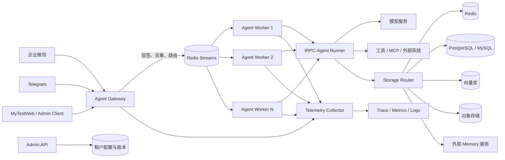

# tRPC-Agent 多租户节点化 Agent 服务平台提交方案

> 项目名称：面向企业 IM 场景的多租户、可扩展 Agent 服务平台  
> 基础框架：tRPC-Agent-Python  
> 文档类型：项目方案 / 活动提交材料  
> 当前阶段：核心功能与本地验证台已完成，可进入真实后端联调和生产化验证

## 1. 项目摘要

本项目在 tRPC-Agent-Python 之上增加独立的企业级平台层，使同一套 Agent 服务能够安全地服务多个租户，并接入企业微信、Telegram 等 IM 通道。平台将 IM 接入、租户路由、Agent 执行、Session/Memory 存储、工具治理、审计和可观测能力拆分为可独立扩缩容的组件，通过共享存储实现无状态 Worker，不依赖 sticky session。

项目重点解决以下问题：

1. 多个企业或业务团队共用 Agent 集群时，配置、数据、工具和密钥如何隔离；
2. 多节点并发处理同一会话时，如何避免乱序、重复执行和上下文丢失；
3. 不同租户如何选择 Redis、SQL、向量库、对象存储或外部 Memory 服务；
4. 企业微信、Telegram 等 IM 平台如何统一接入，并处理验签、重复投递、限流和流式回复；
5. 如何建立可审计、可观测、可灰度、可回滚的生产运行体系；
6. 如何用自动化测试证明租户不串、消息不丢、故障可恢复、密钥不泄漏。

最终交付包括企业级 SDK、部署清单、数据模型、两类 IM Adapter、治理与审计组件、自动化验收体系，以及可在本地运行的 MyTestWeb 实战验证台。

## 2. 背景与目标

### 2.1 背景

单机 Agent Demo 通常将模型配置、会话状态和工具权限保存在进程内，适合验证能力，但难以直接用于企业服务。进入真实业务后，会遇到多租户隔离、IM 回调峰值、节点故障、后端差异、危险工具审批、成本控制和审计合规等问题。

本项目采用“保留 tRPC-Agent 核心能力，在其上叠加 enterprise 平台层”的方式进行建设，尽量复用 Runner、Agent、Tool、Session、Memory 和 OpenTelemetry 能力，减少对核心框架的侵入。

### 2.2 建设目标

- 支持租户级应用、模型、工具、IM、存储、审计和预算配置；
- 支持 Gateway 与 Worker 独立水平扩容，Worker 保持无状态；
- 支持企业微信和 Telegram 两类 IM 通道，并可继续扩展其他平台；
- 支持 InMemory、Redis、SQL、向量库、对象存储和外部 Memory 服务；
- 提供租户级工具权限、敏感信息脱敏、预算和危险工具确认；
- 用一条 trace 串联 IM callback、队列、Runner、模型、工具、存储和 IM 回复；
- 支持故障恢复、配置版本、灰度发布、租户级回滚和数据迁移；
- 企业模块自动化测试行覆盖率不低于 95%。

### 2.3 非目标

- 不自行实现大模型推理服务，模型通过兼容 API 接入；
- 不替代 Redis、PostgreSQL、Qdrant、MinIO 等基础设施；
- 不在第一阶段建设完整计费结算系统，只提供租户级 token、成本记录和预算门禁；
- 不强制所有租户使用同一种数据后端或一致性等级。

## 3. 总体设计思路

### 3.1 设计原则

1. **租户上下文贯穿全链路**：`tenant_id` 必须进入配置查询、session key、memory key、队列消息、审计记录和 trace 属性。
2. **无状态计算、有状态后端**：Worker 不保存会话归属，任何健康 Worker 都可以继续同一 session。
3. **入口先验签、后执行**：IM 回调必须先完成租户识别、签名校验、身份校验、幂等判断和限流。
4. **事件优先、状态可重建**：Session event 采用追加写，state 和 summary 从已提交事件演进，便于恢复与审计。
5. **统一抽象、按租户选后端**：业务代码使用统一 Session/Memory/Artifact/Knowledge/Audit 接口，Storage Router 根据租户配置选取实现。
6. **默认拒绝危险能力**：工具白名单优先，危险工具需要一次性确认，敏感输出离开系统前统一脱敏。
7. **可验证而非只可演示**：需求必须映射到测试、指标或演练步骤，覆盖率是门禁而不是唯一质量标准。

### 3.2 架构拓扑



### 3.3 核心组件职责

| 组件 | 主要职责 | 扩展方式 |
|---|---|---|
| Agent Gateway | webhook、租户解析、验签、身份校验、幂等、限流、任务入队、快速 ACK | 无状态多副本 |
| Agent Worker | 加载租户配置和 Session，执行 Runner、Filter、模型及工具，保存结果并触发回复 | 按队列积压水平扩容 |
| Channel Adapter | 外部 IM 消息与统一输入/输出事件之间的转换 | 每种 IM 实现一个 Adapter |
| Storage Adapter/Router | 统一 Session、Memory、Summary、Artifact、Knowledge、Audit 数据访问 | 按租户配置路由后端 |
| Admin API | 租户配置 CRUD、版本发布、灰度、回滚、审计查询 | 无状态多副本 |
| Telemetry Collector | 汇集 trace、metric、log，关联一次完整 Agent 调用 | 独立部署并按吞吐扩容 |

## 4. 核心业务链路

### 4.1 消息路由

1. IM 平台调用 `/webhook/{tenant_id}/{channel}`；
2. Gateway 根据路径取得候选租户，并使用该租户的 channel secret 验签；
3. Adapter 将平台消息转换成统一 `InboundMessage`；
4. 使用 `tenant_id + channel + message_id` 建立幂等键，重复消息直接返回成功；
5. 根据聊天类型生成稳定的 session ID；
6. Gateway 将 tenant、channel、session、trace carrier 和消息写入 Redis Streams；
7. 任意 Worker 消费任务，从共享 Session/Memory 后端加载上下文；
8. 治理 Filter 完成用户鉴权、预算检查、工具授权和危险工具确认；
9. Runner 调用模型和工具，将 event、state、summary、memory 与审计记录写入对应后端；
10. Channel Adapter 将 Agent Event 转换为文本、流式更新或卡片消息并发送至 IM。

### 4.2 Session 生成与隔离

- 单聊：`sha256(tenant_id:channel:user_id)`；
- 群聊：`sha256(tenant_id:channel:chat_id)`；
- 若同一群需要按成员拆分上下文，可扩展为 `sha256(tenant_id:channel:chat_id:user_id)`；
- 存储层继续注入租户前缀，形成 `{tenant_id}:{app_name}:{user_id}:{session_id}` 的复合作用域。

即使用户 ID、群 ID 或 session ID 在不同租户中相同，也不能访问另一租户的数据。

### 4.3 是否需要 sticky session

不需要。Session、Memory、执行结果和配置版本均保存在共享后端，Worker 每次处理任务时加载最新状态。节点故障后，Redis Streams pending 消息可由其他 Worker reclaim；分布式 session writer lock 到期后也可以重新获取，因此负载均衡器无需保持会话粘性。

## 5. 多租户模型与隔离设计

### 5.1 租户配置模型

| 配置域 | 关键字段 |
|---|---|
| 基础信息 | `tenant_id`、名称、状态、配置版本 |
| 应用配置 | Agent App 列表、默认指令、并发 session 上限 |
| 模型配置 | provider、model、endpoint、timeout、retry、fallback model |
| 工具权限 | whitelist、denylist、dangerous tools |
| IM 配置 | channel type、webhook token、secret、AES key、bot token |
| 数据后端 | session、memory、vector、object、audit 后端及连接引用 |
| 审计策略 | 开关、保留周期、脱敏规则、审计级别 |
| 预算策略 | 每日 token、每日费用、并发和频率限制 |

### 5.2 隔离措施

| 隔离维度 | 实现方案 |
|---|---|
| 配置隔离 | TenantConfigManager 按 tenant ID 查询；配置带单调版本；更新和回滚只作用于目标租户 |
| 数据隔离 | 所有存储 key/表查询强制包含 tenant ID；SQL 可进一步启用 Row Level Security |
| 工具隔离 | Filter 在工具实际执行前按租户白名单、黑名单和用户角色决策 |
| 进程隔离 | 高安全租户可路由至独立 Worker Pool 和独立数据库连接身份 |
| 日志隔离 | 日志、trace、audit 均携带 tenant ID；查询 API 强制租户过滤 |
| 密钥隔离 | 配置仅保存 secret reference；运行时从环境变量或 KMS/Vault 读取；SecretStr 防止 repr 泄漏 |

日志和异常在输出前使用统一 masker，覆盖 API key、Bearer token、数据库 URL 密码和常见个人敏感信息。Prometheus 标签不直接使用 user/session 等高基数字段，详细维度进入 trace 和审计系统。

## 6. 数据模型、多后端与同步

### 6.1 最小数据实体

| 实体 | 核心字段 | 推荐后端 |
|---|---|---|
| tenant | tenant_id、name、status、config_version | SQL |
| agent_app | tenant_id、app_id、agent_name、model_config | SQL |
| session | tenant_id、app_id、user_id、session_id、version、state | Redis/SQL |
| message/event | tenant_id、session_id、event_id、sequence、payload、created_at | Redis Stream/SQL |
| memory | tenant_id、user_id、memory_id、content、embedding_version | SQL/外部 Memory/向量库 |
| summary | tenant_id、session_id、source_version、content | Redis/SQL |
| channel_binding | tenant_id、channel、account_id、external_user_id、internal_user_id | SQL |
| artifact | tenant_id、artifact_id、object_uri、checksum、metadata | 对象存储 + SQL metadata |
| knowledge | tenant_id、document_id、chunk_id、embedding、version | 向量库 |
| audit_log | tenant_id、channel、user_id、session_id、agent/tool/decision/cost/trace | SQL append-only |

完整 PostgreSQL 示例见 `trpc_agent_sdk/enterprise/storage/schema.postgresql.sql`。

### 6.2 一致性与写入顺序

- 同一 session 由 Redis lease writer lock 串行写入；SQL 实现使用事务和 `version` CAS；
- 推荐顺序为：获取锁 → append events → CAS 更新 state/version → 提交 → 异步生成 summary → 异步写 Memory；
- summary 必须携带 `source_version`，旧任务不能覆盖新 summary；
- Redis/SQL Memory 写成功后立即跨节点可见；带本地缓存时通过 Pub/Sub 发送失效通知；
- 向量库和外部 Memory 接受约定窗口内的最终一致，但必须记录写入版本和可见性延迟指标；
- Artifact 先写对象并校验 checksum，再提交 metadata，避免产生指向不存在对象的记录。

### 6.3 后端取舍

| 后端 | 一致性 | 典型延迟 | 成本与运维 | 适用场景 |
|---|---|---|---|---|
| InMemory | 单进程 | 最低 | 最低 | Demo、单元测试 |
| Redis | 单 key 强一致，故障切换存在复制窗口 | 低 | 中 | session、锁、幂等、队列、缓存 |
| SQL | 事务强一致 | 中 | 中 | 配置、审计、长期 session、绑定关系 |
| 向量库 | 通常最终一致 | 中 | 较高 | Knowledge、语义检索 |
| 对象存储 | metadata 协同后最终一致 | 较高 | 较低 | 图片、文件、大型 Artifact |
| 外部 Memory | 取决于服务 SLA | 中 | 低到中 | 托管长期记忆 |

### 6.4 数据迁移

Redis 迁移到 SQL、本地向量库迁移到远端向量库均采用租户级迁移状态机：

1. 创建目标 schema/index，并冻结序列化格式和 embedding version；
2. 按 tenant、kind、key 游标分批全量复制；
3. 记录 watermark、count 和 checksum；
4. 开启 dual-write，失败写进入 durable outbox；
5. 追平增量后执行 checksum、shadow read 和固定查询集召回对比；
6. 仅切换目标租户读路径，观察一个回滚窗口；
7. 异常时切回源后端并反向重放增量。

## 7. IM Channel Adapter 设计

### 7.1 统一接口

Channel Adapter 统一提供验签、消息解析、普通回复、流式回复和平台错误转换。外部文本、图片和文件消息被转换为统一用户输入；Agent Event 则被聚合为纯文本、增量编辑、分段消息或卡片。

### 7.2 企业微信与 Telegram

| 能力 | 企业微信 | Telegram |
|---|---|---|
| 绑定信息 | corp_id、agent_id、token、EncodingAESKey | bot_token、secret_token |
| 验签 | SHA1/HMAC 与 AES 解密 | HTTPS webhook secret header |
| 输入格式 | XML/加密 XML | JSON Update |
| 用户映射 | FromUserName + tenant/channel | from.id + tenant/channel |
| 群聊映射 | chat_id + tenant/channel | chat.id + tenant/channel |
| 流式回复 | 原生 stream；失败降级分段 | sendMessage + editMessageText |
| 长度限制 | 按 UTF-8 字节安全分段 | 按字符限制安全分段 |

Gateway 必须在平台要求的时间内快速 ACK，Agent 执行转入队列。发送端对限流和临时错误做带抖动的指数退避；永久权限错误进入审计和告警，不进行无限重试。重复回调使用 `tenant:channel:message_id` 幂等键，成功结果可缓存，避免 Agent 副作用被重复执行。

## 8. 重点技术

1. **无状态 Worker 与共享会话后端**：摆脱 sticky session，支持任意节点接管和独立扩容。
2. **Redis Streams 可靠任务链路**：consumer group、pending reclaim、最大重试、DLQ 和结果缓存共同处理 at-least-once 投递。
3. **租户级存储路由**：统一抽象屏蔽后端差异，按租户和数据实体选择 Redis、SQL、向量或对象存储。
4. **会话并发控制**：分布式 lease lock、append-only event 和 version CAS 避免同一 session 乱序覆盖。
5. **端到端幂等**：IM message ID、队列 task ID、工具副作用幂等键和回复结果缓存分层防重。
6. **Filter 治理链**：在 Runner/Tool 生命周期中完成权限、预算、脱敏、HITL 和审计决策。
7. **OpenTelemetry 上下文传播**：trace carrier 随队列传递，跨进程串联 callback、Runner、Tool、Storage 和回复。
8. **可回滚迁移**：全量、双写、增量、校验、shadow read、租户级切换形成完整迁移闭环。
9. **密钥零明文**：secret reference、运行时注入、统一日志脱敏和错误安全化共同避免泄漏。
10. **测试证据链**：需求追溯矩阵将每项要求关联到实现、测试、部署或演练报告。

## 9. 治理、监控与安全

### 9.1 租户级治理

- IM 用户和群权限校验；
- 工具 whitelist/denylist；
- 危险工具一次性确认 token；
- 模型调用前原子预留预算，调用后按真实 usage 结算；
- 模型输入、工具输出和最终回复的敏感信息脱敏；
- 拒绝、确认、执行、失败和降级均写入审计。

### 9.2 指标与 Trace

监控请求量、模型/工具耗时、IM 投递成功率、错误率、token、每租户成本、Session 后端延迟、队列 lag、pending age、锁等待和 fallback 次数。

一次请求使用同一 trace ID 串联：

```text
IM callback → Gateway → Redis Streams → Worker → Runner
            → Model / Tool → Session / Memory → IM reply
```

审计日志至少包含：`tenant_id`、`channel`、`user_id`、`session_id`、`agent_name`、`tool_name`、`decision`、`latency`、`error_type`、`cost`、`trace_id`。

### 9.3 密钥管理

开发环境使用未提交的 `.env.local`；CI/CD 和生产使用 Kubernetes Secret 配合 KMS/Vault 等密钥系统。配置中只保存引用，不保存真实 IM token、模型 API key 或数据库密码。日志、trace attribute、审计 detail 和错误报告在输出前必须经过统一脱敏。

## 10. 故障恢复与运维

| 故障 | 处理方式 |
|---|---|
| Gateway/Worker 节点故障 | 健康检查摘除；Worker pending task 由其他消费者 reclaim |
| IM 重复投递 | 幂等键去重；已有成功结果时只重试回复 |
| Redis/SQL 短暂不可用 | 有界指数退避、熔断、503/快速 ACK 策略、恢复后消费积压 |
| 模型首 token 超时 | 切换租户配置的 fallback model；仍失败返回标准降级话术 |
| 部分流式输出后超时 | 结束当前流并提示失败，不重复发送整段回答 |
| 工具执行失败 | 按错误类型决定重试；有副作用工具默认不盲重试 |
| 配置错误 | 配置版本不可变，按 tenant ID 回滚至上一稳定版本 |
| 发布异常 | 租户一致性哈希灰度，指标越阈值自动停止放量并回滚 |

最小部署使用 Docker Compose，包括 Gateway、Worker 和 Redis；生产推荐 Kubernetes，Gateway 与 Worker 使用独立 Deployment/HPA，并配置 PostgreSQL、Redis 高可用、Telemetry Collector、PDB、NetworkPolicy、资源限制和健康探针。

## 11. 测试与质量保障

### 11.1 测试分层

| 层级 | 验证内容 |
|---|---|
| 单元测试 | 租户模型、session ID、验签、分段、Filter、脱敏、预算、迁移算法 |
| 组件测试 | Gateway、Worker、Channel Adapter、Storage、Admin API、审计 |
| 集成测试 | Redis/PostgreSQL/Qdrant/MinIO/Jaeger 真实后端 |
| E2E | webhook → queue → Worker → Session → reply，及 MyTestWeb 浏览器流程 |
| 故障测试 | 节点 SIGKILL、pending reclaim、数据库断连、模型超时、重复投递 |
| 迁移测试 | Redis→SQL、向量库迁移、checksum、shadow read、回滚 |
| 性能测试 | IM callback 峰值、并发 session、长上下文和混合工具负载 |
| 安全测试 | 跨租户访问、伪造签名、危险工具绕过、日志与产物 secret scan |

### 11.2 CI 门禁

- 静态检查和关键语法检查；
- 企业模块自动化测试全绿；
- `trpc_agent_sdk.enterprise` 行覆盖率不低于 95%；
- Compose/Kubernetes 配置校验；
- PR 执行快速测试，主分支或夜间任务执行真实后端、E2E、性能和故障演练；
- 覆盖率报告、JUnit、trace 样例、迁移校验和性能报告作为验收证据。

当前企业模块已具备 131 个自动化测试，行覆盖率为 95.06%；MyTestWeb 后端 5 个测试，行/分支覆盖率为 100%。详细测试矩阵见 `trpc_agent_sdk/enterprise/ACCEPTANCE_TEST_PLAN.md`。

## 12. 预期效果与验收指标

| 目标 | 预期效果 / 验收口径 |
|---|---|
| 租户隔离 | 相同 app/user/session 在不同 tenant 下并发访问无数据串读；未授权工具执行次数为 0 |
| 水平扩展 | 不使用 sticky session；随机终止 Worker 后会话仍能继续，pending task 可被接管 |
| 回调性能 | IM callback ACK P95 小于 500 ms（不包含异步模型生成时间） |
| 消息可靠性 | 重复投递不重复执行 Agent 副作用；队列消息超过重试阈值进入 DLQ |
| IM 可用性 | 正常环境投递成功率目标不低于 99.9%，限流和永久错误均可观测 |
| 数据一致性 | Redis/SQL 写成功后立即可读；向量/外部 Memory 在约定 SLA 内可见 |
| 可观测性 | 一条 trace 可定位 callback、queue、Runner、Tool、Storage 和 reply |
| 安全 | 日志、trace、错误报告和前端产物中不出现真实 token、API key、数据库密码 |
| 发布恢复 | 配置可按租户回滚；灰度异常只影响目标租户并能停止放量 |
| 工程质量 | 企业模块行覆盖率持续 ≥95%，关键隔离、幂等和故障场景必须有结果断言 |

容量不预设固定“每节点 session 数”，而是通过实测获得单 Runner 峰值内存、平均 token、模型并发、Redis/SQL QPS 和队列消费速率，再计算节点数：

```text
Worker 并发上限 ≈ min(
  可用内存 / 单活跃 Runner 峰值内存,
  模型连接池并发,
  工具连接池并发
)

所需 Worker 数 ≈ 峰值任务到达率 / 单 Worker 稳态消费率 × 冗余系数
```

## 13. 时间规划

以下按 6 周给出从方案确认到生产验收的计划。核心代码和本地验证台已完成的内容可以前置验收，剩余时间主要用于真实环境、压测和发布演练。

| 阶段 | 时间 | 工作内容 | 里程碑 |
|---|---|---|---|
| 方案与基线 | 第 1 周 | 冻结租户模型、组件边界、数据模型、SLA 和威胁模型 | 设计评审通过，需求追溯矩阵完成 |
| 核心平台层 | 第 2 周 | Gateway/Worker、队列、Session/Memory 租户包装、配置版本 | 两租户端到端 Mock 链路通过 |
| IM 与治理 | 第 3 周 | 企业微信、Telegram、验签、去重、流式、工具权限、预算、HITL | 两类 IM 沙箱联调通过 |
| 多后端与可观测 | 第 4 周 | Redis/SQL/向量/对象存储联调、审计、Metrics、OTel | 真实后端集成测试和完整 trace 通过 |
| 稳定性与迁移 | 第 5 周 | 故障注入、Redis→SQL、向量迁移、灰度与回滚演练 | 消息无不可解释丢失，迁移校验通过 |
| 性能与交付 | 第 6 周 | 容量压测、安全扫描、文档完善、部署 smoke、答辩材料 | 验收指标达标，形成完整交付包 |

建议后续长期迭代：增加更多 IM Adapter、KMS/Vault 深度集成、租户账单、跨区域容灾、策略中心和可视化运营面板。

## 14. 风险与应对

| 风险 | 影响 | 应对措施 |
|---|---|---|
| IM 平台重试或限流 | 重复执行、回复延迟 | 快速 ACK、幂等、结果缓存、退避、DLQ |
| 同 session 并发 | 上下文覆盖、回复乱序 | lease lock、event sequence、version CAS |
| Redis 故障切换 | 未复制写丢失或短暂不可用 | 高可用配置、持久化、结果缓存、故障演练 |
| 外部模型不稳定 | 首 token 慢、超时、成本波动 | timeout、fallback、预算、熔断、指标告警 |
| 工具有副作用 | 重试造成重复操作 | 工具幂等键、HITL、错误分类、默认不盲重试 |
| 跨租户越权 | 数据或能力泄漏 | 强制 tenant scope、默认拒绝、对抗测试、独立连接身份 |
| 密钥进入日志 | 严重安全事故 | secret reference、统一 masker、secret scan、密钥轮换 |
| 向量迁移结果漂移 | Knowledge 召回质量下降 | 固定 embedding version、Recall@K/NDCG 对比、shadow read |
| 指标标签基数过高 | 监控系统成本与稳定性问题 | metrics 只保留低基数 tenant 聚合，详细字段放 trace/log |
| 配置灰度不一致 | 同租户行为漂移 | tenant 一致性哈希、不可变 config version、快速回滚 |

## 15. 交付物

| 交付物 | 仓库位置 |
|---|---|
| 企业级平台源码 | `trpc_agent_sdk/enterprise/` |
| PostgreSQL 数据模型 | `trpc_agent_sdk/enterprise/storage/schema.postgresql.sql` |
| Docker Compose / Kubernetes | `trpc_agent_sdk/enterprise/deployment/` |
| 自动化测试 | `tests/enterprise/` |
| 实战验证台 | `MyTestWeb/` |
| 多租户示例 | `examples/multi_tenant_saas/` |
| 详细设计 | `trpc_agent_sdk/enterprise/DESIGN.md` |
| 验收测试方案 | `trpc_agent_sdk/enterprise/ACCEPTANCE_TEST_PLAN.md` |
| 需求追溯矩阵 | `trpc_agent_sdk/enterprise/TRACEABILITY.md` |
| 租户接入指南 | `trpc_agent_sdk/enterprise/ONBOARDING.md` |

## 16. 总结

本方案将 tRPC-Agent 从单实例能力验证扩展为面向企业 IM 场景的多租户 Agent 服务平台。核心价值不只是“可以同时服务多个租户”，而是为租户隔离、消息可靠性、无状态扩展、多后端迁移、安全治理和生产运维建立可实现、可验证、可回滚的工程闭环。

通过 MyTestWeb 可以低成本演示租户切换、会话、治理、审计、Trace 和故障场景；通过自动化测试、真实后端集成、故障注入与容量测试，则可以进一步证明系统具备进入生产试点的基础。
