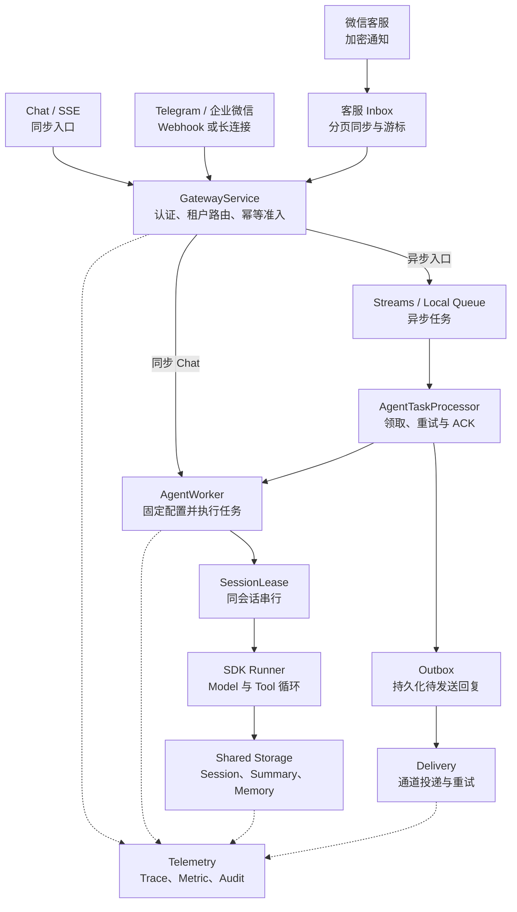

# 架构与请求正确性

本页说明服务的运行链路和正确性约束。整体方案见[架构设计文档](../文档/架构设计文档.md)，验证方法见[测试说明](testing.md)。

## 1. SDK 与平台分工

SDK 负责 LlmAgent、模型/工具循环、Runner、非 partial Event 持久化、Session State、Summary 与 Memory。平台负责可信租户、不可变配置版本、任务状态、共享锁、队列、Outbox、审批、资源隔离及 HTTP/IM。

开发模式使用内存控制面与本地队列。生产入口调用异步 `build_production_container()`，各后端职责如下：

- PostgreSQL 保存 Registry、Request、持久幂等、Outbox、Approval、Usage、Audit 和客服同步状态。
- Redis 承担 Streams、Budget 和兼容幂等缓存。
- 控制面执行租约保存在 PostgreSQL；Session/Memory 的写入租约跟随实际数据后端。

同步 `build_container()` 收到 production 配置时会直接拒绝，不会暗中退回内存实现。

## 2. 两条真实调用路径



同步 Chat 和 SSE 由 Gateway 进程直接执行 Runner，不经过队列。生产 IM 与 `/chat/async` 采用异步队列；开发环境的 Webhook 同样入队，因此需要同时启动 Worker 和 Delivery 才能看到回复。

## 3. 一轮执行顺序

Gateway 写入队列的不是临时字典，而是固定字段的 `AgentRequest`。下面省略附件、metadata 和时间字段，只展示路由与恢复需要的信息：

```python
class AgentRequest(BaseModel):
    request_id: str
    tenant_id: str
    config_version: int
    storage_route_version: int
    app_id: str
    user_id: str
    session_id: str
    text: str
    channel: ChannelType
    source_message_id: str
    binding_id: str
```

1. 认证、解析绑定/活动版本，生成内部 user/session，计算稳定 payload hash。
2. 同一事务创建幂等记录和 reserved 请求；校验审批、预留预算，将可信 metadata 保存到 RequestStore。开发模式使用同一进程锁完成原子创建。
3. 异步入口 XADD 后标 queued；若 Worker 已开始/结束，晚到的 queued 更新不能覆盖新状态。
4. Worker 借用并固定 Runtime，取得控制面及存储原生租约，再读取 Session；先修复上一轮未完成的必要后处理。
5. SDK 追加用户 Event、执行 Model/Tool、写非 partial Event。禁用 SDK 默认吞异常的 post-turn 钩子，改由平台严格执行器调用 SDK Summary/Memory。
6. Session State 的 `_platform_turns` 按 request_id 保存 `agent_finished → summary_done/summary_skipped → memory_done`。先保存模型结果再做摘要，防止摘要压缩 Event 后无法回放。应摘要但未生成新 summary event 时失败，不当作“无需摘要”。
7. 租约覆盖后处理和结果提交。生产 Request 结果、Outbox、持久幂等 succeeded 在控制面同一事务提交，然后完成兼容缓存并 ACK。Usage/预算仍是独立幂等操作，不属于该事务。
8. Delivery 独立投递；请求 succeeded 表示 Agent 与 Outbox 已完成，不表示 IM 用户一定已经收到。

`AgentRequest.config_version` 固定在入口，不随活动版本漂移。Runtime 缓存使用 tenant/app/version；borrow 引用计数保护正在等待锁/信号量的 Runtime 不被 LRU 关闭。全忙时缓存允许临时超过上限。

## 4. 并发锁与恢复边界

Redis Guard 使用唯一 token、TTL、递增 epoch、续租和所有权释放。实际写入在数据 Redis 的同一 Lua 中检查 token/epoch 并执行；Memory 删除旧记录与写入新记录也是一次 Lua。不是先查队列 Redis，再假定另一个存储安全。

Worker 等待同一 Session 锁的时间不再固定为 10 秒，而是按该 Agent 的 `max_run_seconds + 10 秒`计算。这样一次合法的长模型调用不会让排队请求快速耗尽重试次数；等待仍然有上限，锁本身继续使用 30 秒 TTL 和自动续租处理失联节点。

PostgreSQL 使用 `platform_execution_lease`。SDK SQL 提交代理会在同一事务中执行 `SELECT FOR UPDATE`，锁定资格记录并检查 token、epoch 和有效期，通过后才提交数据。接管者也要竞争同一行，控制面提交结果时则单独检查 PostgreSQL 租约。过期的写入和成功提交都会被对应存储的 fencing 拒绝。

SDK 流式异步生成器由一个固定任务创建、推进和关闭。每产生一个 Event，它都会先等待 Worker 确认，再读取下一段模型输出。

服务进程为 SDK 1.1.19 安装了非驻留式 Tracer 适配器。SDK Span 仍记录在 Worker Trace 下，但 Context Token 不会跨 `yield` 保持挂载。这样既能在失锁后于 Event 边界取消模型流，也能避免异步生成器清理时出现 OTel Context 错误。该适配只作用于服务进程，不修改 SDK 仓库。

已成功的 Request 直接复用结果；仅有模型 final Event 时先补必要后处理，再补结果/Outbox。摘要压缩后可从阶段记录回放。只有用户/工具中间事件时进入人工核查，不把用户消息当作答案，也不盲目重跑副作用。

上述保护分别作用于单个后端，并不构成 Redis 与 PostgreSQL 之间的全局事务。真实数据库测试已覆盖旧代次拒写、双进程 Session/Memory 连续性和崩溃恢复。Redis Cluster 的跨 slot Lua，以及 SDK `app:`/`user:` 共享状态的跨 Session 并发更新，不属于该一致性边界；这类状态不应承担跨会话计数器的职责。

日常 Request Repair 使用 PostgreSQL 的原子 claim（`SKIP LOCKED`），只领取已经持久化、但可能没有成功入队的 `reserved` 请求。

`queued`、`running` 和 `retryable_failed` 统一交给 Redis Streams 消费、原子 retry 和 Pending reclaim 恢复。两类入口职责分开，可以避免两个 Worker 重复投递同一任务。

如果 Redis 队列整体丢失，需要执行显式的灾难恢复流程，不能混入日常扫描。没有完成 admission 的请求会按失败关闭，恢复过程也不会绕过预算或审批。

## 5. 角色与生命周期

Gateway 服务普通 API；Admin 服务管理 API；Worker/Delivery 不公开 Chat/Admin 路由。WeCom 角色负责长连接，也只领取自己持有租约的绑定回复；普通 Delivery 不连接企微机器人。

微信客服不占用 WeCom 智能机器人长连接角色：Gateway 持久化通知，Worker 的独立同步循环拉取分页消息并准入，Delivery 调用客服发送 API。客服消息与游标同事务保存；坐席消息和事件留作观察记录，不进入 Agent。发送前实时查会话状态，人工接管后停止自动回复。

后台依赖异常记指标后有界退避，不永久退出。停机停止领取，最多等待 15 秒排空，再取消并关闭资源。readyz 检查角色依赖及后台任务状态；不等于模型可用性或所有 Bot 已认证。

## 6. 模块边界与可维护性

代码按业务职责拆分：

- `channels` 处理外部协议；
- `gateway` 负责准入和可靠任务；
- `agent` 管理 Runner 生命周期；
- `storage` 选择后端并保护写入；
- `tenant` 管理配置与治理。

各层通过 `ChannelAdapter`、`RequestStore`、`AgentTaskQueue`、`OutboxStore`、`SessionExecutionGuard` 和 `TenantRegistry` 等 Protocol 协作。

真实实现和 Fake 实现可以互换，主流程不需要了解具体数据库或 IM 客户端。这种划分让每个模块专注于自己的职责，也减少了模块之间的直接依赖。

`web.app.create_app()` 集中注册 HTTP 路由，具体业务委托给 Chat、Admin、Resource 和 IM 服务。`web.container` 是 Composition Root，统一创建组件并管理后台任务生命周期。

Gateway 共用异常放在 `gateway.errors`，请求持久化层不反向依赖服务层。存储 fencing 与 OTel 的 SDK 1.1.19 兼容逻辑分别集中在 `storage.factory` 和 `metrics.telemetry`。这样既保留统一装配入口，也避免数据库和通道依赖扩散到业务模块。

## 7. 关键源码

- [Gateway 状态与聚合](../trpc_service/gateway/service.py)
- [Worker 与租约](../trpc_service/agent/worker.py)、[Guard](../trpc_service/storage/guard.py)
- [SDK 包装器](../trpc_service/storage/session_wrapper.py)
- [Processor / Delivery](../trpc_service/gateway/dispatcher.py)
- [角色装配](../trpc_service/web/container.py)
- [真实 SDK 离线回归](../tests/test_v3_resumption.py)
- [严格后处理](../trpc_service/agent/post_turn.py)、[存储原生 fencing](../trpc_service/storage/fencing.py)
- [微信客服接入与限制](customer-service.md)、[会话恢复测试](../tests/test_session_recovery.py)
