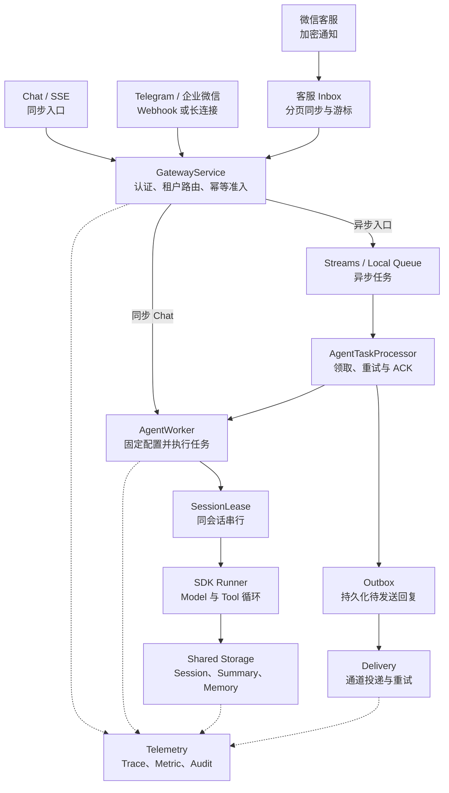

# 架构与请求正确性

本页说明服务的运行链路和正确性约束。整体方案见[架构设计文档](../文档/架构设计文档.md)，验证方法见[测试说明](testing.md)。

## 1. SDK 与平台分工

SDK 负责 LlmAgent、模型/工具循环、Runner、最终 Event 持久化、Session State、Summary 与 Memory。平台负责可信租户、配置版本快照、任务状态、共享锁、队列、Outbox、审批、资源隔离及 HTTP/IM。

开发模式使用内存控制面与本地队列。生产入口调用异步 `build_production_container()`，各后端职责如下：

- PostgreSQL 保存 Registry、Request、持久幂等、Outbox、Approval、Usage、Audit 和客服同步状态。
- Redis 承担 Streams、Budget 和兼容幂等缓存。
- 控制面执行租约保存在 PostgreSQL；Session/Memory 的写入租约跟随实际数据后端。

生产配置统一由 `build_production_container()` 装配，共享依赖缺失时启动校验会返回明确错误。

## 2. 两条真实调用路径



同步 Chat 和 SSE 由 Gateway 进程直接执行 Runner。生产 IM、`/chat/async` 和开发环境 Webhook 使用异步队列，由 Worker 执行任务，再由 Delivery 发送回复。

## 3. 一轮执行顺序

Gateway 使用固定字段的 `AgentRequest` 写入队列。下面省略附件、metadata 和时间字段，只展示路由与恢复需要的信息：

```python
class AgentRequest(BaseModel):
    request_id: str
    tenant_id: str
    config_version: int
    storage_route_version: int
    app_id: str
    user_id: str
    session_id: str
    text: str
    channel: ChannelType
    source_message_id: str
    binding_id: str
```

1. 认证、解析绑定/活动版本，生成内部 user/session，计算稳定 payload hash。
2. 同一事务创建幂等记录和 reserved 请求；校验审批、预留预算，将可信 metadata 保存到 RequestStore。开发模式使用同一进程锁完成原子创建。
3. 异步入口完成 XADD 后标记 `queued`；状态更新使用条件写入，保持 Worker 已写入的新状态。
4. Worker 借用并固定 Runtime，取得控制面及存储原生租约，再读取 Session；如果上一轮留有待恢复阶段，会先补齐相应的后处理。
5. SDK 追加用户 Event、执行 Model/Tool、写非 partial Event。禁用 SDK 默认吞异常的 post-turn 钩子，改由平台严格执行器调用 SDK Summary/Memory。
6. Session State 的 `_platform_turns` 按 request_id 保存 `agent_finished → summary_done/summary_skipped → memory_done`。模型结果先于摘要保存，摘要压缩后仍可按阶段回放。摘要生成结果通过新 Summary Event 校验。
7. 租约覆盖后处理和结果提交。生产 Request 结果、Outbox、持久幂等 succeeded 在控制面同一事务提交，然后更新兼容缓存并 ACK。Usage 和预算使用独立的幂等结算。
8. Delivery 独立投递。请求 `succeeded` 表示 Agent 结果和 Outbox 已经提交，Outbox 状态用于表示 IM 投递结果。

`AgentRequest.config_version` 在入口固定。Runtime 缓存使用 tenant/app/version 作为键，borrow 引用计数保护正在等待锁或信号量的 Runtime。全部 Runtime 忙碌时，缓存可以临时超过上限。

## 4. 并发锁与恢复边界

Redis Guard 使用唯一 Token、TTL、递增 epoch、自动续租和所有权释放。实际写入在数据 Redis 的同一段 Lua 中校验 Token/epoch 并执行；Memory 的旧记录删除和新记录写入也在一次 Lua 中完成。

Worker 等待同一 Session 锁的时间按 `max_run_seconds + 10 秒`计算，为合法的长模型调用预留执行时间。等待时间仍有上限，锁本身使用 30 秒 TTL，并通过自动续租识别活跃节点。

PostgreSQL 使用 `platform_execution_lease`。SDK SQL 提交代理会在同一事务中执行 `SELECT FOR UPDATE`，锁定资格记录并检查 token、epoch 和有效期，通过后提交数据。接管者竞争同一行，控制面提交结果时单独检查 PostgreSQL 租约。存储端 fencing 只接受当前有效代次的写入与成功提交。

SDK 流式异步生成器由一个固定任务创建、推进和关闭。每产生一个 Event，它都会先等待 Worker 确认，再读取下一段模型输出。

服务进程为 SDK 1.1.19 安装了非驻留式 Tracer 适配器。SDK Span 记录在 Worker Trace 下，Context Token 在每个 `yield` 边界完成挂载和释放。失锁后，Worker 可以在 Event 边界取消模型流，并让异步生成器按原 Context 完成清理。该适配位于服务进程，SDK 仓库保持原样。

已成功的 Request 直接复用结果。只有模型 final Event 时，恢复流程先补必要后处理，再补结果和 Outbox。摘要压缩后可以从阶段记录回放。只保存到用户或工具中间 Event 的请求进入人工核查，由 Tool Execution 状态决定后续处理。

上述保护分别作用于单个后端。Redis 与 PostgreSQL 之间通过阶段记录、幂等和恢复流程协调。真实数据库测试已覆盖旧代次拒写、双进程 Session/Memory 连续性和崩溃恢复。

Redis Lua 使用同一 slot 内的 Key。SDK `app:`/`user:` 共享状态适合保存配置型状态；跨 Session 计数由独立的原子存储完成。

日常 Request Repair 使用 PostgreSQL 的原子 claim（`SKIP LOCKED`），只领取已经持久化、但可能没有成功入队的 `reserved` 请求。

`queued`、`running` 和 `retryable_failed` 统一交给 Redis Streams 消费、原子 retry 和 Pending reclaim 恢复。两类入口职责分开，可以避免两个 Worker 重复投递同一任务。

Redis 队列整体丢失时，灾难恢复流程根据 PostgreSQL Request 记录重建任务。日常扫描处理 `reserved` 请求；处于 admission 中间状态的记录按失败关闭，重建任务会重新经过预算和审批校验。

## 5. 角色与生命周期

Gateway 提供普通 API，Admin 提供管理 API，Worker 和 Delivery 只运行后台任务。WeCom 角色维护长连接，并领取自己持有租约的 Binding 回复；其他 Delivery 实例处理 Webhook 类通道。

微信客服使用 Gateway、Worker 和 Delivery：Gateway 持久化通知，Worker 的同步循环按页拉取客户消息并执行准入，Delivery 调用客服发送 API。客服消息与游标在同一事务保存。客户消息进入 Agent，坐席消息和事件用于更新观察状态。发送前实时查询会话状态，人工接管后暂停自动回复。

后台依赖异常会记录指标，并按有界退避继续运行。停机时先停止领取，最多等待 15 秒排空任务，再取消剩余任务并关闭资源。`readyz` 检查角色依赖和后台任务状态；模型与 Bot 连接状态通过各自的 Live 检查验证。

## 6. 模块边界与可维护性

代码按业务职责拆分：

- `channels` 处理外部协议；
- `gateway` 负责准入和可靠任务；
- `agent` 管理 Runner 生命周期；
- `storage` 选择后端并保护写入；
- `tenant` 管理配置与治理。

各层通过 `ChannelAdapter`、`RequestStore`、`AgentTaskQueue`、`OutboxStore`、`SessionExecutionGuard` 和 `TenantRegistry` 等 Protocol 协作。

真实实现和 Fake 实现通过同一接口互换，主流程只处理统一协议。这种划分让每个模块专注于自己的职责，也减少了模块之间的直接依赖。

`web.app.create_app()` 集中注册 HTTP 路由，具体业务委托给 Chat、Admin、Resource 和 IM 服务。`web.container` 是 Composition Root，统一创建组件并管理后台任务生命周期。

Gateway 共用异常放在 `gateway.errors`，请求持久化层通过 Protocol 与服务层连接。存储 fencing 与 OTel 的 SDK 1.1.19 兼容逻辑分别集中在 `storage.factory` 和 `metrics.telemetry`。统一装配入口负责注入数据库和通道实现，业务模块保持独立。

## 7. 关键源码

- [Gateway 状态与聚合](../trpc_service/gateway/service.py)
- [Worker 与租约](../trpc_service/agent/worker.py)、[Guard](../trpc_service/storage/guard.py)
- [SDK 包装器](../trpc_service/storage/session_wrapper.py)
- [Processor / Delivery](../trpc_service/gateway/dispatcher.py)
- [角色装配](../trpc_service/web/container.py)
- [真实 SDK 离线回归](../tests/test_v3_resumption.py)
- [严格后处理](../trpc_service/agent/post_turn.py)、[存储原生 fencing](../trpc_service/storage/fencing.py)
- [微信客服接入与限制](customer-service.md)、[会话恢复测试](../tests/test_session_recovery.py)
