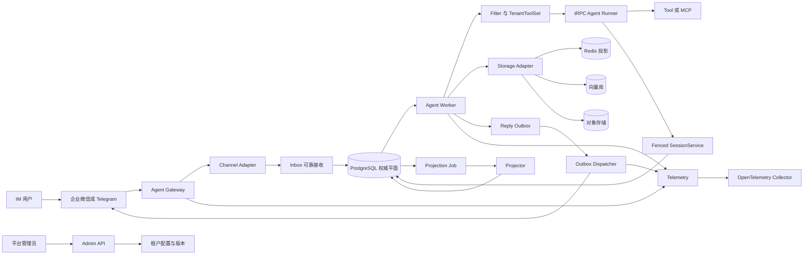

# 架构与组件边界

## 1. 设计立场

平台把“Agent 运行”和“生产可靠性”分成两层：

- tRPC-Agent-Python 负责 `LlmAgent` 编排、`Runner` 事件流、模型调用、Tool/Filter 扩展点和 SDK 数据类型。
- 平台层负责多租户信任边界、IM 协议、持久化接收、会话并发控制、幂等副作用、异步投递、审计和密钥隔离。

这一分层避免把 SDK 的 Session 存储能力误当成多节点分布式互斥协议。在本项目锁定的 `trpc-agent-py==1.1.19` 上，平台用自定义 `BaseSessionService` 适配器将 SDK 事件写入带 CAS 和 fencing token 的 SQL 可靠性面。

## 2. 系统架构

### 组件职责

| 组件 | 关键责任 | 当前代码状态 |
|---|---|---|
| Agent Gateway | HTTP 限制、request/trace 标识、健康检查、Admin API、IM 入口 | 已实现 FastAPI 组合根 |
| Channel Adapter | 验签、解密、严格解析、消息归一化、分段 | 已实现企业微信智能机器人 JSON 回调和 Telegram webhook |
| Inbox | 去重、按 session 分配序号、持久化后才 ACK | 已实现 SQL 仓储及入口集成 |
| Agent Worker | 领取任务、租约心跳、回放会话、运行 Agent、原子完成 | 编排、CLI 公平轮询进程、Compose/K8s 角色均已实现 |
| Fenced SessionService | 把 SDK 非 partial 事件加密封存，以 OCC 和 fence 追加 | 已实现并有伪存储及 SQL 集成测试 |
| Storage Adapter | 显式选择 Session、Scoped State、Memory、Summary、Knowledge、Artifact 后端 | SQL 权威面、InMemory/Redis Session 投影、迁移状态机和 SQL Summary/Memory 已实现；向量库/S3 仍是扩展合同 |
| Outbox Dispatcher | 顺序领取回复、解密短期路由、投递并分类结果 | 核心类、HTTP 合同、CLI 常驻进程和部署角色已实现 |
| Projector | 从 T2 任务读取 committed event，生成单调 Summary/Memory | durable job、lease/fence/heartbeat/retry/dead-letter、常驻进程已实现 |
| Telemetry | FastAPI span、进程出口脱敏、Prometheus 指标 | 基础设施已实现；Worker、Tool、Storage、Dispatcher 的完整手工 span 尚未接齐 |

## 3. 消息与状态面

系统不使用 sticky session。路由和一致性由三个持久化事实支撑：

1. 入口先通过不含密钥和用户标识的 `channel_ingress_route` 找到租户，再进入该租户的 RLS 事务加载 `channel_binding`。
2. `session_id` 由 HMAC 基于 tenant、app、binding、channel、conversation 和 thread 派生，外部用户或群 ID 不直接进入内部标识。
3. 任意 Worker 都可领取消息，但对同一 session 的写入必须同时通过租约所有者、fencing token 和 log version 三重检查。

PostgreSQL 保存不可替代的权威事实：Inbox、AgentRun、SessionEvent、加密 EventObject、ToolEffect、ReplyOutbox、ProjectionJob 和 AuditLog。Redis、向量库和对象存储是可替换投影或外部数据平面，不得反向覆盖 SQL 的已提交事件水位。

## 4. tRPC-Agent-Python 1.1.19 复用边界

| 直接复用 SDK 公开能力 | 平台新增能力 |
|---|---|
| `Runner.run_async` 与完整事件流消费 | Inbox、会话租约、fencing token 和 CAS |
| `LlmAgent`、`RunConfig` 与有限次数循环 | 租户/应用/绑定不可变版本 |
| `Event`、`Content`、`Part` 类型 | partial 事件抛弃、非 partial 事件加密及分阶段发布 |
| `BaseSessionService` 扩展点 | 与领取绑定的 `FencedSessionService` |
| ToolSet、FunctionTool 和 Filter 工厂 | 租户工具白名单、审批门、Tool Effect 幂等账本 |
| OpenAI 兼容模型类 | 平台固定 endpoint、租户只选受批准 provider/model |
| SDK 内建 telemetry 扩展点 | OTLP 出口属性允许列表与日志递归脱敏 |

`trpc_service.agent.compat` 在运行时核验包版本与依赖的公开签名。未审核的 SDK 升级应当先更新兼容性测试，不应放宽版本范围。

## 5. 部署拓扑与实际差距

Gateway、Worker、Dispatcher 和 Projector 可以独立扩容，共享 PostgreSQL 权威面、Redis 投影和 Telemetry Collector。`docker-compose.yml` 已编排四个角色、迁移任务和基础设施；`deploy/k8s/base` 提供独立 ServiceAccount、Deployment、migration Job、PDB、Gateway HPA 与入站 NetworkPolicy。

Kubernetes 文件是可审阅的生产起点，不是对任意集群“一键上线”的承诺。目标环境仍需提供不可变镜像 digest、External Secrets/KMS、Ingress/TLS、托管 PostgreSQL、OTel 地址、FQDN egress allowlist，以及以队列 age/模型并发而非 CPU 为核心的 Worker/Projector HPA。

## 6. 相关文档

- [数据模型](data-model.md)
- [一致性、幂等与故障语义](reliability.md)
- [IM 通道](channels.md)
- [安全模型](security.md)
- [运维手册](operations.md)
- [验收追踪](acceptance.md)
