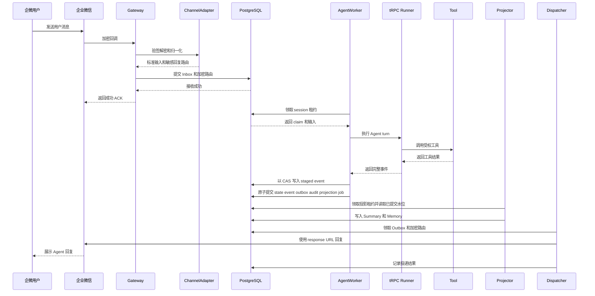

# IM 通道协议与完整消息链路

## 1. 统一边界

IM 回调不直接变成一个普通 HTTP chat 请求。`ChannelAdapter` 在 Agent 之前完成四件事：

1. 使用服务端查得的 `TrustedBindingContext` 校验通道、绑定和外部账号；不信任 URL 路径或 payload 自报的 tenant。
2. 验证回调身份，执行严格 JSON 解析，拒绝重复字段、非有限数值和错误类型。
3. 生成通道中立的 `NormalizedInbound`，用 HMAC 派生 principal、conversation、thread 和 session 标识。
4. 将明文回复坐标拆成 `SensitiveReplyRoute`，由入口加密后与 Inbox 原子保存。

Agent 只看到归一化文本、不可逆内部标识和不含凭据的附件定位键。它看不到 webhook token、AES key、`response_url`、bot token、Telegram chat ID 或外部用户 ID。

## 2. 企业微信与 Telegram 差异

| 维度 | 企业微信智能机器人 | Telegram Bot API |
|---|---|---|
| 入站身份 | `token` 参与字典序 SHA-1 签名，内容用 EncodingAESKey 解密 | 常量时间比较 `X-Telegram-Bot-Api-Secret-Token` |
| 请求格式 | JSON 外层 `encrypt`，签名、timestamp、nonce 在 query | HTTPS POST JSON `Update` |
| URL 验证 | GET 验签并解密 `echostr`，返回精确明文 | `setWebhook` 时由 Bot API 登记 URL 和 secret token |
| 去重键 | `msgid` | `update_id` |
| 账号绑定 | 解密后 `aibotid` 必须匹配 binding | binding 指向唯一 bot token；webhook secret 只做入站验证 |
| 异步回复坐标 | 回调中的一次性 `response_url`，当前按 1 小时有效期保存 | `{chat_id,message_thread_id,reply_to_message_id}` 加密保存，bot token 按 binding 密钥引用取得 |
| 流式/控制消息 | `stream` refresh 分类为 control，不重跑 Agent | 当前主要通过最终 `sendMessage`；未实现打字机式编辑 |
| 长文本 | 按 UTF-8 字节边界分段 | 按 4096 字符上限分段 |
| 群聊 | 群会话由 `chatid` 派生 | 群由 chat ID 派生，forum topic 另纳入 thread |
| 投递模糊结果 | 一次性 URL 只发一次，模糊结果进入 `unknown` | read/write timeout 进入 `unknown`；明确 connect 失败或 429 可有界重试 |

企微适配器针对“智能机器人 API 模式的 JSON 回调”，不是旧的 XML/CorpId 应用回调，也不是只能主动发消息的群 webhook 机器人。

## 3. session_id 与身份隔离

HMAC 的域分离输入包含：

```text
key_version
tenant_id
app_id
app_revision
binding_id
channel
conversation_kind
external_conversation_id
external_thread_id
principal_component
```

- 单聊 session 纳入 principal，同一外部会话中的不同用户不共享状态。
- 群聊 session 默认不纳入 principal，群成员共享会话历史，但每个人仍有不同 principal ID。
- Telegram topic 纳入 thread，同一群的不同 topic 不共享 session。
- tenant、app revision、binding 或 channel 任一不同，就进入不同命名空间。升级到新 app revision 不会读取旧版对话；回滚到旧 revision 会回到原命名空间。

这个策略优先保证隔离和可解释性。如业务需要“跨群记住同一个人”，应通过租户内 Memory 投影实现，不应合并 session ID。

## 4. 企业微信完整时序



`request_id` 由 Gateway 校验输入头后使用或生成，`trace_id` 取当前 FastAPI span；无有效 span 时，用 request ID 派生一个可关联的 32 字节标识。两者持久到 Inbox、Run 和 Audit，并进入 tRPC `RunConfig.custom_data`。

当前代码已实现标识端到端传递，但尚未在 Worker、Tool、Storage、Projector 和 Dispatcher 之间完整重建 OpenTelemetry parent context。因此“用 ID 查齐日志与审计”已具备，“同一分布式 trace 树自动展示全链路”仍是待完成项。

## 5. 消息类型和附件

两个适配器都能把图片、文件、音频/语音和视频映射为不透明 `AttachmentRef`。原始媒体 URL、Telegram file ID 和 AES key 不进入该类型。但当前 Worker 默认解码器只接受非空文本；媒体下载、大小与 MIME/magic bytes 校验、恶意文件扫描、对象存储和模型输入转换尚未接入主链。

当前 Outbox 只接受版本化的纯文本负载。企微卡片、流式快照、文件回复、Telegram 媒体组、撤回和编辑尚未实现。

## 6. 协议参考

- [企业微信智能机器人官方 Node.js SDK](https://github.com/WecomTeam/aibot-node-sdk)
- [Telegram Bot API](https://core.telegram.org/bots/api)
