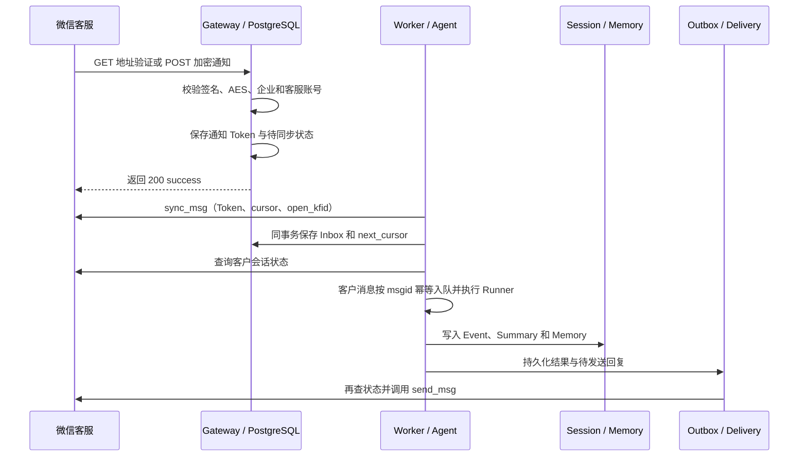

# 微信客服：接入方式、运行效果与边界

本页对应 `wecom_kf`。它是企业微信体系下的微信客服 API，不是个人微信自动化，也不是微信公众号客服接口。`wecom` 指企业微信智能机器人 WebSocket，`telegram` 指 Telegram Bot API；三类通道的统一本地页面见 [IM 接入与本地可视化验证](im.md)。

## 1. 先用离线入口看效果

在已激活的 Anaconda 子环境、仓库根目录运行：

```bat
python -m trpc_service._cli demo customer-service --json
python -m pytest tests/test_customer_service.py -vv
```

Demo 会注入重复通知，并依次运行分页同步、准入、真实 SDK Runner、Outbox 和 Fake 客服回复。

预期输出为 `duplicate_notifications=2`、`replies=1`、`cursor="cursor-1"`，正文包含 `echo:hello customer service`。自动测试还覆盖 AES/签名算法、HTTP 回调、附件、人工接管和发送错误。

该 Demo 把消息、游标、Session、Memory 和 Outbox 保存在 Python 进程内存中，不连接微信，也不调用付费模型；进程退出后数据随之消失。Fake 测试通过只说明本地链路正确，不能代替真实微信后台联调。

## 2. 真实接入的配置

使用 [wecom-kf.yaml](../examples/config/wecom-kf.yaml)，在现有 `.env` 中补充以下变量，不要覆盖你已填写的模型配置：

| 变量 | 用途 |
|---|---|
| `WECOM_KF_CORP_ID` | 企业 ID，亦用于验证加密回调接收者 |
| `WECOM_KF_OPEN_KFID` | 被 API 管理的客服账号 ID |
| `WECOM_KF_SECRET` | 微信客服的 API Secret，不是智能机器人 Secret |
| `WECOM_KF_CALLBACK_TOKEN` | 微信后台与平台约定的回调 Token |
| `WECOM_KF_ENCODING_AES_KEY` | 43 字符 EncodingAESKey，不是 API Secret |

绑定中 `secret_ref`、`webhook_secret_ref`、`encoding_aes_key_ref` 分别引用后三项。`external_account_id` 建议填写客服账号 ID，便于控制面唯一性约束和排查；Runtime 以 `corp_id/open_kfid` 实际调用接口。

模型仍由 `TRPC_AGENT_MODEL_PROVIDER/NAME/BASE_URL/API_KEY` 决定，摘要使用同一个 App 模型。示例的备用值不覆盖 `.env`；如果 `.env` 填的是 GPT，它仍使用 GPT，要换 DeepSeek 应一起修改模型名、地址和密钥。

以下命令只做格式检查：

```bat
python -m trpc_service._cli check-config examples/config/wecom-kf.yaml --env-file .env
```

预期 `valid: 1 tenant configuration(s)`。完整配置后，下面是**真实服务**启动命令，收到消息会调用所配模型、产生费用并向真实客户发送回复：

```bat
python -m trpc_service._cli serve --config examples/config/wecom-kf.yaml --env-file .env --host 127.0.0.1 --port 8080
```

只在准备真实联调时运行这条命令。微信后台需要能够从公网访问的 HTTPS 回调地址，例如 `https://你的域名/api/v1/channels/demo-wecom-kf/webhook`，不能填写 `127.0.0.1`。TLS、域名、账号授权和公网入口由验收环境提供。

开发模式需要同时运行 `gateway,worker,delivery`，进程退出后内存状态不会保留。生产模式使用共享 Redis 和 PostgreSQL，先应用全部数据库迁移并配置租户认证。分角色部署时，各角色应使用同一份租户配置和 Secret。Compose 默认挂载 `tenants.yaml`，若要联调微信客服，需要显式改为客服配置文件。

## 3. 消息究竟怎样处理



GET 验证返回解密后的 `echostr`。POST 成功回应不意味着模型已执行，只表示通知已保存；保存失败返回 503，非法签名返回 403。不在回调里等待模型。

`has_more` 决定是否继续分页，即使这一页没有消息也可能要继续拉取。每条 Inbox 保留显式页内接收序号，避免 PostgreSQL JSONB 重排键后改变本地处理顺序。不同 Worker 通过领取租约避免重复同步；异常后保留旧游标重试。这里只保证本地页接收顺序，不承诺多个消费者和外部迟到消息的全局时间排序。

`origin=3` 的文本、图片和文件才转为 `AgentRequest`。坐席消息、其他类型和事件保留为观察记录，不触发 Agent。人工状态以准入前、发送前的 `service_state/get` 实时查询为准，不依赖可能迟到的事件推断。两个检查之间仍可能发生状态变化，最终由微信接口判定是否允许发送。

## 4. 附件、回复和错误

- 收到图片/文件后，通过固定客服 API 下载，进入已有 Artifact 存储；跨租户读取仍拒绝。下载最多 10 MiB，不允许模型提供任意 URL 让服务端下载。
- 发送端支持一条 OutboundMessage 对应一张图片或一个文件：先从租户 Artifact 取内容，再上传临时素材发送。普通 Agent 回复转换为文本；业务需要发送附件时，通过 OutboundMessage 的附件引用走相同 Adapter 契约。
- 回复是完整异步消息，不是逐 token 流式。文本按 UTF-8 2048 字节分片，不能按 2048 个汉字计算。
- 本地发送保护按最近客户发言限制 48 小时、最多 5 条；分片也占条数。该保护不替代微信实际配额和权限判断，超过本地窗口/额度不发送，接口错误码仍保留。
- access token 在进程内缓存；普通 JSON API 和媒体上传/下载遇到明确过期码刷新后重试一次。不会因发送结果不确定而盲目刷新并重发。
- 429 保留 Retry-After；明确的无权限/格式错误为永久失败。发送读超时、连接中断或 5xx 不能证明没发出，标为 `unknown`，停止自动重发。
- 发送前持久化 attempt，成功后记录 delivered。若进程死在两者之间，下一次看到未确认 attempt 会转待核查，不以“没有 delivered”推断“客户没收到”。这是保守避免重复，不是端到端 exactly-once。

## 5. 存储与运维边界

数据库迁移 [003_customer_service_fencing.sql](../migrations/003_customer_service_fencing.sql) 创建客服运行状态结构。生产环境的 `customer_service_state` 按 Binding 保存通知、Cursor、Inbox、客户发言时间和发送记录，事务行锁保证分页更新的原子性。

客服账号归属从服务端租户快照解析，不接受客户消息自行声明 tenant。

每个 binding 使用一个 JSONB 状态文档，保存游标、Inbox 和发送记录；保留期由运维策略控制，过期同步 Token 和历史记录按租户清理。Token 和原始客户消息只存在受控数据库中，状态快照不通过公众接口开放。

`unknown` 不会自动按失败重发；管理员先核对微信记录，再决定是否重新投递。客服配置按不可变版本发布，变更后通过滚动重启相关 Channel 角色加载新版本。

## 6. 真实联调记录要求

准备测试客服账号和测试客户，依次验证：回调地址保存成功、文本回复、图片/文件收取、人工接管后暂停、恢复机器人接待、重复通知、错误权限、断网时 UNKNOWN。只记录脱敏 request_id/msgid、状态与时间，不粘贴 Secret 或客户原文。

项目提供真实 PostgreSQL 测试环境和统一的 `im-live` 入口。由于没有微信客服真实凭据和公网回调地址，客服实机收发由验收环境完成。本地协议测试与凭据检查不能代替真实链路；只有回调、消息拉取和发送都成功，才能记录为实机通过。

接口核对入口：[微信客服开发文档](https://kf.weixin.qq.com/api/doc)。遇到接口字段/配额变化，应先以账号当前官方说明核对，再扩展客户端测试。
