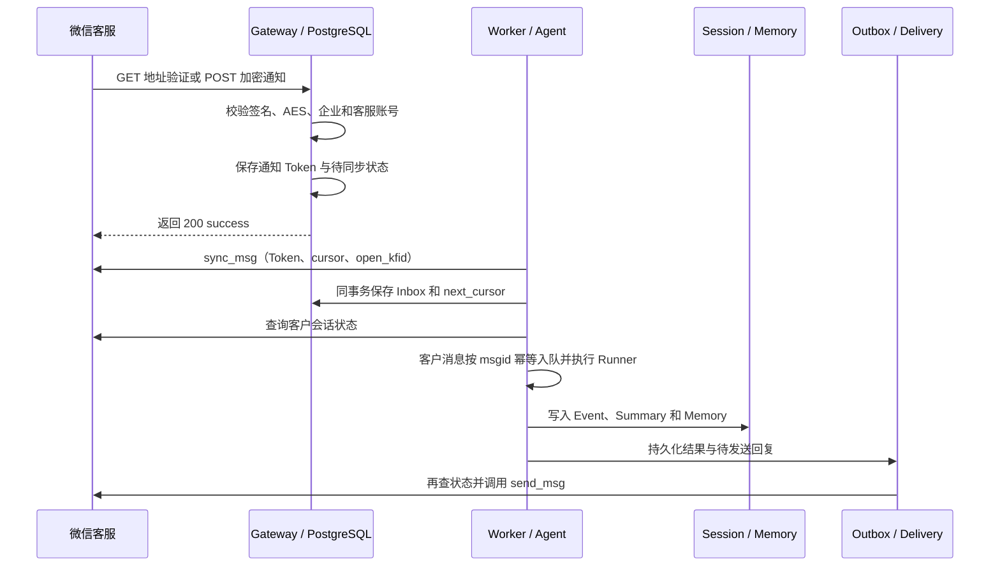

# 微信客服：接入方式、运行效果与边界

本页对应 `wecom_kf`。wecom` 指企业微信智能机器人 WebSocket，`telegram` 指 Telegram Bot API；三类通道的统一本地页面见 [IM 接入与本地可视化验证](im.md)。

## 1. 先用离线入口看效果

在已激活的 Anaconda 子环境、仓库根目录运行：

```bat
python -m trpc_service._cli demo customer-service --json
python -m pytest tests/test_customer_service.py -vv
```

Demo 会注入重复通知，并依次运行分页同步、准入、真实 SDK Runner、Outbox 和 Fake 客服回复。

预期输出为 `duplicate_notifications=2`、`replies=1`、`cursor="cursor-1"`，正文包含 `echo:hello customer service`。自动测试还覆盖 AES/签名算法、HTTP 回调、附件、人工接管和发送错误。

该 Demo 把消息、游标、Session、Memory 和 Outbox 保存在 Python 进程内存中；进程退出后数据随之消失。
## 2. 真实接入的配置

使用 [wecom-kf.yaml](../examples/config/wecom-kf.yaml)，在现有 `.env` 中补充以下变量，模型配置沿用当前值：

| 变量 | 用途 |
|---|---|
| `WECOM_KF_CORP_ID` | 企业 ID，亦用于验证加密回调接收者 |
| `WECOM_KF_OPEN_KFID` | 被 API 管理的客服账号 ID |
| `WECOM_KF_SECRET` | 微信客服 API Secret，与智能机器人 Secret 分开配置 |
| `WECOM_KF_CALLBACK_TOKEN` | 微信后台与平台约定的回调 Token |
| `WECOM_KF_ENCODING_AES_KEY` | 43 字符 EncodingAESKey，用于回调消息解密 |

绑定中 `secret_ref`、`webhook_secret_ref`、`encoding_aes_key_ref` 分别引用后三项。`external_account_id` 建议填写客服账号 ID，便于控制面唯一性约束和排查；Runtime 以 `corp_id/open_kfid` 实际调用接口。

模型由 `TRPC_AGENT_MODEL_PROVIDER/NAME/BASE_URL/API_KEY` 决定，摘要使用同一个 App 模型。终端环境变量优先于示例中的备用值。

以下命令只做格式检查：

```bat
python -m trpc_service._cli check-config examples/config/wecom-kf.yaml --env-file .env
```

预期 `valid: 1 tenant configuration(s)`。完整配置后，下面是**真实服务**启动命令，收到消息会调用所配模型、产生费用并向真实客户发送回复：

```bat
python -m trpc_service._cli serve --config examples/config/wecom-kf.yaml --env-file .env --host 127.0.0.1 --port 8080
```

这条命令用于真实联调。微信后台填写能够从公网访问的 HTTPS 回调地址，例如 `https://你的域名/api/v1/channels/demo-wecom-kf/webhook`。TLS、域名、账号授权和公网入口由验收环境提供。

开发模式同时运行 `gateway,worker,delivery`，状态保存在当前进程。生产模式使用共享 Redis 和 PostgreSQL，并在启动前应用数据库迁移、配置租户认证。分角色部署时，各角色使用同一份租户配置和 Secret。Compose 默认挂载 `tenants.yaml`；联调微信客服时改为客服配置文件。

## 3. 消息究竟怎样处理



GET 验证返回解密后的 `echostr`。POST 在通知保存后立即回应，Agent 由后台异步执行；保存失败返回 503，签名校验失败返回 403。

`has_more` 决定是否继续分页，即使当前页为空也会按该字段继续拉取。每条 Inbox 保存页内接收序号，使 PostgreSQL JSONB 序列化前后仍保持处理顺序。不同 Worker 通过同步租约协调任务；异常时保留旧游标，恢复后从原位置继续。

`origin=3` 的文本、图片和文件会转为 `AgentRequest`。坐席消息和会话事件用于更新客服状态。准入前和发送前都会调用 `service_state/get` 查询人工接待状态，最终发送结果以微信接口返回为准。

## 4. 附件、回复和错误

- 收到图片或文件后，通过微信客服 API 下载并写入租户 Artifact 存储。下载上限为 10 MiB，下载地址来自经过校验的平台消息字段。
- 发送端支持一条 OutboundMessage 对应一张图片或一个文件：先从租户 Artifact 取内容，再上传临时素材发送。普通 Agent 回复转换为文本；业务需要发送附件时，通过 OutboundMessage 的附件引用走相同 Adapter 契约。
- 回复是完整异步消息，文本按 UTF-8 2048 字节分片。
- 本地发送保护按最近客户发言限制 48 小时、最多 5 条，分片同样计入条数。微信接口继续负责实际配额和权限判断，平台保留其错误码。
- access token 在进程内缓存；普通 JSON API 和媒体上传/下载遇到明确过期码时刷新并重试一次。发送结果未知时进入核查流程。
- 429 保留 Retry-After；明确的无权限或格式错误记为永久失败。发送读超时、连接中断或 5xx 记为 `unknown`，由人工核对远端状态。
- 发送前持久化 attempt，成功后记录 delivered。进程在两个阶段之间退出时，未确认 attempt 会转入待核查状态。这种设计优先避免向客户重复发送消息。

## 5. 存储与运维边界

数据库迁移 [003_customer_service_fencing.sql](../migrations/003_customer_service_fencing.sql) 创建客服运行状态结构。生产环境的 `customer_service_state` 按 Binding 保存通知、Cursor、Inbox、客户发言时间和发送记录，事务行锁保证分页更新的原子性。

客服账号归属从服务端租户快照和 Channel Binding 解析，客户消息中的身份字段用于用户映射。

每个 Binding 使用一个 JSONB 状态文档，保存游标、Inbox 和发送记录；保留期由运维策略控制，过期同步 Token 和历史记录按租户清理。Token 与原始客户消息保存在受控数据库中，管理接口按租户权限查询。

`unknown` 交由管理员先核对微信记录，再决定是否重新投递。客服配置按版本快照发布，变更后通过滚动重启相关 Channel 角色加载新版本。

## 6. 真实联调记录要求

准备测试客服账号和测试客户，依次验证：回调地址保存成功、文本回复、图片/文件收取、人工接管后暂停、恢复机器人接待、重复通知、错误权限、断网时 UNKNOWN。测试记录使用脱敏后的 request_id、msgid、状态和时间。

项目提供真实 PostgreSQL 测试环境和统一的 `im-live` 入口。当前本地验证覆盖协议、密码学、分页、执行和模拟投递；验收环境提供微信客服凭据和公网回调地址后，再验证真实回调、消息拉取与发送。

接口核对入口：[微信客服开发文档](https://kf.weixin.qq.com/api/doc)。遇到接口字段/配额变化，应先以账号当前官方说明核对，再扩展客户端测试。
