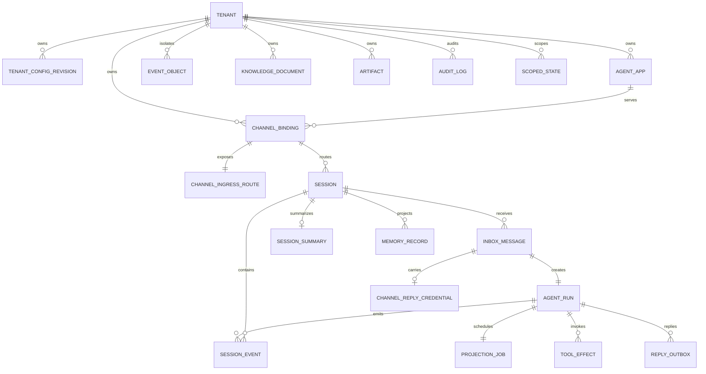

# 数据模型与多后端分工

## 1. 建模原则

1. `tenant_id` 是所有业务数据的第一隔离维度，但不是唯一防线。PostgreSQL 还启用 `ENABLE ROW LEVEL SECURITY` 与 `FORCE ROW LEVEL SECURITY`。
2. Inbox、Run、Event、Tool Effect、Outbox 和 Audit 是不可丢失的权威记录，固定落 SQL。
3. Session state、Summary、Memory、Knowledge 索引和 Artifact 是带版本或水位的投影。投影可替换，但不得越过已提交事件水位。
4. 租户配置和 Agent App 采用不可变版本。回滚是重新物化旧版本，不是修改历史。
5. 明文回复 URL、bot token、原始 chat ID 和外部用户 ID 不进入普通 Inbox/Outbox 负载。

## 2. 核心 ER 图

`audit_log` 在 ORM 中没有为所有业务对象建外键，以避免审计记录的生命周期受业务行删除影响；它仍受 `tenant_id` RLS、哈希字段和 PostgreSQL append-only trigger 约束。

## 3. 表级设计

| 表 | 主键或核心唯一约束 | 用途与关键水位 |
|---|---|---|
| `tenant` | `tenant_id` | 租户状态、活动配置版本、审计和预算策略 |
| `tenant_config_revision` | `(tenant_id, revision)` | 不可变 `spec`、`content_hash`、发布人和时间 |
| `agent_app` | `(tenant_id, app_id, revision)` | prompt、model、tool policy 和 storage config 快照 |
| `channel_binding` | `binding_id`；另有 callback、public ID、external account 唯一性 | 将受信 IM 账号绑定到租户和 Agent 版本，只存 `secret_refs` |
| `channel_ingress_route` | `public_callback_id` | 入口在不知 tenant 时使用的最小公开路由；无密钥、无外部用户数据 |
| `session` | `(tenant_id, session_id)` | `next_inbox_seq`、`log_version`、`state_version`、租约和 `fencing_token` |
| `inbox_message` | `inbox_id`；`(tenant_id,binding_id,external_delivery_id)` | 持久去重、每 session `accepted_seq`、处理状态和重试时间 |
| `agent_run` | `run_id`；每 tenant 的 `request_id` 和 `inbox_id` 唯一 | 一个逻辑 turn，多次 takeover 复用同一 run，记录 attempt/fence |
| `session_event` | `(tenant_id,session_id,seq)`；`(tenant_id,run_id,event_key)` | 不可变事件，可见性为 `staged`/`committed`/`aborted`，`content_ref` 指向加密 SDK Event |
| `event_object` | `(tenant_id,object_key)` | AES-GCM SDK Event 密文与 digest；RLS 隔离，PostgreSQL trigger 禁止 UPDATE/DELETE |
| `projection_job` | `job_id`；`(tenant_id,run_id)` | T2 原子创建，保存 through_seq、lease/fence、重试和 dead-letter 状态 |
| `session_summary` | `(tenant_id,session_id)` | `through_seq` 只前进，带 summarizer version |
| `memory_record` | `(tenant_id,source_event_id,extractor_version)` | 从已提交 event 幂等抽取，`record_version` 用于可见水位 |
| `tool_effect` | `(tenant_id,idempotency_key)` | 外部副作用账本，记录 args hash、execution token、downstream ID 和 `unknown` |
| `reply_outbox` | `(tenant_id,reply_id,part_no)` | 异步回复意图、顺序分片、delivery token、claim 和投递结果 |
| `channel_reply_credential` | `(tenant_id,inbox_id,credential_kind)` | AES-GCM 密文、带键指纹、过期时间及单次/未知状态 |
| `knowledge_document` | `(tenant_id,document_id,version)` | 知识原文元数据、内容哈希、object ref、index watermark 和 tombstone |
| `artifact` | `(tenant_id,artifact_id,version)` | 对象存储引用、内容哈希、MIME 和尺寸 |
| `audit_log` | `audit_id` | tenant、channel、user、session、agent、tool、decision、latency、error、cost、trace 等 |
| `scoped_state` | `(tenant_id,app_id,scope,subject_id)` | app/user 状态与独立 OCC 版本；与 session state 分开 |

### 会话水位

`session` 中有两个不同的水位：

- `log_version` 在非 partial SDK 事件通过 CAS 追加后前进，即使事件仍处于 `staged`。
- `state_version` 只在 run 原子完成后追上 `log_version`。读取面只暴露 `committed` 且 `seq <= state_version` 的事件。

表约束 `state_version <= log_version` 防止 state 宣称看到尚未存在的事件。接管时，旧 attempt 的 staged event 被标记为 `aborted`，新 attempt 从当前 log version 继续分配序号，但回放不包含被废弃的轨迹。

## 4. 后端分工

| 类别 | 权威性 | 适合内容 | 一致性与同步策略 | 当前状态 |
|---|---|---|---|---|
| PostgreSQL | 权威 | 配置、Inbox、Run、Event、加密 EventObject、ProjectionJob、Tool Effect、Outbox、Audit；可同时存 Session/Memory/Summary | 事务、行锁、`SKIP LOCKED`、CAS、RLS；对已 ACK 输入要求持久 | ORM、0001–0006 Alembic 和 PG 合同测试已有；本地未运行真实 PG |
| Redis | 可重建投影 | 热 Session state、Summary 缓存、限流计数 | Lua CAS，读写延迟低；丢失后由 SQL event 重建 | Redis Session 投影适配器与伪 Redis 合同测试已有；未做真实 Redis 集成测试 |
| 向量库 | 可重建索引 | Knowledge chunk 向量和可检索 Memory | `document_id + version + chunk_id` 幂等 upsert，`indexed_version` 达标后切读；接受最终一致 | `pgvector/qdrant/milvus` 可配置，但未实现具体向量适配器和检索链路 |
| 对象存储 | 外部持久对象 | 原始文档、媒体和 Artifact | 内容哈希命名、put-if-absent、SQL 元数据发布 | Artifact 元数据和 EventObject 合同已有；SDK Event 生产默认落权威 SQL，尚无 S3/MinIO Artifact 适配器 |
| InMemory | 进程内 | 开发、单测和契约演示 | 进程锁与版本检查；不跨节点、不持久 | 六类投影接口的实现和测试已有，路由器会在 production 拒绝它 |

## 5. 迁移模型

`MigrationPlan` 以 tenant 和 category 为单位，状态机为 `shadowing -> verifying -> cutover_ready -> cutover`，任何阶段可进入 `rolled_back` 或 `failed`。会话迁移的正确步骤是：

1. 保持旧后端为读权威，用权威输入向新后端写 shadow。
2. 对相同 session 比较 version、committed watermark 和完整 state 哈希，只记录计数和不含负载的差异原因。
3. 只有至少一次比较且零 mismatch 才能进入 `cutover_ready`。
4. 修改新的租户配置版本切读，保留旧后端和回退窗口。

当前只实现 Session 投影的 shadow 比对和进程内 migration status store。生产切换还需持久化状态存储、Admin API、批处理器、告警和回滚自动化。
