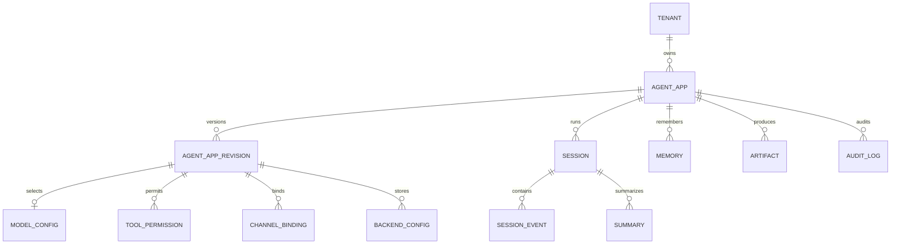

# 核心数据模型

控制面以 `Tenant` 为隔离根，以 `AgentApp` 为稳定应用标识，以
`AgentAppRevision.version` 为不可变配置版本。每次发布会冻结当前草稿并复制出下一版本草稿，
运行时只读取 `AgentApp.active_version`；回滚仅切换该指针。

## 关键约束

- 所有租户业务表都携带 `tenant_id`。
- 子表通过 `(tenant_id, agent_app_id)` 复合外键关联应用，数据库拒绝跨租户引用。
- 应用 slug 在租户内唯一，租户 slug 全局唯一。
- 模型在每个应用配置版本中最多一条；工具名、通道账号、后端用途在版本内唯一。
- Session key 在 `tenant + app` 下唯一，Event sequence 在 Session 内唯一。
- `tenant + channel + external_message_id` 唯一，用于 IM 消息幂等。
- 所有版本号、序列号、延迟、成本和 Artifact 大小均有非负或正数检查。
- 已发布配置不可修改。写操作使用 `version/lock_version` 乐观并发控制。
- 模型、通道和存储凭据只保存 `env://`、`vault://` 等密钥引用；JSON 配置拒绝明文敏感字段。

开发环境默认使用 SQLite，并显式执行 `PRAGMA foreign_keys=ON`。生产环境可将
`TRPC_SERVICE_DATABASE_URL` 切换为 PostgreSQL URL，并使用 Alembic 管理迁移。

`0003_postgresql_tenant_rls` 为 tenants 以及所有携带 tenant_id 的表启用并强制执行 PostgreSQL
Row-Level Security。事务通过 `set_config` 写入 `trpc.tenant_id`；租户请求只能读取和修改本租户行。
可信的控制面全局操作和 Inbox/Outbox Worker 使用 `trpc.rls_bypass=on`，该能力只对服务内部数据库
会话开放。生产应分离迁移账号和运行账号，并禁止业务方直接取得数据库凭据。
