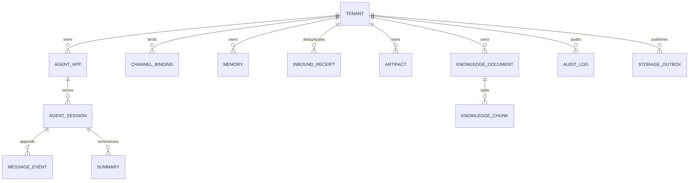

# 数据模型设计

可执行的 MySQL 8 DDL 位于 [`data/schema.mysql.sql`](../../data/schema.mysql.sql)。SQL 保存关系、
版本、状态和外部数据引用；向量和对象 payload 分别留在向量库与对象存储。

## 1. 实体关系

## 2. 核心表

| 表 | 主键/唯一键 | 作用 |
|---|---|---|
| `tenant` | `tenant_id` | 当前租户配置快照和单调 `config_version` |
| `tenant_config_version` | `(tenant_id, version)` | 不可变历史与回滚依据 |
| `agent_app` | `(tenant_id, app_id)` | Agent 名称、指令和版本 |
| `channel_binding` | `(tenant_id, channel, account_id)`；平台账号唯一 | IM 账号到租户的绑定、secret ref 和身份规则 |
| `agent_session` | `(tenant_id, app_id, user_id, session_id)` | 可变 state 和 CAS version |
| `message_event` | session scope + `sequence_no`；幂等键唯一 | 不可变消息/工具/模型事件和 trace id |
| `memory` | `(tenant_id, memory_id)` | 长期记忆及版本 |
| `summary` | `(tenant_id, summary_id)` | Session 摘要和 `source_version` |
| `inbound_receipt` | `(tenant_id, channel, message_id)` | request/trace/task、处理状态与回复状态 |
| `artifact` | `(tenant_id, artifact_id, version)`；object key 唯一 | 对象 URI、checksum、大小、MIME 和状态 |
| `knowledge_document` | `(tenant_id, document_id)` | 原文 checksum、版本和索引状态 |
| `knowledge_chunk` | `(tenant_id, document_id, chunk_id)`；vector id 唯一 | 文本、embedding model/version 和向量引用 |
| `storage_outbox` | `event_id` | 跨 SQL、向量库、对象存储的可重放任务 |
| `audit_log` | `id` | append-only 决策、耗时、成本、错误和 trace |

## 3. 关键约束

所有业务主键或索引的第一维都是 `tenant_id`。Repository 查询不得接受调用方自由传入缺少
tenant scope 的条件。`message_event` 的 `idempotency_key` 和 `inbound_receipt` 主键阻止同一
平台消息重复落库；`summary.source_version` 阻止旧摘要覆盖新会话；Artifact 在 SQL 中只保存
对象引用和 checksum，大 payload 不进入事务日志；Knowledge Chunk 的 `embedding_version`
保证索引重建和回滚时可区分新旧向量。

`channel_binding.secret_ref` 只保存 KMS/Vault/Kubernetes Secret 引用。示例租户配置中的
SecretStr 在持久化前会从公开 JSON 拆出并加密，不会出现在配置历史、日志或 Admin API 响应。

## 4. 数据生命周期

- Event 与 Audit 采用追加写，按租户策略归档或分区，不直接业务更新；
- Session、Memory 和 Summary 可设置 TTL/保留期，删除任务必须携带 tenant id；
- Artifact 使用版本化不可变 key，SQL tombstone 保留到对象删除确认；
- Knowledge 更新创建新 document version，索引完成后原子切换 active version；
- `inbound_receipt` 过期时间必须覆盖 IM 最大重试窗口和任务最长执行时间；
- outbox 成功记录按审计要求保留，pending/dead 记录持续告警，不能静默清理。
