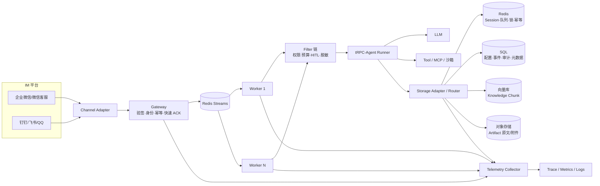
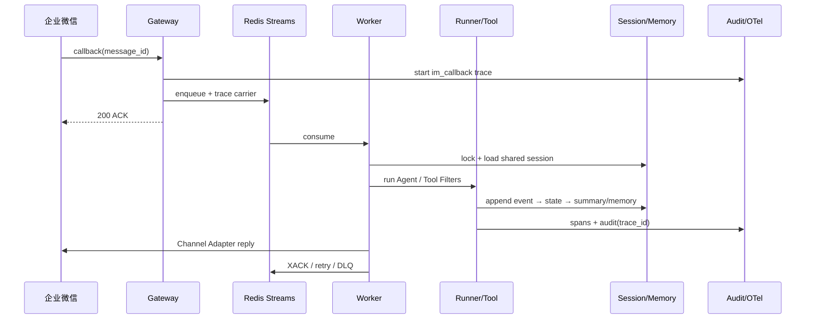

# tRPC-Agent 多租户工程化 — 设计文档

> 本文档串起 `trpc_service/` 包的各模块，说明多租户模型、节点部署拓扑、
> 数据多后端、IM 通道接入、治理/监控/安全与故障恢复的设计决策，并映射到已实现代码。

---

## 1. 架构总览



**核心设计原则**：多租户能力作为**独立的 `trpc_service` 服务包**叠加在框架之上，**不改动任何
core 现有文件**。租户隔离复用框架既有的 `app_name → user_id → session_id` 三级作用域，
通过 `app_name` 前缀注入租户维度（`app_name` 已是所有存储 key 的第一级前缀）。

---

## 2. 租户模型与隔离

### 2.1 租户模型（`trpc_service/tenant/_models.py`）

| 配置域 | 字段 | 说明 |
|---|---|---|
| 基础 | `tenant_id` / `name` / `status` | `active` / `disabled` |
| 应用 | `app_config.app_list` / `default_instruction` / `max_concurrent_sessions` | 绑定 App 列表、默认提示词、并发上限 |
| 模型 | `model.provider` / `model_name` / `api_endpoint` / `timeout` / `retry` / `fallback_model` | 主模型与降级备选 |
| 工具 | `tool_permissions.tool_whitelist` / `tool_denylist` / `dangerous_tools` | 白名单/黑名单/需二次确认 |
| IM | `channel_configs[channel_type]` | 企业微信/微信客服/钉钉/飞书/QQ 的 token、secret 与账号绑定 |
| 后端 | `session_backend` / `memory_backend` / `vector` / `object` | Session/Memory 选 Redis 或 MySQL；Knowledge 选向量库；Artifact 选本地或 S3 兼容存储；Summary 跟随 Session，Audit 固定 MySQL |
| 审计 | `audit_policy.enabled` / `retention_days` / `desensitize_rules` | 审计开关与脱敏规则 |
| 预算 | `budget.daily_token_budget` / `daily_cost_limit` | 日 token / 成本上限 |

> 注：模型配置字段命名为 `model` 而非 `model_config`，因 `model_config` 是 Pydantic
> 保留字。

### 2.2 隔离机制（`TenantSessionService` / `TenantMemoryService`）

- **数据隔离**：`TenantSessionService` 将 `app_name` 注入为 `{tenant_id}:{app_name}`，
  存储 key 变为 `session:{tenant_id}:{app}:{user}:{session}`；`TenantMemoryService` 对
  memory key 做同样的幂等前缀注入。两个租户用相同的 `user_id`/`session_id` 也不会串。
- **配置隔离**：MySQL `tenant` 是配置事实源，`tenant_config_version` 保存不可变历史，
  更新使用 `config_version` CAS 防止多节点覆盖；进程内仅保留 L1 副本，Redis 保存加密 L2
  缓存并通过 Pub/Sub 通知其他节点刷新。Admin/Worker 均按 `tenant_id` 强制过滤。
- **工具权限隔离**：`ToolAllowlistFilter`（TOOL filter）在执行前按租户白名单/黑名单/危险
  工具清单拦截。
- **密钥管理**：密钥字段用 `pydantic.SecretStr`（repr 不泄露明文）；写 MySQL/Redis 前由
  `TenantConfigCodec` 将密钥从公开 JSON 中剥离，并使用
  `TENANT_CONFIG_ENCRYPTION_KEY` 派生的 Fernet 密钥加密。生产密钥来自 KMS/Secret；
  `SecretMasker` 对日志/trace/异常做 `sk-*`/`Bearer`/`password=` 遮蔽。

---

## 3. 节点部署拓扑与水平扩展

组件协作：

| 组件 | 职责 | 实现 |
|---|---|---|
| Agent Gateway | 统一入口、租户解析、验签、幂等、限流、路由 | `trpc_service/web/gateway/_app.py` |
| Agent Worker | 无状态执行，Runner + 治理 Filter，读写共享后端 | `trpc_service/agent/_worker.py` |
| Channel Adapter | IM 消息 ↔ Agent 输入输出双向转换 | `trpc_service/channels/` |
| Storage Adapter | 统一数据访问抽象 | 复用 `SessionServiceABC`/`MemoryServiceABC` + 租户包装 |
| Admin API / Telemetry | 租户 CRUD/版本回滚、审计/指标查询、OTel | `trpc_service/web/admin/`、`trpc_service/metrics/_metrics.py`、`trpc_service/metrics/_observability.py` |

**路由流程**：IM 回调到达 Gateway → 从 URL path 解析 `tenant_id` → 验签/幂等 →
`generate_session_id(tenant, channel, chat_type, user, chat)` 得到 session → 任意 Worker
从共享后端加载上下文 → 执行 → 写回 + 推送回复。



**是否需要 sticky session？不需要。** Worker 完全无状态：每次请求从共享后端
（Redis/MySQL）加载最新上下文，执行完写回。Compose 默认已经通过 Redis Streams 将
Gateway 与 Worker 解耦，并用 consumer group、pending reclaim、最大重试和 DLQ 支持独立扩缩容；
仅在最低资源演示时可关闭队列，让 Gateway 进程内执行。

---

## 4. 数据同步与多后端

### 4.1 后端选型与一致性取舍

| 后端 | 一致性 | 延迟 | 成本/运维 | 主要用途 |
|---|---|---|---|---|
| Redis | 单主单 key 写后读一致；故障切换窗口可能丢失未复制写 | 通常毫秒级 | 中 | 热 Session、队列、锁、幂等、预算、缓存 |
| SQL/MySQL | 事务强一致，可用版本号/CAS 防止并发覆盖 | 通常数毫秒到数十毫秒 | 中到高 | 租户配置、长期 Event/Memory、审计、Artifact/Knowledge 元数据 |
| Qdrant/Milvus/pgvector | 单记录 upsert；索引构建与副本同步通常最终一致 | 检索低延迟，写入可异步 | 中到高 | Knowledge Chunk embedding、语义召回与元数据过滤 |
| S3/COS/MinIO | 对象 PUT 后读取；跨区域复制最终一致 | 高于数据库 | 低到中 | 图片、文件、模型产物和大体积 Artifact |

### 4.2 数据实体存储映射

| 实体 | 位置 |
|---|---|
| Session event/state | Redis Stream/Hash 或 MySQL 事务表 |
| Summary | 作为 session summary event，跟随 Session 存入 Redis 或 MySQL |
| Memory | Redis 租户前缀键或 MySQL `memory` 表 |
| Artifact | 对象存储保存不可变 payload；SQL `artifact` 保存版本、URI、checksum 与状态；Redis 仅缓存热点元数据 |
| Knowledge | SQL 保存 document/chunk 事实记录；向量库存 embedding 与检索 payload；对象存储保留原文 |
| Audit Log | MySQL 不可变 append-only 表；每个进程仅在内存保留最近 500 条，不使用 Redis 存储 |
| Tenant Config | MySQL 当前快照 + 不可变版本历史；Redis 加密缓存/版本通知 |

### 4.3 数据同步策略

- **多节点并发写一致性**：同一 session 通过 Redis lease writer lock 串行；event
  append-only，SQL 推荐在同一事务内 CAS `version` 并对冲突重试。
- **Event/State/Summary 顺序**：event 先写（不可变）→ state 覆盖写（可变）→ summary 由
  异步 Summarizer 生成后覆盖写。
- **Memory 跨节点可见性**：写入后经 Redis Pub/Sub 失效通知，各节点本地缓存主动失效。
- **后端迁移**：迁移对象限定为 Session/Memory，方向限定为 Redis→MySQL。生产流程为
  建目标 schema → 记录 watermark → 按租户全量复制 → 双写并追平增量 → checksum/shadow read
  校验 → 单租户切换读路由 → 保留回滚窗口。Audit 始终以 MySQL 为主存储，不参与迁移；
  Summary 作为 session summary event 时随 Session 一起迁移。
  MyTestWeb 已接入真实 `TenantBackendMigrationAdapter`；当前可运行流程会全量复制 Session/Memory、
  复扫源端并校验 checksum，源端发生未追平写入时拒绝切换。生产零停机部署还需在复制窗口接入
  `DualWriteBackend` 和 durable outbox。
- **IM 幂等**：Gateway 以 `tenant:channel:msg_id` 为键 `SETNX`（TTL 300s），已存在则
  返回 200 不重复处理（`web/gateway/_idempotency.py`）。
- **配置同步**：配置写入、版本快照和 `config_outbox` 在同一 MySQL 事务提交；成功后更新
  Redis 缓存并发布版本事件。Redis 暂时不可用不会撤销 MySQL 事务，outbox 保持 pending，
  恢复后重放。节点若漏掉 Pub/Sub，也会在缓存过期/L1 miss 时回源 MySQL。
- **Knowledge 同步**：原文先写对象存储并得到 checksum；SQL 事务写入 document、chunk 和
  `storage_outbox`；索引 Worker 按 `(tenant_id, document_id, version)` 幂等 upsert 向量库，
  成功后把文档状态改为 `ready`。更新使用新版本向量，检索切换后再异步删除旧版本。
- **Artifact 同步**：对象 payload 使用带租户前缀的不可变 key，PUT 成功后才提交 SQL 元数据；
  删除先把元数据标记为 `deleting`，再异步删对象，避免数据库引用尚未存在的 payload。
- **适配器实现**：`TenantStorageRouter` 已支持 Redis/MySQL Session/Memory、内存/Qdrant
  VectorStore、本地/S3 兼容 ObjectStore。Milvus 与 pgvector 通过注册工厂接入，所有
  Vector namespace 和 Object key 在路由边界强制添加 `tenant_id`。

---

## 5. IM 通道接入（企业微信 / 微信客服 / 钉钉 / 飞书 / QQ）

### 5.1 适配器抽象（`trpc_service/channels/_base.py`）

```python
class ChannelAdapter(ABC):
    async def verify_signature(payload, headers, query) -> bool
    async def parse_message(payload) -> InboundMessage
    async def send_message(outbound) -> SendResult
    async def send_stream(chat_id, stream) -> SendResult
    async def reply_text(inbound, text) -> SendResult
```

### 5.2 已实现能力

| 能力 | 企业微信/微信客服 | 钉钉/飞书 | QQ |
|---|---|---|---|
| 验签 | token + SHA1/HMAC，需要时 AES 解密 | app secret / verification token / encrypt key | AppSecret 派生 Ed25519 密钥，校验 timestamp + raw body |
| 消息转换 | XML 或平台 JSON → `InboundMessage` | 平台 event JSON → `InboundMessage` | C2C/群/频道/频道私信 event → `InboundMessage` |
| session_id | 单聊 `sha256(tenant:channel:user)`；群聊 `sha256(tenant:channel:chat)` | 同左 | 同左 |
| 回复 | 文本分段，图片/文件保留 attachment | webhook/SDK 发送文本或卡片，限流退避 | App AccessToken + 对应会话 OpenAPI，限流退避 |
| 本地验证 | MyTestWeb 构造企业微信/微信客服 fixture | MyTestWeb 构造钉钉/飞书 fixture | MyTestWeb 构造 QQ fixture |

### 5.3 账号绑定与身份映射

| 平台 | 绑定 | 验签 | 身份映射 |
|---|---|---|---|
| 企业微信 | `corp_id`+`agent_id`+`token`+`EncodingAESKey` | AES 解密 + SHA1/HMAC | `FromUserName` → UserID |
| 微信客服 | `corp_id`+`open_kfid`+`token`+`EncodingAESKey` | AES + SHA1/HMAC | `external_userid` → UserID |
| 钉钉 | `app_id`+`robot_code`+`secret` | SDK/webhook 签名 | `senderStaffId` → UserID |
| 飞书 | `app_id`+`verification_token`+`encrypt_key` | token + event encryption | `open_id` → UserID |
| QQ | `app_id`+`app_secret` | Ed25519（`timestamp + raw_body`） | `user_openid`/`member_openid`/频道 UserID |

---

## 6. 治理、监控与安全

### 6.1 治理 Filter 链（`trpc_service/tool/`）

| 策略 | Filter | 说明 |
|---|---|---|
| 工具白名单/黑名单 | `ToolAllowlistFilter` | `_before` 拦截，违规 `is_continue=False` |
| 危险工具二次确认 | `ToolAllowlistFilter` + `ConfirmationManager` | 生成一次性确认 token，`ToolConfirmationRequired` |
| 敏感信息脱敏 | `ToolOutputRedactionFilter` + `SensitiveDataRedactor` | `_after` 对输出做正则脱敏 |
| 预算限制 | `ModelBudgetFilter` + `BudgetTracker` | `_before` 检查预算，`_after` 从 `usage_metadata` 记录 token/成本 |

### 6.2 监控指标

请求量、每租户 QPS、模型/工具调用耗时、IM 投递成功率、错误率、token 消耗、每租户成本、
Session 后端延迟。`observability.tenant_attributes(tenant_id)` 产出 `{"tenant.id": ...}`
供框架 `report_*` 的 `extra_attributes` 使用。

### 6.3 OpenTelemetry 链路

```
im_callback (Gateway, 带 tenant.id/channel)
  └── invocation (Runner)
        ├── agent_run
        ├── call_llm
        ├── execute_tool
        └── session read/write
```

Gateway 用 `callback_span()` 开 `im_callback` span，Worker 用 `attach_tenant_to_span()`
打 tenant 标签；`TenantSessionService` / `TenantMemoryService` 为每次读写创建
`session.*`、`summary.*`、`memory.*` span；Runner/Tool/Model span 由框架原生创建。
部署启动时 `configure_telemetry()` 读取 `OTEL_EXPORTER_OTLP_ENDPOINT`，通过批量 OTLP
exporter 上报到独立 Telemetry Collector，队列中的 W3C trace carrier 负责跨进程续接。

### 6.4 审计日志（`trpc_service/log/`）

`AuditLogEntry` 字段：`tenant_id, channel, user_id, session_id, agent_name, tool_name,
decision, latency_ms, error_type, cost, trace_id, detail`。
部署配置了 `MYSQL_URL` 时，`SqlAuditSink` append-only 持久化且 Admin 查询直接回读 MySQL，
所以进程重启不会丢失审计记录。

### 6.5 密钥脱敏

`SecretMasker` + `RedactingLogFilter`（全局 logging filter）：`sk-*`、`Bearer`、
`password=`、`mysql://user:pass@`、`redis://:pass@` 连接串均遮蔽；`safe_error_message()` 用于异常。

---

## 7. 故障恢复与运维

| 生产风险 | 影响 | 缓解策略 |
|---|---|---|
| Gateway/Worker 节点故障 | 回调超时、任务停留在 pending | 无状态多副本、健康探针、PDB；Redis Streams pending 由其他 Worker reclaim |
| IM 重复或乱序投递 | 重复工具副作用、上下文顺序错误 | `tenant:channel:message_id` 去重；session lease lock；平台时间戳/sequence 检查；结果缓存只重试回复 |
| Redis 故障切换 | 锁、队列或热 Session 短暂不可用 | AOF/高可用 Redis、有界重试和熔断；锁使用 fencing token；关键结果写 SQL/outbox |
| SQL 短暂不可用或主从延迟 | 配置、审计和状态写入失败或读旧值 | 主库写后读、事务重试、连接池隔离；审计失败告警并进入本地有界缓冲 |
| 向量索引延迟或迁移漂移 | 新知识暂不可检索、召回质量下降 | SQL 状态机 + outbox；embedding 版本固定；shadow query、Recall@K 对比和旧索引回滚 |
| 对象写成功但元数据失败 | 产生孤儿对象 | payload 先写、checksum 校验、元数据后提交；周期性 orphan GC，删除采用 tombstone |
| 模型超时、限流或价格波动 | 回复失败、延迟和成本失控 | 超时、指数退避、fallback model、租户预算原子预留、熔断和费用告警 |
| 工具有副作用且被重试 | 重复下单、取消或写入 | 业务 idempotency key、危险工具 HITL、错误分类；不确定结果先查询再补偿 |
| 跨租户越权 | 数据、工具或密钥泄漏 | 存储边界强制 tenant scope、默认拒绝、独立凭据/库/桶、对抗测试和审计 |
| 密钥进入日志或配置历史 | 严重安全事故 | SecretStr、加密配置、KMS/Vault、统一 masker、secret scan 和定期轮换 |
| 指标标签基数过高 | 监控成本上涨甚至 Collector 故障 | metrics 只使用 tenant/channel/outcome 等受控标签，user/session 放 trace 或 audit |
| 灰度配置不一致 | 同租户请求行为漂移 | 不可变 config version、CAS/outbox、按租户一致性路由、自动停止放量和一键回滚 |

**灰度发布**：按租户路由到 `canary`/`stable` 版本标签，先切低风险租户，观察后逐步放大。
**配置回滚**：`TenantConfigManager.rollback(tenant_id, to_version)` 保留版本历史，热加载
生效。

**容量评估参考**：每 Worker 并发 session ≈ 内存/上下文大小；Redis QPS ≈ 每请求 1 读 +
1-3 写；SQL QPS ≈ 审计 1 写 + 配置读（缓存）；IM 回调峰值 ≈ 用户数 × 对话频率。

## 8. SDK 复用与平台新增边界

| 能力 | 处理方式 | 对应模块 |
|---|---|---|
| Agent、Model、Runner、Event、Session/Memory ABC | 直接复用 `trpc-agent-py`，本仓库不复制 SDK 源码 | `trpc_agent_sdk.*` 外部依赖 |
| Redis/MySQL Session 与 Memory 实现 | 复用 SDK 客户端，外层增加 tenant namespace、路由和指标 | `trpc_service/workspace/` |
| Tool、Filter 生命周期和 OpenTelemetry 基础能力 | 复用 SDK 扩展点 | `trpc_agent_sdk.tools/filter/telemetry` |
| 多租户模型、配置版本、密钥加密和热更新 | 平台新增 | `trpc_service/tenant/`、`config/` |
| IM Gateway、五类 Channel Adapter、消息幂等和队列 | 平台新增 | `trpc_service/channels/`、`web/gateway/`、`agent/` |
| 权限、预算、HITL、脱敏和审计 | 基于 SDK Filter 扩展点新增 | `trpc_service/tool/`、`log/` |
| Vector/Object 协议、Qdrant/S3 适配和租户路由 | 平台新增；与 SDK Knowledge/Artifact API 组合使用 | `trpc_service/workspace/_data_backends.py` |

这种边界使服务可以随 `trpc-agent-py` 的 1.1.x 版本升级，同时把企业策略留在独立发行包
`trpc-agent-service` 中。平台代码只引用 SDK 公共导出，不依赖其私有 `_*.py` 文件。

## 9. 最小部署与生产部署

最小方案使用 `deploy/docker-compose.minimal.yml`：一个 Gateway、一个 Worker、单节点 Redis、
单节点 MySQL以及共享 `artifact-data` 卷。Gateway 负责验签与入队，Worker 调用 Agent；内存
向量索引和本地对象存储仅适合功能验证。也可以设置 `AGENT_QUEUE_ENABLED=0`，让 Gateway
进程内执行 Agent，进一步减少进程数，但进程重启会中断正在运行的任务。

生产方案使用 `deploy/kubernetes/`：Gateway 至少 2 副本、Worker 至少 3 副本并分别 HPA；
Redis、MySQL、Qdrant 和 S3/COS/MinIO 使用托管或高可用外部服务；OTel Collector 独立部署。
Ingress 只暴露 webhook 与必要的 Admin 路径，凭据通过 Secret/KMS 注入。Worker 根据队列
lag、pending age 和任务时长扩缩容，Gateway 根据 QPS/P95 扩缩容。发布时先按 tenant_id
把少量租户路由到 canary，错误率、成本或延迟越阈值即停止放量并恢复稳定版本。

具体环境变量、Secret、镜像构建、部署顺序和上线检查见 `DEPLOYMENT.md`。

---

## 10. 交付物映射

| 申请书要求 | 实现位置 |
|---|---|
| 租户模型 + 隔离 | `trpc_service/tenant/`、`trpc_service/workspace/` |
| 节点拓扑 + 路由 | `trpc_service/web/gateway/`、`trpc_service/agent/` |
| 数据多后端 | `trpc_service/workspace/` + `BACKEND_ADAPTERS.md` |
| IM 接入（企业微信/微信客服/钉钉/飞书/QQ） | `trpc_service/channels/` |
| 治理/监控/安全 | `trpc_service/tool/`、`trpc_service/log/`、`trpc_service/metrics/_observability.py` |
| 部署 | `deploy/`（compose + k8s） |
| 数据模型 | `data/schema.mysql.sql` + `DATA_MODEL.md` |
| 同步与幂等 | `SYNC_AND_IDEMPOTENCY.md` |

完整验收环境、故障注入、迁移演练、容量公式和 CI 门禁见 `ACCEPTANCE_TEST_PLAN.md`；
最小 MySQL 8 数据模型见 `data/schema.mysql.sql`。

> 说明：网关/Worker 网络分离（Redis Streams）、企业微信原生流式、预算按日滚动（日期分桶）
> 已作为 P0 增强完成，见 `P0_CHECKLIST.md`。
