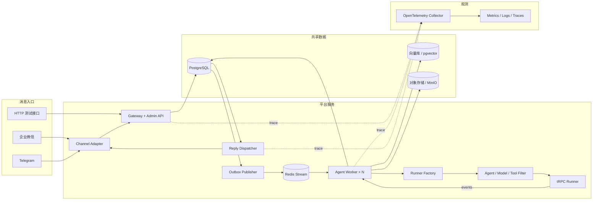
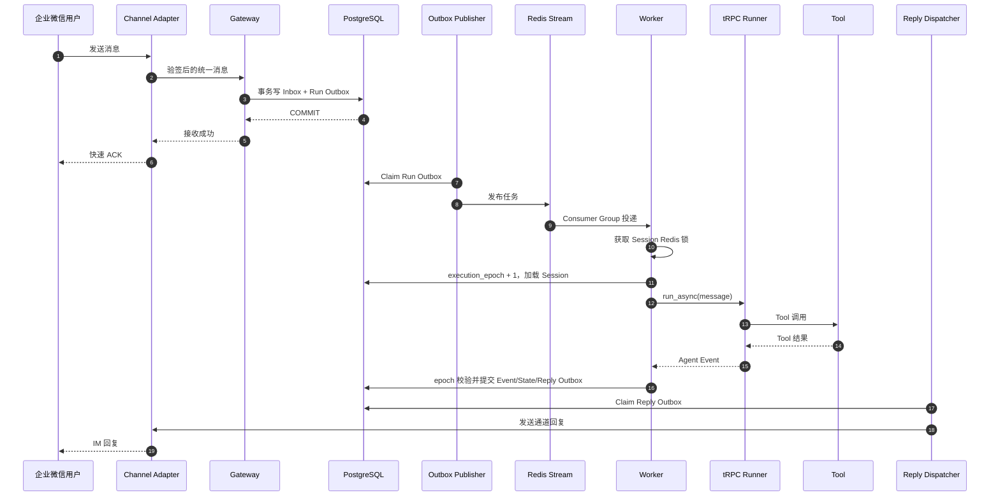

# 基于 tRPC-Agent-Python 的多租户 Agent 平台设计（小规模真实可运行版）

> 适用项目：`trpc-agent-service`
> 目标：完成题目要求，并让第一次接触 Agent 平台的开发者能够分阶段实现

## 1. 先说结论

这个项目不需要重新开发 Agent 框架。`trpc-agent-python` 已经提供 Model、Agent、Runner、Tool、Session、Memory、Filter、Telemetry 和企业微信/Telegram 通道，我们需要做的是在它外面增加多租户和服务化能力。

最终代码提交实现一条真实闭环：

```text
真实企业微信 / Telegram / HTTP → Gateway → InlineExecutionBus 或 RedisExecutionBus
→ AgentExecutionService → 真实 tRPC Runner + ModelFactory
→ 外部 RealModel → Tool
→ SQLite/Redis Session / Memory + SQLite/PostgreSQL 事实数据 → 真实 IM 回复
```

单元测试允许使用 TestModel 和 TestSender，但它们不能成为开发、部署或最终演示的默认配置。

当前还提供一条简化但可运行的多副本路径：

```text
IM 用户 → Gateway → SQL Execution Outbox → Redis Stream
       → 无状态 Worker → tRPC Runner → SQL Session
       → Redis 临时结果队列 → Gateway / Channel 回复
```

小规模部署使用 SQLite 唯一键和 `version` 乐观锁。多副本部署使用 PostgreSQL 共享事实、
Redis Stream Consumer Group、SQL Execution Outbox 和 owner-token 会话锁，不需要 sticky
session。完整 Inbox/Reply Outbox、`execution_epoch`、锁续租和跨地域接管仍保留为演进设计。

早期原型提供了配置模型、存储适配器、IM Adapter、Filter、限流、监控和部署清单等参考
方向。本仓库不依赖或链接仓库外代码；下文区分“复用 tRPC-Agent SDK 的能力”和“平台新增
逻辑”。

### 1.1 交付策略

题目明确写了“以架构设计为主，不要求实现完整系统”。因此交付分成两类：

- **必须实现的代码**：两个租户、真实 tRPC Runner、外部 RealModel、真实企业微信与 Telegram、SQLite 持久化、Filter、幂等、审计和测试。
- **额外落地的部署能力**：PostgreSQL 事实库、SQL Execution Outbox、Redis Stream、多 Worker、
  owner-token 锁、生产 HTTP 租户 API Key 和简化 Kubernetes 清单。
- **只需完整设计的能力**：完整 Inbox/Reply Outbox、在线迁移、灰度、跨地域容灾、KMS、
  向量/对象存储集群和 OTLP Collector 集群。

当前没有模型 API Token 不影响前期开发；TestModel 只用于自动化测试。获得凭据后，开发调试、集成测试和最终演示必须使用外部 RealModel。`APP_ENV` 不是 `test` 时，如果仍配置 TestModel、TestSender 或缺少必要 Secret，服务必须拒绝启动。

### 1.2 对早期参考原型的判断与取舍

| 模块 | 当前参考实现 | 本方案处理方式 |
| --- | --- | --- |
| 项目结构、Pydantic 配置模型 | 结构清晰，覆盖主要领域 | 保留思路并补充配置版本、Secret 引用 |
| Storage Adapter/Factory | 有 InMemory、Redis、SQL 和迁移示例 | 复用接口思想；SQL 作为事实源，补唯一约束和原子版本更新 |
| 企业微信、微信客服、Telegram | 有统一 Adapter 和本地模拟逻辑 | 完成企业微信与 Telegram 的真实验签、解析和发送；模拟发送仅用于单测 |
| AgentRunner | 是规则判断和固定文本，不是 tRPC Runner | 必须改为 `LlmAgent + Runner`，这是题目核心 |
| Gateway/Worker | `BackgroundTasks` 执行；Compose 中所谓 Worker 仍启动同一个 Web App | 同时实现进程内 Bus 和 Redis Stream Bus，Gateway 与 Worker 可独立扩容 |
| 租户识别 | URL/Header 直接传入 `tenant_id` | IM 必须由已验签的 Channel Binding 反查租户；HTTP 使用认证身份 |
| 幂等与并发 | Redis TTL 去重、无 owner 的短锁、非原子版本检查 | 单节点使用唯一键/乐观锁；多副本使用 Redis owner-token 锁和 Stream ACK/重试 |
| 租户配置 | 全局内存字典 | 租户、Binding、Session、Memory、Summary、Knowledge、Artifact 元数据和 Audit 落 SQLite |
| KMS、限流、熔断、灰度、沙箱、监控 | 有可测试骨架 | 已实现入口权限/长度/单机限流、脱敏工具、基础 OTel/Prometheus 和 trace_id；KMS、熔断、灰度、沙箱仍为设计 |
| 部署与测试 | 有 Compose/K8s 和单元/E2E 示例 | 已实现单服务 Compose、多 Worker Compose 和简化 K8s 清单并完成 kind 冒烟测试 |

结论：本仓库直接依赖已发布的 tRPC-Agent-Python SDK，并在其外层完成真实模型、真实 IM、
租户解析、SQLite/Redis 存储、幂等和基础治理闭环，并增加可本地验证的简化多副本基础设施；
它不是跨地域高可用平台。

## 2. 用通俗语言认识系统

| 名词 | 含义 |
| --- | --- |
| Tenant | 一家公司或一个需要独立管理的部门 |
| Agent App | 某个租户配置的机器人 |
| Session | 一段需要保留上下文的对话 |
| Gateway | 接收 HTTP/IM 消息、识别租户、把消息落库 |
| Worker | 调用模型和工具的后台进程 |
| Inbox | 已收到的消息记录，用于防止重复处理 |
| Outbox | 已提交但尚未发送的任务或回复 |
| Channel Adapter | 企业微信、Telegram 等协议与平台消息之间的转换器 |
| Filter | 模型、Agent 或 Tool 调用前后的安全检查 |
| execution_epoch | Session 每次被 Worker 接管时递增的版本号，用来拒绝旧 Worker 的结果 |

## 3. tRPC-Agent-Python 怎么运行

框架要求 Python 3.10+，推荐 Python 3.12。没有 API Token 时先验证本地 SDK 可以导入：

```sh
cd /path/to/trpc-agent-service
sh bootstrap.sh
uv run --frozen python -c "import trpc_agent_sdk; print('tRPC-Agent SDK OK')"
```

官方 Quickstart 需要模型 Token，可以等内网具备凭据后再运行。本项目正常开发和最终演示使用 `MODEL_PROVIDER=openai`（或公司兼容的 Provider）；自动化单测通过依赖注入替换成 TestModel，不把测试 Provider 写入正式部署配置。

```env
# 开发、集成测试和最终演示
APP_ENV=development
MODEL_PROVIDER=openai
MODEL_API_KEY_REF=env://TRPC_AGENT_API_KEY
MODEL_BASE_URL=https://model.example.com/v1
MODEL_NAME=your-model
```

pytest 使用专用 fixture 注入 TestModel；`APP_ENV=development|production` 时，配置加载器禁止选择测试模型并校验 API Key 引用可解析。

| 环境 | Model/Channel | 存储 | 用途 |
| --- | --- | --- | --- |
| `test` | TestModel、TestSender | 临时 SQLite/InMemory | 快速、确定的自动化测试 |
| `development` | 外部 RealModel、真实 IM Adapter | SQLite | 日常开发和联调 |
| `production` | 外部 RealModel、真实 IM Adapter、严格验签 | SQLite 数据卷 | 本题最终小规模部署与演示 |

测试环境的替身通过 pytest fixture 注入，不允许写进 `development/production` 配置文件。

框架核心代码只有四步：

```python
model = OpenAIModel(...)
agent = LlmAgent(name="assistant", model=model, tools=[...])
session_service = SqlSessionService(db_url=...)
runner = Runner(app_name="tenant:app", agent=agent, session_service=session_service)

async for event in runner.run_async(
    user_id=user_id,
    session_id=session_id,
    new_message=message,
):
    ...
```

参考资料：

- [tRPC-Agent-Python 中文 README](https://github.com/trpc-group/trpc-agent-python/blob/main/README.zh_CN.md)
- [Quickstart](https://github.com/trpc-group/trpc-agent-python/tree/main/examples/quickstart)
- [FastAPI 示例](https://github.com/trpc-group/trpc-agent-python/tree/main/examples/fastapi_server)
- [Redis Session 示例](https://github.com/trpc-group/trpc-agent-python/tree/main/examples/session_service_with_redis)
- [SQL Session 示例](https://github.com/trpc-group/trpc-agent-python/tree/main/examples/session_service_with_sql)
- [Filter 说明](https://github.com/trpc-group/trpc-agent-python/blob/main/docs/mkdocs/zh/filter.md)

## 4. 交付范围和边界

### 4.1 必须实现并测试的代码

- 两个租户、每个租户一个 Agent App。
- FastAPI `/health`、`/metrics`、`/v1/chat`、两个 webhook 和基础 Admin CRUD。
- 真正调用 tRPC-Agent-Python 的 `LlmAgent + Runner + RealModel`；TestModel 仅用于单元测试。
- SQLite Storage Adapter 真实保存配置、Event、Summary、Knowledge、Artifact 元数据和 Audit；Session/Memory 可按租户选 SQLite 或 Redis，InMemory 仅用于单元测试。
- 企业微信和 Telegram 两种 Channel Adapter，完成真实回调验签、消息解析和发送 API。
- 工具白名单、IM 用户权限/长度/单机限流、敏感信息脱敏工具、审计、OpenTelemetry SDK
  核心 span、Prometheus 基础指标和 trace_id。
- SQLite 唯一键消息去重和 Session `version` 乐观锁。
- `ExecutionBus` 与 `AgentExecutionService` 分层，代码不把 Runner 写死在 HTTP 路由里。
- 单测覆盖健康检查、Runner、Tool、租户隔离、Session 多轮、IM 去重、工具权限、审计和脱敏。

### 4.2 只需在设计中完整说明

- 完整 Inbox/Reply Outbox 事务和 `execution_epoch` 防陈旧提交方案。
- Redis Memory、向量 Knowledge、对象存储及外部 Memory 的统一接口和迁移策略。
- Reply Outbox、重试、DLQ、OTel Collector 集群、灰度、回滚和容量估算。
- 托管/高可用 PostgreSQL、Redis 和完整 Kubernetes 发布门禁。

### 4.3 本次不实现的大规模基础设施

- 微信客服第三通道、管理后台页面和复杂多 Agent 编排。
- 向量库/MinIO/KMS/OTel Collector 集群。
- 自动迁移平台、自动灰度平台、跨地域灾备和完整 Kubernetes 发布门禁。

这些能力不在代码中伪装成“已完成”，README 必须明确列为大规模演进项。外部 RealModel、企业微信和 Telegram 不在此排除范围内，最终必须真实联调。

### 4.4 与题目要求的对应关系

| 题目要求 | 本次代码证明 | 文档补充设计 |
| --- | --- | --- |
| 多租户与节点部署 | 两租户隔离、Redis Stream、多 Worker、无 sticky session | 跨地域接管和更细调度 |
| 数据同步与多后端 | SQLite、Memory/Summary、唯一键、乐观锁和本地 Artifact | Redis/远程 SQL/向量/对象存储、迁移和同步顺序 |
| 至少两种 IM | 企业微信与 Telegram 真实收发和端到端联调 | 大规模限流、队列化回复和多账号扩容 |
| 治理、监控、安全 | 工具白名单、脱敏、OTel SDK span、Prometheus、trace_id、审计 | Collector 集群、KMS、预算和完整审批流程 |
| 故障恢复与运维 | 模型/Tool 异常、Worker 重试/死信、Outbox、K8s | 自动灰度、人工重放平台和跨地域容灾 |
| GitHub 实现代码 | 小规模真实运行链路、外部集成和自动化测试 | README 明确部署依赖、已实现与演进项 |

## 5. 系统架构



### 5.1 组件职责

| 组件 | 职责 |
| --- | --- |
| Gateway | 验签、识别 Channel Binding、生成 Session ID、限流，并事务写 Inbox 与任务 Outbox |
| Admin API | 创建租户、Agent App、通道绑定和配置版本；首版可与 Gateway 同进程 |
| Outbox Publisher | 把 SQL 中待处理任务发布到 Redis Stream；失败可以重试 |
| Worker | 获取 Session 锁和 epoch，创建 Runner，执行一轮 Agent |
| Runner Factory | 根据租户配置组装 Model、Tools、Filters、Session 和 Memory |
| Reply Dispatcher | 从回复 Outbox 读取结果并发回 IM，失败重试 |
| Telemetry | 连接 Gateway、Runner、模型、Tool、存储和 IM 回复的 trace |

为了让精简代码与生产架构保持一致，Gateway 不直接调用 Runner，而是依赖 `ExecutionBus`：

```python
class ExecutionBus(Protocol):
    async def submit(self, command: RunAgentCommand) -> str: ...


class InlineExecutionBus:  # 本次实现：同进程调用，方便调试
    ...


class RedisStreamExecutionBus:  # 生产设计：跨进程、多 Worker
    ...
```

`AgentExecutionService` 负责真正的执行逻辑。当前同时实现 `InlineExecutionBus` 和基于
Redis Stream 的跨进程执行路径，部署时通过环境变量切换，不需要重写 Agent。

## 6. 多租户和 Session 路由

租户配置使用带版本的 JSON/YAML：

```yaml
tenant_id: tenant_a
app_id: customer_service
version: 1
model:
  provider: openai
  model_name: model-x
  api_key_ref: env://TENANT_A_MODEL_KEY
tools:
  allow: [weather.query, ticket.create]
channels:
  - type: wecom
    account_id: bot-a
storage:
  session: sql
  memory: redis
  knowledge: pgvector
audit:
  retain_days: 180
  capture_content: false
```

租户不能由未认证请求中的 `tenant_id` 决定。Gateway 必须根据 `(channel_type, external_account_id)` 查询 Channel Binding，得到真正的 tenant 和 app。普通 HTTP 接口则从 API Key/JWT 映射租户；开发环境可以显式启用 `X-Tenant-ID`，但不得作为生产默认行为。

Session ID 使用稳定 HMAC，避免泄露原始用户 ID：

- 单聊：`HMAC(tenant | app | channel | account | user)`。
- 群聊：`HMAC(tenant | app | channel | account | group | thread)`。
- 群内用户长期 Memory 仍按独立 `principal_id` 查询，不能把个人记忆暴露给群成员。

`app_name`、`user_id`、缓存键和数据库查询都必须包含租户作用域，例如 `tenant_a:customer_service`。所有业务表包含 `tenant_id`，生产 SQL 可增加 Row-Level Security。

## 7. 同 Session 并发与幂等

不使用 sticky session。任何 Worker 都可以处理任何 Session，因为状态在共享 PostgreSQL/Redis 中。

精简代码实现数据库唯一键和 `version` 乐观锁：保存时执行 `UPDATE session SET version=version+1 WHERE session_id=? AND version=?`，只有影响一行才算成功。注意“先读取 version、再无条件写回”不是真正的乐观锁。

当前多节点代码已增加 Redis owner-token 锁、Execution Outbox、Stream Consumer Group 和有限
重试；完整目标方案还增加 `execution_epoch`。完整步骤如下，其中已落地的是 1、3、4、5、7
以及简化的结果返回：

1. Gateway 验签并查 Binding。
2. SQL 事务锁定 Session 行，为消息分配递增 `session_sequence`，再插入 Inbox；唯一键为 `(tenant_id, binding_id, external_message_id)`。
3. 同一事务插入 `agent.run.requested` Outbox，随后立即向 IM 返回 ACK。
4. Publisher 将 Outbox 发布到 Redis Stream。
5. Worker 获取 `lock:{tenant}:{session}`。锁使用 `SET NX PX`，值是随机 owner token，并定时续租；释放时用 Lua 校验 owner。
6. Worker 在 SQL 中确认该消息是 `resolved_sequence + 1`，再将 `execution_epoch` 加一并记住本次 epoch；提前到达的乱序消息稍后重试。
7. Worker 调用真正的 tRPC Runner。本轮非 partial Event 先写入 `TurnBufferSessionService`，流式片段只用于展示。
8. 完成后，SQL 事务执行 `UPDATE ... WHERE execution_epoch=:my_epoch`，一起提交 Event、State、Audit、Inbox 状态和 Reply Outbox，并推进 `resolved_sequence`。
9. 如果更新行数为 0，说明 Worker 已过期，其结果不能发送。
10. Reply Dispatcher 幂等发送回复；成功后标记完成，失败指数退避并最终进入 DLQ。

`InlineExecutionBus` 用于单进程调试；`RedisExecutionBus` 会先写 SQL Execution Outbox，再发布
Stream 并等待 Worker 的短期结果键。Worker 使用 owner-token 锁，失败时重投，超过次数标记
`dead_letter`。当前没有把 Event、State、Audit 和 Reply 合并成一个 Mailbox 事务，也没有实现
`execution_epoch`，因此不能把它描述为完整的 exactly-once 系统。

## 8. 核心时序



Channel Adapter 创建 `trace_id`，并放入 SQL、Redis 消息 metadata 和 tRPC `AgentContext`。平台补充 `im.receive`、`tenant.resolve`、`outbox.publish`、`session.load/commit`、`im.send` span；tRPC 已提供 Runner、Agent、模型和 Tool span。

## 9. 数据模型

生产设计使用以下十张核心表：

| 表 | 关键字段与约束 |
| --- | --- |
| `tenant` | `tenant_id PK, name, status, audit_policy` |
| `agent_app` | `tenant_id, app_id, active_config_version, config_json` |
| `channel_binding` | `tenant_id, binding_id, channel_type, account_id, secret_ref`；`channel_type+account_id` 唯一 |
| `inbound_message` | `inbound_id, tenant_id, binding_id, external_message_id, session_id, session_sequence, status, payload`；外部消息唯一，Session 内 sequence 唯一 |
| `session` | `tenant_id, app_id, session_id, principal_id, state, accepted_sequence, resolved_sequence, execution_epoch, last_event_seq` |
| `session_event` | `tenant_id, session_id, seq, event_id, type, payload, trace_id`；`session_id+seq` 唯一 |
| `memory` | `tenant_id, memory_id, principal_id, content, source_event_id, vector_ref, metadata`；`source_event_id` 唯一 |
| `summary` | `tenant_id, summary_id, session_id, content, source_end_seq, version` |
| `outbox_event` | `outbox_id, tenant_id, type, aggregate_id, payload, status, retry_count` |
| `audit_log` | `tenant_id, channel, user_id, session_id, agent_name, tool_name, decision, latency, error_type, cost, trace_id` |

实体关系为：Tenant 具有多个 Agent App 和 Channel Binding；Agent App 具有多个 Session；Session 具有多个 Inbound、Event、Summary 和 Outbox；Memory 归属于租户内的用户主体，并通过来源 Event 与会话关联。

小规模代码在 SQLite 中真正建立 `tenant`、`agent_app`、`channel_binding`、`inbound_message`、
`session`、`session_event`、`memory`、`summary`、`knowledge`、`artifact`、`execution_outbox` 和
`audit_log` 十二张表。
Artifact 内容保存到租户隔离的本地目录，路径、大小和 SHA-256 经过校验，元数据写入 SQLite；
`outbox_event` 只保留生产设计，本次单进程运行不启用发布器。

## 10. 多后端存储与同步

| 后端 | 存什么 | 一致性 | 延迟、成本与运维 |
| --- | --- | --- | --- |
| InMemory | 单元测试 Session/Memory | 仅单进程 | 快且确定，但重启丢失，不用于正式运行 |
| PostgreSQL | 租户配置、Inbox/Outbox、Session、Event、Audit | 强一致，默认生产后端 | 延迟中等；事务可靠，需备份和连接池 |
| Redis | Stream、Session 锁、限流、缓存；可选 Redis Memory | 低延迟，数据允许重建 | 延迟低、内存成本较高，生产需持久化/高可用 |
| 向量库/pgvector | Knowledge embedding、长期 Memory 检索索引 | 最终一致，强制 tenant filter | 专用库检索强但运维较多；小规模优先 pgvector |
| 对象存储 | 图片、文件、Artifact、知识库原文 | 元数据提交后可见 | 单价低、吞吐高，不适合频繁小记录更新 |
| 外部 Memory | Mem0/Mempalace 等 | 取决于服务，一般最终一致 | 接入快，但增加外部费用、网络和供应商依赖 |

统一边界包括 tRPC `SessionService`、`MemoryStore`、`SummaryStore`、`KnowledgeStore`、
`ArtifactStore` 和 `AuditStore`，由 `TenantStorageRouter` 根据租户配置或小规模部署策略创建。
当前 Session/Memory 可选 SQLite/Redis，Knowledge 使用 SQLite 文本检索，Artifact 使用租户隔离
本地目录；生产关键事实仍写 SQL，不能把审计和幂等事实只放在向量库或内存中。

Session 接口不能绕开 tRPC 再自创一套互不相干的会话。正式运行使用框架的 `SqlSessionService`；`InMemorySessionService` 仅用于单元测试。生产演进可实现兼容 `SessionServiceABC` 的 `PlatformSessionService`，内部委托给 `SessionStore`，并用 TurnBuffer 将本轮 Event 纳入平台 SQL 事务。这样 Runner 看到的历史和平台审计的历史来自同一事实源。

当前单节点更新顺序为：先提交 Event 和 Session State，再同步写 Memory 和 Summary，最后返回
回复。Summary 保存 `source_end_sequence` 与递增版本；Memory 使用 `source_event_id` 唯一，且
写入 metadata 的 `visibility=principal`。生产多节点版本改为 Event/State/Outbox 原子提交后异步
投影，投影完成后发布缓存失效事件；目标可见延迟 5 秒，超时告警。

迁移采用：全量复制 → 双写 → 数量/hash 校验 → 少量租户切读 → 全量切换 → 保留旧库观察 → 清理。副后端写失败进入 Outbox 重试，不假装两个不同数据库能共同原子提交。

## 11. IM Channel Adapter

本次选择企业微信和 Telegram，因为 tRPC-Agent 生态已有相关协议和 SDK 能力，复用成本较低。
两种通道均已完成真实文本收发；模拟 Runner 和 Sender 只通过依赖注入用于自动化测试，不能
作为外部联调验收结果。微信客服第三通道不在本次范围内。

统一输入包含 `message_id/channel/account_id/chat_type/chat_id/sender_id/timestamp/content`，统一输出包含 `text/chunks/card/media/reply_to`。Adapter 只负责协议转换，不直接创建 Agent。

| 项目 | 企业微信 | Telegram |
| --- | --- | --- |
| 凭据 | corp_id、agent_id、secret、callback token、encoding AES key | bot token、Webhook secret |
| 回复 | 支持流式 reply，但首版建议只发最终结果 | `sendMessage`，长文本分片，注意 Markdown 转义 |
| 身份 | 企业、成员、群 ID 都要加账号命名空间 | user、chat、thread ID 分开映射 |
| 限制 | 回调时限、媒体下载、卡片能力 | flood control、文件大小、编辑/撤回限制 |

当前企业微信实现包含 access token 获取/刷新、回调验签、AES 解密和文本发送 API，也支持
AIBot WebSocket 主动连接；Telegram 包含 webhook secret 校验、Bot API 文本发送、长文本分片
和 `Retry-After` 有限重试。尚未覆盖企业微信全部错误码分类、Telegram Markdown 模式和通用
持久化重试。跳过验签只允许出现在 pytest 注入的测试 Adapter 中，开发和部署环境一律
fail-closed。

当前 IM Adapter 只接收文本；本地 ArtifactStore 已实现租户路径隔离、大小限制和 SHA-256
校验。后续加入图片或文件消息时，必须先保存到该接口并只把受控引用或提取文本交给 Agent；
大规模部署再替换对象存储。IM 重复投递由 SQLite 唯一键处理；小规模部署直接发送并持久化
发送状态，生产演进再替换为 Reply Outbox。

事件转换规则保持简单：partial text 可选地转成“处理中”更新；Tool call/result 默认只写审计，也可转成状态卡片；final Event 转成最终文本或卡片；错误 Event 转成统一失败提示。首版建议关闭 IM 流式进度，只发送最终回复，避免 Worker 重试时用户看到重复片段。

最终联调必须提供一条可由 IM 平台访问的 HTTPS callback，并分别保存以下证据：企业微信回调 URL 验证成功、真实用户消息及机器人回复、Telegram webhook 注册成功、真实用户消息及机器人回复，以及对应的 `trace_id`/审计记录。凭据只通过 Secret 引用加载，不写入截图、日志或仓库。

## 12. 治理、监控和安全

Filter 分工：

- AgentFilter：租户状态、IM 用户权限、预算和输入长度。
- ModelFilter：模型白名单、token 上限、超时、敏感信息脱敏。
- ToolFilter：工具白名单、参数校验；删除、退款、执行代码等危险工具要求二次确认。

监控指标至少包括请求量、Redis backlog、Agent/模型/Tool 延迟、错误率、token 与租户成本、Session 存储延迟、epoch 冲突数、IM 回复成功率、Outbox 重试和 DLQ 数量。

小规模实现接入 OpenTelemetry SDK 和 Prometheus：Channel 处理、Runner、Memory 和 Summary
写入创建 span，并通过 `/metrics` 暴露请求量、Agent 执行结果/延迟、Tool 事件、存储操作及
IM 发送结果。开发环境可启用 `ConsoleSpanExporter`；OTLP Exporter/Collector、模型 token、
租户成本、Redis backlog、epoch 和 Outbox/DLQ 指标尚未实现，不能伪造数值；Outbox/DLQ
状态本身已经持久化。

数据库只保存 `env://`、`file://` 或 Vault Secret 引用，不保存明文 Key。日志和 trace 禁止记录 Authorization、IM secret、数据库密码和原始敏感内容；OpenTelemetry Collector 再进行一次脱敏。

## 13. 故障恢复与部署

- Worker 崩溃：Redis 锁到期，pending 消息由 Consumer Group reclaim；新 Worker 获得更大的 epoch。
- Redis 不可用：消息已在 SQL Inbox/Outbox 中，恢复后重新发布；积压过大时 Gateway 限流。
- SQL 不可用：Gateway 不返回成功 ACK，依赖 IM 重试；Worker 不确认任务。
- 模型超时：当前有可配置硬超时并持久化失败事件/审计；生产版再增加仅限未输出内容的有限
  重试和备用模型，已经输出内容后不自动切模型重放。
- Tool 失败：设置超时与熔断；有副作用 Tool 使用业务幂等键。
- IM 回复失败：Outbox 指数退避，超过阈值进 DLQ，支持人工重放。
- 配置错误：配置带版本，发布前校验；按租户回滚到上一个版本。

灰度发布按 `tenant_id` 或 `app_id` 白名单选择新版本，先让少量测试租户使用；每次执行固定 `config_version`，本轮中途不热切换。若错误率、延迟或成本异常，Admin API 将这些租户的 active version 指回旧版本。

容量估算不猜固定数字，而是压测后代入：

```text
Worker 数 ≈ 峰值请求/秒 × 平均执行秒数 ÷ 单 Worker 安全并发 × 1.3
SQL 写 QPS ≈ 请求/秒 × 每轮 Event 数 + Inbox/Outbox/Audit 写入
Redis QPS ≈ 请求/秒 ×（Stream 发布、读取、ACK、锁和续租次数）
```

最小部署仍是一个应用容器和 SQLite 数据卷，使用 InlineExecutionBus。简化多副本部署已提供
PostgreSQL、Redis、独立 Gateway/Worker 的 Compose 与 Kubernetes 清单；K8s 默认运行 2 个
Gateway 和 2 个 Worker，并已在本地 kind 验证健康检查。PostgreSQL/Redis 在样例中是单实例，
正式高可用环境应替换为托管服务；OTel Collector 仍需另行部署。

## 14. tRPC 复用与新增代码

| 直接复用 tRPC-Agent-Python | 平台需要新增 |
| --- | --- |
| LlmAgent、Runner、Event、多 Agent 编排 | TenantContext、Channel Binding、配置版本 |
| OpenAI/Anthropic/LiteLLM Model | TenantRunnerFactory、模型密钥注入 |
| FunctionTool、MCP、Skills | 租户工具白名单和危险工具确认 |
| Session/Memory 基类及 Redis/SQL 实现 | Session 锁、execution_epoch、TurnBuffer |
| Knowledge、Artifact、CodeExecutor | 租户后端路由和数据隔离 |
| Agent/Model/Tool Filter | 策略配置、预算和审计落库 |
| OpenTelemetry span、FastAPI 示例 | Gateway、Inbox/Outbox、队列与 IM span |
| OpenClaw 企业微信/Telegram | 账号与租户绑定、统一消息和回复重试 |

### 14.1 当前仓库的精简落地映射

当前仓库不依赖外部源码目录，下面按实际文件列出已落地能力及仍保留为设计的边界：

| 目标模块 | 参考位置 | 动作 |
| --- | --- | --- |
| 配置与领域对象 | `config/models.py`、`config/settings.py` | 已实现租户存储配置、App 活跃配置版本字段和 Secret 引用；版本历史/回滚 API 未实现 |
| 租户上下文 | `tenant/context.py`、`tenant/session_id.py` | 已实现 `ContextVar`、租户作用域 HMAC Session ID 和生产租户 API Key 映射 |
| Agent 执行 | `agent/runtime.py`、`agent/execution.py` | 已实际创建 tRPC `LlmAgent`、`Runner`、`Content`，并持久化 Event/State/Memory/Summary/Audit |
| 存储抽象 | `storage/contracts.py`、`storage/router.py` | 已实现租户路由以及 Memory/Summary/Knowledge/Artifact/Audit 边界；远程后端继续按接口扩展 |
| SQL 存储 | `storage/models.py`、`storage/repositories.py` | SQLite/PostgreSQL 保存业务事实和 Execution Outbox，包含租户复合键、消息唯一约束和原子 `version` 更新 |
| Redis 存储 | `storage/redis_adapter.py`、`storage/lock.py` | 已实现租户 Session/Memory、Stream 请求/响应和 owner-token 会话锁；锁续租与失效广播未实现 |
| IM 通道 | `channels/*` | 已实现企业微信/Telegram 真实鉴权、解析和文本发送；测试替身仅通过依赖注入进入单测 |
| Web 入口 | `web/app.py` | Binding 反查 IM 租户；production HTTP 使用租户 API Key；readiness 检查 SQL 与队列 |
| Worker | `worker/runtime.py`、`worker/redis_runtime.py`、`bus/*` | 已实现独立 Redis Consumer Group Worker、有限重试、死信状态与取消安全 ACK |
| 治理与运维 | `governance.py`、`metrics/*`、`telemetry.py` | 已实现工具白名单、IM 权限/长度/单机限流、脱敏工具、审计、基础指标和核心 span；预算/审批/熔断/灰度未实现 |
| 部署 | `Dockerfile`、`compose*.yaml`、`deploy/k8s/*` | 已实现单服务、独立多 Worker 和 2 Gateway/2 Worker K8s 部署；样例数据服务为单实例 |

依赖已经在 `pyproject.toml` 声明并由 `uv.lock` 锁定，包括兼容范围内的 PyPI
`trpc-agent-py`、FastAPI、SQLAlchemy/aiosqlite、Redis、HTTP 客户端、企业微信 SDK、
OpenTelemetry、PostgreSQL asyncpg 和测试依赖。因此 GitHub 只提交本服务仓库即可独立安装；
向量库和对象存储驱动在对应代码路径落地时再加入。

## 15. 主要风险

| 风险 | 缓解方法 |
| --- | --- |
| 同一 Session 被两个 Worker 处理 | Redis owner lock + SQL execution_epoch |
| IM 重复消息 | SQL Inbox 唯一键 |
| Gateway 落库后发队列失败 | 事务 Outbox + Publisher 重试 |
| Worker 提交后 ACK 前崩溃 | Inbox 状态和 Event 唯一键保证重放幂等 |
| 跨租户读取 | 所有 key/查询带 tenant，SQL RLS，隔离测试 |
| 向量检索串租户 | 服务端强制 tenant filter |
| 密钥或正文泄露 | Secret 引用、日志/trace 双重脱敏 |
| Tool 重试产生重复副作用 | 业务幂等键、执行台账、人工确认 |
| 模型超时和费用失控 | deadline、备用模型、token/费用预算 |
| Summary/Memory 乱序 | source_end_seq 与 source_event_id 幂等 |
| IM 限流或发送失败 | 分片、Retry-After、Outbox、DLQ |
| Redis/SQL 故障 | SQL 事实源、Redis 可重建、多副本和恢复演练 |

## 16. 预期效果

- 多个租户可以使用同一套服务，但配置、Session、Memory、工具和审计互相隔离。
- Worker 可以水平扩容，不需要 sticky session。
- IM 重投不会创建重复会话事件或重复逻辑回复。
- Redis、SQL、向量库和对象存储职责明确，可按租户选择 Memory/Knowledge/Artifact 后端。
- 同一 `trace_id` 可以查询 IM 接入、Runner、模型、Tool、存储和回复链路。
- 首版代码规模可控，同时保留升级 PostgreSQL Mailbox 和完整 Kubernetes 架构的接口。

## 17. 初学者实施步骤

不要一次实现整张生产架构图。下面七步全部属于本次提交，每一步先通过测试再继续。当前七步
均已完成；只有真实外部验收需要模型和 IM 凭据，自动化测试不需要。

### 第 1 步：准备环境与工程骨架（已完成）

通过跨平台 `uv` 项目环境管理依赖；创建 `pyproject.toml`、CLI、FastAPI 应用和 pytest 骨架，并从 PyPI 安装版本范围锁定的 `trpc-agent-py`。服务仓库不依赖外部源码目录或固定 Conda 环境。

```sh
cd /path/to/trpc-agent-service
sh bootstrap.sh
uv run --frozen python -c "import trpc_agent_sdk; print('SDK OK')"
```

完成标准：SDK 和服务包均从本地目标路径导入，`/health` 返回 200，测试命令可运行；不要求 API Token。

### 第 2 步：建立分环境安全配置（已完成）

实现 test、development、production 三种环境及 Secret 引用。测试环境允许测试 Provider；开发和生产环境必须配置真实模型 Provider、HTTPS Base URL 和 Secret 引用，选择 test/fake/mock Provider 或缺少必需 Secret 时拒绝启动。

完成标准：配置测试覆盖合法配置、非法 URL、非法 Secret 引用以及非测试环境 fail-closed 行为；正式配置不保存明文密钥。

### 第 3 步：建立 SQLite 数据模型（已完成）

使用 SQLAlchemy Async 和 aiosqlite 建立 Tenant、AgentApp、ChannelBinding、InboundMessage、
Session、SessionEvent、Memory、Summary、Knowledge、Artifact、ExecutionOutbox、AuditLog
十二张业务表。租户数据
带 `tenant_id`，关键实体使用租户复合唯一约束，外部消息使用唯一键支持去重。

完成标准：CLI 能真实创建 SQLite 文件和十二张表；数据结构覆盖租户、应用、通道绑定、会话、
事件、记忆、摘要、知识、产物和审计。

### 第 4 步：实现 Repository、幂等和就绪检查（已完成）

实现十二张业务表的异步 Repository；重复外部消息返回已有记录，Session 使用 `version` 条件
更新处理并发冲突。FastAPI 生命周期负责建库和释放连接，`/ready` 实际检查数据库和执行队列。

完成标准：Repository 测试覆盖 CRUD、租户作用域、消息幂等和乐观锁；`/health`、`/ready` 均返回 200；格式、Lint、编译和单元测试全部通过。

### 第 5 步：接入真实 tRPC Runner、多租户路由和 Tool（2～3 天）

实现 `ModelFactory` 和 `TenantRunnerFactory`，正式配置创建 RealModel，再组装 tRPC `LlmAgent`、`Runner`、SessionService、Filters 和 calculator Tool。增加 TenantContext、Binding 查询、稳定 Session ID、带管理认证的基础 Admin API，以及 `/v1/chat`。单元测试可注入 TestModel，但正式配置和最终联调必须使用真实外部模型。

完成标准：源码实际调用 `trpc_agent_sdk.runners.Runner`；真实模型能回答普通问题并触发 calculator Tool；两个租户使用相同用户和 Session 标识仍保持隔离；HTTP 路由中没有硬编码回复。

### 第 6 步：真实接入企业微信、Telegram 和基础治理（2～3 天）

实现企业微信真实验签、AES 解密、Token 刷新和消息发送，以及 Telegram webhook secret 校验、Bot API 发送和限流处理。Webhook 通过 `account_id/bot_id` 反查 Binding。补充工具白名单、输入长度限制、敏感字段脱敏、trace_id、审计、统一错误和基础指标；样例报文、TestSender 只用于自动化测试。

完成标准：真实企业微信和 Telegram 用户都能收到 Agent 回复；验签失败被拒绝；重复 `message_id` 只执行一次；未授权 Tool 被拒绝；日志不泄露 Secret，并可按 trace_id 查询链路。

### 第 7 步：端到端测试、容器和交付（1～2 天）

补齐真实模型、Tool、Session、多租户、两种 IM、幂等、审计、脱敏和故障测试。添加单服务
Dockerfile/Compose，并额外实现 PostgreSQL + Redis Stream 多 Worker 与简化 Kubernetes 部署。
KMS、远程向量库、MinIO、OTel Collector 和完整发布平台仍只保留接口与设计。

完成标准：单元测试和真实模型集成测试通过；企业微信与 Telegram 端到端冒烟测试通过；新开发者只看 README 就能配置并运行。

推荐目录：

```text
trpc_service/
├── _cli.py
├── agent/          # ModelFactory、TenantRunnerFactory、执行服务
├── channels/       # 统一消息、企业微信、Telegram
├── config/         # 配置和 Secret 引用
├── tenant/         # 租户、Binding、Session ID
├── storage/        # SQLite/PostgreSQL、Redis 锁、本地 Artifact 和远程后端接口
├── bus/            # Inline 与 Redis Stream ExecutionBus
├── worker/         # 同进程 WorkerService 与独立 Redis Worker
├── filters/        # 安全、预算、工具权限
├── metrics/        # trace、基础指标、审计
└── web/            # FastAPI Gateway/Admin
```

## 18. 最终验收清单

### 18.1 代码验收

- 单元测试可通过 TestModel/TestSender 在无外部凭据时运行；测试替身不进入正式配置。
- 非测试环境缺模型或 IM Secret、选择测试 Provider、关闭验签时必须拒绝启动。
- `/health` 和 `/v1/chat` 正常，外部 RealModel 通过真正的 tRPC Runner 调用。
- 至少有一项真实模型问答和一项真实模型 Tool 调用集成测试通过。
- calculator Tool 通过框架调用，不在 HTTP 路由中模拟。
- 两个租户的配置、Session 和工具权限相互隔离。
- 基础 Admin API 可以真实创建和查询 Tenant、AgentApp、ChannelBinding，并有管理认证。
- 单服务可使用 SQLite；多副本使用 PostgreSQL 事实库和 Redis 队列，重启后关键事实保留。
- 企业微信与 Telegram 的协议单测、真实验签、真实发送和端到端冒烟测试均通过。
- 重复外部消息只产生一次逻辑执行，Session 使用原子乐观锁。
- 输入/身份/工具基础治理、OpenTelemetry 核心 span、Prometheus 基础指标、trace_id 和审计已
  验证，日志不泄露 Secret；预算、危险操作审批、token/成本指标属于明确的生产缺口。
- `ExecutionBus`、`WorkerService`、`AgentExecutionService` 已分层，同时支持进程内与 Redis
  Stream 跨进程执行。
- 自动化测试与外部集成测试全部通过，README 能指导安装、配置真实凭据、启动和验证。

### 18.2 设计验收

- 架构图包含 Gateway、Worker、Channel、Storage、Filter、Telemetry、数据库和 IM。
- 时序图覆盖接收、Tool、Session/Memory、回复和贯穿全链路的 trace_id。
- 数据模型分别包含 tenant、app、binding、session、event、memory、summary、audit。
- 企业微信与 Telegram 的验签、身份、长度、限流和重试差异有说明和测试。
- SQL、Redis、向量库、对象存储的职责和一致性取舍明确。
- 至少 8 项风险有缓解措施，本方案列出了 12 项。
- 文档明确 tRPC-Agent-Python 的复用点和平台新增模块。
- 多节点设计说明 Redis Stream、共享状态、分布式锁、Inbox/Outbox、无 sticky session 和故障恢复。
- 文档说明迁移、监控、灰度、回滚、容量评估、Compose 和 Kubernetes 推荐拓扑。

满足 18.1 与 18.2 即完成本题。真实模型、企业微信和 Telegram 已联调；Redis Stream、
多进程 Worker 和简化 Kubernetes 也已作为额外工程实现。KMS、远程向量库、MinIO、OTel
Collector、完整事务 Mailbox 和高可用数据服务不属于代码完成条件。

当前第 1～7 步的小规模运行链路均已完成，并已通过真实模型、calculator Tool、Telegram 和
企业微信 AIBot 验收；测试替身仅用于自动化测试。简化多副本链路已通过 Docker 集成测试和
本地 kind 的 2 Gateway + 2 Worker 冒烟测试；剩余高级生产能力仍需按本节边界表述。
