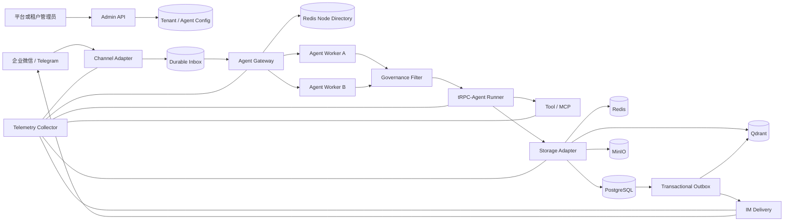
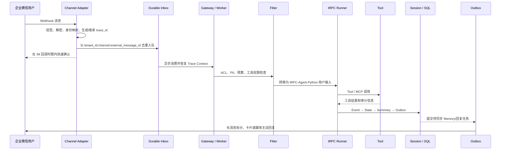

# 基于 tRPC-Agent-Python 的多租户节点化 Agent 平台方案与时间规划

> 规划周期：2026 年 8 月 21 日—9 月 11 日  
> 本文依据项目官方 `README.md` 编写，聚焦设计方案、重点技术、预期效果和阶段安排。

## 1. 项目概述

### 1.1 项目背景

企业落地 Agent 时，通常需要同时面向多个部门、业务线、IM 账号和数据后端。单体 Agent Demo
难以解决租户隔离、跨节点会话一致性、IM 回调时限、数据同步、权限治理、审计追踪和故障恢复等
生产问题。因此，本项目计划基于 tRPC-Agent-Python 设计一套多租户、可节点化部署、支持多后端
和多 IM 通道的 Agent 平台。

### 1.2 建设目标

1. 建立以 Tenant 和 Agent App 为核心的控制面，支持应用配置、模型配置、工具权限、IM 通道、
   数据后端和审计策略的租户级管理。
2. 建立 Gateway、Channel Adapter 和无状态 Agent Worker 组成的数据面，使节点能够水平扩展，
   并将消息路由到正确租户和 Session。
3. 为 Session、Event、Memory、Summary、Knowledge、Artifact 和 Audit Log 设计统一存储抽象及同步策略。
4. 接入至少两类 IM 通道，其中包含企业微信，并处理验签、身份映射、消息去重、异步回复和平台限制。
5. 建立治理、可观测性、安全和故障恢复方案，使完整消息链路可追踪、关键操作可审计、异常可恢复。

### 1.3 项目边界

项目以“可指导工程落地的架构设计和关键实现”为目标，不替代成熟的身份提供商、服务网格、数据库、
向量数据库和对象存储产品。OIDC Provider、Vault/KMS、PostgreSQL、Redis、Qdrant、MinIO 和
OpenTelemetry Collector 均作为可替换基础设施接入。

## 2. 总体设计思路

### 2.1 控制面与数据面分离

- 控制面由 Admin API 管理 Tenant、Agent App、配置版本、发布和回滚。
- 数据面由 Channel Adapter、Durable Inbox、Gateway、Worker、Storage Adapter 和异步 Outbox 组成。
- 运行节点只装配已发布配置，避免草稿修改直接影响线上请求。

### 2.2 无状态 Worker 与共享状态

Worker 不保存唯一业务状态，负载均衡层不要求 sticky session。Gateway 以
`tenant_id + agent_app_id + session_id` 作为路由键，将相同 Session 稳定映射到健康节点；最终
一致性不依赖路由稳定性，而由共享 Session/Memory 后端、同 Session 分布式锁、幂等键和 SQL
乐观锁共同保证。节点退出后，其他节点可以从共享后端恢复上下文并继续处理。

### 2.3 强一致与最终一致结合

Session Event、State、Summary 和 Outbox 记录在 SQL 事务中按固定顺序更新，核心会话事实采用强一致。
Memory/Knowledge 向量索引和 IM 主动回复通过 Transactional Outbox 异步同步，采用可重试的最终一致。
Artifact 写入对象存储后使用内容校验和确认完整性。

### 2.4 平台安全边界

所有配置和业务数据均携带 tenant 边界；模型 API Key、IM Token、数据库密码只保存 Secret Reference。
管理面使用 OIDC/RBAC，节点间使用内部认证和 mTLS，Runner 与 Tool 前后执行租户级治理 Filter，日志、
Trace 和错误报告统一执行字段白名单及敏感信息脱敏。

## 3. 系统架构

主要组件协作关系如下：

| 组件 | 主要职责 |
|---|---|
| Admin API | 租户、Agent、通道、后端、权限、版本发布与回滚 |
| Channel Adapter | Webhook 验签/解密、用户映射、消息归一化和回复格式转换 |
| Agent Gateway | 节点发现、Session 路由、跨节点转发和灰度选择 |
| Agent Worker | Filter、Runner、Tool 和会话编排，无状态水平扩展 |
| Storage Adapter | 屏蔽 Redis、SQL、向量库和对象存储差异 |
| Telemetry Collector | 汇聚 Trace、Metrics 和脱敏后的结构化日志 |

## 4. 核心消息链路

`trace_id` 或 W3C Trace Context 从 IM callback 开始，随 Inbox、Gateway 转发、Runner、Tool、
Session/Memory 读写及 Reply Outbox 传播。异步消息中持久化 Trace carrier，使消费者能够恢复父
Context；Audit Log 同时保存 tenant、channel、user、session、agent、tool、decision、latency、
error、cost 和 trace_id，便于跨组件定位问题。

## 5. 重点技术方案

### 5.1 多租户与节点部署

Tenant 作为隔离根，关联 Agent App、配置版本、模型、工具权限、Channel Binding、Backend Config
和 Audit Policy。配置访问使用 tenant/app/version 复合边界；业务表保留 tenant_id，生产 SQL
可启用 PostgreSQL RLS，高隔离租户可进一步采用独立 Schema 或数据库。

节点通过 Redis TTL 心跳加入目录，Gateway 使用 Rendezvous Hash 选择健康 Worker。Session 路由只
用于提高局部性，不作为正确性前提；共享 SQL/Redis/Memory 后端使 Worker 保持无状态，并通过 HPA、
健康检查和故障摘除实现水平扩展。

### 5.2 数据同步与多后端

| 后端 | 主要数据 | 同步与一致性策略 |
|---|---|---|
| InMemory/Local | 本地开发与单元测试 | 单进程、低成本，不用于生产共享状态 |
| Redis | Session 锁、幂等、限流、节点目录和短期状态 | 原子操作和 TTL；同 Session 分布式锁 |
| PostgreSQL | Tenant、Agent、Session、Event、Summary、Audit、Inbox/Outbox | 事务强一致、唯一约束、version CAS |
| Qdrant/外部 Memory | Memory、Knowledge 检索索引 | SQL Outbox 异步 upsert，跨节点最终一致 |
| MinIO/对象存储 | Artifact、图片、文件和报告 | 校验和、版本化、生命周期管理 |

最小数据模型需表达 Tenant → Agent App → Session → Event/Summary，以及 Tenant/Agent App 与
Channel Binding、Memory、Audit Log 的关系。迁移采用“全量回填—增量追平—校验—切读—观察—回滚”
流程，覆盖 Redis→SQL、Local→MinIO 和本地向量库→远端向量库；迁移期间使用 version 或 CAS 防止
旧数据覆盖新写入。

### 5.3 IM 软件接入

Channel Adapter 将不同 IM 消息统一转换为 NormalizedMessage，再转换为 tRPC-Agent-Python 用户输入；
Agent Event 则根据通道能力转换为文本、分段消息、卡片、媒体或流式更新。

| 对比项 | 企业微信 | Telegram |
|---|---|---|
| 回调安全 | token 签名、EncodingAESKey 加解密 | Webhook Secret Token、HTTPS JSON |
| 消息格式 | XML/加密 XML | JSON Update |
| 身份映射 | Corp/User/Conversation 映射平台用户 | Bot/Chat/User 映射平台用户 |
| 回复方式 | 快速确认后主动消息、卡片、media_id | sendMessage、文件 URL、消息编辑 |
| 平台限制 | 回调时限、Access Token、素材上传 | 文本长度、Bot 限流、文件 API |

Webhook URL 由 channel type 和 account id 定位 Channel Binding；Token、Secret 和 AES Key 使用密钥
引用。私聊 Session 由 tenant/app/channel/account/user 生成，群聊 Session 将 conversation/group id
纳入计算，保证跨群和跨租户隔离。重复消息使用固定幂等键，失败投递经指数退避后进入死信队列。

### 5.4 治理、监控和安全

治理 Filter 按租户执行工具白名单、危险工具二次确认、PII 脱敏、IM 用户 ACL 和预算限制。
Prometheus 指标覆盖请求量、模型/工具耗时、错误率、IM 投递成功率、Token、租户成本和 Session
后端延迟。OpenTelemetry 串联 callback、Gateway、Runner、Tool、Storage 和 Reply；敏感字段不得
写入日志、Span、Metric label 或错误报告。

### 5.5 故障恢复与运维

节点故障通过心跳过期摘除和消息租约接管恢复；IM 重试通过幂等入队避免重复执行；数据库短暂不可用
时暂停消费并退避重试，不切换到临时 InMemory 形成双事实源；模型超时和 Tool 结果不确定时进入人工
核对状态，避免重复外部副作用。发布采用租户级 canary 和稳定版本并行，配置采用不可变 Revision 和
乐观锁回滚。

最小运行环境可使用单进程、SQLite、InMemory 和本地 Artifact；集成环境使用 Docker Compose；
生产环境推荐 Kubernetes + PostgreSQL HA + Redis 高可用 + Qdrant + MinIO + Telemetry Collector。
容量评估同时考虑 IM callback 峰值、Agent P95 时延、每节点并发 Session、平均 Token、Redis/SQL
QPS、Inbox backlog 和外部模型 RPM/TPM 限制。

### 5.6 tRPC-Agent-Python 复用边界

直接复用或薄适配的能力包括 Agent/Runner、模型抽象、Tool/MCP、RunConfig、Agent Event、Filter/
Callback 扩展点以及 Session、Memory、Knowledge 和 Telemetry 接口思想。平台层新增 Tenant Control
Plane、AgentFactory 多租户装配、Channel Adapter、Durable Inbox、Gateway 节点路由、Storage
Coordinator、Transactional Outbox、Execution Ledger、OIDC/RBAC、SecretResolver 和部署运维模块。

## 6. 预期效果

- 租户能够独立配置 Agent、模型、工具、IM 通道、数据后端和审计策略，租户之间保持数据与权限隔离。
- 多个 Worker 可以无状态水平扩展，同一 Session 在节点变化、并发写入和重复消息场景下保持一致。
- 企业微信与 Telegram 消息能够快速确认、异步执行，并按通道限制完成文本、卡片或媒体回复。
- Redis、SQL、向量库和对象存储各自承担适合的数据类型，并通过事务与 Outbox 完成可靠同步。
- 管理员能够使用 trace_id、指标和审计日志定位完整链路，并对异常执行、灰度版本和租户配置进行恢复。

## 7. 时间规划（2026.08.21—2026.09.11）

| 阶段 | 时间 | 工作重点 | 阶段产出 |
|---|---|---|---|
| 第一阶段：需求与架构设计 | 08.21—08.24 | 对照 README 拆解验收标准，确定多租户模型、节点拓扑、消息链路和技术边界 | 总体架构、核心时序、数据关系初稿 |
| 第二阶段：核心平台建设 | 08.25—08.29 | 完成控制面、Gateway、Session 一致性、统一存储抽象和 tRPC-Agent-Python 装配 | 可运行服务、Admin/Gateway 接口和核心测试 |
| 第三阶段：IM、治理与多后端联调 | 08.30—09.03 | 联调企业微信/Telegram、Redis/SQL/Qdrant/MinIO，补充 Filter、Trace、Metrics 和 Audit | 两类 IM 说明、端到端链路和后端联调记录 |
| 第四阶段：可靠性与部署验证 | 09.04—09.08 | 验证幂等、并发、节点故障、超时、死信、迁移、灰度、备份和容量；整理 Compose/Kubernetes | 故障演练、部署清单、压测结果和风险材料 |
| 第五阶段：终稿与提交 | 09.09—09.11 | 统一 README、架构文档、图表和数据模型，复测演示流程，检查密钥与提交包 | 2000—4000 字方案、架构图、时序图、模型/同步说明、代码和演示证据 |

## 8. 总结

本方案围绕官方 README 的多租户与节点部署、数据同步与多后端、IM 接入、治理监控与安全、故障
恢复与运维五类要求展开。8 月 21 日至 9 月 11 日的工作按五个阶段推进，最终形成架构设计、系统
架构图、核心时序图、数据模型、同步与幂等说明、多后端方案、风险清单和可运行代码，重点保证
设计内容可解释、工程实现可验证、提交材料相互一致。
