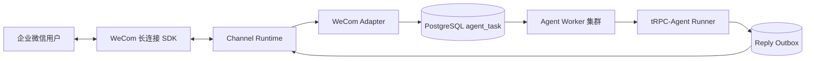

# 企业微信接入

## 1. 当前范围

当前接入企业微信智能机器人长连接，不依赖公网回调或内网穿透。已支持：

- 用户私聊机器人。
- 群聊中 `@机器人` 的文本消息。
- 文本、纯图片、图文混排、文件、语音和视频入站；文本、图片和文件回复。
- 消息幂等入队、快速处理中提示、真实 Agent 执行和异步回复。
- Binding 启停或配置变更后自动重连。

正确配置 Binding 后，Channel Runtime 会自动完成长连接鉴权。模板卡片、消息撤回和平台事件不属于当前范围。

## 2. 运行结构

`start.sh` 只启动一个本地 `channel` 进程。该 Channel Runtime 同时管理企业微信和飞书连接，并领取两类 IM Reply Outbox；普通 Worker 不持有 IM Transport。

## 3. 配置

先在企业微信管理界面创建“智能机器人 - API 模式 - 长连接”并取得 Bot ID 和 Secret，再由系统管理员创建租户账号。租户管理员登录 `/tenant`，在“IM 接入”中选择企业微信卡片，填写 Agent、Bot ID 和只写 Secret 后启用。

`thinking_message` 在页面显示为“快速响应提示语（可选）”，不是企业微信凭据。它是在 Agent 执行前立即写入回复流的提示语，默认“正在思考，请稍候…”，留空可关闭。必填凭据只有 Bot ID 和 Bot Secret。

代码和示例文件不保存 Bot ID 或 Secret。Bot ID 保存在 Binding 的非敏感配置中；Secret 由平台主密钥按租户加密，Binding 只保存内部引用，查询接口不会返回引用或明文。Connector 最多在配置的轮询间隔内自动发现变更，不需要重启服务。

## 4. 平台限制

- 入站文本最多 20,000 字符；媒体默认最多 50 MiB，可由 Binding 下调。
- SDK 使用 512 KiB 分片，最多 100 片；下载后先写租户对象存储，再进入 Agent。
- 图片内容按文件签名校验后交给 `qwen-vl-max`，单张默认不超过 10 MiB、单次最多 4 张；普通文本仍使用租户配置的 `qwen-max`。
- 企业微信返回的中文媒体文件名会在 S3 元数据层安全编码，原始文件内容和租户隔离键不变。
- 当前视觉模型不支持 Function Calling，因此图片轮次只做视觉问答，不调用 Tool/MCP。
- 快速回复只表示任务已可靠入队；最终回复由 Outbox 和 Delivery Worker 异步完成。
- ACK 超时视为结果未知并进入 `UNKNOWN`，禁止盲目重复发送；明确限频和临时错误按有上限退避重试。

## 5. 手动验收

1. 私聊机器人发送一个普通问题，确认先出现处理中提示，再收到最终回复。
2. 在群聊中发送 `@机器人 + 问题`，确认会话按群 ID 隔离。
3. 重复投递同一个 `msgid`，确认 Agent Task 和最终回复不会重复创建。
4. 分别发送纯图片和带文字说明的图片，确认对象进入租户 Artifact 空间并收到视觉模型回答。
5. 检查 `.run/channel-runtime.log`，日志中不得出现 Bot Secret。
6. 在管理端停用 Binding，确认 Runtime 自动断开；重新启用后自动恢复。

真实联调失败时按顺序检查 Agent 是否启用并绑定活动 Model Profile、Binding 状态、Bot ID/Secret、企业微信机器人权限和 `local-channel-runtime` 节点心跳。Agent 就绪校验、任务失败回复和超时收敛属于共享 Channel/Agent 链路；签名、帧格式、媒体上传下载和回复流属于企业微信 Adapter。不要把 Secret 复制到日志或工单。

新增其他 IM 时必须继承 `ChannelAdapter`，并复用共享的 Binding CRUD、Agent 就绪校验、Identity/Conversation、Inbox/Task、Outbox/Delivery 和安全错误映射，不能在新 Adapter 内再实现一套 Agent 执行链路。
