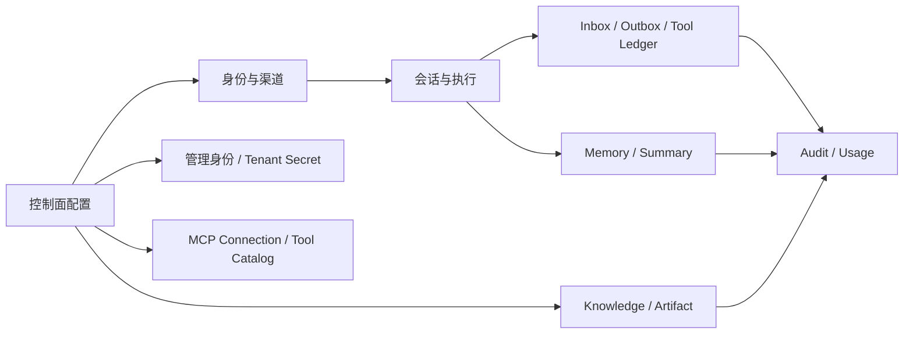
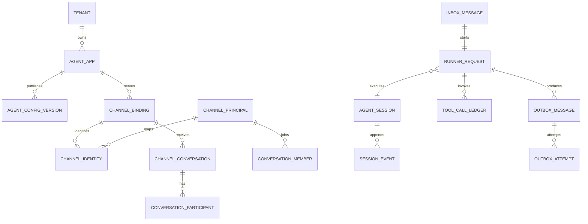
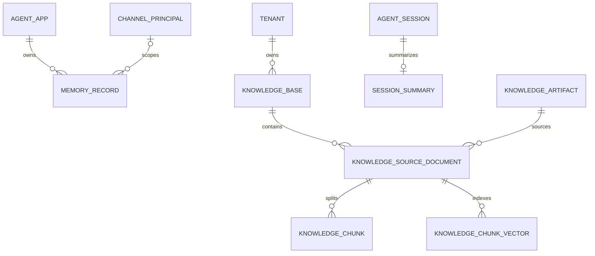
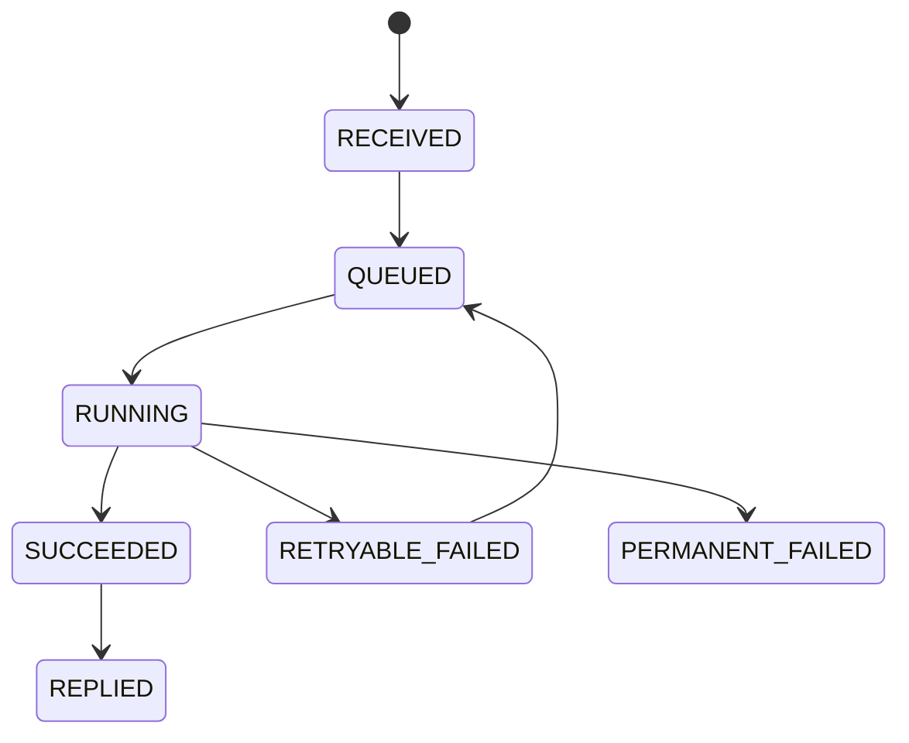

# 存储表结构设计

## 1. 设计边界

- PostgreSQL 保存控制面配置、会话事实、幂等状态、审计和对象元数据，是生产环境的事实源。
- Redis 已用于带 TTL 的近期 Session Snapshot，并保留可选租约快速路径和 Outbox 唤醒边界；任务、租约、完整事件和队列事实仍全部在 PostgreSQL。
- 当前 pgvector 作为同一 PostgreSQL 实例的扩展保存可重建向量索引；SeaweedFS 保存文件正文，数据库只保存对象位置、哈希和生命周期。
- InMemory 实现与正式存储共用接口，只用于单测和本地演示，不作为生产事实源。
- 本文以 Alembic Head `20260910_0027` 的已落库结构为准；生产扩展项会明确标为“未落库”。

## 2. 通用约束

| 项目 | 约束 |
| --- | --- |
| 主键 | Tenant、Agent、Binding、Inbox 等平台实体使用 UUID；跨后端运行标识使用受长度限制的稳定字符串；序号、版本号和 fencing token 使用 `BIGINT` |
| 租户隔离 | 租户资源必须包含 `tenant_id`；跨表引用使用包含 `tenant_id` 的组合外键 |
| 时间 | 使用 `TIMESTAMPTZ` 和数据库默认时间；同时区分 `created_at`、`occurred_at`、`completed_at` |
| 可变数据 | 可查询、可约束字段单独成列；扩展字段使用 `JSONB`，不能把核心字段全部塞入 JSON |
| 状态 | 使用 `TEXT + CHECK`；状态只能按允许的状态机推进 |
| 删除 | 事实表不物理覆盖；需要删除的数据使用 `deleted_at` 或 Tombstone，并写审计 |
| Secret | 只保存 `secret_ref`，禁止保存 API Key、IM Secret 和对象存储凭证明文 |
| 外部标识 | 保存带版本的 HMAC 哈希；原值仅在确有业务需要时加密保存 |
| 审计字段 | 可变表统一包含 `created_at`、`updated_at`；管理配置包含 `created_by`、`updated_by` |

## 3. 分级关系图

### 3.1 一级：数据域

### 3.2 二级：核心执行关系

### 3.3 二级：知识与派生数据

## 4. 控制面表

### 4.1 `tenant`

| 字段 | 类型 | 说明 |
| --- | --- | --- |
| `tenant_id` | UUID PK | 租户标识 |
| `name` | VARCHAR(120) | 租户名称 |
| `status` | TEXT | `active/disabled` |
| `isolation_mode` | TEXT | `shared/schema/database` |
| `audit_policy` | JSONB | 保留期限、脱敏和归档策略 |
| `created_at/updated_at` | TIMESTAMPTZ | 审计时间 |

约束：`name` 全局唯一；`disabled` 租户不能创建新执行。

### 4.2 `agent_app`

主表保存 `agent_app_id`、`tenant_id`、名称、Model Profile、状态、应用/模型/工具/知识/后端配置，以及稳定版本、灰度版本和灰度百分比。`(tenant_id, name)` 唯一，并提供 `(tenant_id, agent_app_id)` 唯一键供组合外键引用。

### 4.3 `agent_config_version`

| 字段 | 类型 | 说明 |
| --- | --- | --- |
| `tenant_id/agent_app_id/version` | UUID/UUID/BIGINT | 组合主键，版本在 Agent 内递增 |
| `snapshot` | JSONB | 模型、工具、知识库、存储路由和预算快照 |
| `status` | TEXT | `draft/released/retired` |
| `created_by/reason/created_at` | TEXT/TEXT/TIMESTAMPTZ | 发布人与原因 |

`released` 快照不原地修改。Agent 主表使用稳定/灰度指针选择版本；每次 Agent Task 和 Runner Request 固定入队时的版本。

### 4.4 Backend Profile 配置

当前没有独立 `storage_profile` 表。平台默认路由来自 `TRPC_SERVICE_STORAGE_BACKENDS` 和 `TRPC_SERVICE_STORAGE_PROFILE`；Agent 快照可以保存 `session/memory/summary/knowledge/artifact/audit` 后端名称，上层只依赖 Storage Port。

数据库地址、对象存储地址和 Secret 引用由平台配置，不由 IM 对话者修改。执行开始后固定配置快照，不能中途切换后端。

### 4.5 `channel_binding`

已落库字段为 `binding_id`、`binding_public_id`、`tenant_id`、`agent_app_id`、`channel_type`、`external_account_hash`、`account_config`、`secret_ref_map`、`capabilities`、`status` 和时间字段。`binding_public_id` 全局唯一；`(channel_type, external_account_hash)` 在 `active` 状态下唯一，停用后允许迁移账号。当前没有 Binding Alias 表。

### 4.6 `worker_pool_control` 与 `runtime_node`

`worker_pool_control` 保存全局 Agent Worker Pool 的 `pool_name`、`desired_nodes`、`generation`、`updated_by` 和时间字段。当前只有 `agent-worker` 一行；期望数量限制为 1 到 64，修改时必须匹配 generation，防止并发管理操作互相覆盖。

`runtime_node` 保存节点角色、并发度、启动时间和心跳。Worker 状态为 `active/draining/stopped`：`draining` 节点继续完成已领取任务但不再领取新任务，退出后保留停止记录。期望状态与心跳事实分表保存，不能用删除心跳记录代替缩容。

### 4.7 `mcp_connection`

字段：`connection_id`、`tenant_id`、`name`、`endpoint_url`、`auth_type`、`secret_ref`、`timeout_seconds`、`tool_catalog`、`catalog_refreshed_at`、`last_error_code`、`status` 和时间字段。

约束：`(tenant_id, name)` 唯一；只允许 `none/bearer` 认证与 `active/disabled` 状态。Token 写入 `tenant_secret` 后这里只保存 MCP 作用域的引用；工具目录保存名称、描述、输入 Schema、交互风险级别和风险策略版本。同时声明只读且未声明破坏性的 Tool 归为 L0，其余 MCP Tool 归为 L2；旧目录首次使用时自动重发现，执行时以目录值覆盖旧配置，客户端不能自行降级。

## 5. 身份与渠道表

### 5.1 `principal`

实际表名为 `channel_principal`。字段：`tenant_id`、`principal_id`、`principal_type`、`display_name`、`status`、`attributes` 和时间字段。

约束：主键使用 `(tenant_id, principal_id)`；状态为 `ACTIVE/DISABLED/DELETED`，类型为 `USER/SERVICE/BOT`。

### 5.2 `channel_identity`

字段：`tenant_id`、`identity_id`、`binding_id`、`principal_id`、`provider_principal_id`、`status`、`last_seen_at`、`attributes`。

约束：`(tenant_id, binding_id, provider_principal_id)` 唯一；组合外键保证 Binding 和 Principal 属于同一租户。Provider 标识只用于路由，禁止进入日志、指标和跨租户查询结果。

### 5.3 `channel_conversation`

字段：`tenant_id`、`conversation_id`、`binding_id`、`provider_conversation_id`、`kind`、`title`、`status`、`last_message_at`、`attributes`。

约束：`(tenant_id, binding_id, provider_conversation_id)` 唯一；`kind` 为 `DIRECT/GROUP/THREAD`。

`conversation_member` 使用 `tenant_id`、`conversation_id`、`principal_id`、`role`、`status` 和时间字段，并保证 `(tenant_id, conversation_id, principal_id)` 唯一。群成员关系不能放入 JSONB。

## 6. 会话事实表

### 6.1 `agent_session`

| 字段 | 类型 | 说明 |
| --- | --- | --- |
| `session_id` | VARCHAR(255) | 跨后端稳定 Session 标识，不直接使用外部 Conversation ID |
| `tenant_id/agent_app_id` | UUID | 强制租户归属 |
| `status` | TEXT | `ACTIVE/CLOSED/EXPIRED/DELETED` |
| `state` | JSONB | 当前物化状态 |
| `version` | BIGINT | 每次原子提交递增，用于 CAS |
| `last_event_seq` | BIGINT | 已提交的最大事件序号 |
| `last_fencing_token` | BIGINT NULL | 最近成功提交的执行令牌 |
| `last_activity_at/expires_at` | TIMESTAMPTZ | 生命周期 |

主键：`(tenant_id, agent_app_id, session_id)`。当前索引为 `(tenant_id, agent_app_id, status, last_activity_at)`；Conversation 通过 `channel_conversation` 和确定性 `session_id` 关联，`agent_session` 不保存 `conversation_id` 列。

`version` 表示提交次数，`last_event_seq` 表示事件位置，两者不能混用。更新必须同时校验 `expected_version` 和 fencing token。

Redis 使用 `tenant_id + agent_app_id + SHA-256(session_id)` 作为缓存键，只保存最近有界事件和 State。Worker 领取任务时从 SQL 同事务取得当前 `version`，缓存版本完全一致才可命中；SQL 提交成功后才更新缓存。Redis 超时、损坏、版本不一致或条目过大时直接回源 SQL，不参与 CAS 和恢复判定。

### 6.2 `session_event`

字段：`event_id`、`tenant_id`、`agent_app_id`、`session_id`、`seq_no`、`committed_version`、`event_type`、`actor_type`、`actor_principal_id`、`request_id`、`trace_id`、`payload`、`occurred_at`、`created_at`。

约束：

- `(tenant_id, agent_app_id, event_id)` 唯一。
- `(tenant_id, agent_app_id, session_id, seq_no)` 唯一且按 Session 连续递增。
- 只允许追加，修复使用新的 Repair Event。
- `payload` 写入前执行事件 Schema 校验和脱敏。

### 6.3 `session_summary`

当前表保存每个 Session 的最新可重建摘要：`tenant_id`、`agent_app_id`、`session_id`、`source_event_seq`、`content`、`attributes` 和时间字段。

主键为 `(tenant_id, agent_app_id, session_id)`；`source_event_seq` 不能超过 Session 高水位。需要历史版本时由 Event 重建，不在该表累积多个摘要版本。

## 7. 幂等与可靠执行表

幂等不能只依赖一张通用表，必须分别处理四种风险。

| 风险 | 事实表 | 唯一键 |
| --- | --- | --- |
| 外部消息重复回调 | `inbox_message` | `(tenant_id, binding_id, external_message_id)` |
| 同一请求重复执行 | `runner_request` | `(tenant_id, request_id)` |
| Tool 副作用重复 | `tool_call_ledger` | `(tenant_id, request_id, logical_call_index)` |
| 回复或派生任务重复投递 | `outbox_message` | `(tenant_id, agent_app_id, category, idempotency_key)` |

### 7.1 `inbox_message`

字段：`inbox_id`、`tenant_id`、`binding_id`、`agent_app_id`、`external_message_id`、`payload_hash`、`id_source`、`request_id`、`trace_id`、`session_id`、`status`、`attempt_count`、`next_attempt_at`、`lease_owner`、`lease_until`、`reply_outbox_id`、`committed_session_version`、`result_state`、安全错误摘要和时间字段。Conversation 与发送者身份保存在规范化请求、`channel_identity` 和 `channel_conversation`，当前 Inbox 不重复保存这两列。

状态机：

处理规则：

- 首次使用唯一键插入；冲突后读取已有状态，不能再次调用模型。
- 相同唯一键但 `payload_hash` 不同，立即抛出 `IdempotencyConflict`，不能复用结果或覆盖原 Inbox；独立冲突审计和指标在真实 IM 接入前补齐。
- IM 没有稳定消息 ID 时，由 Adapter 使用账号、发送者、Conversation、平台时间桶和规范化正文生成退化 ID，并单独记录 `id_source=DERIVED`；该方式只能在较短窗口内去重。
- `RUNNING` 必须有有限期租约；仅租约过期后允许 fencing 接管。
- SQL 是最终去重依据，Redis `SET NX` 只是快速路径。

### 7.2 `session_execution_fence`

字段：`tenant_id`、`agent_app_id`、`session_id`、`issued_token`、`lease_owner`、`lease_until`、时间字段。

主键：`(tenant_id, agent_app_id, session_id)`。领取 Session 时锁定该行、递增 `issued_token` 并写入 Runner；提交必须同时满足 Inbox 为 `RUNNING`、Runner token 等于 Fence token、租约未过期。旧 Worker 即使恢复运行也不能覆盖新 Worker。

### 7.3 `runner_request`

字段：`request_id`、`tenant_id`、`agent_app_id`、`session_id`、`inbox_id`、`config_version`、`status`、`next_step_index`、`next_tool_call_index`、`pending_tool_call_id`、`state_ref`、`fencing_token`、`attempt_count`、`started_at`、`completed_at`、`last_error`、时间字段。

状态：`PENDING/RUNNING/COMPLETED/RETRYABLE_FAILED/PERMANENT_FAILED/CANCELLED/UNKNOWN`。一个 Inbox 最多对应一个 Runner Request；内部调用允许 `inbox_id` 为空。

`runner_attempt` 记录每次 Worker 尝试：`attempt_id`、`task_id`、`request_id`、`node_id`、`attempt_no`、`fencing_token`、`status`、开始/结束时间和安全错误摘要。`runner_checkpoint` 按序保存阶段与外部状态引用。两者用于恢复判断和诊断，业务去重仍由 Inbox 与 Tool Ledger 承担。

### 7.4 `tool_call_ledger`

字段：`tenant_id`、`agent_app_id`、`call_id`、`request_id`、`logical_call_index`、`name`、`kind`、`action`、`resource`、`intent_hash`、`status`、`result_payload`、`error_summary`、`completed_at` 和时间字段。

状态：`PREPARED/SUCCEEDED/FAILED/UNKNOWN`。能力调用必须先提交 `PREPARED` 再进入实现；`UNKNOWN` 必须查询、补偿或人工处理，不能盲目重试。

### 7.5 `outbox_message` 和 `outbox_attempt`

`outbox_message` 字段：`outbox_id`、`tenant_id`、`agent_app_id`、`request_id`、`session_id`、`category`、`destination`、`binding_id`、`sequence_no`、`idempotency_key`、`payload`、`status`、`priority`、`attempt_count`、`retry_count`、`next_attempt_at`、`lease_owner`、`lease_until`、`external_receipt_id`、`last_error_code`、`last_error_summary`、`created_at`、`delivered_at`、`expires_at`。

状态：`PENDING/PROCESSING/DELIVERED/RETRYABLE_FAILED/UNKNOWN/DEAD_LETTER/CANCELLED`。当前运行消费者只处理 `IM_REPLY`；Memory、Audit、Knowledge 和 Artifact 异步投影类别是后续扩展，不能由 Delivery Worker 误领。

`outbox_attempt` 字段：`attempt_id`、`tenant_id`、`outbox_id`、`attempt_no`、`worker_id`、`started_at`、`finished_at`、`result`、`provider_status_code`、`external_receipt_id`、`error_summary`。

约束：`(tenant_id, agent_app_id, outbox_id, attempt_no)` 唯一；IM 回复额外保证 `(tenant_id, agent_app_id, request_id, sequence_no)` 唯一。`attempt_count` 单调递增并作为不可变 Attempt 编号，`retry_count` 只统计当前投递周期。终结 Attempt 必须校验 `worker_id + attempt_no`；达到次数上限后保留原 Outbox 并进入 `DEAD_LETTER`，人工重放将 `retry_count` 清零并创建更大的新 Attempt，不复制业务事实或覆盖审计历史。

## 8. Memory、Knowledge 和 Artifact 表

### 8.1 `memory_record`

当前字段为 `tenant_id`、`agent_app_id`、`memory_id`、`principal_id`、`content`、`attributes` 和时间字段。

主键为 `(tenant_id, agent_app_id, memory_id)`，并按 `(tenant_id, agent_app_id, principal_id)` 查询。生命周期、来源版本和 Memory 向量化属于后续扩展，当前不能在文档中假定已落库。

### 8.2 `knowledge_base`

字段：`tenant_id`、`knowledge_base_id`、`name`、`status`、`embedding_model`、`embedding_dimensions` 和时间字段。主键为 `(tenant_id, knowledge_base_id)`，`(tenant_id, name)` 唯一。知识库属于 Tenant，Agent 只保存访问授权。

### 8.3 `knowledge_source_document`

字段：`tenant_id`、`document_id`、`knowledge_base_id`、`artifact_id`、`filename`、`checksum`、`version`、`status`、`chunk_count`、`error_summary`、`deleted_at` 和时间字段。

约束：`(tenant_id, knowledge_base_id, checksum)` 幂等，`(tenant_id, knowledge_base_id, filename, version)` 唯一。状态：`INGESTING/READY/FAILED/SUPERSEDED/DELETED`。

### 8.4 `knowledge_chunk`

字段：`tenant_id`、`chunk_id`、`document_id`、`chunk_index`、`start_char`、`end_char`、`content`、`content_hash`、`attributes` 和时间字段。`knowledge_chunk_vector` 保存 `tenant_id`、Chunk ID、知识库 ID、正文、属性和 1024 维向量。

约束：`(tenant_id, document_id, chunk_index)` 唯一。原文和 Chunk 是事实，pgvector 或外部向量库索引可以重建。

### 8.5 `knowledge_artifact`

对象正文保存在 S3 兼容存储；SQL 表保存 `tenant_id`、`artifact_id`、上传 Agent/Principal、文件名、媒体类型、SHA-256、大小、对象 URI 和时间字段。主键为 `(tenant_id, artifact_id)`，`(tenant_id, checksum)` 唯一。当前删除知识文档只删除检索向量并保留原始对象，便于审计和恢复；通用 Artifact 引用计数与 Legal Hold 后续补充。

## 9. 审计、用量和投影表

### 9.1 `audit_log`

字段必须显式包含：`audit_id`、`tenant_id`、`agent_app_id`、`binding_id`、`principal_id`、`session_id`、`request_id`、`trace_id`、`action`、`decision`、`policy_version`、`tool_name`、`latency_ms`、`error_type`、`cost_amount`、`details_redacted`、`occurred_at`、`created_at` 和 `immutable`。

审计只追加；索引使用 `(tenant_id, agent_app_id, occurred_at)`、`(tenant_id, trace_id)`、`(tenant_id, session_id, occurred_at)`。实际表还包含 `cost_amount` 和不可变标记。题目要求中的 `channel/user_id/agent_name/cost` 分别以 `binding_id/principal_id/agent_app_id/cost_amount` 规范化保存，查询时关联 Binding、Principal 与 Agent；这样名称变化不会改写历史审计。消息正文可以按租户审计策略留存，但 Secret、认证头、模型 API Key、IM/MCP Token 和数据库密码必须脱敏。

### 9.2 `usage_ledger`

字段：`usage_id`、`tenant_id`、`agent_app_id`、`request_id`、`trace_id`、`model_provider`、`model_name`、`input_tokens`、`output_tokens`、`total_tokens`、`estimated_cost`、`occurred_at`、`created_at`。

约束：`(tenant_id, request_id)` 唯一，避免 Worker 重放重复记账；预算统计从此表汇总，不能只依赖日志或 Prometheus。

### 9.3 `approval_request`

保存 L2/L3 能力的 `PENDING/APPROVED/REJECTED/EXPIRED/EXECUTING/EXECUTED/UNKNOWN` 状态。审批只保存参数 SHA-256、`config_version`、调用序号和原请求的内部 `artifact_refs`，不保存模型生成的原始参数。授权绑定 Tenant、Agent、Binding、Principal、Session、配置版本和附件集合，且只能消费一次。`operation_arguments` 仅作为历史兼容保留，新流程固定写入空对象；RAG 写操作由租户管理台显式 API 完成并单独审计，不经过 IM 审批恢复链路。

### 9.4 Projection Checkpoint（未落库）

字段：`consumer_name`、`tenant_id`、`partition_key`、`last_event_id`、`last_event_seq`、`version`、`updated_at`。

计划约束：`(consumer_name, tenant_id, partition_key)` 唯一；Checkpoint 只能单调推进，用于未来的 Memory、向量索引、审计归档和迁移任务。当前同步知识摄取使用文档 `INGESTING/READY/FAILED` 状态恢复。

## 10. 同步、一致性与后端迁移

### 10.1 Session、Summary 与 Memory 顺序

一次对话先提交 Session Event、物化 State、Inbox 终态、Runner Request 和 Reply Outbox，再由 Delivery Worker 对外回复。`session_summary.source_event_seq` 只允许指向已经提交的 Event 高水位；摘要计算失败不回滚原始 Event，下次从高水位继续重建。当前生产 Runner 会读取 Session、Memory 和 Summary Port，但不会自动抽取长期 Memory；由明确业务流程写入 Memory 时，PostgreSQL 实现提交成功后其他节点立即可见，外部 Memory 后端则必须用 Outbox、Checkpoint 和“最近写入覆盖层”保证读己之写。

运行审计、Usage Ledger 和 Tool Ledger 各自使用短事务：它们与模型或外部 Tool 调用不能放进 Session 长事务。当前 Reply Outbox 与 Session 事实原子提交；尚未启用 Memory/Audit/Knowledge 派生 Outbox，文档不假设这些消费者已经运行。

### 10.2 后端取舍

| 后端 | 适合数据 | 一致性与延迟 | 成本和运维 |
| --- | --- | --- | --- |
| PostgreSQL + pgvector | 配置、Session、Event、Inbox/Outbox、Ledger、审计、中小规模向量 | 事务强一致；向量随当前同步摄取完成后可见 | 单一事实源简单，但写入和向量检索共享容量 |
| Redis | 近期 Session Snapshot、通知、可选租约快速路径 | 低延迟、精确版本命中、允许丢失；不能作为最终事实 | TTL 后过期，异常自动回源 SQL |
| S3 兼容对象存储 | 原始文档、IM 媒体、Artifact | 对象写成功后再提交 SQL 引用；跨系统不是原子事务 | 容量成本低，必须处理孤儿对象、版本和备份 |
| 外部向量库 / Memory | 大规模语义检索或专用记忆 | 通常最终一致，需要版本、Checkpoint 和回退 | 易独立扩展，但增加网络、迁移和对账成本 |
| InMemory | 单元测试 | 单进程立即一致，重启即丢失 | 无外部运维，不可用于生产 |

### 10.3 Redis → SQL 或缓存下线

SQL 一直是权威数据，因此不是把 Redis 数据直接“搬成事实”。迁移步骤为：冻结新缓存能力 → 保持 SQL 双读校验 → 等待 Redis 租约过期 → 从 SQL 预热需要的缓存 → 关闭 Redis 读路径。任一步失败都回到 SQL-only；不得从 Redis 覆盖更新的 SQL 版本。

### 10.4 本地向量库 → 外部向量库

1. 为目标后端创建新 Backend 名称，保持原始 `knowledge_chunk`、模型、维度和内容哈希不变。
2. 按 Tenant/Knowledge Base 回填，幂等键使用 `tenant_id + document_id + chunk_index + content_hash`。
3. 记录每个分区的高水位，逐批比较数量、哈希和抽样 Top-K 结果。
4. 进入短期双写；读取仍走旧库，失败写入进入重试状态。
5. 按 Agent 配置版本灰度切读，观察召回、延迟和错误后全量切换。
6. 回滚只切回旧读路径；确认超过回滚窗口后再停止双写和回收旧索引。

当前没有通用 `projection_checkpoint` 表；知识摄取使用文档状态恢复。真正启用外部投影前必须先落库 Checkpoint，并把迁移工具、校验和回滚纳入同一版本交付。

## 11. 原子事务边界

一次 Agent 成功提交必须在同一 PostgreSQL 事务中完成：

1. 校验 Inbox/Runner 状态、Session `expected_version` 和 fencing token。
2. 追加 Session Event。
3. 更新 Session State、`version` 和 `last_event_seq`。
4. 将 Runner Request 和 Inbox 标记为 `COMPLETED/SUCCEEDED`。
5. 插入 `IM_REPLY` Outbox。

任一步失败则全部回滚。模型调用和外部 Tool 调用不能放在这个长事务中；Tool 使用短事务写 Ledger。

## 12. 索引、分区和保留

- 所有 Worker 领取任务的索引以 `status, next_attempt_at` 开头，并使用部分索引排除终态数据。
- Event、Audit、Model Usage 达到单表容量阈值后再按时间或 Tenant 分区，初期不为了分区增加开发复杂度。
- Inbox 和 Outbox 终态记录按租户策略归档；幂等保留期必须大于 IM 最大重试窗口。
- Event、Audit、Tool Ledger 的归档不能破坏在线幂等判断；必要的摘要键单独长期保留。
- PostgreSQL 备份和时间点恢复同时覆盖事实表与 pgvector 索引；Redis 和 SeaweedFS 对象分别执行恢复演练。

## 13. 当前结构差距和落地顺序

| 优先级 | 当前差距 | 落地内容 |
| --- | --- | --- |
| P0（已完成） | 旧表使用临时 `runtime_*` 名称，状态和租约不完整 | 已迁移为 `agent_session`、`session_event`、`inbox_message`、`outbox_message`、`audit_log` 等正式名称，并补齐状态、约束和索引 |
| P0（已完成） | `runtime_inbox.message_id` 由字符串拼接，无法校验 ID 冲突 | 已拆为 `binding_id + external_message_id + payload_hash`，Agent 执行前先领取 Inbox；历史数据标记为 `LEGACY`，避免用合成哈希误判冲突 |
| P0（已完成） | 旧 Worker 在租约过期后仍可能提交 | 已增加 `session_execution_fence`，领取时发放单调 token，提交和失败均校验 token 与租约 |
| P0（已完成） | Outbox 只提交未持久化投递过程 | 已实现领取租约、不可变 Attempt、成功回执、自动退避、UNKNOWN、Dead Letter 和租户级人工重放 |
| P0（已完成） | Audit 关键查询字段都在 JSON | 已抽出 request、trace、session、principal、延迟、错误和 Tool 字段 |
| P1（已完成） | Runner 缺少可诊断恢复状态 | 已实现 Runner Request、Attempt、阶段 Checkpoint 和恢复状态机 |
| P1（已完成） | Agent 执行可能超过初始租约 | Worker 按租约三分之一续期任务和 Session Fence；任一失租立即取消旧执行 |
| P1（已完成） | 缺少常驻 Delivery Worker | 已增加跨租户到期扫描、节点竞争领取、统一退避、UNKNOWN/DLQ 和审计重放 API |
| P1（保留增强） | ID 复用冲突当前只拒绝请求 | 增加不修改原 Inbox 的独立冲突审计、指标和告警 |
| P1（已完成） | Tool 重试可能产生重复副作用 | 已增加 Tool Ledger、稳定 Call ID、结果重放和 UNKNOWN 隔离 |
| P1（已完成） | 身份与 Conversation 由 Adapter 临时映射 | 已增加 Principal、Channel Identity、Channel Conversation 和 Member |
| P2（主体完成） | Knowledge 缺少来源、版本和生命周期 | 已完成知识库、Artifact、文档版本、Chunk、摄取状态和 pgvector 表；大文件异步投影待按容量需要增加 |
| P2（主体完成） | SeaweedFS 只有对象内容，没有统一元数据关系 | 已增加知识 Artifact 元数据；通用引用计数和 Legal Hold 属于生产合规增强 |
| P2（主体完成） | 配置直接保存在 Agent JSON | Agent 执行配置已使用不可变快照、稳定/灰度指针和回滚；独立 Storage Profile 表按多后端运营需求再引入 |

每个优先级单独建立 Alembic 迁移并提供升级、回滚和重复执行测试。新的外部写 Tool 即使复用现有 Ledger，也必须先定义 provider 对账方法和 UNKNOWN 人工处置流程。

迁移 `20260828_0005` 完整保留旧表记录。无 Binding 前缀的旧 Inbox 使用零 UUID 隔离，运行时按同租户、同 Agent 和原消息 ID 兼容重放；旧结构没有 Inbox 与 Outbox 的关联字段，因此不能伪造历史关联，未确认投递结果的旧 Outbox 保持 `UNKNOWN`，后续通过对账处理。历史集成测试产生的孤立记录使用 `NOT VALID` 外键兼容：旧记录仍可读取，新写入立即受组合外键约束；清理旧记录后再执行约束验证。
