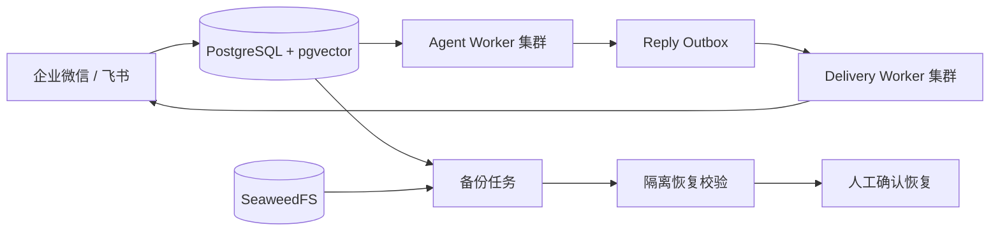
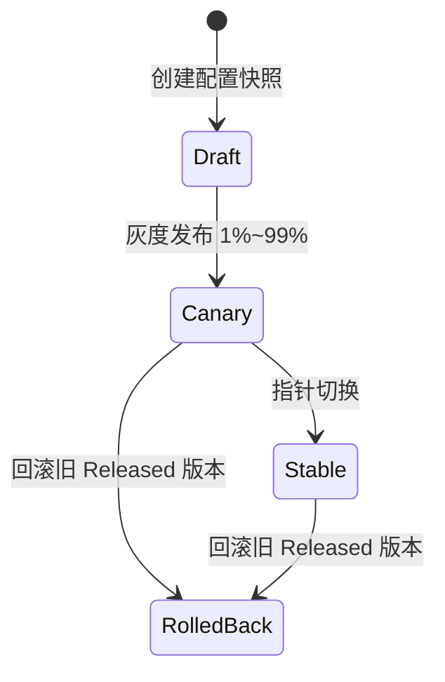

# 故障运维与恢复

## 1. 恢复边界

PostgreSQL 是 Agent Task、Session、Inbox、Outbox、配置、审批、Usage/Tool Ledger 和审计的事实源，并通过同一实例的 pgvector 扩展保存可重建向量；SeaweedFS 保存 Artifact。Redis、Prometheus、Tempo 和 Loki 不作为业务恢复源，丢失后分别从 SQL、运行流量、新 Trace 和新日志恢复。

## 2. 自动恢复

| 场景 | 当前处理 |
| --- | --- |
| Worker 退出 | `agent_task` 租约过期后由其他节点领取；续租失败时旧 Worker 取消执行 |
| Runner 中断 | 新 Attempt 使用更高 fencing token 接管；旧 Attempt 进入 UNKNOWN，有序 Checkpoint 保留已到达阶段 |
| SQL 短暂不可用 | 未持久化不 ACK；Worker 保持运行并按有上限指数退避重新扫描 |
| Redis 不可用或缓存过期 | Session 缓存 fail-open 到 PostgreSQL；恢复后由正常读取或提交自动回填，不从缓存反向覆盖 SQL |
| 模型超时或运行错误 | 配置/权限/参数错误直接终止；基础设施和供应商错误按次数上限退避 |
| IM 限频/网络错误 | Delivery Worker 续租防止长调用被重复领取，并遵守 `Retry-After`；确定性抖动避免节点同时重试 |
| IM 结果不确定 | 标记 `UNKNOWN`，禁止盲目重发；确认外部状态后由租户管理员重放 |
| IM 永久错误 | 进入 `DEAD_LETTER`，保留 Attempt 和安全错误摘要 |
| 高风险能力结果不确定 | Approval Request 标记 `UNKNOWN`，禁止自动重试，等待人工对账 |
| Tool 结果不确定 | Tool Ledger 标记 `UNKNOWN`；相同 Call ID 不再执行，避免重复外部副作用 |
| MCP 工具名不存在 | tRPC-Agent 将结构化失败返回模型并允许其改正调用；不直接中断为 IM 通用失败文案 |
| MCP DNS、连接或调用超时 | DNS 解析和 Streamable HTTP 调用均有上限；达到上限后进入统一失败链路，不让 IM 永久停留在处理中 |

租户投递故障入口：

- `GET /api/v1/tenants/{tenant_id}/delivery-failures`
- `POST /api/v1/tenants/{tenant_id}/delivery-failures/{outbox_id}/replay`

重放只能处理 `UNKNOWN` 或 `DEAD_LETTER`，必须提供原因，并与管理审计在同一事务中提交。重放重置本轮 `retry_count`，但保留单调递增的 `attempt_count` 和全部不可变 Attempt，兼顾新的重试预算与历史可审计性。

当前已通过统一治理端口接入计算、日期时间、HTTPS 查询、Local Workspace 只读、知识库 Tool 和租户 MCP。Tool Ledger 已覆盖实际进入治理端口的调用。租户显式授权的 MCP Tool 中，同时声明 `readOnlyHint=true` 且未声明破坏性的读取按 L0 直接执行；未声明、声明冲突或可能写入的 Tool 按 L2 处理。旧目录首次使用时自动重发现，失败则继续要求确认。执行前以刷新目录中的分类覆盖旧 Agent 快照，客户端不能自行把写操作降级。对有外部副作用且 Provider 没有查询接口的 MCP Tool，`UNKNOWN` 状态不得自动重试，必须先人工对账。Grafana 的 Tool 总数和明细按当前所选时间范围统计；显示 0 表示该范围内没有调用进入治理链路。

## 3. 配置灰度与回滚

Agent 配置保存为不可变快照。稳定版本由 `stable_config_version` 指向；灰度版本由 `canary_config_version + canary_percent` 指向。入口使用 `SHA-256(tenant_id, agent_app_id, principal_id)` 选择灰度组，不依赖节点本地状态。

发布、回滚和旧版兼容字段投影在一个 SQL 事务中完成。已经入队的任务固定使用入队时的版本，不会在执行中途切换。

## 4. 本地最小部署

- 主机 Python + uv：一个 Gateway、至少两个独立 Agent Worker、一个 Channel Runtime；Channel Runtime 持有 IM Transport 并运行 Delivery Worker，普通 Worker 不直接发送 IM 回复。
- 同一 Compose 分组：包含 pgvector 扩展的 PostgreSQL、Redis、SeaweedFS、OTel Collector、Prometheus、Tempo、Loki、Alloy、Grafana。
- `start.sh` 负责构建、迁移和启动；统一 Channel Runtime 同时管理企业微信与飞书长连接；`stop.sh` 先停入口，再排空 Worker，最后停止组件。
- 该部署可用于开发、CI、预发和受控试点，不具备跨主机、跨可用区高可用。

## 5. 生产推荐部署

- 生产规模增大后可把 Gateway/Admin API、Agent Worker、Channel Runtime/Delivery Worker 进一步独立扩缩容，并跨故障域部署。
- PostgreSQL 使用托管高可用和 PITR；对象存储使用支持版本控制、跨区域复制和 Object Lock 的 S3 服务。
- Redis 只做缓存/唤醒，允许从 SQL 重建；向量库保留原始 Chunk、Embedding 模型和维度，允许重建索引。
- 通过 Queue Lag、执行并发和 IM 投递延迟扩容，设置 PDB、Topology Spread、优雅停机和最小可用 Worker 数。
- 发布遵循 expand-migrate-contract，先内部租户，再 5%/25%/50%/100%，每阶段按配置版本观察错误率。

## 6. 备份与恢复

备份任务生成同时包含事实表与 pgvector 数据的 PostgreSQL 自定义格式转储、SeaweedFS 对象清单和 SHA-256 校验。恢复前必须先把数据库转储导入隔离临时库，并逐文件校验对象；人工确认后再停止入口、恢复 staging 数据、保留原库作为 rollback 库完成短时切换，最后升级到当前 Alembic Head 并执行冒烟检查。

当前 PostgreSQL 转储同时恢复 pgvector 表和索引。系统已保存原始 Artifact、Chunk、Embedding 模型和维度，因此具备重新向量化所需的事实数据；批量重建命令尚未作为正式运维脚本交付，生产恢复仍以数据库转储为主。

备份目录必须复制到独立故障域并加密，不能只留在本机。当前脚本保证 PostgreSQL 转储和对象清单各自一致，但不是跨数据库与对象存储的原子快照；正式环境达到核心 SQL RPO 1 分钟，需要托管 PITR/WAL 归档。

## 7. 容量检查

容量门禁默认在工作区磁盘达到 80% 或持久队列积压达到 1000 时失败，并根据峰值消息 RPS、Agent P95、单 Worker 安全并发、平均 Token、SQL 写放大和 IM 突发倍数估算 Worker、token/s、SQL/Redis QPS 和 IM 峰值。默认参数只用于本地自检，不能作为生产容量结论。

容量评审至少记录：峰值消息 RPS、Agent P95 时长、单 Worker 安全并发、模型 token/s 配额、SQL 写 QPS、连接池等待、队列 Lag、Artifact 日增长、向量数量、Trace 日增长和 30% 节点故障余量。

## 8. 演练与上线门禁

1. 杀死一个正在执行任务的 Worker，确认租约过期后其他节点接管，旧节点不能提交。
2. 复用相同节点/slot 名称领取新 generation，确认旧 token 仍不能续租、完成或失败。
3. 暂停 PostgreSQL，确认新消息不被假 ACK；恢复后任务继续处理。
4. 注入模型超时、永久配置错误和 IM `Retry-After`，检查分类、次数上限和安全错误。
5. 将投递或 Tool Ledger 置为 `UNKNOWN`，确认系统禁止盲目重放。
6. 灰度新配置，按版本查看错误率，执行旧版本回滚并确认新任务使用旧版本。
7. 完成一次离机备份、隔离恢复校验、全量恢复和冒烟检查，记录实际 RPO/RTO。

## 9. 生产风险

| 风险 | 缓解措施 |
| --- | --- |
| 跨租户越权 | TenantContext、组合键、所有权校验和隔离测试 |
| IM 重复或乱序 | Inbox 唯一键、Payload Hash 和 Session CAS |
| Worker 脑裂 | 租约续期、Fencing Token 和旧节点拒绝提交 |
| 模型超时或限流 | 超时预算、有限重试、Retry-After 和备用配置 |
| Tool 提示注入或重复副作用 | 白名单、Schema、审批、稳定 Call ID 和 Tool Ledger |
| 密钥或 Trace 内容泄露 | Secret 引用、RBAC、脱敏、保留期限和轮换 |
| SQL/Redis 状态分叉 | SQL 事实源、事务 Outbox 和 Redis 可重建 |
| Memory/向量索引滞后 | Checkpoint、版本查询、Pending Overlay 和回退 |
| IM 投递结果未知 | UNKNOWN 状态、人工对账，禁止盲目重试 |
| 磁盘或连接池耗尽 | 容量告警、保留期、限流和扩容 |
| 配置发布错误 | 不可变版本、租户灰度和快速回滚 |
| 备份不可恢复 | Checksum、隔离恢复演练、迁移和冒烟检查 |
