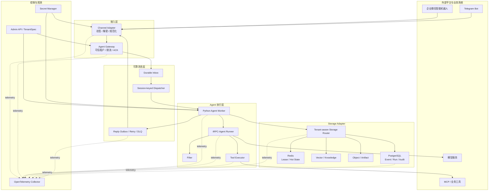
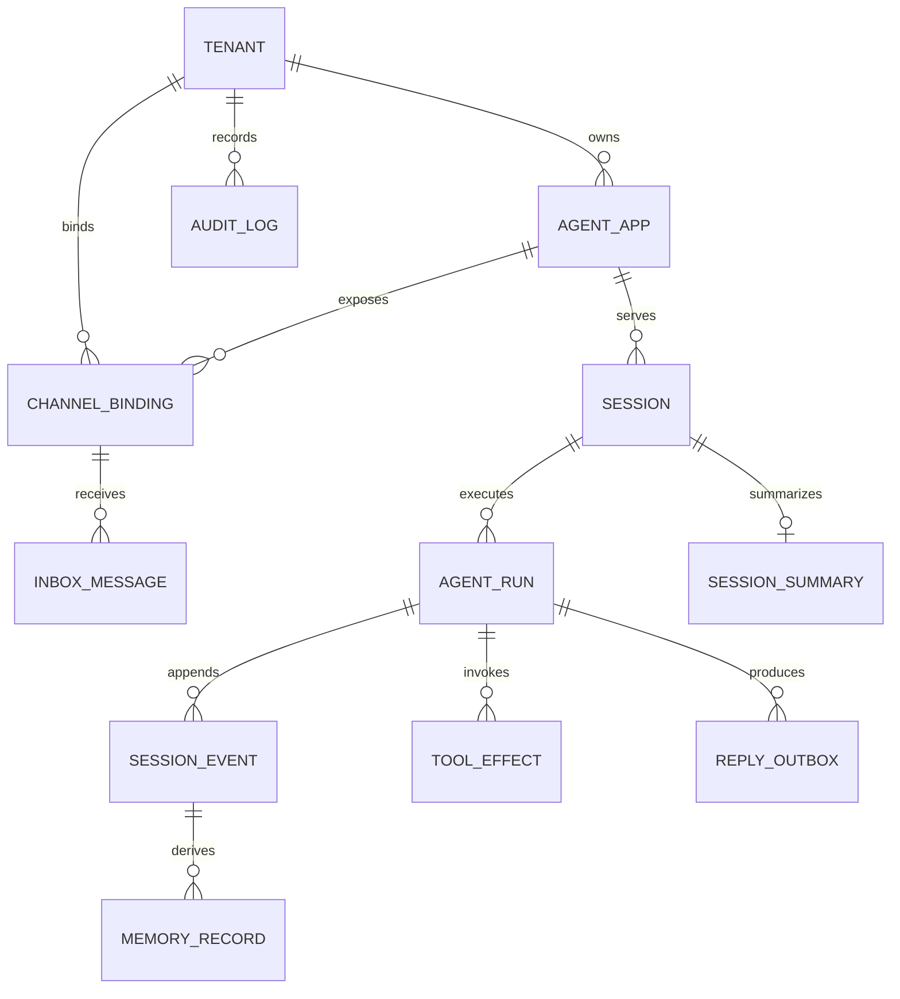
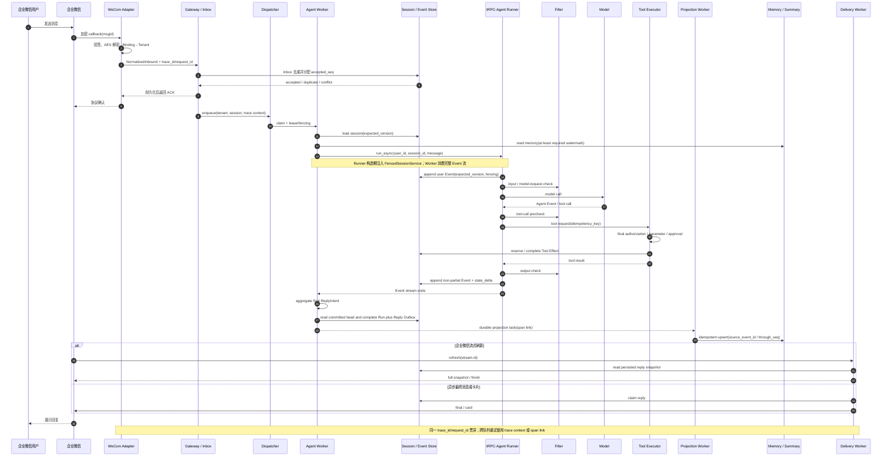

# 曹清妍 项目方案书——基于 tRPC-Agent 设计多租户节点化 Agent 部署平台

---

## 摘要

本项目基于 tRPC-Agent-Python 建设面向企业微信与 Telegram 的多租户节点化 Agent 平台。复用 Agent/Runner、Tool/MCP、Session、Memory、Knowledge、Filter 与 Telemetry，新增可信租户解析、耐久 Inbox/Outbox、Session 有序调度、租户化存储、工具强制授权、审计与恢复。

核心不变量有三项：跨租户不串线；多 Worker 下同一 Session 不乱序、不丢更新；IM 重投不重复产生逻辑执行或副作用。运行不依赖 sticky，Event 是事实源，其余状态按版本派生；交付以可运行主链和证据为准。

---

## 1. 建设目标、范围与验收口径

### 1.1 建设目标

| 维度 | 目标 |
| --- | --- |
| 多租户 | 租户独立配置 Agent 应用、模型、工具、IM、数据后端、预算与审计策略 |
| 多节点 | Gateway 与 Worker 可水平扩展，任一健康 Worker 均能接管会话 |
| 多后端 | 业务数据按语义适配后端；可靠性元数据与 Audit 固定 SQL |
| 双 IM | 首期接入企业微信智能机器人与 Telegram Bot，保留统一扩展接口 |
| 治理运维 | 提供 Filter、强制授权、指标、全链追踪、审计、灰度、回滚和故障降级 |

### 1.2 实施范围

| 级别 | 范围 | 完成判定 |
| --- | --- | --- |
| P0：终稿必做 | 双 IM 主链、可信租户、Inbox/Outbox、同 Session 有序执行、PostgreSQL/Redis、隔离治理、OTel、Compose | 可运行、可重启恢复，关键不变量有自动化测试 |
| P1：冲刺加分 | Redis→SQL 可回滚迁移、跨租户攻击测试、Worker 故障注入、容量曲线、配置灰度 | 至少完成一条端到端演练并保留原始证据 |
| P2：生产参考 | Kubernetes、远端向量迁移、A2A/AG-UI、完整管理 UI、长时间 soak | 给出接口与部署设计，不挤占 P0/P1 |

---

## 2. 仓库基线、框架复用与代码落位

### 2.1 指定仓库基线

截至 2026 年 8 月 27 日，指定仓库 [main@4cda37b](https://github.com/raychen911/trpc-agent-service/tree/4cda37bfc41efc412e9ce5e38aa563859c1aa8ee) 有 23 个文件：题目 README 和两个 ignore 文件非空，其余 20 个（根脚本、`docs/data` 占位 README 及 Python 文件）全为空；没有依赖、锁、测试、迁移、Docker 或业务代码，README 所列 `lint_flake8.sh` 与 `trpc_service/workspace/` 也不存在。

它是交付骨架和目录约束，并非已有平台实现。将在原骨架补齐工程基线，并修正：

- `.gitignore` 当前忽略全部 `*.lock`，需允许提交唯一选定的 Python 依赖锁文件；
- `.env`、私钥、token、数据库卷和 `data/` 下的租户运行数据必须排除，仅提交 `.env.example` 与脱敏 fixture。

### 2.2 tRPC-Agent-Python 复用边界

候选基线采用 PyPI `trpc-agent-py==1.1.19` 并锁定包 hash；8 月 28 日通过兼容性探针后冻结依赖与镜像。题面所列能力是上游框架能力，不代表指定仓库已经接入。

| 能力 | 计划直接复用 | 平台层新增 |
| --- | --- | --- |
| Agent 执行 | Agent、Runner、Event/Content/Part、RunConfig | TenantContext、Tenant-aware AgentFactory、Run Ledger、调度与恢复 |
| Tool / MCP / Skill | FunctionTool、ToolSet、MCP 与调用循环 | 租户白名单、预算、审批、执行前授权、Tool Effect 幂等 |
| Session / Memory / Summary | 官方 ABC、查询接线及合适的摘要算法；内置 Store 用于开发或兼容参考 | 租户域包装、CAS、水位、幂等投影、耐久后处理与迁移 |
| Knowledge / Artifact | Knowledge 管线、KnowledgeFilterExpr、BaseArtifactService | 强制租户过滤、对象路径隔离、索引版本与预签名访问 |
| Filter | Agent/Model/Tool Filter 扩展点 | DLP 与调用期校验；工具可见性由 ToolSet 控制，最终授权在 Executor |
| Telemetry | Runner/Agent/Model/Tool 既有 spans 与 metrics | IM、队列、存储、回复 spans，进程内属性抑制和独立审计 |
| FastAPI / IM | FastAPI/SSE 示例；OpenClaw 的消息映射与回复聚合经验 | 自建企微 HTTP callback 与 Telegram 传输层，并补 Binding、Inbox/Outbox、限流和 DLQ |
| A2A / AG-UI | 若启用则复用上游 server 模块 | 本期不自建协议栈，P2 再按需选择，避免无关 extra 冲突 |

框架原生对象没有一等 `tenant_id`。平台统一映射：

```text
Runner 的 app_name = tenant_id + agent_app_id 的全局唯一内部键
run_async(user_id=租户内 principal_id, session_id=服务端 HMAC 派生值)
metadata["tenant_context"] = 平台定义的不可变 TenantContext
```

框架的 metadata 字典本身可变，因此 Store 与 Tool 不从模型或 payload 重建租户身份，只接受平台创建并校验的 TenantContext。

### 2.3 架构组件到仓库目录的映射

| 目标目录 | 计划职责 |
| --- | --- |
| `trpc_service/web/` | FastAPI、IM webhook、Gateway、Admin API、健康检查 |
| `trpc_service/channels/` | 企业微信与 Telegram Adapter、能力协商与回复渲染 |
| `trpc_service/agent/` | Agent Factory、Runner 封装与 Worker |
| `trpc_service/tenant/`、`trpc_service/config/` | TenantContext、绑定关系、不可变 TenantSpec 与 SecretRef |
| `trpc_service/tool/`、`trpc_service/skill/` | 工具注册、权限、审批、幂等与租户 Skill |
| `trpc_service/metrics/`、`trpc_service/log/` | OTel、业务指标、结构化日志、脱敏与审计接入 |
| `trpc_service/workspace/`（补建） | 租户/Session/Run 隔离的沙箱工作区 |
| `trpc_service/storage/`（新增） | tRPC-facing Store 包装与 SQL/Redis/Vector/Object Adapter |
| `trpc_service/reliability/`（新增） | Inbox、Outbox、Dispatcher、Lease/Fencing 与重试 |
| `trpc_service/_cli.py`、根脚本 | 构建、迁移、启动、停止、测试、覆盖率和安全清理；补建 `lint_flake8.sh` |

根 `README.md` 负责安装与最小演示，详细设计进入 `docs/`。`clean.sh` 仅清理可再生成产物；`start.sh` 从干净检出完成迁移、启动与健康检查。

---

## 3. 总体架构与节点路由

### 3.1 系统架构



控制面管理不可变 revision，数据面执行消息，观测面异步汇聚；Telemetry 故障不阻塞主链。

### 3.2 租户模型与生命周期

```yaml
tenant_id: t_xxx
status: active
app_config: {app_id: service_agent, revision: 3, prompt_version: 5}
model_config: {provider: p1, model: m1, timeout_s: 60, token_ceiling: 8000, fallback: tenant_approved}
tool_policy: {allow: [faq_search, ticket_create], approval: [ticket_delete]}
channels:
  - {type: wecom_aibot, binding_id: wc_01, secret_ref: secret://t/wc/v2}
  - {type: telegram, binding_id: tg_01, secret_ref: secret://t/tg/v1}
storage: {session: redis, memory: postgresql, summary: postgresql, knowledge: pgvector, artifact: s3}
audit_policy: {scope: all_tools, retention_days: 180, export: restricted}
reliability_store: {backend: postgresql, fixed_for: [inbox, event, outbox, audit]}
```

应用按 `draft → validate → publish immutable revision → bind channel/storage → cohort rollout → rollback/disable` 管理。一次 turn 固定 revision；高隔离租户可使用独立数据库、凭据或 Worker pool。

### 3.3 路由、Session 与无状态 Worker

外部 payload 的 `tenant_id` 不可信。系统以 webhook 路径和机器人账号定位 Binding，验签/解密后从服务端绑定取得 tenant、app 与身份。Session 规则为：

```text
private = HMAC(K_session_v, canonical(tenant, app, binding, "private", principal))
group   = HMAC(K_session_v, canonical(tenant, app, binding, "group", chat, optional_thread))
```

`K_session_v` 是版本化密钥。群聊共享上下文与个人长期 Memory 分离；敏感业务默认派生 `group_member` Session。消息耐久化时获得 `accepted_seq`，Dispatcher 按 `(tenant_id, session_id)` 串行调度，同一 Session 使用 lease + 递增 fencing token，Store 以 `expected_version` 拒绝旧 Worker 提交。sticky 只提升缓存命中，关闭后结果必须一致。

### 3.4 纵深隔离

| 层次 | 约束 |
| --- | --- |
| 配置 | 主键与缓存键包含 tenant + revision；无可信 TenantContext 直接拒绝 |
| SQL | 复合主外键、唯一约束、RLS；业务账号不使用 owner/BYPASSRLS |
| Redis / Vector | 统一 key builder；Adapter 强制注入 tenant filter，调用方不可覆盖 |
| Artifact / Workspace | tenant 前缀、短时签名 URL、文件校验、进程与目录边界 |
| 工具 | 模型前只展示允许工具，执行前再次校验 principal、resource、action 与参数 |
| 日志与成本 | 身份假名化、敏感正文默认不采集；租户级 QPS、token、费用和公平队列 |

---

## 4. 数据模型、同步与多后端

### 4.1 两层存储接口

tRPC-facing 侧实现或包装 `BaseSessionService`、`BaseMemoryService`、`BaseArtifactService` 等官方抽象。平台扩展契约为 `SessionStore(load/append_event_cas)`、`MemoryStore(query/upsert_idempotent)`、`SummaryStore(put_if_newer)`、`KnowledgeStore(search/upsert_versioned)`、`ArtifactStore(version/presign)` 与 `AuditSink(append)`。

可靠性平面固定使用 PostgreSQL：Tenant/Binding、Inbox、Run、canonical Event、Session Head、Tool Effect、Reply Outbox 与 Audit。租户可选择运行时 Session 投影、Memory、Summary、Knowledge 与 Artifact 后端。

| 后端 | 适合存储 | 一致性与取舍 | 成本/运维 |
| --- | --- | --- | --- |
| InMemory | 单测、本地开发 | 最低延迟；不持久、不跨节点 | 低；零运维 |
| PostgreSQL | Event、Run、State、Inbox/Outbox、Audit | ACID、OCC、RLS；需控制热点与连接池 | 中；备份迁移成熟 |
| Redis | 热 Session 投影、限流、短租约 | 毫秒级、TTL 友好；不承担不可重建事实 | 中高；HA 与内存容量 |
| pgvector / 向量库 | Knowledge、Memory 语义索引 | 最终一致；强制 tenant filter | 中高；索引与召回评测 |
| 对象存储 | Artifact、大消息、导出包 | 低成本容量；不参与细粒度事务 | 低；生命周期与权限 |
| 外部 Memory | 托管提取或检索 | 接入快；受供应商隐私和可用性约束 | 按量；供应商依赖 |

### 4.2 核心关系模型



| 实体 | 关键字段与约束 |
| --- | --- |
| tenant / tenant_config_revision | `tenant_id`；`UNIQUE(tenant_id, revision)` |
| agent_app | `tenant_id, app_id, app_revision, model/prompt/tool_policy` |
| channel_binding / external_identity | `tenant_id, app_id, binding_id, route_rule, callback_path, external_account_id, verify_token_ref, aes_key_ref/bot_token_ref, principal_id` |
| inbox_message | `tenant_id, binding_id, external_delivery_id, payload_hash, accepted_seq, status`；delivery 唯一 |
| session | `tenant_id, app_id, binding_id, session_id, scope, principal_id, current_version, fencing_token` |
| agent_run / session_event | `run_id, request_id, invocation_id, trace_id`；Event 含 `seq, event_type, role, content_ref, created_at`，Session 内 seq 唯一 |
| session_summary / memory_record | `through_seq`；`source_event_id, extractor_version, record_version` |
| tool_effect / reply_outbox | 统一字段 `idempotency_key`；回复另含 `reply_id, part_no, status, next_retry_at` |
| artifact / knowledge_document | 对象/索引版本、content hash、tombstone 与 tenant scope |
| audit_log | 追加写；记录 actor、decision、reason、版本、成本与 trace 关联 |

### 4.3 更新顺序、可见性与幂等

1. Channel Adapter 验证来源，Inbox 以 `(tenant_id, binding_id, external_delivery_id)` 唯一约束接收；同 ID 不同 hash 隔离告警。
2. Dispatcher 为 Session 指派唯一有效 Worker。Worker 读取 canonical version，并在需要时等待 Redis 投影追平、按 Event 补齐或回退权威读取。
3. Worker 建立含 `run_id/expected_version/fencing` 的 TurnContext，并使用构造期已注入 tenant-aware `FencedSessionService` 的 Runner。Wrapper 从调用上下文取并推进版本：先保留上游语义——`temp:*` 仅在进程内、app/user/session state 分域——再将裁剪后的非 partial Event 与 `state_delta` 以 `run_id + event_id` 幂等短事务追加；canonical Event 永久保留，活动窗口只是投影视图。
4. Worker 调用 `run_async(...)` 并完整消费 `AsyncGenerator[Event]`。生成器结束后聚合 ReplyIntent，从 Wrapper/Store 读取 committed head，再以短事务完成 Run 与引用该 seq 的 Reply Outbox；Runner 本身不返回 `last_committed_seq`。
5. 显式设置 `Runner(..., enable_post_turn_processing=False)`。耐久 Projection Worker 按 `through_seq` 重建 Session 副本，可复用摘要算法但不改 canonical Event；Summary 拒绝旧水位。Memory 只复用 ABC、查询接线或合适算法，平台 Adapter 负责 `(source_event_id, extractor_version)` 幂等和乱序拒绝。
6. Tool Effect 在调用外部写接口前 reserve 幂等键。下游不支持幂等或状态查询时，“发送超时且结果未知”进入对账或人工确认，不自动重做。
7. Reply Outbox 对确定失败和 429 安全重试；普通 IM 发送接口不识别平台 `reply_id` 时，结果未知可能产生极小重复风险，必须在报告中如实说明。

迁移按租户执行：冻结 schema → 记录高水位并 backfill → 追平增量 → 对比 count/seq/hash/tombstone → 小流量切换 → 观察/回滚。Redis/向量端是可重建投影，请求线程不做无事务双写。

---

## 5. IM Channel Adapter 与核心时序

### 5.1 双通道设计

| 维度 | 企业微信智能机器人 | Telegram Bot |
| --- | --- | --- |
| Python 接入 | 按企业微信官方 HTTP callback 协议实现 Adapter；密码学封装使用官方测试向量验证，OpenClaw 仅参考消息映射 | 使用 aiogram 3.x 的 asyncio Router/Webhook |
| 来源校验 | URL 签名、AES 解密、ReceiveId 与重放校验 | HTTPS + webhook secret header |
| 去重键 | `msgid` | `update_id` |
| 会话 | `chatid/userid`，区分群聊与私聊 | `chat/user`，论坛加入 `message_thread_id`，受 privacy mode 影响 |
| 流式回复 | 平台刷新同一 stream，返回完整快照 | 私聊 draft 为临时预览；群聊用 typing/edit/final 降级 |
| 卡片与媒体 | 模板卡片较强，群私聊媒体能力不同 | 文本、InlineKeyboard、文件为稳定基线 |
| 失败处理 | 重复回调、过期 response URL、平台错误分类 | 429 按 `retry_after`，5xx/超时按结果确定性处理 |

入站消息归一为 `NormalizedInbound(principal, conversation, text, attachments, reply_to)`，再概念映射为 Runner 的 app/user/session/message 上下文；不在方案中伪造固定 SDK 签名。Agent Event 由聚合器归并为 `partial/final/tool_result/card/file` ReplyIntent，Adapter 根据通道能力分片、编辑或降级。

### 5.2 企业微信完整链路



Webhook 不等待模型；企微流式刷新只读持久 stream state，不重跑 Agent；Telegram 群聊不假定可读全部消息。长文本按平台规则分段；媒体校验大小、MIME、magic bytes 与目标域名后进入租户空间；撤回和 chat migration 记录为事件。

---

## 6. 治理、监控与安全

### 6.1 Filter 与工具安全

Runner 前完成 IM 验签、租户鉴权和身份映射；AgentFactory 按 TenantSpec 选择模型并构造租户 ToolSet。无跨请求状态的 Filter 从 TenantContext 取策略，执行输入 DLP、模型请求、工具调用和输出校验；`RunConfig.max_llm_calls/max_tool_calls/max_iterations` 限制单次调用，预算另做 reserve/reconcile。Tool Executor 在副作用前强制复核 tenant、principal、resource、action、参数、审批与幂等键，策略不可用时 fail closed。

### 6.2 指标、追踪与审计

- 指标：请求量、验签失败、Inbox 重复/冲突、队列深度、模型/工具耗时、IM 投递成功率、错误率、token、每租户成本、Session 后端 p50/p95/p99、投影 lag 与迁移 mismatch；
- Trace：平台 spans `im.receive → channel.verify → inbox → session.process → store → im.deliver` 包住 SDK 自带 invocation，以及 `run_runner/run_agent/call_llm/execute_tool` 等内部操作；异步任务使用 context/link；
- Audit：至少包含 `tenant_id, channel, user_id, session_id, agent_name, tool_name, decision, latency, error_type, cost, trace_id`，并补充 actor/action/resource、request/invocation/idempotency key 与配置版本；
- Secret：TenantSpec 只存 SecretRef。IM token、模型 key、数据库密码、prompt 正文、完整 tool args/result 默认不允许导出或落盘。

SDK 可能在进程内生成上述 span 属性。平台用终端导出包装器按 allowlist 生成脱敏副本，副本才交给 OTLP；不依赖普通 SpanProcessor 原地修改 ReadableSpan。Collector 再做 redaction、采样与导出。Audit 追加写且不采样。

---

## 7. 故障恢复、发布、容量与部署

### 7.1 生产风险与缓解

| 风险 | 处理 |
| --- | --- |
| 仓库为空骨架，工程基线耗时超预期 | 8/28 先完成依赖、CLI、根脚本、测试、迁移和 Compose 门禁 |
| 企业微信/Telegram 账号或公网不可用 | 提前申请；官方 fixture/simulator 仅作协议验证，报告中区分实号结果 |
| Worker 在模型或工具中途退出 | lease 接管、fencing 拒绝旧提交，按 Run/Event/Tool Effect 恢复 |
| PostgreSQL 短暂不可用 | 无耐久入口时不返回成功 ACK；恢复后从 Inbox 继续 |
| 模型超时、429 或配额不足 | deadline、有限退避、租户允许时才切备用模型 |
| 工具失败或写入结果未知 | 只读工具有限重试/熔断；确定性错误不重试；未知写入对账或人工确认 |
| Redis/向量投影落后或迁移不一致 | 水位屏障、Event 补齐、shadow compare、按租户回滚 |
| 跨租户泄漏或 secret 进入导出物 | RLS/强制 filter/工具授权；canary 与 secret scan 阻断交付 |
| 两周范围膨胀 | P0 阻断时停止 P1/P2；9 月 10 日冻结新功能 |

### 7.2 灰度与容量

镜像、TenantSpec、Prompt、模型/工具策略、schema 与 storage route 分别版本化；turn 固定 revision。按内部租户→小 cohort→扩大范围灰度，异常回滚；数据库采用 expand–migrate–contract。

```text
并发 turn C ≈ 峰值到达率 λ_peak × 平均 turn 时长 T_turn
Worker 数 N = ceil(C / (单 Pod 安全并发 × 目标利用率))
排空时间 = backlog / (消费速率 - 正常到达率)
```

容量报告记录平均 token、RPM/TPM、工具时延、Redis/SQL QPS、连接、热点 Session、IM 峰值和错误率；阈值在 8/28 基准后冻结。

### 7.3 部署方案

| 方案 | 组成与用途 |
| --- | --- |
| 最小可运行 | Docker Compose：同一 Python 镜像以 Gateway/Worker/Delivery/Admin 命令运行，配 PostgreSQL、Redis、pgvector、MinIO 与 OTel Collector；一键迁移、seed、smoke |
| 生产参考 | Kubernetes 多副本、优雅 drain、readiness、HPA/KEDA、Secret Manager、托管 SQL/Redis/Object/Vector、备份恢复与租户 cohort 灰度 |

---

## 8. 预期效果、时间规划与交付物

### 8.1 预期效果

| 验证主题 | 终稿判定 |
| --- | --- |
| 双 IM | 企业微信与 Telegram 各完成入站—Runner—回复闭环，并展示能力降级 |
| 幂等 | 同一 delivery 批量重放只形成一个逻辑 Run；支持幂等的工具最多一次副作用 |
| 多节点 | 单 Worker 与 3 Worker 两种拓扑下 Session seq 无重复、无 gap、无 lost update；旧 fencing 提交为 0 |
| 隔离 | API、SQL、Redis、Vector、Artifact、Tool 和日志负向测试无未授权跨租户成功 |
| 数据 | Event 可重放；Summary/Memory 水位单调；完成一次 Redis→SQL 切换与回滚 |
| 观测安全 | 一条 trace 串起 callback、Runner、Tool、Store、Memory 与 reply；canary secret 命中 0 |
| 可复现 | 全新检出可完成 build、start、health、test/coverage、stop；结果附环境和原始记录 |

上述均为计划验收口径，不是当前已取得的结果。真实模型体验、平台正确性与容量结果分别报告。

### 8.2 时间规划

| 日期 | 任务 | 阶段出口 |
| --- | --- | --- |
| 8/21—8/27 | 需求、仓库与框架调研；提交方案 | 架构、范围、风险和验收口径冻结 |
| 8/28 | 在既有骨架上补齐 `pyproject.toml`、锁文件、CLI、`lint_flake8.sh` 等根脚本、tests、migration、Compose、CI | 干净检出可构建、启动、测试和停止 |
| 8/29—8/31 | TenantContext、最小 PostgreSQL Store、trace_id 传播及企微 Binding→Inbox→Runner→Event→Outbox | 耐久 ACK、重启恢复、trace_id 贯穿 |
| 9/1—9/3 | 同 Session FIFO/lease/fencing/OCC、Tool Effect 与 Telegram | 双 IM、多 Worker、重复投递与接管测试 |
| 9/4—9/6 | 扩充 Redis/Memory/Summary/Knowledge/Artifact Adapter、水位与迁移 | 多后端契约和 Redis→SQL 回滚演练 |
| 9/7—9/8 | Filter、授权、预算、Audit、OTel 导出、看板、脱敏、灰度与 Runbook | 完整 trace、治理安全和故障场景通过 |
| 9/9 | clean-room、隔离、容量、故障和全量回归 | 所有 P0 门禁首轮通过并保留证据 |
| 9/10 | 停止新增功能，修复阻断项，整理 README/docs/报告/演示 | 候选终稿冻结 |
| 9/11 | 最终 smoke、包与 commit 校验后提交 | 代码、文档、演示和证据一致 |

### 8.3 最终交付

- 根 README：设计摘要、安装、配置、启动、最小演示和测试命令；
- `docs/architecture.md`、`data-model.md`、`consistency.md`、`deployment.md`、`test-report.md`；
- 系统架构图、企业微信核心时序图、数据模型与风险清单；
- Python 代码、依赖锁、migration、Compose、生产参考配置和脱敏样例；
- 并发、幂等、隔离、迁移、故障、容量、trace 与审计证据。

---

## 9. 题面验收对照

| 验收标准 | 对应章节 |
| --- | --- |
| 多租户、节点化、同步、多后端、IM、治理和故障恢复 | 3—7 |
| tenant、agent、binding、session、event、memory、summary、audit 关系 | 4.2 |
| 至少两种 IM，且包含微信或企业微信 | 5.1 |
| 至少三类后端的存储与同步策略 | 4.1、4.3 |
| 企业微信完整时序及 trace_id/request_id | 5.2 |
| 至少 8 个生产风险及缓解 | 7.1 |
| tRPC-Agent-Python 复用能力与平台新增模块 | 2.2、2.3 |

---

## 参考资料

1. [指定实现仓库与题目 README](https://github.com/raychen911/trpc-agent-service)
2. [指定仓库固定基线 main@4cda37b](https://github.com/raychen911/trpc-agent-service/tree/4cda37bfc41efc412e9ce5e38aa563859c1aa8ee)
3. [tRPC-Agent-Python v1.1.19](https://github.com/trpc-group/trpc-agent-python/releases/tag/v1.1.19)
4. [tRPC-Agent-Python Runner 源码](https://github.com/trpc-group/trpc-agent-python/blob/v1.1.19/trpc_agent_sdk/runners.py)
5. [tRPC-Agent-Python Redis Session 源码](https://github.com/trpc-group/trpc-agent-python/blob/v1.1.19/trpc_agent_sdk/sessions/_redis_session_service.py)
6. [tRPC-Agent-Python SQL Session 源码](https://github.com/trpc-group/trpc-agent-python/blob/v1.1.19/trpc_agent_sdk/sessions/_sql_session_service.py)
7. [tRPC-Agent-Python 文档](https://trpc-group.github.io/trpc-agent-python/)
8. [企业微信智能机器人：接收消息](https://developer.work.weixin.qq.com/document/path/100719)
9. [企业微信智能机器人：被动回复](https://developer.work.weixin.qq.com/document/path/101031)
10. [企业微信智能机器人：加解密](https://developer.work.weixin.qq.com/document/path/101033)
11. [Telegram Bot API](https://core.telegram.org/bots/api)
12. [PostgreSQL Row Security Policies](https://www.postgresql.org/docs/current/ddl-rowsecurity.html)
13. [OpenTelemetry：Handling Sensitive Data](https://opentelemetry.io/docs/security/handling-sensitive-data/)
14. [Kubernetes Multi-tenancy](https://kubernetes.io/docs/concepts/security/multi-tenancy/)

---

## 结语

方案以指定骨架和 tRPC-Agent-Python 为起点，优先完成可信租户、跨节点会话、耐久消息与双 IM 主链，并以故障和越权测试证明质量。
