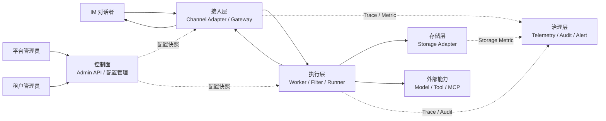
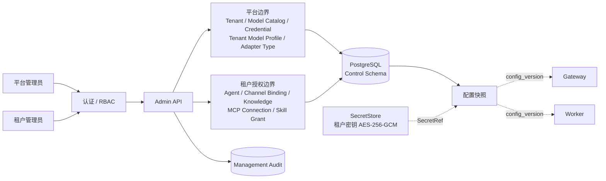
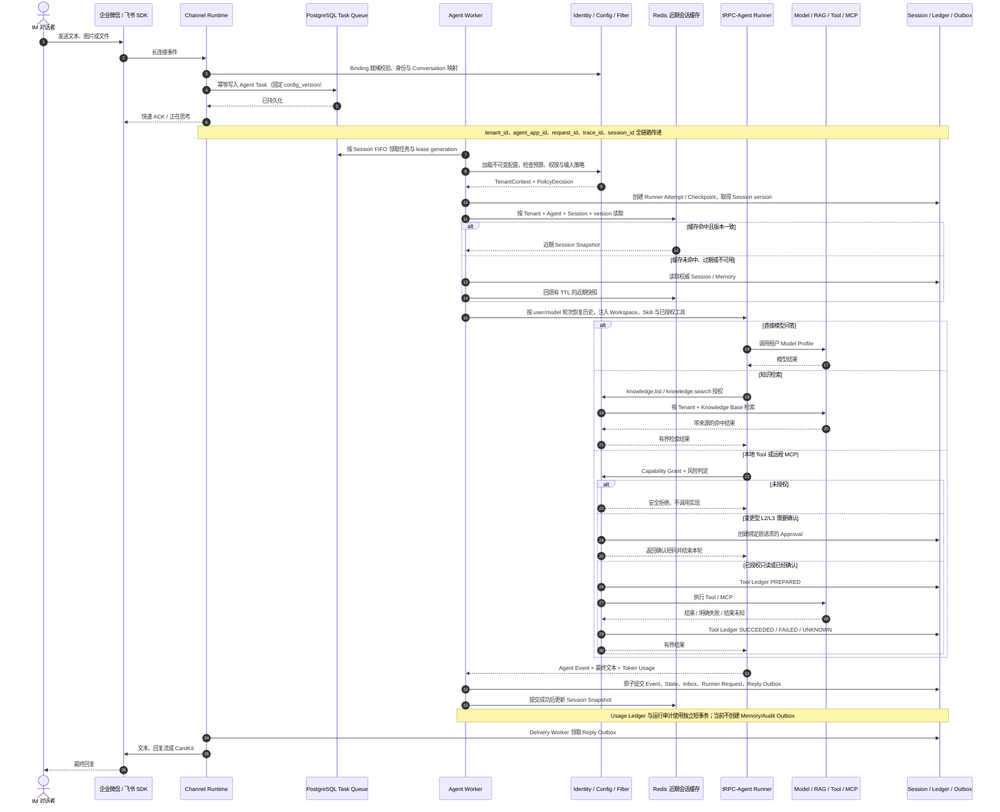
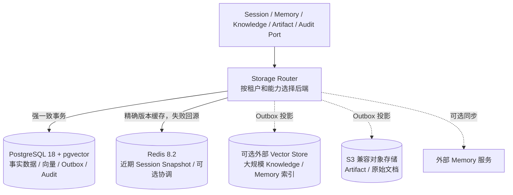
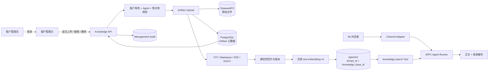
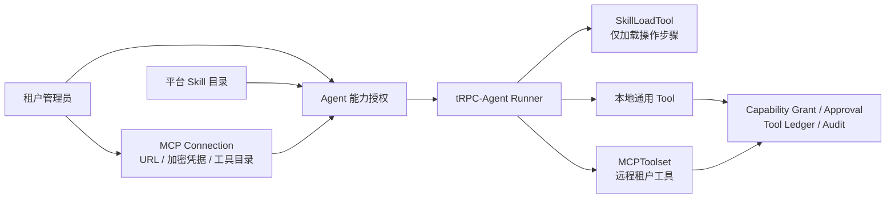
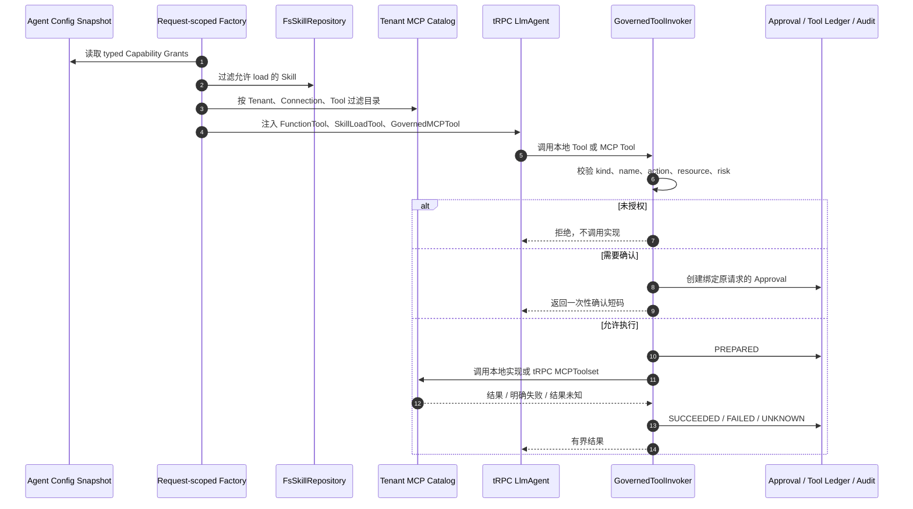
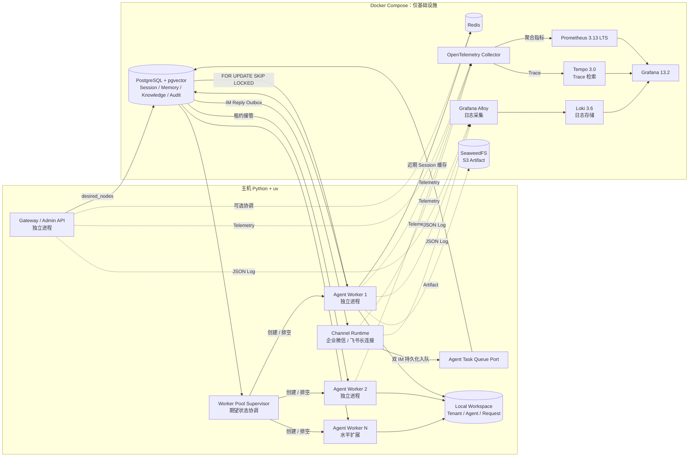

# 架构

## 1. 一级架构

一级架构只表示模块之间的关系，不展开模块内部实现。

## 2. 二级架构

### 2.1 控制面

平台管理员统一管理模型凭据和租户模型策略，租户管理员不能修改模型或 API Key。租户管理员维护本租户 IM Binding、知识库、MCP Connection 和 Agent 能力授权。平台进入其他租户业务范围时必须携带支持原因并写入审计。IM 与 MCP 密钥按租户、用途分别加密保存，业务表只保存不可反查明文的 `SecretRef`。

一个 Tenant 只关联一个租户管理员登录身份。IM 对话者只在 Channel Identity、Conversation 和 Session 中建模，不属于控制面的管理账号或角色。

### 2.2 核心执行链路

Worker 不保存本地会话。同一个 Session 使用确定性路由键、队首领取、执行租约和数据库版本检查，避免跨节点乱序或并发写入。模型历史按原始 `message.received=user`、`agent.replied=model` 轮次恢复，当前问题始终作为单独的新 `user` 消息提交，不能把整段历史伪装成当前输入。

### 2.2.1 两种 IM 的差异

| 维度 | 企业微信智能机器人 | 飞书机器人 | 平台统一部分 |
| --- | --- | --- | --- |
| 连接 | API 模式长连接，Bot ID + Bot Secret | WebSocket 长连接，App ID + App Secret | Binding、密钥加密和配置热加载 |
| 会话 | 私聊、群聊 `@机器人` | 私聊、群聊 `@机器人`、话题线程 | Principal、Conversation、Session 映射 |
| 快速响应 | 回复流中的 `thinking_message` | 独立可见 ACK | 只在任务持久化成功后发送 |
| 最终文本 | 企业微信回复流 | CardKit 流式卡片 | Reply Outbox、重试、UNKNOWN/DLQ |
| 媒体 | 图片/文件等分片收发 | 图片/文件下载与发送 | Artifact 大小限制、租户对象键和媒体校验 |
| 平台限制 | 分片、回复流状态、平台限频 | CardKit 权限、事件订阅、平台限频 | Adapter 分类错误，Delivery Worker 统一恢复 |

Provider SDK、帧格式和媒体接口留在各自 Adapter 中；Agent 就绪检查、身份映射、任务幂等、执行、治理和可靠回复不能在 Adapter 内重复实现。

### 2.3 存储层

PostgreSQL 是核心事实源，也是当前任务、Session 租约与 Outbox 的正确性依赖。Redis 已接入 Worker 的近期 Session Snapshot 读写：SQL 在领取任务时给出权威版本，只有版本完全相同的缓存才可使用；未命中、过期、损坏或连接失败都回源 PostgreSQL。缓存只在 SQL 提交成功后更新，停用或丢失 Redis 不影响事实恢复。向量库、对象存储和外部 Memory 不加入分布式事务，派生写入失败时根据状态或 Outbox 恢复。

### 2.4 RAG 链路

知识库属于 Tenant，不属于单个 Agent。对象键、元数据和向量行都包含 `tenant_id`；Agent 只能读取配置快照中授权的 `knowledge_base_names`。上传、替换和删除只开放给租户管理员的显式 HTTP 接口，页面再次确认后提交，后端重新校验权限并记录审计。IM 模型侧只注册 `knowledge.list` 和 `knowledge.search`，即使旧配置残留写权限也不会创建写工具。更新生成新版本并失效旧向量，删除保留 Tombstone。

### 2.5 Skill、MCP 与 Tool

Skill 是平台审核过的操作知识，当前只有 `hr-assistant` 和 `code-review`，通过 tRPC-Agent-Python 的 `FsSkillRepository` 与 `SkillLoadTool` 加载，不提供 Skill 执行或沙箱。MCP 由租户填写 HTTPS Streamable HTTP 地址和可选 Bearer Token，刷新后保存工具名称、Schema 和交互风险分类；凭据不回显。Agent 只能看到显式授权的 Skill 和 MCP Tool，MCP 实际调用仍进入统一治理链路。请求级装配以最新目录分类覆盖旧快照风险：严格声明为只读的 Tool 直接执行，未声明或变更型 Tool 按 L2 确认；SDK 返回的可恢复 Tool 错误继续交给模型修正，供应商或模型错误仍直接失败。

能力在每次请求中按不可变 Agent 快照重新装配，不使用跨租户的全局 Tool 实例：

Skill 只提供经过审核的文字步骤，不经过 Tool Ledger，因为它没有外部副作用；本地 Tool 与 MCP 执行都经过同一个 `GovernedToolInvoker`。租户先显式授权具体连接和 Tool，随后 `readOnlyHint=true` 且未声明破坏性的读取按 L0 直通，其余 MCP Tool 保守归类为 L2。旧目录在首次使用时按策略版本自动重发现，失败时维持 L2。两类调用都保留 Tool Ledger、审计、指标、超时和租户隔离。

### 2.6 本地部署

`start.sh` 当前启动一个 Gateway、一个统一 Channel Runtime 和一个 Worker Pool Supervisor；Supervisor 首次以两个 Worker 为期望值，随后以管理端保存的 `desired_nodes` 为准创建独立 Worker。缩容节点先进入 `draining`，停止领取新任务并在完成当前任务后退出。Channel Runtime 同时管理企业微信与飞书长连接；入口先映射租户 Principal、Conversation 和 Session，再写入 `agent_task`。Worker 通过 SQL 行锁、FIFO 路由、lease generation、Runner Attempt 和 Checkpoint 执行；Session Fence 与 State version 阻止旧节点提交。节点不保存 Session，也不要求 sticky session。

Local Workspace 位于 `data/workspaces/<tenant>/<agent>/<request>`。每次 Worker 开始执行时都会获取同一个 Request Workspace，并将类型化 `WorkspaceHandle` 注入 Runner Context；因此本地 Worker 1 失败后，Worker 2 可按稳定 Request ID 接管同一目录。目录内固定包含 `inputs`、`outputs`、`tmp`，只通过 `WorkspaceProvider` 暴露；路径穿越、绝对路径和越界符号链接默认拒绝，当前仅开放受治理的列表与只读文本 Tool。

本地模式不运行应用 Python 容器，只有基础设施进入 Compose；Kubernetes 模式使用项目 `Dockerfile` 构建 Python 3.12 应用镜像。PostgreSQL 是任务、完整会话、Worker Pool 期望状态和 Usage Ledger 的事实源；Redis 保存带 TTL 的近期 Session 快照并允许随时从 SQL 重建，不能替代 `agent_task` 或完整事件日志。Prometheus 保存低基数指标，Tempo 保存 Trace，Loki 保存结构化日志，Grafana 统一查询但不充当数据源。Kubernetes 使用单独的最小权限 Scaler 修改 `agent-worker` Deployment 的 scale 子资源，控制面语义与本地 Supervisor 一致。
