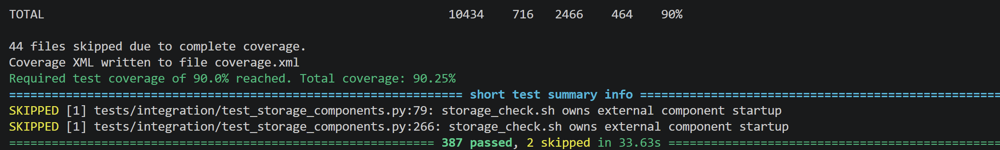
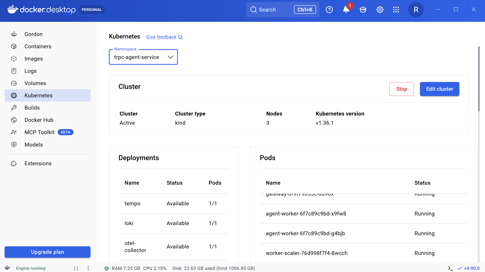
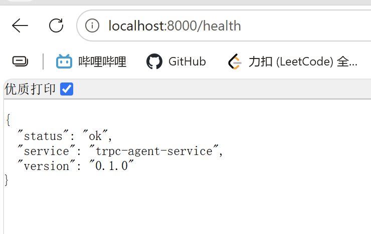
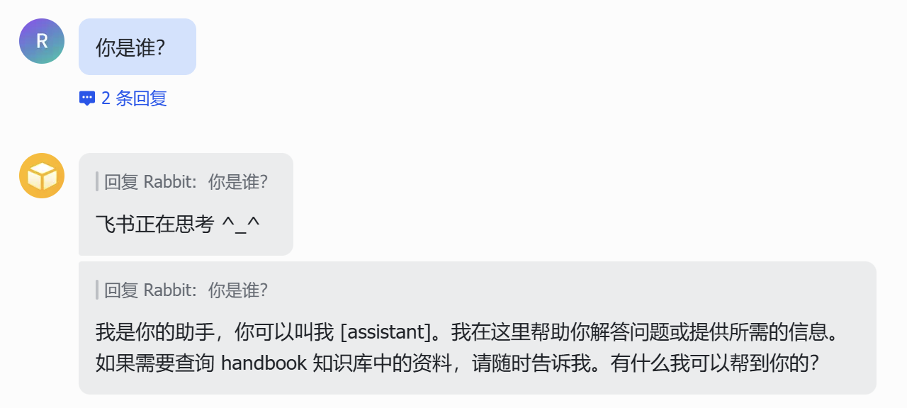
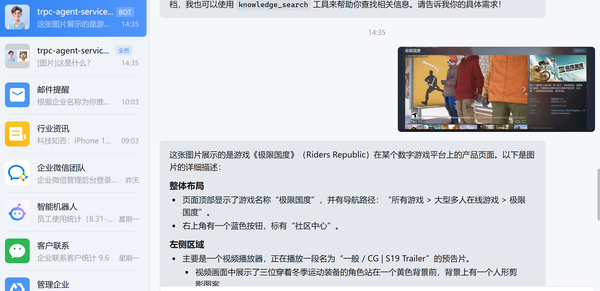
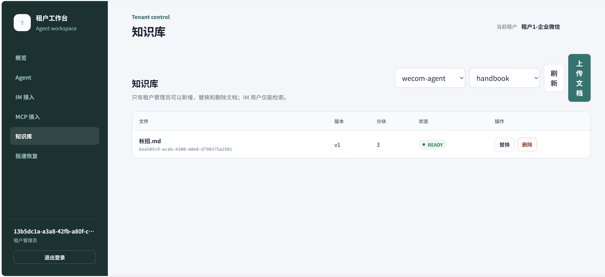
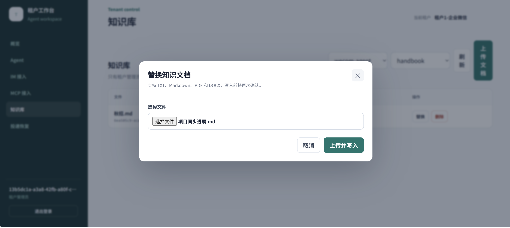
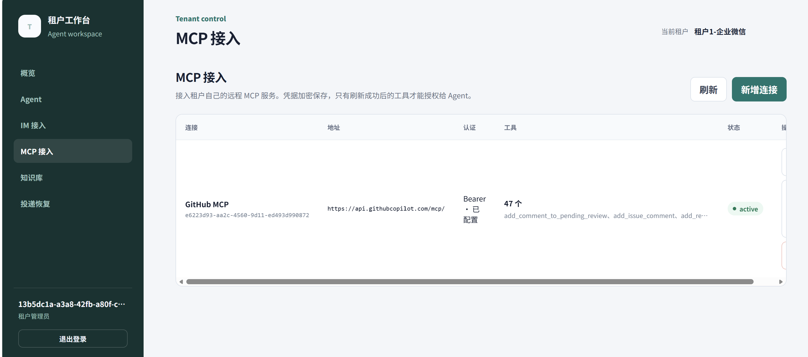
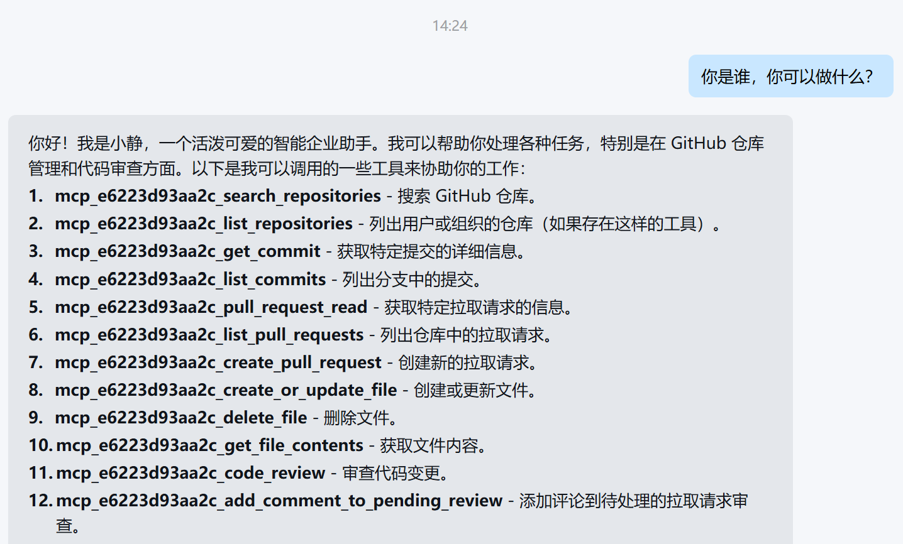
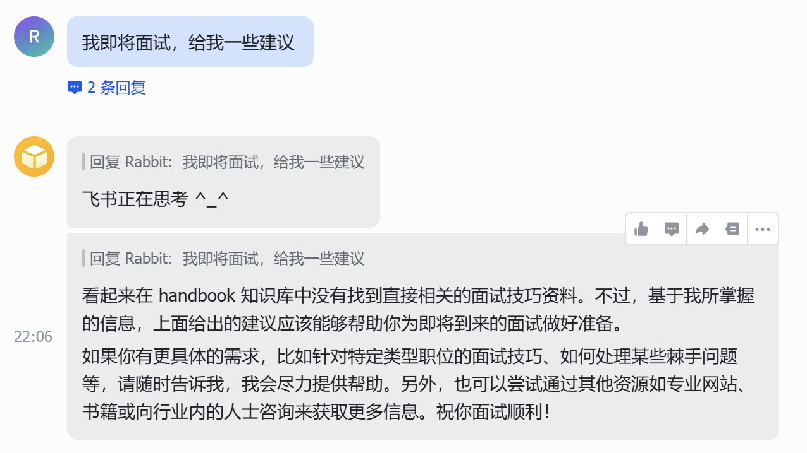

# 测试结果与截图记录

## 1. 当前验证状态

本文件把可重复的自动化结果与需要真实账号、Docker 或 Kubernetes 的人工验收分开记录。缺少截图时只表示“待验收”，不能据历史运行记录直接写成“通过”。执行人完成用例后填写日期、结果和备注，并将截图保存到约定路径。

| 检查项 | 证据 | 当前状态 |
| --- | --- | --- |
| 单元、契约与部署清单 | 387 passed、2 skipped、覆盖率 90.25% | 通过 |
| 格式、Flake8、严格 mypy | 120 个源码文件无类型问题 | 通过 |
| Alembic 单一 Head | `20260909_0026` | 通过 |
| Python 制品构建 | wheel 与 sdist | 通过 |
| PostgreSQL、pgvector、Redis、SeaweedFS | 真实组件测试输出 | 通过 |
| Kubernetes 部署 | Pod、Service、健康与节点分布截图 | 通过 |
| 飞书、企业微信 | 真实 IM 对话截图 | 通过 |
| RAG、MCP、治理与可观测 | 管理台、IM 与 Grafana 截图 | 通过 |

## 2. 自动化与运行环境

### 2.1 自动化测试

### 2.2 Kubernetes 组件

执行 `kubectl get pods -n trpc-agent-service -o wide` 和 `kubectl get services -n trpc-agent-service`，确认项目 Namespace 内组件处于运行或完成状态，并确认 Gateway、Worker 分散在不同工作节点。

### 2.3 服务健康状态

## 3. IM 链路

### 3.1 飞书

快速 ACK、CardKit 流式回复、上下文连续性和文件接收。

### 3.2 企业微信

文本问答、回复流、图片理解和文件接收。

## 4. RAG 租户管理

### 4.1 新增

租户管理员登录 `/tenant`，选择 Agent 和知识库，上传文件并确认。完成后到飞书或企业微信提问，回答应包含文件内容和来源。

### 4.2 更新

租户管理员在管理台选择原文档并上传新版本。页面确认后只检索到新内容，数据库保留版本记录。

### 4.3 删除

租户管理员在管理台选择目标文档并确认删除。删除后 IM 不再检索到目标内容，数据库保留删除状态用于审计。

## 5. Skill、MCP、治理与可观测性

### 5.1 Skill 与内置 Tool

为 Agent 授权 `code-review` 或 `hr-assistant`，确认模型只能加载步骤说明，不能通过 Skill 执行命令。分别调用 `calculate`、`current_time`、`knowledge.search`，确认未授权 Tool 不出现在 Runner 中，授权调用写入 Tool Ledger。

### 5.2 租户 MCP

1. 租户管理员新增 HTTPS Streamable HTTP MCP，填写 Bearer Token 后查询接口不得回显 Token 或 SecretRef。
2. 执行“测试并刷新”，确认页面显示有界工具目录；私网或环回地址在未配置平台白名单时必须拒绝。
3. 只给 Agent 授权一个具体 MCP Tool，其他连接和工具不能出现在该 Agent 的 Runner 中。
4. 从 IM 触发该工具，确认先返回二次确认短码；同一对话者回复 `确认 <短码>` 后才能执行。
5. 检查 Tool Ledger 和 Audit；结果未知必须进入 `UNKNOWN`，不能自动重复调用。
6. 登录其他租户，确认看不到该连接、目录和凭据。

### 5.3 治理与可观测性

验证 IM 对话者无法获得 RAG 写工具、租户管理员不能跨租户访问，并在 Grafana 中检查请求量、耗时、错误、Token、Tool 和 Trace 数据。

