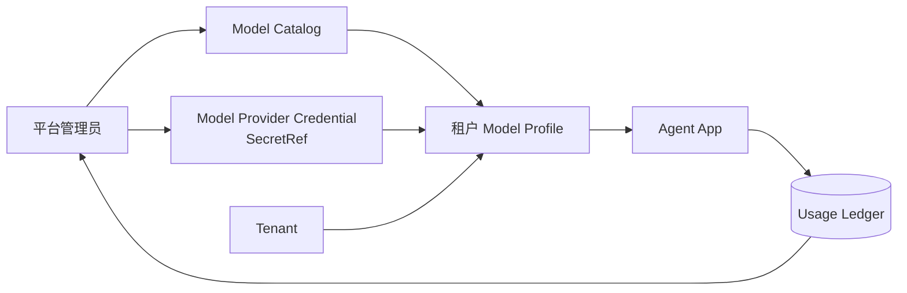

# 管理员模块设计

## 1. 管理边界

| 内容 | 平台管理员 | 租户管理员 |
| --- | --- | --- |
| Tenant | 新增、停用、修改隔离方式 | 不可跨租户修改 |
| Model Catalog | 维护可用模型 | 只读 |
| Model Provider Credential | 登记、轮换、停用 SecretRef | 不可访问 |
| Model Profile | 为每个租户分配模型、参数、超时和预算 | 不可修改 |
| Agent / Channel | 支持模式下管理并审计 | 管理本租户配置 |
| IM Binding | 查看状态，不读取租户密钥 | 选择已部署 Adapter，维护本租户账号与密钥 |
| Knowledge | 支持模式下只读排障 | 上传、替换、删除本租户知识文档 |
| MCP Connection | 不读取租户凭据；控制私网主机白名单 | 新增、测试刷新、更新和停用本租户连接 |
| Skill | 发布平台审核的 Skill 文件 | 为本租户 Agent 选择已发布 Skill |
| Agent Capability | 定义治理上限和风险规则 | 授权本租户 Tool、Skill、MCP Tool 与资源范围 |
| Delivery Failure | 支持模式下排障 | 查看并有原因地重放本租户 UNKNOWN/DLQ 回复 |
| Usage Ledger | 查询租户调用、Token 和成本 | 不可访问 |
| Adapter Type | 登记已部署实现 | 只使用已启用类型 |
| Worker Pool | 设置期望节点数，查看扩容、排空和异常状态 | 不可访问 |

模型和模型 API Key 统一由平台管理员提供。租户 IM 密钥由租户管理员写入，使用平台主密钥按租户加密；API 创建、更新和查询都不回显真实密钥。

每个租户只有一份租户管理员账号和密码，不再区分租户所有者、租户管理员或其他后台成员角色。企业微信、飞书等 IM 中与机器人对话的人属于渠道身份，由租户自行决定机器人投放范围，不进入管理后台账号体系。

租户管理员必须通过账号创建接口一次性写入身份、租户关系和密码，通用角色接口不能授予该角色，且同一身份不能同时属于平台和租户管理域。唯一账号不可单独停用或撤销，只能由平台管理员重置密码；旧角色升级存在多个候选人、缺少有效密码或混合管理域时，数据库迁移直接中止并要求人工确认。

## 2. 配置关系

Profile 只能引用相同 Provider 的活动凭据。运行时优先读取独立凭据表；旧 Catalog/Profile 密钥字段只作为迁移兼容，管理页面不再创建这种配置。

## 3. 租户策略

当前支持：

- `temperature`、`max_output_tokens`、`context_window_tokens`、输入/输出百万 Token 单价；
- `timeout_seconds`，不能超过平台全局硬上限；
- `max_input_chars`；
- UTC 自然日 `daily_calls`、`daily_tokens`。
- 启用 Token 硬预算时必须满足 `daily_tokens >= context_window_tokens >= max_output_tokens`。

Usage Ledger 在模型调用前原子预留预算，完成后以实际 Token 和配置单价结算；`tenant_id + request_id` 保证幂等。Prometheus 只用于运行监控，不能代替预算和用量事实。

## 4. 租户自助配置

- 管理页面根据已部署 Adapter 的 JSON Schema 生成 IM 卡片，不把企业微信、飞书字段写死在前端。
- 一个租户可以启用多种 IM；Bot ID、App ID 等非敏感参数保存在 Binding，Secret 只写不读。
- 租户管理员通过页面上传、替换和删除知识文档；IM 对话者只能检索知识库，不能调用写工具。
- RAG 写接口同时校验租户管理员身份、Agent 配置和知识库授权，所有变更写入 Management Audit。
- 租户管理员可以维护 HTTPS Streamable HTTP MCP；“测试并刷新”只验证连接并同步工具清单，不代表 Agent 已获得权限。刷新成功后需要进入目标 Agent，选择具体 MCP Tool 完成授权；Bearer Token 不回显。
- 租户管理员只能选择平台已经发布的 knowledge-only Skill，不能从 Web 上传可执行 Skill 或脚本。

## 5. 认证与审计

- Bootstrap Token 由 `start.sh` 生成，只用于首次初始化和应急平台管理；日常使用账号密码与可撤销的服务端 Web Session；
- 人员密码使用 Argon2id 保存摘要；浏览器登录使用服务端 Session、HttpOnly Cookie 和 CSRF 双重校验；
- 平台访问租户范围必须带 `X-Support-Reason`；
- 模型凭据、Profile、租户、IM Binding 和知识库变更写入 Management Audit；
- Token 只返回一次，库内保存摘要；API Key 和 IM Secret 永不进入响应、日志、Trace 和审计详情。

## 6. 管理页面

管理端按职责拆成两个入口：`/admin` 仅供系统管理员维护租户、唯一租户管理员账号、模型、凭据、策略、运行节点、用量与审计；`/tenant` 仅供租户管理员维护本租户 Agent、IM、知识库、MCP 和投递恢复。两端共享基础视觉组件，但路由、页面结构和权限校验相互独立。页面不单独引入前端构建流程，Bootstrap Token 仅保存在系统管理页面内存，人员登录使用安全 Cookie。

系统管理员在运行节点页面设置 Worker Pool 的期望节点数，不能直接选择或强杀某个节点。扩容由独立 Supervisor 创建缺少的 WorkNode；缩容先把多余节点标记为 `draining`，停止领取新任务，完成已领取任务后退出。每次修改携带 generation，过期页面返回冲突并要求刷新；变更写入 Management Audit。
