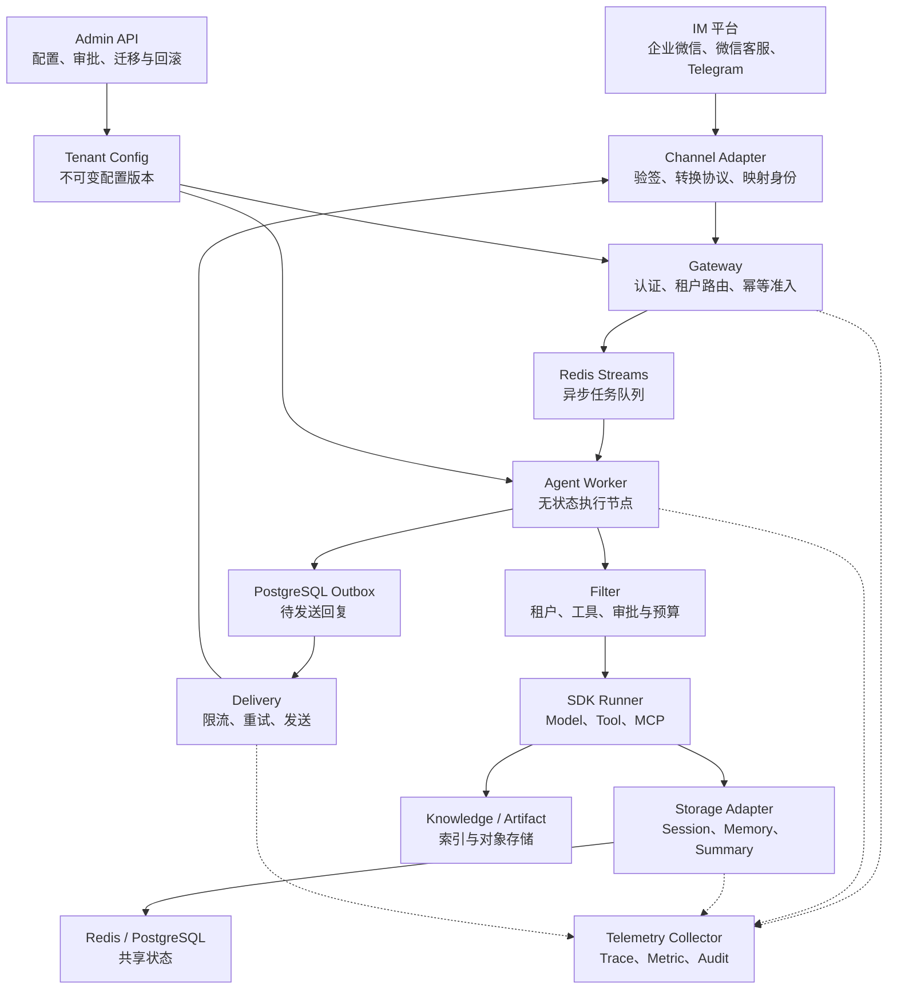
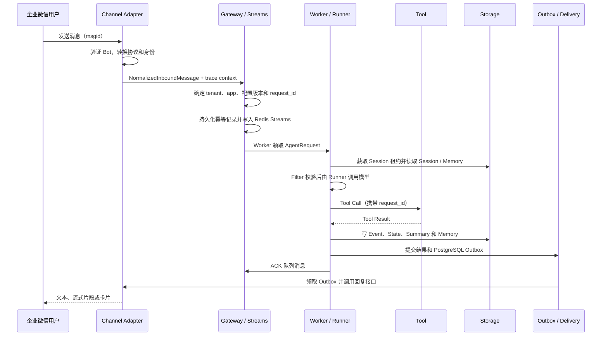

# 基于 tRPC-Agent-Python 的多租户节点化 Agent 平台设计

## 1. 任务理解与设计目标

本实战主要解决怎样把 Agent 做成可供多个组织共同使用的平台。每个租户可以创建多个 Agent App，分别选择模型、工具、IM 通道和数据后端。平台必须保证租户之间的配置、会话、记忆、附件、知识、密钥、工具权限、预算和审计记录互不混用。

租户管理员在发布配置时选择 Session 和 Memory 使用 Redis、PostgreSQL 或已注册的外部 Provider。连接信息由平台配置和 Secret 引用管理，普通用户不能覆盖。这样既允许不同租户采用不同存储策略，也避免用户输入直接控制数据库连接。平台自己的任务状态、配置版本、用量和 Outbox 仍保存在统一控制面中，与租户选择的会话后端分开。

节点化部署首先要解决状态归属问题。Worker 可以水平扩容，但不能把 Session、Memory 或执行进度只保存在本机，否则下一条消息换到另一台 Worker 后就无法继续对话。

本方案不使用 Sticky Session。Worker 只保留可重建的 Runtime 缓存，影响恢复的数据全部写入共享后端。同一 Session 串行执行，不同 Session 可以并行处理。

## 2. 总体架构

平台采用 FastAPI 单代码库并按角色部署。开发环境可以在一个进程中运行，生产环境拆分为 Gateway、Worker、Channel、Delivery 和 Admin。各模块通过稳定接口连接，具体 IM 客户端和存储实现由组合根注入。



SDK 与平台层的分工如下：

- SDK 提供 `LlmAgent`、Runner、Model/Tool 循环、MCP、Event、Session、Summary、Memory、Filter 和 Telemetry 扩展点。
- 平台层负责 Tenant Registry、身份映射、配置版本、Redis Streams、Session Guard、幂等、Request 状态、Outbox、Channel Adapter、审批、预算、审计和迁移。
- Workspace 复用 SDK 的本地与容器运行时；生产环境不使用缺少隔离的本地执行方式。

通道层在代码中只暴露三个操作，业务流程不需要了解具体 IM SDK：

```python
class ChannelAdapter(Protocol):
    async def normalize(
        self, binding_id: str, payload: dict, headers: dict
    ) -> NormalizedInboundMessage: ...

    async def deliver(self, message: OutboundMessage) -> DeliveryResult: ...
    async def close(self) -> None: ...
```

各节点只处理自己的职责：

- Channel Adapter 负责平台协议、附件和外部身份。
- Gateway 负责认证、租户定位、配置固定、预算准入和可靠入队。
- Worker 创建 Agent Runtime 并执行 Runner。
- Delivery 发送 Outbox 中已经提交的回复。
- Admin API 管理配置、审批、迁移和回滚，不参与消息执行。

这样，IM 入口可以快速响应，模型慢请求不会占住回调连接，Worker 和 Delivery 也能分别扩容。

代码放在同一个仓库中，运行角色由启动参数决定。开发环境合并部署，生产环境由多个进程连接共享的 Redis 和 PostgreSQL。

业务层依赖 `ChannelAdapter`、`SessionExecutionGuard`、`TenantRegistry` 和存储 Provider 等接口，不直接创建具体客户端。更换 IM 或数据库时，主要修改适配层，Runner 的调用流程保持不变。

## 3. 核心消息链路



`request_id` 从 Gateway 一直保存到 Event、Tool 执行记录、Usage 和 Outbox，用于业务对账。W3C `traceparent` 随队列和 Outbox 传播，用于把 Channel、Runner、Tool、Storage 和 Delivery 的 Span 放进同一条 Trace。

Gateway 接受消息后，先持久化请求，再写入 Redis Streams。因此，HTTP 返回成功只表示平台已经可靠接收任务。

Worker 完成 Agent、Summary 和 Memory 后，将最终结果与 Outbox 一起提交，随后才 ACK 队列消息。Delivery 发送失败时只重试 Outbox，不会要求 Worker 重新调用模型。Agent 执行和 IM 投递是两个可以分别恢复的阶段。

## 4. 多租户、数据模型与隔离

`TenantConfig` 是不可变配置快照，包含 Agent App、模型、ToolPolicy、Channel Binding、Storage、Audit 和 Budget。发布新配置时增加版本，回滚只切换活动版本。请求进入 Gateway 时固定 `config_version`，在途请求不会突然换模型或权限。

下面是租户配置模型的主要字段。代码省略了默认值和校验器，字段名称与实现保持一致：

```python
class TenantConfig(BaseModel):
    tenant_id: str
    name: str
    version: int
    status: TenantStatus
    api_token_ref: str
    apps: dict[str, AgentAppConfig]
    channels: list[ChannelBindingConfig]
    storage: StoragePolicy
    audit: AuditPolicy
    budget: BudgetPolicy
```

一个租户可以配置多个 Agent App。每个 App 都有自己的指令、模型、工具列表、并发限制和摘要策略。Channel Binding 则负责把机器人或客服账号连接到指定租户和 App。

发布前，平台会检查外部账号绑定、工具 allow/deny 冲突、Secret 引用和存储 Provider。配置发布后不再原地修改；需要回退时切换活动版本。新请求使用回滚后的版本，已入队请求继续使用原版本。

SDK 使用 `(app_name, user_id, session_id)` 定位会话。平台把 `app_name` 写成 `tenant:{tenant_id}:app:{app_id}`，并根据可信的 Channel Binding、外部用户和会话主题生成内部 ID。群聊默认按成员隔离；显式选择共享模式时，群作为会话主体，真实发言人仍单独用于 ACL、审批和审计。

核心数据关系如下：

```text
tenant(tenant_id, status, active_config_version)
  └─ tenant_config_version(tenant_id, version, config_json, published_at)
       ├─ agent_app(tenant_id, app_id, config_version, model_tool_runtime_json)
       └─ channel_binding(binding_id, tenant_id, app_id, channel, external_account_id)

session(app_name, user_id, session_id, state, update_time)
  ├─ event(event_id, request_id, author, content, actions, usage, timestamp)
  ├─ summary_event(event_id, covers_through_seq, content, checksum)
  └─ memory(scope_key, source_session_id, content, expires_at)

request_execution(request_id, tenant_id, idempotency_key, state, attempts, result)
  ├─ tool_execution(request_id, tool_name, args_hash, state, result)
  ├─ usage_ledger(request_id, model, input_tokens, output_tokens, cost_usd)
  └─ outbound_message(outbound_id, request_id, binding_id, state, attempts)

audit_log(tenant_id, request_id, channel, user_id, session_id,
          agent_name, tool_name, decision, latency_ms, error_type, cost_usd, trace_id)
```

密钥只保存 `env://` 等引用，运行时由 Secret Provider 解析。日志、错误、Trace 和审计不记录完整 Prompt、密钥或 IM Token；指标也不使用用户、Session、Request 和 Trace 等高基数标签。

隔离检查贯穿整条链路：

- Gateway 根据可信 Binding 生成 `TenantContext`。
- Storage Adapter 为 Redis Key、SQL 查询、对象路径和 Knowledge Namespace 加入租户范围。
- Runtime 只装配该 Agent 允许的模型和 Tool。
- 日志与审计记录固定写入 `tenant_id`，敏感内容在输出前脱敏。

即使两个学校使用相同的外部 user ID、群 ID 或 Session 名称，最终生成的内部标识也不同。

## 5. 同步、并发与幂等

### 会话并发

同一 Session 使用带唯一令牌、TTL、续租和递增执行代次的租约。Redis 写入在 Lua 中同时校验租约和代次；PostgreSQL 在事务内锁定资格记录后再提交。旧 Worker 即使恢复，也不能覆盖新 Worker 已写入的状态。

### 状态更新顺序

一次请求按照以下顺序更新状态：

1. 读取 Session，写入用户 Event。
2. 执行 Model/Tool，保存非 partial Event 和 State。
3. 生成 Summary，再写入 Memory。
4. 保存结果与 Outbox，最后 ACK 队列消息。

Summary 是 Session 中的特殊 Event，不建立第二份会话真值。必要后处理失败时，请求不会标记成功。恢复程序根据阶段记录只补缺失步骤，不重复模型和有副作用的 Tool。

### 消息幂等

IM 来源消息 ID 与内容摘要组成幂等依据。同一个键和相同内容返回原 `request_id`，不同内容返回冲突。

Redis Streams 采用至少一次投递，Pending 消息可以由其他 Worker 接管。Request、Tool Execution 和 Outbox 的唯一键将重复投递收敛为一次有效执行。IM 发送超时且无法判断是否成功时记录 `unknown`，不盲目重发。

### 后端迁移

后端迁移依次经过 `preparing → dual_write → backfilling → verifying → shadow_read → cutover → completed`。回填过程保存 checkpoint，切读前比较数量和内容 Hash，并通过准入屏障排空在途请求。

Redis 与 PostgreSQL 的 Session/Memory 支持双向迁移。旧后端在观察期内继续保留，用于必要时回滚。

迁移期间，每个请求固定 `storage_route_version`。进入双写后，历史数据分批回填，新数据同时写入两个后端。对账会比较 Event 顺序、State、Summary、Memory 和规范化 Hash，而不只检查记录数量。

切换前，平台短暂停止该租户的新请求并等待在途任务结束，防止旧 Runtime 继续写入源库。只要存在 mismatch 或 dirty 记录，迁移就不会切换到目标后端。

## 6. 多后端适配

| 后端 | 适合保存的内容 | 一致性处理 |
|---|---|---|
| InMemory | 单元测试和本地演示 | 只在当前进程有效，不用于多节点生产 |
| Redis | Streams、锁、幂等缓存、预算、低延迟 Session/Memory | 原子命令或 Lua；故障时停止依赖操作，不降级到内存 |
| PostgreSQL | 租户配置、Request、Outbox、Usage、Audit，也可保存 Session/Memory | 事务、唯一约束和行锁保证控制面一致性 |
| 向量库 | Knowledge embedding 和相似度索引 | 原文是恢复依据，索引按版本异步重建并检查租户过滤 |
| 对象存储 | 图片、文件和知识原文 | 内容与元数据分阶段提交，通过 object ID、checksum 和 ACL 校验 |

上层不直接判断数据库类型。Runner 只依赖 SDK Session/Memory 接口；Artifact、Knowledge 和 Audit 分别使用平台 Provider。工厂根据租户配置创建实现，并统一加上租户范围、写入保护、Trace 和指标。

三类 IM 使用同一 `ChannelAdapter` 契约，但各自保留协议差异：

- 企业微信智能机器人通过 `bot_id + secret` 建立长连接，并用 `req_id` 关联流式回复。
- 微信客服先验证加密回调，再按游标拉取消息；人工接管后停止自动回复。
- Telegram 使用 Webhook Secret 验证请求，再通过 Bot API 发送消息。

图片和文件先保存到租户 Artifact Store，队列中只传对象引用。长回复按通道上限分片，限流和网络错误交给 Outbox 延迟重试。

单聊会话由租户、Binding、外部用户和会话主题共同确定。群聊默认再加入真实发言人，防止群成员互相读取个人上下文。每种通道都保留来源消息 ID 作为幂等键，外部账号、用户 ID 和群 ID 不能直接当作租户身份。

三种通道最终都转换为 `NormalizedInboundMessage`，再进入同一套身份、幂等、队列和 Agent 链路。附件会先转换成租户 Artifact 引用，避免在队列中传递大块二进制数据。

## 7. 治理、故障恢复与预期效果

Filter 的执行顺序是租户与身份检查、预算预留、模型策略、工具白名单、危险操作审批、Tool Safety 和输出处理。危险工具的确认令牌绑定租户、用户、Session、工具名和参数 hash，只能使用一次。用量根据模型返回的 token 结算并写入 Usage Ledger；`cost_usd` 是按配置单价计算的内部估算。

观测数据分为三类：

- Metric 反映请求量、错误率、队列积压、模型和 Tool 耗时，以及 token 与成本趋势。
- Trace 展示一条请求经过的节点和各阶段耗时。
- Audit 记录配置、审批、工具和发送操作的主体与结果。

三者只使用低基数标签和脱敏字段，不把 Prompt、Secret 或完整用户标识暴露给监控系统。`request_id` 用于业务记录对账，`trace_id` 用于性能与故障定位，两者可以互相查询。

| 生产风险 | 缓解措施 |
|---|---|
| Worker 处理中退出 | Streams Pending 接管，按阶段恢复 |
| Session 租约失效 | 取消旧执行，存储端 fencing 拒绝旧代次写入 |
| Redis 暂时不可用 | 就绪检查失败，有界退避，不切换 InMemory |
| PostgreSQL 或 Outbox 失败 | 不标记成功，恢复后补结果或回复记录 |
| 模型超时、限流或断流 | 稳定错误分类、受控重试并结算已发生用量 |
| Tool 结果不确定 | 记录 `UNKNOWN`，查询或人工核查，不重复副作用 |
| IM 重复、乱序或超时 | 来源幂等、顺序窗口、Outbox 重试和未知状态 |
| 配置发布影响在途请求 | 固定配置版本，旧 Runtime 等引用释放后关闭 |
| Secret 或隐私泄漏 | Secret 引用、字段白名单、日志与 Trace 统一脱敏 |
| 迁移遗漏或覆盖新数据 | 双写、checkpoint、hash 对账、切换屏障和回滚观察期 |

预期效果是多个租户可以共用服务，但不能读取彼此的数据。任意 Worker 都能继续上一节点保存的会话，重复 IM 消息只产生一次有效执行，模型、Tool、存储和回复也能通过同一个 `request_id` 与 Trace 定位。

验收重点包括双租户隔离、双 Worker 会话连续性、同 Session 并发、重复消息、数据库故障恢复、配置回滚、Tool 审批和完整 Trace，而不只是验证一次普通问答。

当前代码已完成离线、真实 Redis/PostgreSQL、双 Worker、迁移、故障恢复、真实模型和本地三类 IM 协议闭环验证。企业微信、微信客服和 Telegram 的真实账号凭据由验收环境提供，通过统一 Live 入口注入，不需要修改 Adapter 代码。
